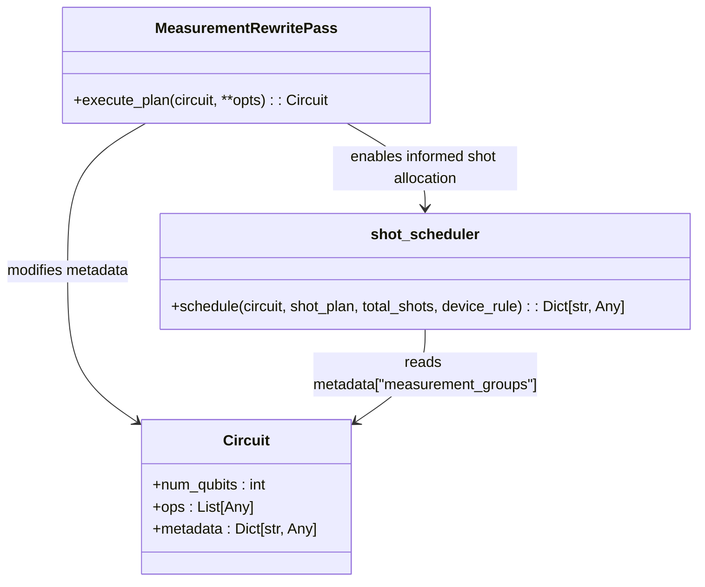
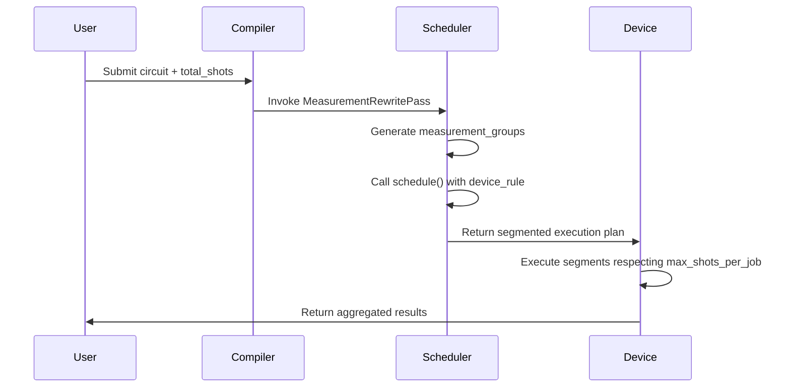
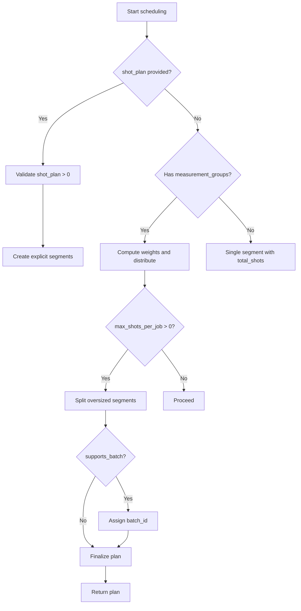

# Scheduling Stage

<cite>
**Referenced Files in This Document**   
- [shot_scheduler.py](file://src/tyxonq/compiler/stages/scheduling/shot_scheduler.py)
- [measurement.py](file://src/tyxonq/compiler/stages/rewrite/measurement.py)
- [hamiltonian_grouping.py](file://src/tyxonq/libs/hamiltonian_encoding/hamiltonian_grouping.py)
- [test_compiler_stages.py](file://tests_core_module/test_compiler_stages.py)
- [test_shot_scheduler_integration.py](file://tests_core_module/test_shot_scheduler_integration.py)
</cite>

## Table of Contents
1. [Introduction](#introduction)
2. [Core Functionality of Shot Scheduler](#core-functionality-of-shot-scheduler)
3. [Shot Allocation Algorithm](#shot-allocation-algorithm)
4. [Integration with Measurement Grouping](#integration-with-measurement-grouping)
5. [Device and Backend Adaptation](#device-and-backend-adaptation)
6. [Examples of Shot Distribution](#examples-of-shot-distribution)
7. [Handling Constraints and Edge Cases](#handling-constraints-and-edge-cases)
8. [Best Practices for Scheduling Policies](#best-practices-for-scheduling-policies)
9. [Conclusion](#conclusion)

## Introduction

The Scheduling stage in TyxonQ's compiler pipeline is responsible for allocating measurement shots across multiple observables to minimize total execution cost while maintaining statistical accuracy. This stage leverages the `shot_scheduler.py` module, which transforms high-level measurement grouping metadata into a concrete execution plan composed of shot segments. The scheduler supports both user-defined shot plans and automatic distribution based on observable variance, commutativity, and device constraints.

This document details how the shot allocation algorithm operates, its integration with upstream measurement grouping, adaptation to cloud API rate limits and numeric backends, and best practices for configuring scheduling policies under accuracy and cost constraints.

**Section sources**
- [shot_scheduler.py](file://src/tyxonq/compiler/stages/scheduling/shot_scheduler.py#L1-L24)

## Core Functionality of Shot Scheduler

The `schedule` function in `shot_scheduler.py` serves as the central component for generating execution plans. It consumes circuit metadata containing grouped measurement observables and produces a list of segments, each specifying the number of shots, measurement basis, wires involved, and basis mapping. This decoupling allows downstream executors to reuse measurement settings efficiently and batch runs where possible.

Two primary modes of operation are supported:
- **Explicit Mode**: When a `shot_plan` is provided by the user, one segment is created per entry.
- **Group-Based Mode**: In the absence of an explicit plan, the scheduler distributes `total_shots` across measurement groups using `estimated_shots_per_group` as weights derived from observable complexity.

The resulting plan ensures that `sum(shots) == total_shots`, with deterministic rounding preserving shot budget integrity.

```mermaid
flowchart TD
A[Circuit with metadata["measurement_groups"]] --> B{shot_plan provided?}
B --> |Yes| C[Create one segment per shot value]
B --> |No| D[Compute weights from estimated_shots_per_group]
D --> E[Distribute total_shots proportionally]
E --> F[Split segments by max_shots_per_job if needed]
F --> G[Assign batch IDs if device supports batching]
G --> H[Return execution plan with segments]
```

**Diagram sources**
- [shot_scheduler.py](file://src/tyxonq/compiler/stages/scheduling/shot_scheduler.py#L43-L118)

**Section sources**
- [shot_scheduler.py](file://src/tyxonq/compiler/stages/scheduling/shot_scheduler.py#L43-L118)

## Shot Allocation Algorithm

The shot allocation algorithm uses a weighted distribution strategy based on heuristic cost models generated during the measurement rewriting phase. For each measurement group, the scheduler computes `estimated_shots_per_group` as:

```
estimated_shots_per_group = max(1, num_items) * max(1, num_wires)
```

Where:
- `num_items`: Number of observables in the group
- `num_wires`: Number of qubits involved

These weights are normalized and used to proportionally allocate the `total_shots`. Rounding is handled deterministically, with any remainder assigned to the final segment to ensure shot conservation.

The algorithm also respects device-specific constraints such as `max_shots_per_job`, splitting large segments accordingly. If the device supports batching (`supports_batch=True`), segments are annotated with `batch_id` based on `max_segments_per_batch`.

```mermaid
graph TD
A[Input: total_shots, measurement_groups] --> B[Extract weights: estimated_shots_per_group]
B --> C[Normalize weights to fractions]
C --> D[Compute shots_i = round(total_shots * weight_i)]
D --> E[Assign remainder to last segment]
E --> F[Split segments exceeding max_shots_per_job]
F --> G[Annotate with batch_id if batching supported]
G --> H[Output: List of execution segments]
```

**Diagram sources**
- [shot_scheduler.py](file://src/tyxonq/compiler/stages/scheduling/shot_scheduler.py#L60-L118)

**Section sources**
- [shot_scheduler.py](file://src/tyxonq/compiler/stages/scheduling/shot_scheduler.py#L60-L118)

## Integration with Measurement Grouping

The shot scheduler integrates tightly with the `MeasurementRewritePass`, which generates `measurement_groups` metadata by grouping compatible observables. This pass identifies commuting sets or product-basis-safe groupings, enabling efficient shot reuse without altering circuit semantics.

For Hamiltonian terms (e.g., in VQE or QAOA), the `MeasurementRewritePass` uses `group_hamiltonian_pauli_terms` to partition Pauli strings into simultaneous measurement groups. Each group corresponds to a unique tensor product basis (e.g., "XYYZ"), allowing joint measurement of all terms within that basis.

The scheduler consumes this structured metadata, including `basis_map`, `wires`, and `estimated_shots_per_group`, ensuring that shot allocation reflects both physical constraints and observable complexity.



**Diagram sources**
- [measurement.py](file://src/tyxonq/compiler/stages/rewrite/measurement.py#L9-L88)
- [shot_scheduler.py](file://src/tyxonq/compiler/stages/scheduling/shot_scheduler.py#L43-L118)

**Section sources**
- [measurement.py](file://src/tyxonq/compiler/stages/rewrite/measurement.py#L9-L88)
- [hamiltonian_grouping.py](file://src/tyxonq/libs/hamiltonian_encoding/hamiltonian_grouping.py#L20-L66)

## Device and Backend Adaptation

The scheduler adapts to both physical devices and numeric backends through the `device_rule` parameter, which provides device-specific constraints:
- `max_shots_per_job`: Maximum shots allowed per execution job
- `supports_batch`: Whether the device supports batched submissions
- `max_segments_per_batch`: Maximum number of segments per batch

For cloud devices, these rules help comply with API rate limits and queue policies. For example, IBM Quantum systems impose per-job shot limits, necessitating segment splitting. Similarly, simulators may benefit from batching to reduce overhead.

Numeric backends (e.g., statevector, MPS) are treated uniformly, with scheduling decisions driven by accuracy requirements rather than hardware constraints. However, the same execution plan structure is preserved, enabling consistent workflows across backends.



**Diagram sources**
- [shot_scheduler.py](file://src/tyxonq/compiler/stages/scheduling/shot_scheduler.py#L86-L118)
- [test_compiler_stages.py](file://tests_core_module/test_compiler_stages.py#L20-L29)

**Section sources**
- [shot_scheduler.py](file://src/tyxonq/compiler/stages/scheduling/shot_scheduler.py#L86-L118)

## Examples of Shot Distribution

### VQE Hamiltonian Example

For a molecular Hamiltonian expressed as a sum of Pauli terms (e.g., H₂O), the measurement grouper partitions terms into simultaneous measurement groups. Suppose a 4-qubit Hamiltonian yields three groups with estimated complexities [8, 5, 12]. With `total_shots=1000`, the scheduler allocates:

| Group | Weight | Allocated Shots |
|-------|--------|-----------------|
| 1     | 8      | 320             |
| 2     | 5      | 200             |
| 3     | 12     | 480             |

Higher-variance terms (often longer Pauli strings) receive more shots to maintain energy estimation accuracy.

### QAOA Cost Function Example

In QAOA, the cost Hamiltonian typically consists of ZZ and Z terms. These are grouped into X-basis and Z-basis measurements. Due to higher variance in ZZ terms, they are assigned more shots. A typical distribution might allocate 70% of shots to ZZ groups and 30% to single-Z groups.

```python
# Pseudocode for QAOA shot allocation
groups = [
    {"basis": "Z", "estimated_shots_per_group": 30},
    {"basis": "ZZ", "estimated_shots_per_group": 70}
]
plan = schedule(circuit, total_shots=1000)  # Yields [300, 700] shots
```

**Section sources**
- [hamiltonian_grouping.py](file://src/tyxonq/libs/hamiltonian_encoding/hamiltonian_grouping.py#L20-L66)
- [test_shot_scheduler_integration.py](file://tests_core_module/test_shot_scheduler_integration.py#L10-L17)

## Handling Constraints and Edge Cases

The scheduler handles several common issues:
- **Under-sampling high-variance terms**: The heuristic `estimated_shots_per_group` inherently prioritizes complex observables, reducing under-sampling risk.
- **Exceeding daily shot budgets**: By respecting `max_shots_per_job`, the scheduler prevents individual jobs from violating platform limits.
- **Zero or invalid shot plans**: The `ShotSchedulerPass` validates input, rejecting non-positive integers.
- **No measurement groups**: If no groups exist, all shots are allocated to a single segment.

Device rule parsing is wrapped in try-except blocks to ensure robustness against malformed configurations.



**Diagram sources**
- [shot_scheduler.py](file://src/tyxonq/compiler/stages/scheduling/shot_scheduler.py#L25-L118)

**Section sources**
- [shot_scheduler.py](file://src/tyxonq/compiler/stages/scheduling/shot_scheduler.py#L121-L133)
- [test_compiler_stages.py](file://tests_core_module/test_compiler_stages.py#L10-L19)

## Best Practices for Scheduling Policies

To optimize accuracy and cost:
1. **Use Automatic Grouping**: Rely on `MeasurementRewritePass` for optimal observable grouping instead of manual specification.
2. **Calibrate Weights**: For critical applications, override `estimated_shots_per_group` with variance-estimated weights.
3. **Respect Device Limits**: Always provide accurate `device_rule` to avoid job failures.
4. **Monitor Shot Utilization**: Analyze segment distribution to detect imbalance or inefficiency.
5. **Balance Accuracy and Cost**: Increase `total_shots` for higher precision, but consider diminishing returns.

For hybrid workflows, combine numeric gradient estimation (low shots) with final high-shot validation on hardware.

**Section sources**
- [shot_scheduler.py](file://src/tyxonq/compiler/stages/scheduling/shot_scheduler.py#L43-L118)
- [measurement.py](file://src/tyxonq/compiler/stages/rewrite/measurement.py#L9-L88)

## Conclusion

The Scheduling stage in TyxonQ provides a robust, extensible mechanism for allocating measurement shots across observables. By decoupling shot allocation from execution, it enables testable, policy-agnostic scheduling that adapts to both device constraints and algorithmic requirements. Through integration with measurement grouping and support for variance-aware heuristics, the scheduler optimizes statistical accuracy while minimizing execution cost. Future enhancements may include dynamic variance feedback and vendor-specific cost models.