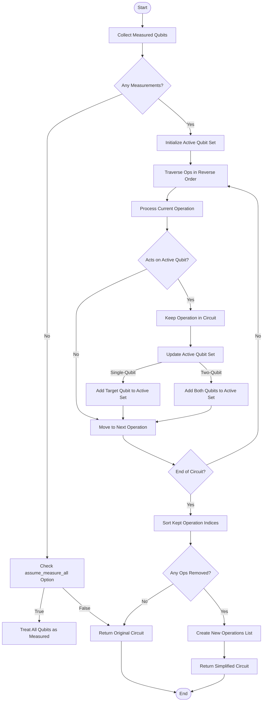
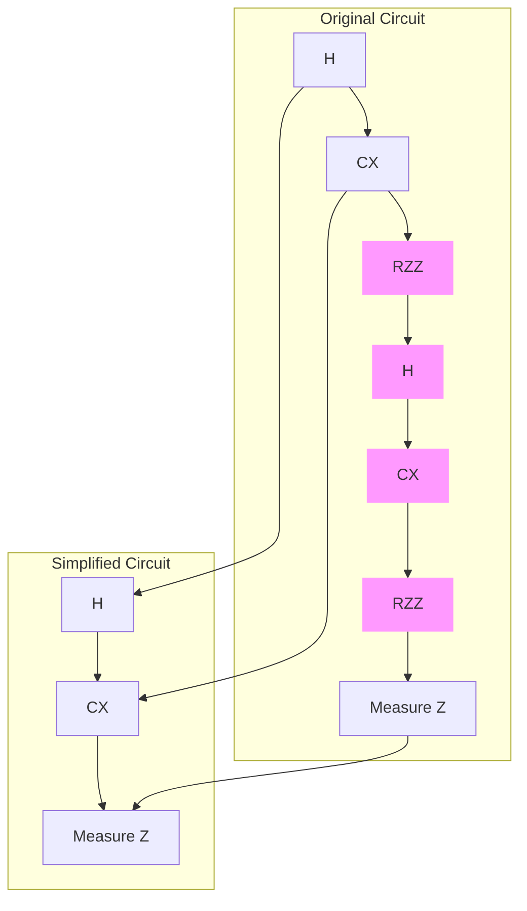

# Simplification Stage

<cite>
**Referenced Files in This Document**   
- [lightcone.py](file://src/tyxonq/compiler/stages/simplify/lightcone.py)
- [circuit.py](file://src/tyxonq/core/ir/circuit.py)
- [lightcone_simplify.py](file://examples-ng/lightcone_simplify.py)
- [test_compiler_simplify_lightcone.py](file://tests_core_module/test_compiler_simplify_lightcone.py)
- [test_compiler_simplify_lightcone_extras.py](file://tests_core_module/test_compiler_simplify_lightcone_extras.py)
- [__init__.py](file://src/tyxonq/postprocessing/__init__.py)
</cite>

## Table of Contents
1. [Introduction](#introduction)
2. [Core Algorithm: Lightcone Traversal](#core-algorithm-lightcone-traversal)
3. [Integration with Postprocessing Requirements](#integration-with-postprocessing-requirements)
4. [Examples of Circuit Simplification](#examples-of-circuit-simplification)
5. [Preservation of Gradient Semantics](#preservation-of-gradient-semantics)
6. [Common Issues and Limitations](#common-issues-and-limitations)
7. [Best Practices for Optimization Passes](#best-practices-for-optimization-passes)

## Introduction
The Simplification stage in TyxonQ's compiler leverages lightcone-based circuit optimization to eliminate quantum operations that do not influence final measurement outcomes. This optimization significantly reduces both circuit depth and total gate count by analyzing the causal influence zones within the Intermediate Representation (IR) dependency graph. The process is particularly effective for variational quantum algorithms and time-evolution circuits, where large portions of the circuit may be irrelevant to specific observables. By focusing only on operations within the lightcone of measured qubits, the compiler enables faster simulation and execution while preserving computational accuracy.

**Section sources**
- [lightcone.py](file://src/tyxonq/compiler/stages/simplify/lightcone.py#L12-L95)
- [circuit.py](file://src/tyxonq/core/ir/circuit.py#L100-L200)

## Core Algorithm: Lightcone Traversal
The lightcone optimization algorithm operates through a backward traversal of the IR dependency graph, starting from measurement operations and propagating causal influence backward through entangling gates. The algorithm identifies all operations that causally affect measured qubits, forming the "lightcone" of relevant operations.

The traversal process follows these steps:
1. **Measurement Collection**: Identify all explicitly measured qubits from `measure_z` operations
2. **Backward Slicing**: Traverse operations in reverse order, maintaining an active set of qubits influenced by measurements
3. **Dependency Propagation**: For each operation, if it acts on any active qubit, include it in the simplified circuit and expand the active set
4. **Entanglement Handling**: Two-qubit gates propagate dependency to both qubits, expanding the lightcone across entangled pairs

This approach ensures that only operations within the causal past of measurement events are preserved, while all other operations are pruned from the circuit.



**Diagram sources**
- [lightcone.py](file://src/tyxonq/compiler/stages/simplify/lightcone.py#L12-L95)

**Section sources**
- [lightcone.py](file://src/tyxonq/compiler/stages/simplify/lightcone.py#L12-L95)

## Integration with Postprocessing Requirements
The lightcone simplification is tightly integrated with TyxonQ's postprocessing framework, ensuring that optimization decisions respect downstream analysis requirements. The postprocessing system routes operations based on the `method` parameter, which can include expectation value calculations, readout mitigation, and other quantum measurements.

When simplification is applied, the system ensures that:
- Measurement operations required for postprocessing are preserved
- Observable calculations (e.g., Pauli term expectations) maintain access to necessary qubits
- Readout mitigation procedures can still access calibration data for relevant qubits

The integration is managed through the `apply_postprocessing` function, which coordinates between the simplified circuit and various postprocessing methods, ensuring that the reduced circuit still satisfies all measurement requirements specified in the computation.

```mermaid
graph TD
Circuit[Circuit] --> Simplification[Lightcone Simplification]
Simplification --> SimplifiedCircuit[Simplified Circuit]
SimplifiedCircuit --> Postprocessing[Postprocessing]
Postprocessing --> MethodChoice{Postprocessing Method}
MethodChoice --> |expval_pauli_sum| PauliExpectation[Pauli Expectation Calculation]
MethodChoice --> |readout_mitigation| ReadoutMitigation[Readout Mitigation]
MethodChoice --> |Other| OtherMethods[Other Postprocessing]
PauliExpectation --> Result[Final Result]
ReadoutMitigation --> Result
OtherMethods --> Result
OriginalCircuit[Circuit (Original)] --> Postprocessing
```

**Diagram sources**
- [__init__.py](file://src/tyxonq/postprocessing/__init__.py#L15-L132)
- [lightcone.py](file://src/tyxonq/compiler/stages/simplify/lightcone.py#L12-L95)

**Section sources**
- [__init__.py](file://src/tyxonq/postprocessing/__init__.py#L15-L132)
- [lightcone.py](file://src/tyxonq/compiler/stages/simplify/lightcone.py#L12-L95)

## Examples of Circuit Simplification
The lightcone optimization demonstrates significant efficiency gains in various quantum circuit types, particularly in large variational circuits and time-evolution circuits with Trotter steps.

### Variational Quantum Eigensolver (VQE) Circuits
In variational circuits like those used in VQE, the lightcone optimization can dramatically reduce circuit complexity when only specific qubits are measured. For example, in a brickwall ansatz with RZZ gates, if only a subset of qubits are measured, the algorithm prunes all operations that do not influence those qubits, even if they are deep in the circuit.

### Time-Evolution Circuits
For time-evolution circuits using Trotter decomposition, the lightcone optimization is particularly effective. When simulating local observables, only a fraction of the Trotter steps may be relevant, allowing the compiler to eliminate entire blocks of gates that do not affect the measured subsystem.

The `lightcone_simplify.py` example demonstrates this optimization by comparing execution time and gradient computation with and without lightcone simplification, showing substantial performance improvements while maintaining numerical equivalence.



**Diagram sources**
- [lightcone_simplify.py](file://examples-ng/lightcone_simplify.py#L20-L50)
- [lightcone.py](file://src/tyxonq/compiler/stages/simplify/lightcone.py#L12-L95)

**Section sources**
- [lightcone_simplify.py](file://examples-ng/lightcone_simplify.py#L20-L50)
- [test_compiler_simplify_lightcone.py](file://tests_core_module/test_compiler_simplify_lightcone.py#L5-L20)

## Preservation of Gradient Semantics
The lightcone simplification preserves gradient semantics required for parameter-shift rules, ensuring that derivative calculations remain valid after optimization. This is critical for variational algorithms where gradients are computed using parameter-shift rules.

The algorithm maintains gradient integrity by:
- Preserving all parameterized gates within the lightcone of measured observables
- Maintaining the causal relationship between parameters and measurement outcomes
- Ensuring that the simplified circuit produces identical expectation values and gradients as the original

When the `enable_lightcone` flag is set in expectation value calculations, the system verifies that the simplified circuit produces numerically equivalent results (within tolerance) to the unsimplified version, as demonstrated in the test cases that assert gradient consistency.

**Section sources**
- [lightcone_simplify.py](file://examples-ng/lightcone_simplify.py#L30-L60)
- [test_compiler_simplify_lightcone.py](file://tests_core_module/test_compiler_simplify_lightcone.py#L25-L35)

## Common Issues and Limitations
Despite its effectiveness, the lightcone simplification faces several challenges and limitations:

### Incomplete Simplification
Incomplete simplification can occur due to:
- **Dynamic Control Flow**: Circuits with conditional operations based on mid-circuit measurements may have lightcone boundaries that are difficult to determine statically
- **Global Measurements**: When all qubits are measured (via `assume_measure_all`), no simplification occurs as the entire circuit is within the lightcone
- **Barrier Operations**: Barrier instructions may prevent optimal pruning by artificially extending the lightcone

### Incorrect Lightcone Boundaries
Boundary detection issues can arise when:
- Entangling gates create non-local dependencies that are not fully captured
- Measurement operations are added programmatically rather than explicitly in the IR
- Qubit remapping or compilation stages alter the qubit connectivity after lightcone analysis

These limitations are addressed through careful validation in the test suite, which verifies that pruned operations do not affect measurement outcomes.

**Section sources**
- [lightcone.py](file://src/tyxonq/compiler/stages/simplify/lightcone.py#L12-L95)
- [test_compiler_simplify_lightcone.py](file://tests_core_module/test_compiler_simplify_lightcone.py#L5-L35)
- [test_compiler_simplify_lightcone_extras.py](file://tests_core_module/test_compiler_simplify_lightcone_extras.py#L1-L10)

## Best Practices for Optimization Passes
To maximize the effectiveness of lightcone simplification and integrate it with other optimization passes, consider the following best practices:

1. **Pass Ordering**: Apply lightcone simplification early in the compilation pipeline, before more complex optimizations, to reduce the workload for subsequent passes
2. **Combine with Other Passes**: Chain lightcone simplification with gate merging, rotation optimization, and layout passes for cumulative improvements
3. **Explicit Measurements**: Use explicit `measure_z` operations rather than relying on `assume_measure_all` to enable maximum simplification
4. **Validation**: Always verify that simplified circuits produce equivalent results to original circuits, especially for gradient computations
5. **Benchmarking**: Use the provided benchmarking tools to quantify performance improvements from simplification

The optimal optimization pipeline typically follows: Decompose → Lightcone Simplify → Gate Rewrite → Layout → Scheduling, allowing each pass to build upon the reductions achieved by previous stages.

**Section sources**
- [lightcone.py](file://src/tyxonq/compiler/stages/simplify/lightcone.py#L12-L95)
- [test_compiler_simplify_lightcone.py](file://tests_core_module/test_compiler_simplify_lightcone.py#L5-L35)
- [circuit.py](file://src/tyxonq/core/ir/circuit.py#L500-L600)