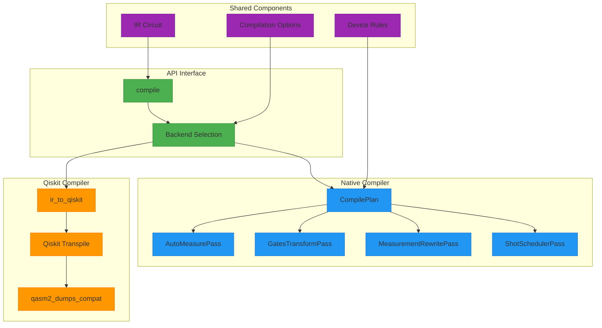
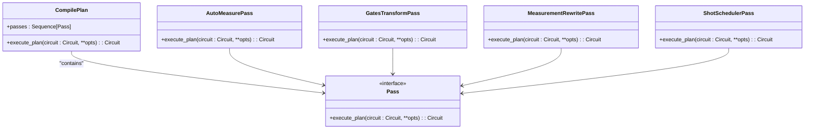

# Compiler Backends

<cite>
**Referenced Files in This Document**   
- [api.py](file://src/tyxonq/compiler/api.py)
- [native_compiler.py](file://src/tyxonq/compiler/compile_engine/native/native_compiler.py)
- [qiskit_compiler.py](file://src/tyxonq/compiler/compile_engine/qiskit/qiskit_compiler.py)
- [compile_plan.py](file://src/tyxonq/compiler/compile_engine/native/compile_plan.py)
- [dialect.py](file://src/tyxonq/compiler/compile_engine/qiskit/dialect.py)
- [auto_measure.py](file://src/tyxonq/compiler/stages/rewrite/auto_measure.py)
- [gates_transform.py](file://src/tyxonq/compiler/stages/rewrite/gates_transform.py)
- [shot_scheduler.py](file://src/tyxonq/compiler/stages/scheduling/shot_scheduler.py)
- [measurement.py](file://src/tyxonq/compiler/stages/rewrite/measurement.py)
</cite>

## Table of Contents
1. [Introduction](#introduction)
2. [Architecture Overview](#architecture-overview)
3. [Native Compiler](#native-compiler)
4. [Qiskit Compiler](#qiskit-compiler)
5. [API Interface and Backend Selection](#api-interface-and-backend-selection)
6. [Practical Examples](#practical-examples)
7. [Trade-offs and Performance](#trade-offs-and-performance)
8. [Troubleshooting Guide](#troubleshooting-guide)

## Introduction

The TyxonQ compiler backends provide a pluggable architecture for quantum circuit compilation, enabling both native optimization and interoperability with external frameworks. This document details the design and implementation of the two primary backends: the native compiler and the Qiskit compiler. The native compiler offers deep integration with TyxonQ's intermediate representation (IR) and advanced optimization capabilities, while the Qiskit compiler provides seamless interoperability with the Qiskit ecosystem. Both backends share a common API interface that allows users to select compilation strategies, pass options, and handle fallback mechanisms consistently.

**Section sources**
- [api.py](file://src/tyxonq/compiler/api.py#L0-L65)

## Architecture Overview

The compiler backends architecture is designed around a pluggable system that separates compilation concerns from execution concerns. The core components include the API interface, native compiler, Qiskit compiler, and various compilation stages that implement specific transformations. This modular design enables independent development and testing of compilation strategies while maintaining a consistent interface for users.



**Diagram sources**
- [api.py](file://src/tyxonq/compiler/api.py#L0-L65)
- [native_compiler.py](file://src/tyxonq/compiler/compile_engine/native/native_compiler.py#L12-L98)
- [qiskit_compiler.py](file://src/tyxonq/compiler/compile_engine/qiskit/qiskit_compiler.py#L19-L76)

## Native Compiler

The native compiler implements TyxonQ's proprietary compilation pipeline, optimized for performance and integration with the framework's intermediate representation. It processes circuits through a series of compilation stages that transform the circuit according to specified optimization levels and device constraints.

### Compile Plan Execution

The native compiler uses a compile plan to orchestrate the sequence of compilation passes. The plan is constructed from a list of stage names, which are resolved to actual pass instances. The default pipeline always includes essential normalization passes such as auto-measurement insertion and gate transformation, followed by any user-specified passes.



**Diagram sources**
- [compile_plan.py](file://src/tyxonq/compiler/compile_engine/native/compile_plan.py#L0-L97)
- [auto_measure.py](file://src/tyxonq/compiler/stages/rewrite/auto_measure.py#L10-L34)
- [gates_transform.py](file://src/tyxonq/compiler/stages/rewrite/gates_transform.py#L9-L49)
- [measurement.py](file://src/tyxonq/compiler/stages/rewrite/measurement.py#L9-L88)
- [shot_scheduler.py](file://src/tyxonq/compiler/stages/scheduling/shot_scheduler.py#L121-L133)

### Optimization Capabilities

The native compiler provides several optimization capabilities that enhance circuit efficiency and execution performance:

1. **Auto-measurement insertion**: When no explicit measurements are present in the circuit, the compiler automatically inserts Z measurements on all qubits, ensuring that execution produces meaningful results.

2. **Gate transformation**: The compiler rewrites gates according to the preferred basis gates specified in the compilation options. For example, X gates are transformed to RX(π) when RX gates are allowed in the basis.

3. **Measurement grouping**: The compiler groups measurement operations to enable shot reuse and reduce execution time. This is particularly important for variational algorithms like VQE that require multiple expectation value calculations.

4. **Shot scheduling**: Based on measurement grouping metadata, the compiler generates a shot allocation plan that optimizes the distribution of shots across different measurement settings.

### Integration with Device Rules

The native compiler integrates with device rules to ensure that compiled circuits are compatible with target hardware constraints. Device rules can specify limitations such as maximum shots per job, batch execution capabilities, and supported gate sets. The compiler uses this information to split execution segments appropriately and validate compilation options.

**Section sources**
- [native_compiler.py](file://src/tyxonq/compiler/compile_engine/native/native_compiler.py#L12-L98)
- [compile_plan.py](file://src/tyxonq/compiler/compile_engine/native/compile_plan.py#L0-L97)

## Qiskit Compiler

The Qiskit compiler provides interoperability with the Qiskit ecosystem, enabling users to leverage Qiskit's extensive optimization and transpilation capabilities. It acts as an adapter between TyxonQ's IR and Qiskit's QuantumCircuit representation.

### Dialect Translation

The Qiskit compiler implements dialect translation through a set of adapter functions that convert between TyxonQ's IR and Qiskit's circuit representation. The translation process preserves the semantics of quantum operations while adapting to Qiskit's data model.


**Diagram sources**
- [dialect.py](file://src/tyxonq/compiler/compile_engine/qiskit/dialect.py#L133-L139)
- [qiskit_compiler.py](file://src/tyxonq/compiler/compile_engine/qiskit/qiskit_compiler.py#L19-L76)

### Round-trip Fidelity

The Qiskit compiler maintains high round-trip fidelity when converting between IR and Qiskit representations. This ensures that circuits can be translated to Qiskit for optimization and then converted back to IR without loss of information. The fidelity is achieved through careful mapping of quantum operations and preservation of circuit structure.

### QASM2 Output Generation

The compiler generates QASM2 output using the `qasm2_dumps_compat` function, which attempts to use Qiskit's modern QASM2 serializer when available, falling back to the legacy QASM method when necessary. This ensures compatibility with different Qiskit versions while providing access to the latest QASM2 features.

**Section sources**
- [qiskit_compiler.py](file://src/tyxonq/compiler/compile_engine/qiskit/qiskit_compiler.py#L19-L76)
- [dialect.py](file://src/tyxonq/compiler/compile_engine/qiskit/dialect.py#L26-L39)

## API Interface and Backend Selection

The compiler API provides a unified interface for selecting backends, passing options, and handling compilation results. This interface abstracts the differences between native and Qiskit compilation, allowing users to switch between backends with minimal code changes.

### Backend Selection

Users can select the compilation backend using the `compile_engine` parameter, which accepts the following values:
- `"default"` or `"native"`: Uses the native compiler
- `"qiskit"`: Uses the Qiskit compiler

The API automatically handles the instantiation of the appropriate compiler class based on the selected backend.

### Compilation Options

Both backends support a common set of compilation options that control the compilation process:

- `output`: Specifies the output format (`"ir"`, `"qasm2"`, or `"qiskit"`)
- `basis_gates`: Defines the preferred gate set for compilation
- `optimization_level`: Controls the aggressiveness of optimization passes
- `add_measures`: Determines whether measurements are automatically added
- `transpile`: Enables or disables Qiskit's transpilation process

### Fallback Mechanisms

The API implements fallback mechanisms to handle cases where a requested compilation backend is not available. For example, if Qiskit is not installed, attempts to use the Qiskit compiler will raise a `RuntimeError`. Similarly, when generating QASM2 output through the native compiler, it will fall back to returning the IR if the Qiskit adapter fails.

**Section sources**
- [api.py](file://src/tyxonq/compiler/api.py#L0-L65)

## Practical Examples

This section demonstrates how to compile a VQE circuit using both the native and Qiskit backends, comparing their outputs and usage patterns.

### Native Backend Compilation

```python
# Example of compiling a VQE circuit with the native backend
circuit = build_vqe_circuit()  # Assume this function exists
result = compile(
    circuit,
    compile_engine="native",
    output="ir",
    optimization_level=2,
    basis_gates=["h", "rx", "rz", "cx", "cz"]
)
```

The native backend will apply its optimization pipeline, including measurement grouping and shot scheduling, producing an optimized IR circuit suitable for execution on TyxonQ devices.

### Qiskit Backend Compilation

```python
# Example of compiling a VQE circuit with the Qiskit backend
circuit = build_vqe_circuit()  # Assume this function exists
result = compile(
    circuit,
    compile_engine="qiskit",
    output="qasm2",
    optimization_level=2,
    basis_gates=["cx", "h", "rz", "rx", "cz"]
)
```

The Qiskit backend will translate the circuit to Qiskit's representation, apply Qiskit's transpilation passes, and generate QASM2 output that can be executed on Qiskit-compatible devices.

### Output Comparison

When comparing the outputs of both backends:
- The native backend produces optimized IR that maintains full compatibility with TyxonQ's execution model
- The Qiskit backend produces QASM2 that can be executed on any Qiskit-compatible platform
- Both backends preserve the semantic correctness of the original circuit
- The Qiskit backend may produce different gate decompositions due to Qiskit's transpilation rules

**Section sources**
- [native_compiler.py](file://src/tyxonq/compiler/compile_engine/native/native_compiler.py#L12-L98)
- [qiskit_compiler.py](file://src/tyxonq/compiler/compile_engine/qiskit/qiskit_compiler.py#L19-L76)

## Trade-offs and Performance

Choosing between the native and Qiskit backends involves several trade-offs related to optimization, interoperability, and performance.

### Native Optimizations vs. Qiskit Interoperability

The native compiler offers deeper integration with TyxonQ's architecture, enabling optimizations that are specific to the framework's execution model. These include:
- Advanced measurement grouping and shot scheduling
- Tight integration with device rules and constraints
- Optimized gate transformations for TyxonQ hardware

In contrast, the Qiskit compiler provides superior interoperability with the broader quantum computing ecosystem:
- Compatibility with Qiskit's extensive device library
- Access to Qiskit's advanced transpilation algorithms
- Ability to generate standard QASM2 for cross-platform execution

### Performance Differences

Performance characteristics differ between the backends:
- The native compiler typically has lower overhead due to its direct integration with TyxonQ's IR
- The Qiskit compiler may introduce additional overhead from the translation process and Qiskit's transpilation
- For circuits that benefit from Qiskit's advanced optimization passes, the Qiskit backend may produce more efficient circuits
- The native backend is optimized for TyxonQ's execution model, potentially yielding better performance on TyxonQ devices

**Section sources**
- [native_compiler.py](file://src/tyxonq/compiler/compile_engine/native/native_compiler.py#L12-L98)
- [qiskit_compiler.py](file://src/tyxonq/compiler/compile_engine/qiskit/qiskit_compiler.py#L19-L76)

## Troubleshooting Guide

This section addresses common issues encountered when using the compiler backends and provides strategies for resolution.

### Backend-specific Compilation Failures

When the Qiskit backend fails to compile a circuit, common causes include:
- Qiskit not being installed or available in the environment
- Incompatible circuit operations that cannot be translated to Qiskit
- Memory limitations during transpilation

Resolution strategies:
- Ensure Qiskit is properly installed: `pip install qiskit`
- Verify that all operations in the circuit are supported by the `ir_to_qiskit` adapter
- Monitor memory usage and consider simplifying large circuits

### Dialect Incompatibilities

Dialect translation issues may occur when:
- Operations in the IR have no direct equivalent in Qiskit
- Circuit metadata is not properly preserved during translation
- Parameterized gates have incompatible parameter expressions

Mitigation approaches:
- Use the native backend for circuits with custom operations
- Simplify parameter expressions to basic mathematical operations
- Validate circuit structure before translation

### Performance Differences

When experiencing unexpected performance differences:
- Compare optimization levels between backends
- Check that basis gates are appropriately configured for the target device
- Verify that shot allocation is optimal for the measurement requirements

Configuration tips:
- For the native backend, use higher optimization levels for complex circuits
- For the Qiskit backend, experiment with different transpilation settings
- Monitor compilation time and adjust circuit complexity accordingly

**Section sources**
- [qiskit_compiler.py](file://src/tyxonq/compiler/compile_engine/qiskit/qiskit_compiler.py#L19-L76)
- [dialect.py](file://src/tyxonq/compiler/compile_engine/qiskit/dialect.py#L26-L39)