# Compiler Pipeline

<cite>
**Referenced Files in This Document**   
- [api.py](file://src/tyxonq/compiler/api.py)
- [native_compiler.py](file://src/tyxonq/compiler/compile_engine/native/native_compiler.py)
- [compile_plan.py](file://src/tyxonq/compiler/compile_engine/native/compile_plan.py)
- [qiskit_compiler.py](file://src/tyxonq/compiler/compile_engine/qiskit/qiskit_compiler.py)
- [dialect.py](file://src/tyxonq/compiler/compile_engine/qiskit/dialect.py)
- [rotations.py](file://src/tyxonq/compiler/stages/decompose/rotations.py)
- [measurement.py](file://src/tyxonq/compiler/stages/rewrite/measurement.py)
- [lightcone.py](file://src/tyxonq/compiler/stages/simplify/lightcone.py)
- [shot_scheduler.py](file://src/tyxonq/compiler/stages/scheduling/shot_scheduler.py)
- [parameter_shift_pass.py](file://src/tyxonq/compiler/stages/gradients/parameter_shift_pass.py)
- [gates_transform.py](file://src/tyxonq/compiler/stages/rewrite/gates_transform.py)
- [auto_measure.py](file://src/tyxonq/compiler/stages/rewrite/auto_measure.py)
- [merge_prune.py](file://src/tyxonq/compiler/stages/rewrite/merge_prune.py)
</cite>

## Table of Contents
1. [Introduction](#introduction)
2. [Compiler Architecture Overview](#compiler-architecture-overview)
3. [Compilation Stages](#compilation-stages)
   - [Decomposition](#decomposition)
   - [Rewriting](#rewriting)
   - [Simplification](#simplification)
   - [Scheduling](#scheduling)
   - [Gradient Processing](#gradient-processing)
4. [Optimization Passes](#optimization-passes)
   - [Measurement Rewriting](#measurement-rewriting)
   - [Lightcone Simplification](#lightcone-simplification)
   - [Shot Scheduling](#shot-scheduling)
5. [Backend System](#backend-system)
   - [Native Backend](#native-backend)
   - [Qiskit Backend](#qiskit-backend)
   - [Dialect Translation](#dialect-translation)
   - [Round-Trip Capabilities](#round-trip-capabilities)
6. [API Interface](#api-interface)
   - [Compilation Workflows](#compilation-workflows)
   - [Optimization Configuration](#optimization-configuration)
7. [Practical Examples](#practical-examples)
   - [VQE Circuit Compilation](#vqe-circuit-compilation)
   - [QAOA Circuit Compilation](#qaoa-circuit-compilation)
8. [Integration Points](#integration-points)
   - [Device Constraints](#device-constraints)
   - [Numerics Backend Requirements](#numerics-backend-requirements)
9. [Troubleshooting](#troubleshooting)
   - [Failed Passes](#failed-passes)
   - [Suboptimal Reductions](#suboptimal-reductions)
10. [Performance Tuning](#performance-tuning)
    - [Large-Scale Circuit Optimization](#large-scale-circuit-optimization)

## Introduction

The TyxonQ compiler pipeline provides a modular framework for quantum circuit compilation with support for multiple optimization stages, pluggable backends, and advanced scheduling capabilities. This document details the architecture, stages, optimization passes, and integration points of the compiler system, enabling users to effectively compile and optimize quantum circuits for various execution targets.

**Section sources**
- [api.py](file://src/tyxonq/compiler/api.py#L0-L65)

## Compiler Architecture Overview

The TyxonQ compiler follows a modular architecture with distinct compilation stages that can be configured through a flexible API. The system supports both native compilation and integration with external frameworks like Qiskit, providing a unified interface for quantum circuit compilation.

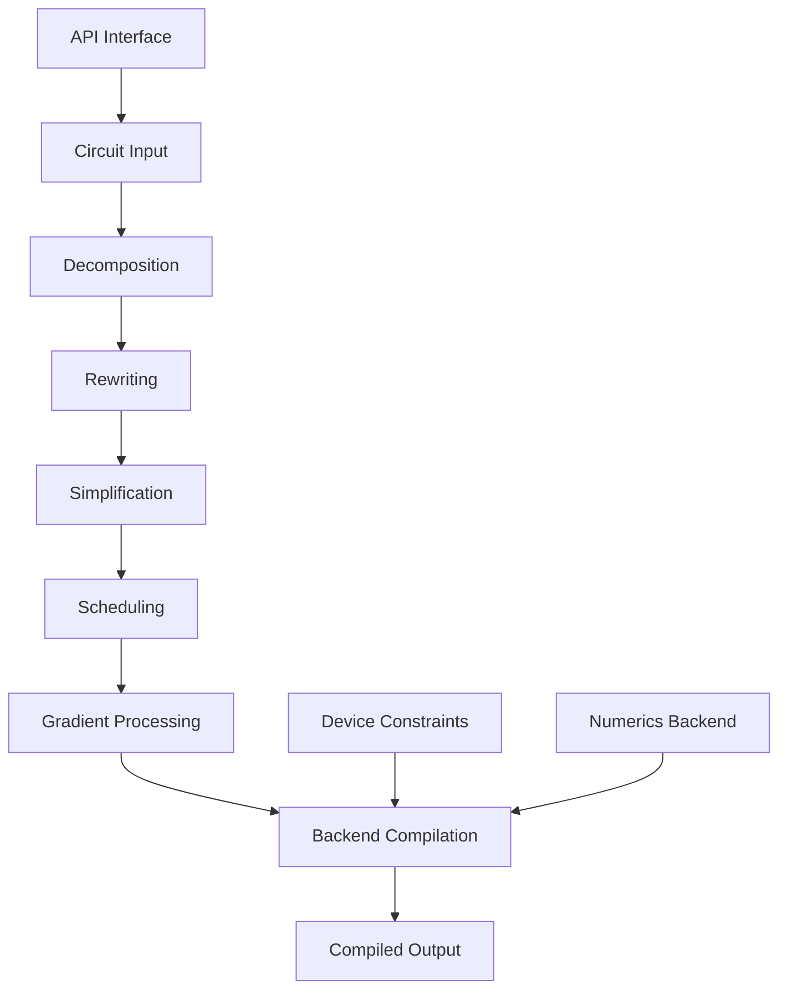

**Diagram sources**
- [api.py](file://src/tyxonq/compiler/api.py#L0-L65)
- [native_compiler.py](file://src/tyxonq/compiler/compile_engine/native/native_compiler.py#L0-L101)

**Section sources**
- [api.py](file://src/tyxonq/compiler/api.py#L0-L65)
- [native_compiler.py](file://src/tyxonq/compiler/compile_engine/native/native_compiler.py#L0-L101)

## Compilation Stages

The compiler pipeline consists of five distinct stages that transform quantum circuits through various optimization and preparation steps.

### Decomposition

The decomposition stage breaks down complex quantum operations into fundamental gate sets supported by target hardware. The `RotationsDecomposePass` handles parametric rotations by decomposing them into standard gate identities.

```mermaid
graph TD
A[RX(θ)] --> B[H · RZ(θ) · H]
C[RY(θ)] --> D[S† · H · RZ(θ) · H · S]
E[RZZ(θ)] --> F[CX · RZ(θ) · CX]
G[RXX(θ)] --> H[H⊗H · CX · RZ(θ) · CX · H⊗H]
I[RYY(θ)] --> J[(S†H)⊗(S†H) · CX · RZ(θ) · CX · (HS)⊗(HS)]
```

**Diagram sources**
- [rotations.py](file://src/tyxonq/compiler/stages/decompose/rotations.py#L0-L69)

**Section sources**
- [rotations.py](file://src/tyxonq/compiler/stages/decompose/rotations.py#L0-L69)

### Rewriting

The rewriting stage transforms circuit components according to specified rules and constraints. This includes gate basis transformations, measurement handling, and circuit normalization.

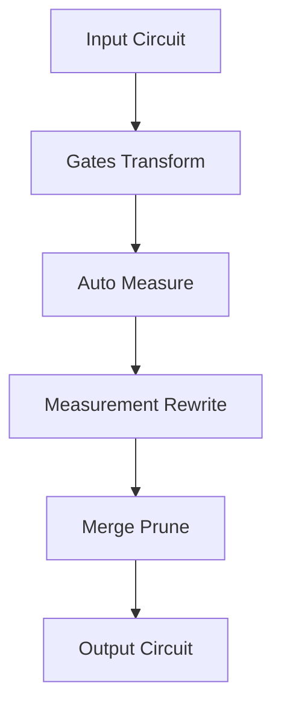

**Diagram sources**
- [gates_transform.py](file://src/tyxonq/compiler/stages/rewrite/gates_transform.py#L0-L52)
- [auto_measure.py](file://src/tyxonq/compiler/stages/rewrite/auto_measure.py#L0-L37)
- [measurement.py](file://src/tyxonq/compiler/stages/rewrite/measurement.py#L0-L164)
- [merge_prune.py](file://src/tyxonq/compiler/stages/rewrite/merge_prune.py#L0-L85)

**Section sources**
- [gates_transform.py](file://src/tyxonq/compiler/stages/rewrite/gates_transform.py#L0-L52)
- [auto_measure.py](file://src/tyxonq/compiler/stages/rewrite/auto_measure.py#L0-L37)
- [measurement.py](file://src/tyxonq/compiler/stages/rewrite/measurement.py#L0-L164)
- [merge_prune.py](file://src/tyxonq/compiler/stages/rewrite/merge_prune.py#L0-L85)

### Simplification

The simplification stage reduces circuit complexity through optimization techniques. The lightcone simplification pass implements backward slicing to remove operations that do not affect measured qubits.

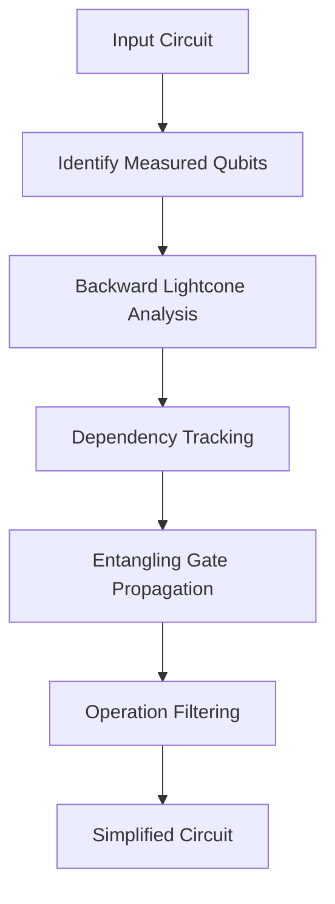

**Diagram sources**
- [lightcone.py](file://src/tyxonq/compiler/stages/simplify/lightcone.py#L0-L98)

**Section sources**
- [lightcone.py](file://src/tyxonq/compiler/stages/simplify/lightcone.py#L0-L98)

### Scheduling

The scheduling stage prepares circuits for execution by organizing measurement operations and allocating shot budgets. The shot scheduler converts measurement grouping metadata into executable segments.

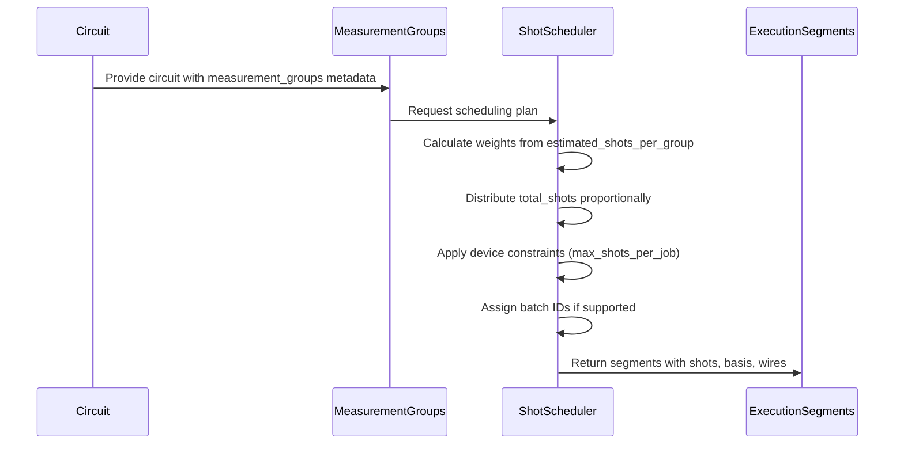

**Diagram sources**
- [shot_scheduler.py](file://src/tyxonq/compiler/stages/scheduling/shot_scheduler.py#L0-L136)

**Section sources**
- [shot_scheduler.py](file://src/tyxonq/compiler/stages/scheduling/shot_scheduler.py#L0-L136)

### Gradient Processing

The gradient processing stage prepares circuits for gradient-based optimization by generating parameter-shift circuits. The parameter shift pass creates metadata for computing gradients through finite differences.

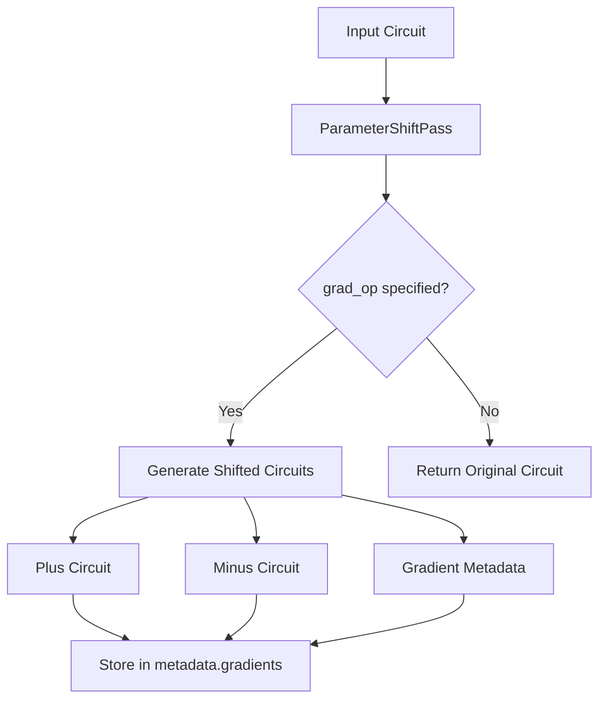

**Diagram sources**
- [parameter_shift_pass.py](file://src/tyxonq/compiler/stages/gradients/parameter_shift_pass.py#L0-L31)

**Section sources**
- [parameter_shift_pass.py](file://src/tyxonq/compiler/stages/gradients/parameter_shift_pass.py#L0-L31)

## Optimization Passes

### Measurement Rewriting

The measurement rewriting pass groups measurement operations to enable shot reuse and optimize execution efficiency. It supports both explicit measurement instructions and Hamiltonian-based observable grouping.

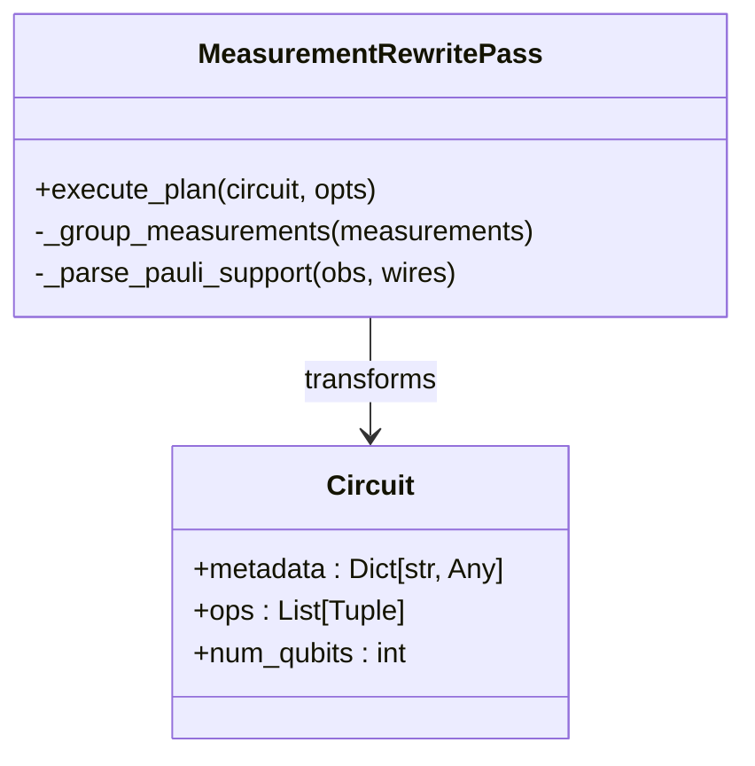

**Diagram sources**
- [measurement.py](file://src/tyxonq/compiler/stages/rewrite/measurement.py#L0-L164)

**Section sources**
- [measurement.py](file://src/tyxonq/compiler/stages/rewrite/measurement.py#L0-L164)

### Lightcone Simplification

The lightcone simplification pass implements circuit reduction by analyzing the causal cone of measured qubits. Operations outside the lightcone are removed as they do not affect measurement outcomes.

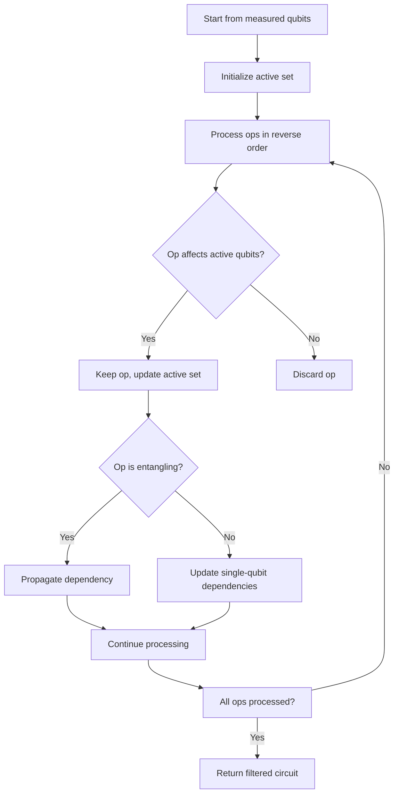

**Diagram sources**
- [lightcone.py](file://src/tyxonq/compiler/stages/simplify/lightcone.py#L0-L98)

**Section sources**
- [lightcone.py](file://src/tyxonq/compiler/stages/simplify/lightcone.py#L0-L98)

### Shot Scheduling

The shot scheduler converts measurement grouping metadata into an executable plan with shot allocation. It supports both explicit shot plans and automatic distribution based on grouping weights.

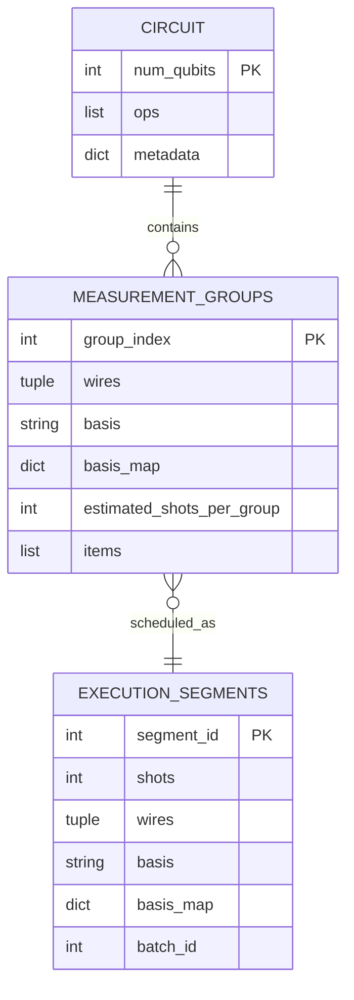

**Diagram sources**
- [shot_scheduler.py](file://src/tyxonq/compiler/stages/scheduling/shot_scheduler.py#L0-L136)

**Section sources**
- [shot_scheduler.py](file://src/tyxonq/compiler/stages/scheduling/shot_scheduler.py#L0-L136)

## Backend System

### Native Backend

The native backend provides TyxonQ's default compilation pipeline with support for IR output and integration with the native execution system. It implements a configurable compilation plan with optimization levels.

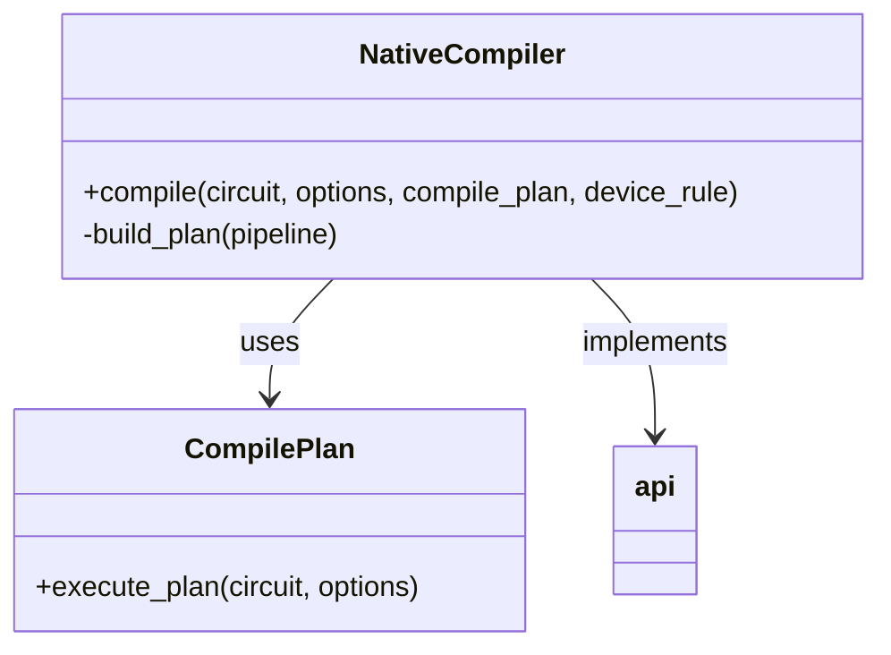

**Diagram sources**
- [native_compiler.py](file://src/tyxonq/compiler/compile_engine/native/native_compiler.py#L0-L101)
- [compile_plan.py](file://src/tyxonq/compiler/compile_engine/native/compile_plan.py)

**Section sources**
- [native_compiler.py](file://src/tyxonq/compiler/compile_engine/native/native_compiler.py#L0-L101)
- [compile_plan.py](file://src/tyxonq/compiler/compile_engine/native/compile_plan.py)

### Qiskit Backend

The Qiskit backend enables integration with the Qiskit framework for transpilation and execution on IBM quantum devices. It provides bidirectional conversion between TyxonQ IR and Qiskit circuits.

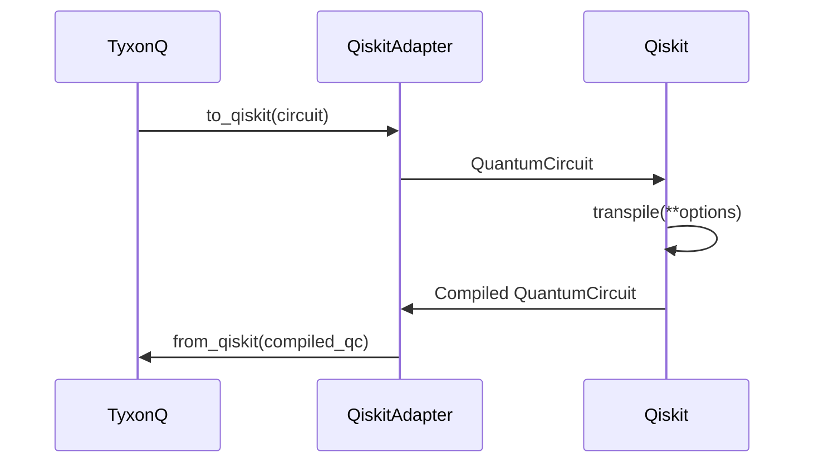

**Diagram sources**
- [qiskit_compiler.py](file://src/tyxonq/compiler/compile_engine/qiskit/qiskit_compiler.py#L0-L83)
- [dialect.py](file://src/tyxonq/compiler/compile_engine/qiskit/dialect.py#L0-L246)

**Section sources**
- [qiskit_compiler.py](file://src/tyxonq/compiler/compile_engine/qiskit/qiskit_compiler.py#L0-L83)
- [dialect.py](file://src/tyxonq/compiler/compile_engine/qiskit/dialect.py#L0-L246)

### Dialect Translation

The dialect translation system provides bidirectional conversion between TyxonQ IR and Qiskit circuits. This enables interoperability with the broader quantum computing ecosystem.

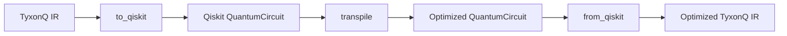

**Diagram sources**
- [dialect.py](file://src/tyxonq/compiler/compile_engine/qiskit/dialect.py#L0-L246)

**Section sources**
- [dialect.py](file://src/tyxonq/compiler/compile_engine/qiskit/dialect.py#L0-L246)

### Round-Trip Capabilities

The compiler supports round-trip translation between TyxonQ IR and Qiskit circuits, preserving circuit semantics through the conversion process. This enables hybrid workflows that leverage both frameworks.

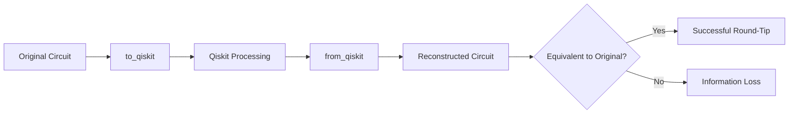

**Diagram sources**
- [dialect.py](file://src/tyxonq/compiler/compile_engine/qiskit/dialect.py#L0-L246)

**Section sources**
- [dialect.py](file://src/tyxonq/compiler/compile_engine/qiskit/dialect.py#L0-L246)

## API Interface

### Compilation Workflows

The unified compile API provides a single entry point for all compilation operations, supporting multiple backends and output formats.

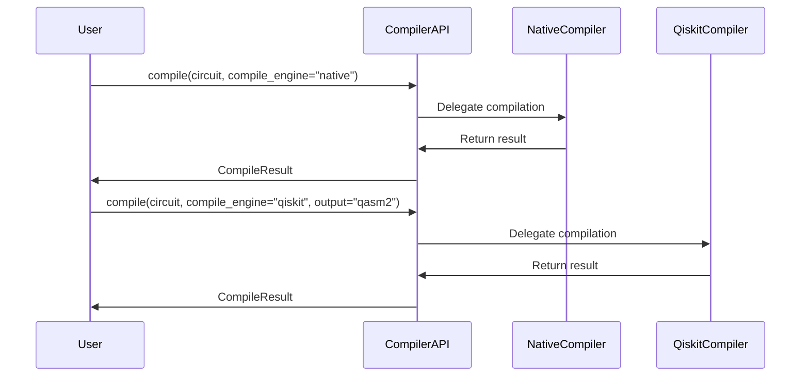

**Diagram sources**
- [api.py](file://src/tyxonq/compiler/api.py#L0-L65)
- [native_compiler.py](file://src/tyxonq/compiler/compile_engine/native/native_compiler.py#L0-L101)
- [qiskit_compiler.py](file://src/tyxonq/compiler/compile_engine/qiskit/qiskit_compiler.py#L0-L83)

**Section sources**
- [api.py](file://src/tyxonq/compiler/api.py#L0-L65)

### Optimization Configuration

The API supports configuration of optimization levels and custom compilation plans, allowing users to balance compilation time with circuit quality.

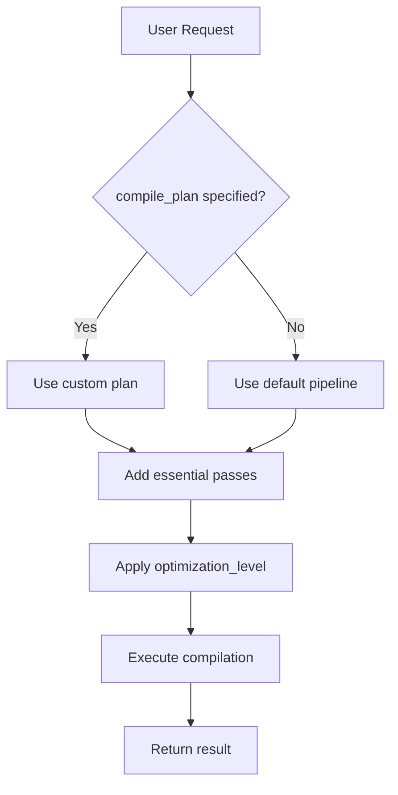

**Diagram sources**
- [api.py](file://src/tyxonq/compiler/api.py#L0-L65)
- [native_compiler.py](file://src/tyxonq/compiler/compile_engine/native/native_compiler.py#L0-L101)

**Section sources**
- [api.py](file://src/tyxonq/compiler/api.py#L0-L65)
- [native_compiler.py](file://src/tyxonq/compiler/compile_engine/native/native_compiler.py#L0-L101)

## Practical Examples

### VQE Circuit Compilation

The compilation of VQE circuits involves specific optimization considerations for variational quantum algorithms.

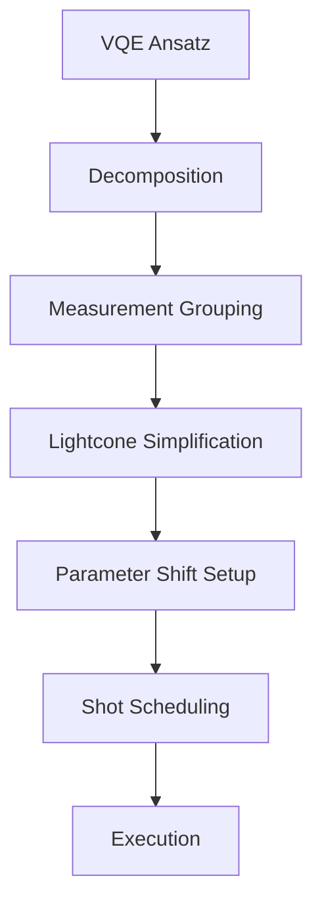

**Section sources**
- [parameter_shift_pass.py](file://src/tyxonq/compiler/stages/gradients/parameter_shift_pass.py#L0-L31)
- [measurement.py](file://src/tyxonq/compiler/stages/rewrite/measurement.py#L0-L164)
- [lightcone.py](file://src/tyxonq/compiler/stages/simplify/lightcone.py#L0-L98)

### QAOA Circuit Compilation

QAOA circuits benefit from specific optimization passes that handle the alternating structure of mixer and cost Hamiltonians.

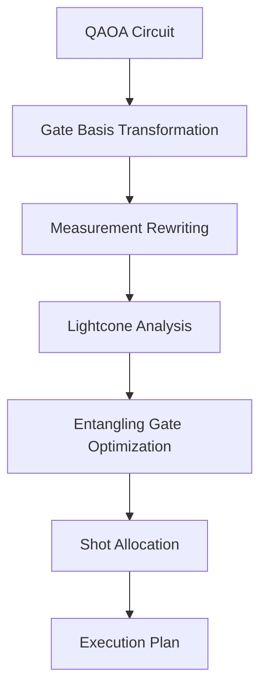

**Section sources**
- [gates_transform.py](file://src/tyxonq/compiler/stages/rewrite/gates_transform.py#L0-L52)
- [measurement.py](file://src/tyxonq/compiler/stages/rewrite/measurement.py#L0-L164)
- [lightcone.py](file://src/tyxonq/compiler/stages/simplify/lightcone.py#L0-L98)

## Integration Points

### Device Constraints

The compiler integrates with device rules to respect hardware limitations and optimize for specific quantum processors.

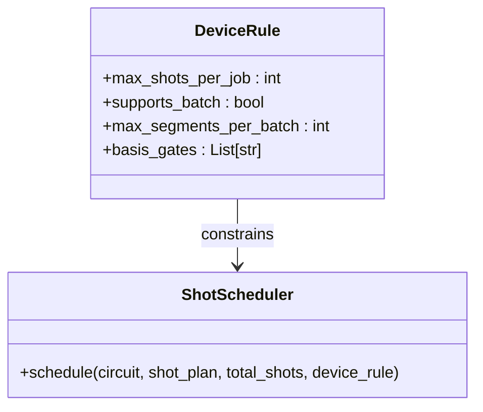

**Diagram sources**
- [shot_scheduler.py](file://src/tyxonq/compiler/stages/scheduling/shot_scheduler.py#L0-L136)

**Section sources**
- [shot_scheduler.py](file://src/tyxonq/compiler/stages/scheduling/shot_scheduler.py#L0-L136)

### Numerics Backend Requirements

The compiler interacts with numerics backends to ensure compatibility between compiled circuits and numerical computation requirements.

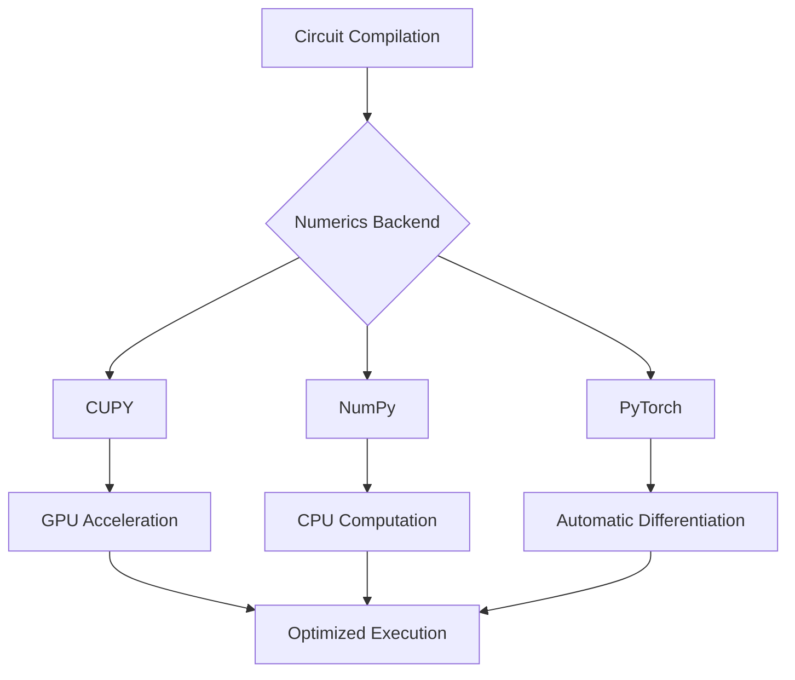

**Section sources**
- [numerics/backends](file://src/tyxonq/numerics/backends)

## Troubleshooting

### Failed Passes

When compilation passes fail, the system provides diagnostic information through metadata and error handling.

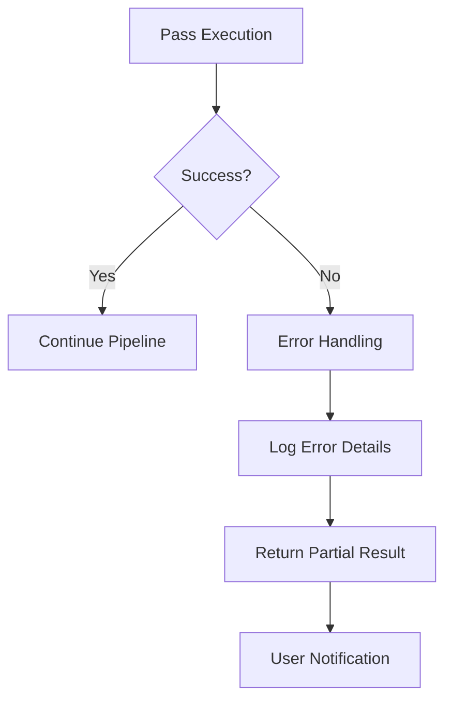

**Section sources**
- [api.py](file://src/tyxonq/compiler/api.py#L0-L65)
- [native_compiler.py](file://src/tyxonq/compiler/compile_engine/native/native_compiler.py#L0-L101)

### Suboptimal Reductions

Cases where circuit simplification does not achieve expected reductions can be diagnosed through lightcone analysis.

```mermaid
flowchart TD
A[Expected Reduction] --> B{Achieved?}
B --> |Yes| C[Optimal Result]
B --> |No| D[Analyze Dependencies]
D --> E[Check Entangling Gates]
E --> F[Verify Measurement Points]
F --> G[Adjust Compilation Plan]
```

**Section sources**
- [lightcone.py](file://src/tyxonq/compiler/stages/simplify/lightcone.py#L0-L98)

## Performance Tuning

### Large-Scale Circuit Optimization

For large-scale circuits, specific optimization strategies can improve compilation efficiency and execution performance.

```mermaid
flowchart TD
A[Large Circuit] --> B[Modular Compilation]
B --> C[Parallel Pass Execution]
C --> D[Memory-Efficient Processing]
D --> E[Incremental Optimization]
E --> F[Batched Execution]
F --> G[Optimized Performance]
```

**Section sources**
- [native_compiler.py](file://src/tyxonq/compiler/compile_engine/native/native_compiler.py#L0-L101)
- [lightcone.py](file://src/tyxonq/compiler/stages/simplify/lightcone.py#L0-L98)
- [shot_scheduler.py](file://src/tyxonq/compiler/stages/scheduling/shot_scheduler.py#L0-L136)