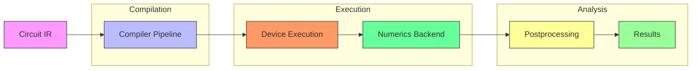
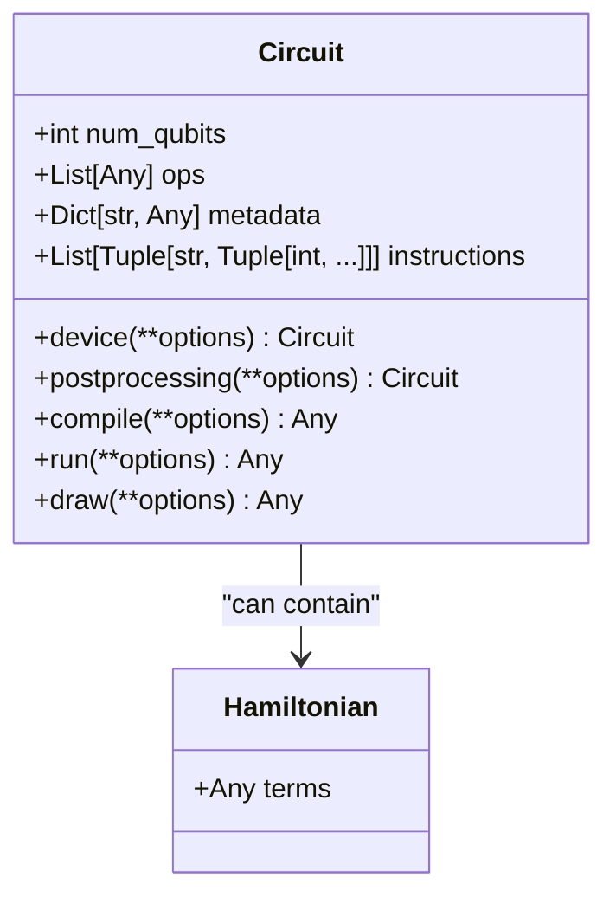
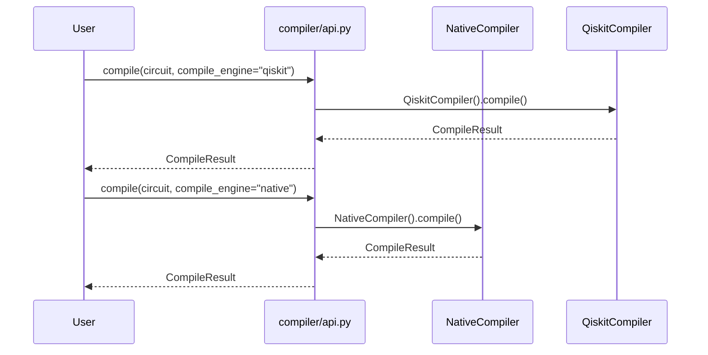
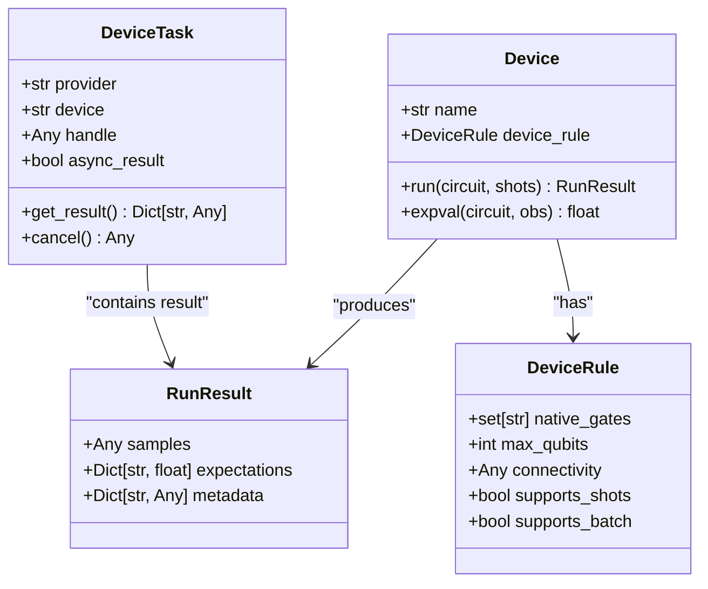
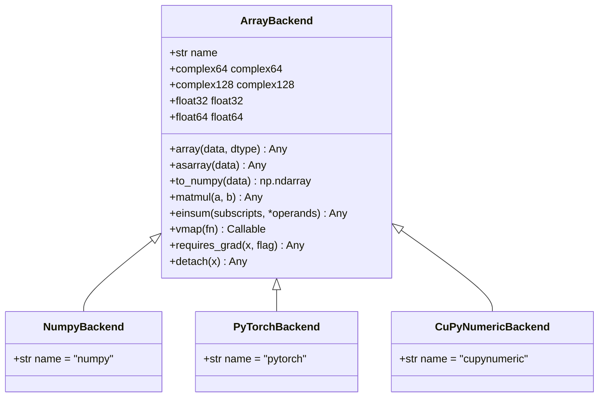
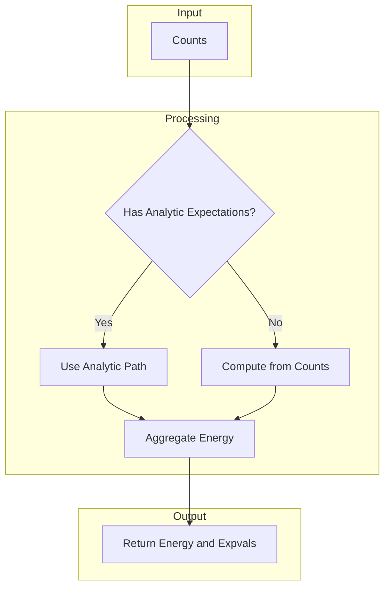
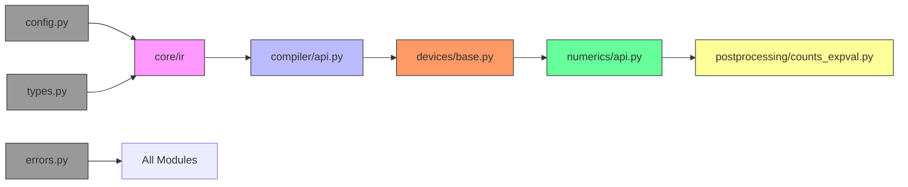

# Core Framework Architecture

<cite>
**Referenced Files in This Document**   
- [circuit.py](file://src/tyxonq/core/ir/circuit.py)
- [api.py](file://src/tyxonq/compiler/api.py)
- [base.py](file://src/tyxonq/devices/base.py)
- [api.py](file://src/tyxonq/numerics/api.py)
- [counts_expval.py](file://src/tyxonq/postprocessing/counts_expval.py)
- [errors.py](file://src/tyxonq/core/errors.py)
- [types.py](file://src/tyxonq/core/types.py)
- [config.py](file://src/tyxonq/config.py)
</cite>

## Table of Contents
1. [Introduction](#introduction)
2. [Project Structure](#project-structure)
3. [Core Components](#core-components)
4. [Architecture Overview](#architecture-overview)
5. [Detailed Component Analysis](#detailed-component-analysis)
6. [Dependency Analysis](#dependency-analysis)
7. [Performance Considerations](#performance-considerations)
8. [Troubleshooting Guide](#troubleshooting-guide)
9. [Conclusion](#conclusion)

## Introduction
This document provides comprehensive architectural documentation for the Core Framework Architecture of TyxonQ, a quantum computing framework designed for flexibility, extensibility, and performance. The architecture is built around five core pillars: Stable IR System, Pluggable Compiler Pipeline, Unified Device Abstraction, Single Numerics Backend, and Counts-First Postprocessing Layer. These components work together to enable fluent workflows through a Chain API, maintain system-wide contracts via Stable IR, and support modular compilation stages. The framework integrates with external systems such as Qiskit, PySCF, and cloud APIs while addressing cross-cutting concerns like error handling, type safety, and configuration management.

## Project Structure
The TyxonQ framework follows a modular directory structure organized by functional domains. Core components are located in the `src/tyxonq` directory, with subdirectories for `core`, `compiler`, `devices`, `numerics`, `postprocessing`, and other specialized modules. The `core` module contains fundamental abstractions like the Intermediate Representation (IR) and type system. The `compiler` module implements a pluggable pipeline for circuit transformation. The `devices` module provides unified access to simulators and hardware backends. The `numerics` module offers a consistent tensor/array interface across different computational backends. The `postprocessing` module handles measurement analysis and error mitigation. Configuration and cross-cutting utilities are centralized in top-level modules.

```mermaid
graph TD
subgraph "Core Modules"
IR["core/ir"]
Types["core/types.py"]
Errors["core/errors.py"]
end
subgraph "Compilation"
Compiler["compiler/api.py"]
Stages["compiler/stages"]
end
subgraph "Execution"
Devices["devices/base.py"]
Simulators["devices/simulators"]
Hardware["devices/hardware"]
end
subgraph "Numerics"
Numerics["numerics/api.py"]
Backends["numerics/backends"]
end
subgraph "Postprocessing"
Postprocessing["postprocessing/counts_expval.py"]
Mitigation["postprocessing/error_mitigation.py"]
end
Config["config.py"]
IR --> Compiler
Compiler --> Devices
Devices --> Numerics
Numerics --> Postprocessing
Config --> All[All Modules]
Types --> IR
Errors --> All
style IR fill:#f9f,stroke:#333
style Compiler fill:#bbf,stroke:#333
style Devices fill:#f96,stroke:#333
style Numerics fill:#6f9,stroke:#333
style Postprocessing fill:#ff9,stroke:#333
style Config fill:#999,stroke:#333
```

**Diagram sources**
- [circuit.py](file://src/tyxonq/core/ir/circuit.py)
- [api.py](file://src/tyxonq/compiler/api.py)
- [base.py](file://src/tyxonq/devices/base.py)
- [api.py](file://src/tyxonq/numerics/api.py)
- [counts_expval.py](file://src/tyxonq/postprocessing/counts_expval.py)
- [config.py](file://src/tyxonq/config.py)

**Section sources**
- [circuit.py](file://src/tyxonq/core/ir/circuit.py)
- [api.py](file://src/tyxonq/compiler/api.py)
- [base.py](file://src/tyxonq/devices/base.py)
- [api.py](file://src/tyxonq/numerics/api.py)
- [counts_expval.py](file://src/tyxonq/postprocessing/counts_expval.py)
- [config.py](file://src/tyxonq/config.py)

## Core Components
The TyxonQ framework is built upon five core architectural components that form the foundation of its design: Stable IR System, Pluggable Compiler Pipeline, Unified Device Abstraction, Single Numerics Backend, and Counts-First Postprocessing Layer. These components interact through well-defined interfaces and contracts, enabling a flexible and extensible architecture. The Stable IR serves as the system-wide contract between components, ensuring consistency across the framework. The Pluggable Compiler Pipeline allows for modular transformation of quantum circuits through configurable stages. The Unified Device Abstraction provides a consistent interface to diverse execution backends. The Single Numerics Backend abstracts tensor operations across different computational frameworks. The Counts-First Postprocessing Layer handles measurement analysis with a focus on experimental data.

**Section sources**
- [circuit.py](file://src/tyxonq/core/ir/circuit.py)
- [api.py](file://src/tyxonq/compiler/api.py)
- [base.py](file://src/tyxonq/devices/base.py)
- [api.py](file://src/tyxonq/numerics/api.py)
- [counts_expval.py](file://src/tyxonq/postprocessing/counts_expval.py)

## Architecture Overview
The TyxonQ framework follows a layered architecture that orchestrates the flow of quantum programs from high-level specification to execution and analysis. The architecture is centered around a Stable Intermediate Representation (IR) that serves as the system-wide contract between components. Quantum circuits are expressed in this IR, which is then processed through a Pluggable Compiler Pipeline that applies transformations and optimizations. The compiled circuit is executed on a target device through a Unified Device Abstraction layer that normalizes differences between simulators and hardware. Numerical computations are handled by a Single Numerics Backend that provides a consistent tensor/array interface across different computational frameworks. Finally, measurement results are processed by a Counts-First Postprocessing Layer that specializes in analyzing experimental data from quantum devices.



**Diagram sources**
- [circuit.py](file://src/tyxonq/core/ir/circuit.py)
- [api.py](file://src/tyxonq/compiler/api.py)
- [base.py](file://src/tyxonq/devices/base.py)
- [api.py](file://src/tyxonq/numerics/api.py)
- [counts_expval.py](file://src/tyxonq/postprocessing/counts_expval.py)

## Detailed Component Analysis

### Circuit IR Analysis
The Circuit IR component serves as the foundational data structure for representing quantum programs in TyxonQ. It provides a minimal, extensible representation of quantum circuits with support for qubit operations, metadata, and instructions. The IR is designed to be both human-readable and machine-processable, serving as the system-wide contract between framework components. Key features include chainable configuration methods, structural validation, and lightweight analysis helpers. The IR supports both direct operation specification and builder-style ergonomics through method chaining. It also provides JSON serialization for persistence and interoperability.



**Diagram sources**
- [circuit.py](file://src/tyxonq/core/ir/circuit.py)

**Section sources**
- [circuit.py](file://src/tyxonq/core/ir/circuit.py)

### Compiler Pipeline Analysis
The Compiler Pipeline component implements a pluggable architecture for transforming and optimizing quantum circuits. It provides a unified entry point for compilation through the `compile` function, which delegates to specific compiler engines based on user configuration. The pipeline supports multiple compilation targets including native IR, OpenQASM 2, and Qiskit QuantumCircuit objects. Compiler stages are organized as modular passes that can be composed to create custom compilation workflows. The pipeline maintains a system-wide contract through the CompileResult TypedDict, ensuring consistent output structure across different compiler implementations.



**Diagram sources**
- [api.py](file://src/tyxonq/compiler/api.py)

**Section sources**
- [api.py](file://src/tyxonq/compiler/api.py)

### Device Abstraction Analysis
The Device Abstraction component provides a unified interface for executing quantum circuits on diverse backends, including simulators and hardware devices. It normalizes differences between execution targets through the DeviceTask wrapper and Device protocol. The abstraction supports both synchronous and asynchronous execution models, with consistent result formatting across backends. Key features include provider resolution, task management, and noise simulation capabilities. The interface is designed to be extensible, allowing new device types to be integrated through driver modules. The abstraction also handles batched circuit execution and provides utilities for task monitoring and cancellation.



**Diagram sources**
- [base.py](file://src/tyxonq/devices/base.py)

**Section sources**
- [base.py](file://src/tyxonq/devices/base.py)

### Numerics Backend Analysis
The Numerics Backend component provides a unified tensor/array interface that abstracts over different computational frameworks such as NumPy, PyTorch, and CuPyNumeric. It defines the ArrayBackend protocol that specifies required operations for array creation, algebra, and random number generation. The backend supports vectorization through the vmap operation, with fallback strategies for backends that don't natively support it. The implementation includes a factory function for backend selection and policy-based vectorization control. This abstraction enables consistent numerical computations across the framework while allowing users to leverage GPU acceleration and automatic differentiation when available.



**Diagram sources**
- [api.py](file://src/tyxonq/numerics/api.py)

**Section sources**
- [api.py](file://src/tyxonq/numerics/api.py)

### Postprocessing Layer Analysis
The Postprocessing Layer component specializes in analyzing measurement results from quantum circuits, with a focus on counts-based data. It provides functions for computing expectation values from bitstring counts, supporting both single Pauli terms and full Pauli sums. The layer includes specialized algorithms for energy estimation in variational quantum algorithms. It handles both experimental data from finite-shot measurements and analytic results from statevector simulations. The implementation is optimized for performance with large numbers of measurements and supports error mitigation techniques. The counts-first design philosophy ensures that postprocessing is grounded in experimental reality.



**Diagram sources**
- [counts_expval.py](file://src/tyxonq/postprocessing/counts_expval.py)

**Section sources**
- [counts_expval.py](file://src/tyxonq/postprocessing/counts_expval.py)

## Dependency Analysis
The TyxonQ framework exhibits a directed acyclic dependency structure that enforces architectural boundaries between components. The core dependencies flow from the Circuit IR through the Compiler Pipeline to the Device Abstraction layer, then to the Numerics Backend, and finally to the Postprocessing Layer. This unidirectional flow ensures that higher-level components do not depend on lower-level ones, maintaining a clean separation of concerns. The framework uses protocol-based interfaces and dependency injection to minimize coupling between modules. Configuration and type definitions are shared across components through the config.py and types.py modules, providing a consistent foundation for the entire system.



**Diagram sources**
- [config.py](file://src/tyxonq/config.py)
- [types.py](file://src/tyxonq/core/types.py)
- [errors.py](file://src/tyxonq/core/errors.py)
- [circuit.py](file://src/tyxonq/core/ir/circuit.py)
- [api.py](file://src/tyxonq/compiler/api.py)
- [base.py](file://src/tyxonq/devices/base.py)
- [api.py](file://src/tyxonq/numerics/api.py)
- [counts_expval.py](file://src/tyxonq/postprocessing/counts_expval.py)

**Section sources**
- [config.py](file://src/tyxonq/config.py)
- [types.py](file://src/tyxonq/core/types.py)
- [errors.py](file://src/tyxonq/core/errors.py)
- [circuit.py](file://src/tyxonq/core/ir/circuit.py)
- [api.py](file://src/tyxonq/compiler/api.py)
- [base.py](file://src/tyxonq/devices/base.py)
- [api.py](file://src/tyxonq/numerics/api.py)
- [counts_expval.py](file://src/tyxonq/postprocessing/counts_expval.py)

## Performance Considerations
The TyxonQ framework incorporates several performance-oriented design decisions to ensure efficient execution across different computational scenarios. The Single Numerics Backend abstraction allows users to leverage GPU acceleration through PyTorch or CuPyNumeric when available, while falling back to CPU-based NumPy computations when necessary. The vectorization policy system enables automatic batching of operations when supported by the underlying backend, with configurable fallback behavior. The Counts-First Postprocessing Layer is optimized for processing large volumes of measurement data efficiently. The Pluggable Compiler Pipeline supports circuit optimization passes that can reduce gate counts and improve execution performance. The framework also includes lightweight analysis helpers in the Circuit IR that provide quick estimates of computational complexity without requiring full simulation.

## Troubleshooting Guide
The TyxonQ framework includes comprehensive error handling and diagnostic capabilities to assist users in identifying and resolving issues. The core.errors module defines a hierarchy of exception types that categorize different failure modes, including TyxonQError (base), CompilationError, and DeviceExecutionError. The framework also includes the VectorizationFallbackWarning to alert users when vectorized operations fall back to slower eager execution. Configuration issues are handled through consistent validation and normalization functions in the config.py module. When encountering issues, users should first check the configuration settings, verify backend availability, and examine the compilation and execution logs. The framework's modular design allows for isolating problems to specific components, making diagnosis more straightforward.

**Section sources**
- [errors.py](file://src/tyxonq/core/errors.py)
- [config.py](file://src/tyxonq/config.py)

## Conclusion
The Core Framework Architecture of TyxonQ provides a robust, extensible foundation for quantum computing applications. By organizing the system around five core components—Stable IR System, Pluggable Compiler Pipeline, Unified Device Abstraction, Single Numerics Backend, and Counts-First Postprocessing Layer—the framework achieves a balance between flexibility and consistency. The architectural patterns, including the Chain API for fluent workflows and the Stable IR as a system-wide contract, enable intuitive and composable quantum programming. The component interactions follow a clear data flow from circuit specification to execution and analysis, with well-defined interfaces that minimize coupling. Integration with external systems like Qiskit, PySCF, and cloud APIs extends the framework's capabilities while maintaining a cohesive user experience. The attention to cross-cutting concerns such as error handling, type safety, and configuration management ensures reliability and maintainability. Overall, the architecture supports both rapid prototyping and production-scale quantum computing workflows.