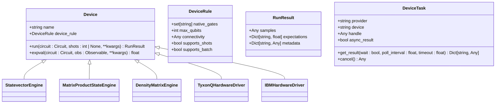
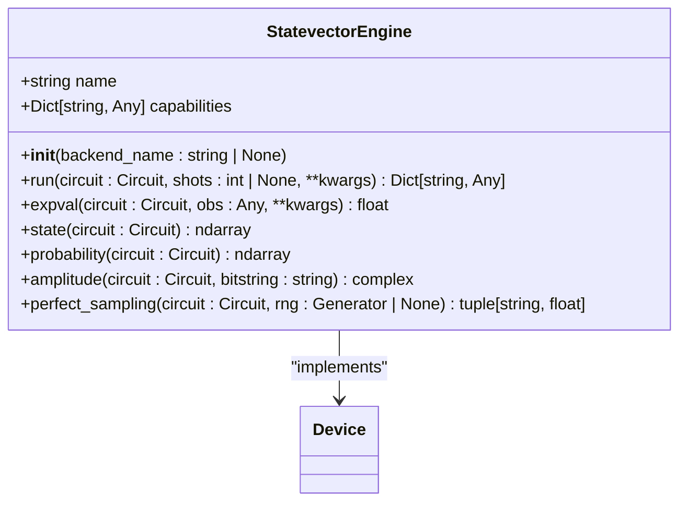
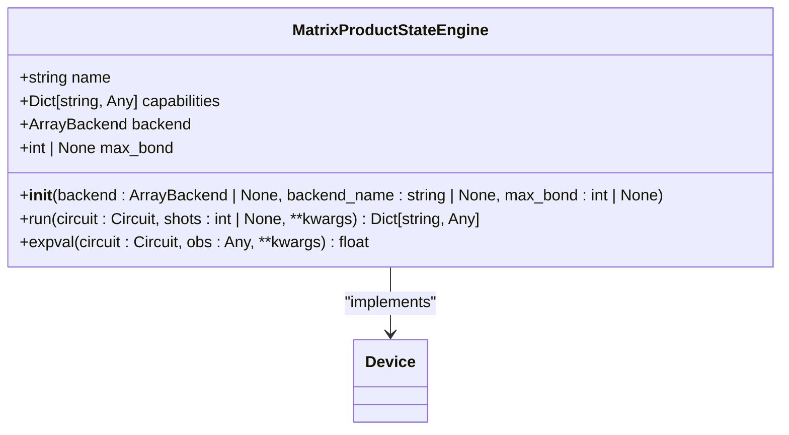
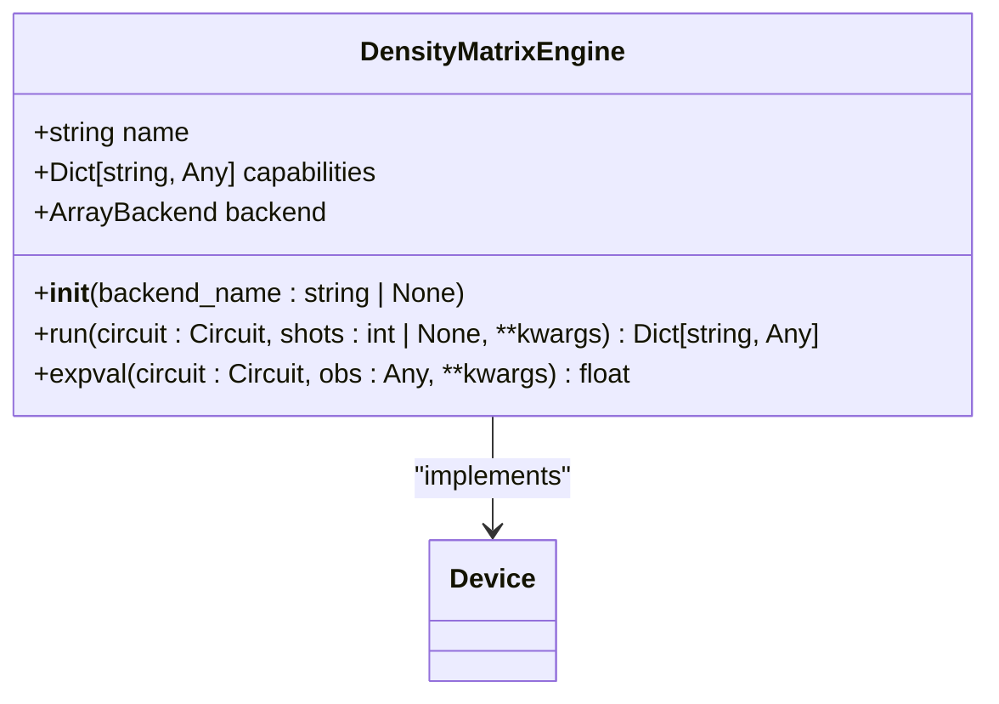
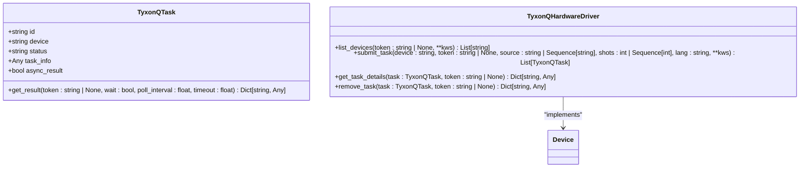
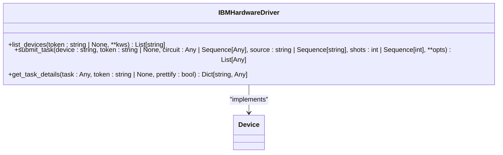
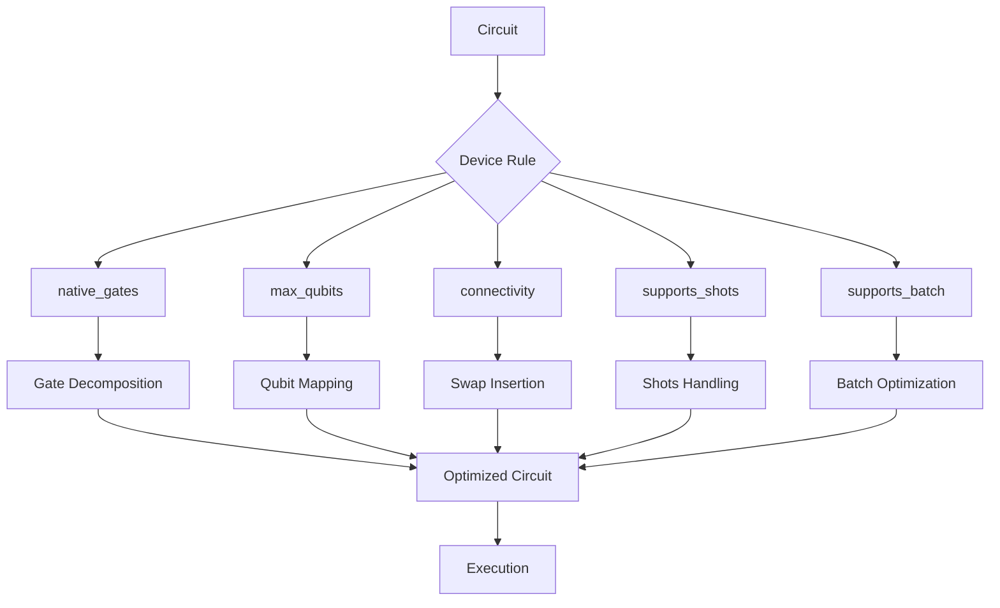
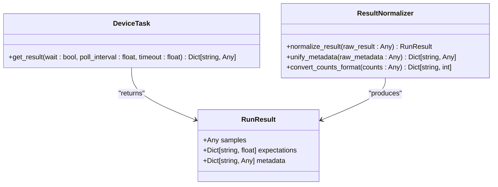
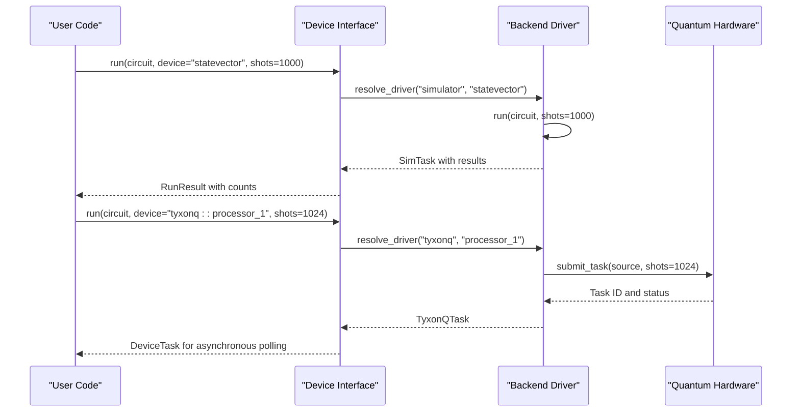
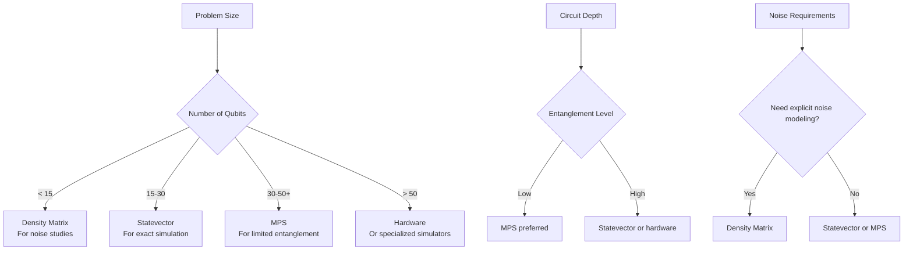

# Device Abstraction Layer

<cite>
**Referenced Files in This Document**   
- [base.py](file://src/tyxonq/devices/base.py)
- [session.py](file://src/tyxonq/devices/session.py)
- [driver.py](file://src/tyxonq/devices/simulators/driver.py)
- [statevector/engine.py](file://src/tyxonq/devices/simulators/statevector/engine.py)
- [matrix_product_state/engine.py](file://src/tyxonq/devices/simulators/matrix_product_state/engine.py)
- [density_matrix/engine.py](file://src/tyxonq/devices/simulators/density_matrix/engine.py)
- [tyxonq/driver.py](file://src/tyxonq/devices/hardware/tyxonq/driver.py)
- [ibm/driver.py](file://src/tyxonq/devices/hardware/ibm/driver.py)
</cite>

## Table of Contents
1. [Introduction](#introduction)
2. [Unified Interface Design](#unified-interface-design)
3. [Base Device and Session Classes](#base-device-and-session-classes)
4. [Simulator Implementations](#simulator-implementations)
5. [Hardware Drivers](#hardware-drivers)
6. [Device Constraints and Compiler Integration](#device-constraints-and-compiler-integration)
7. [Execution Result Normalization](#execution-result-normalization)
8. [Configuration and Execution Examples](#configuration-and-execution-examples)
9. [Common Issues and Backend Selection Guidance](#common-issues-and-backend-selection-guidance)
10. [Conclusion](#conclusion)

## Introduction
The Device Abstraction Layer in TyxonQ provides a unified interface for executing quantum circuits across various backends, including simulators and real quantum hardware. This architecture enables seamless switching between different execution environments while maintaining consistent APIs for circuit execution, measurement, and result processing. The layer abstracts device-specific details, allowing users to focus on quantum algorithm development without being constrained by backend-specific implementations.

## Unified Interface Design
The Device Abstraction Layer employs a protocol-based design to define a consistent interface for all quantum devices. This design enables polymorphic behavior where simulators and hardware drivers implement the same contract, allowing higher-level components to interact with devices without knowing their specific implementation details. The unified interface supports both synchronous and asynchronous execution models, accommodating the different response characteristics of simulators and remote quantum processors.

**Section sources**
- [base.py](file://src/tyxonq/devices/base.py#L67-L78)

## Base Device and Session Classes
The core of the Device Abstraction Layer consists of the `Device` protocol and `Session` classes that define the execution contract. The `Device` protocol specifies the fundamental operations that all quantum devices must support, including circuit execution and expectation value computation. The `Session` class manages execution plans and provides utilities for aggregating results from multiple execution segments.

**Diagram sources**
- [base.py](file://src/tyxonq/devices/base.py#L67-L78)

**Section sources**
- [base.py](file://src/tyxonq/devices/base.py#L67-L78)
- [session.py](file://src/tyxonq/devices/session.py#L0-L50)

## Simulator Implementations
The Device Abstraction Layer includes multiple simulator engines, each optimized for different use cases and scalability requirements. These simulators implement the same device interface but employ different quantum state representations and computational approaches.

### Statevector Simulator
The statevector simulator represents the quantum state as a dense complex vector of size 2^n, where n is the number of qubits. This engine provides exact simulation of pure quantum states and supports both sampling and analytic expectation value computation.

**Diagram sources**
- [statevector/engine.py](file://src/tyxonq/devices/simulators/statevector/engine.py#L20-L264)

### Matrix Product State (MPS) Simulator
The MPS simulator represents the quantum state using a tensor network decomposition, which can efficiently simulate systems with limited entanglement. This engine scales with the bond dimension rather than the full Hilbert space size, enabling simulation of larger qubit systems when entanglement is constrained.

**Diagram sources**
- [matrix_product_state/engine.py](file://src/tyxonq/devices/simulators/matrix_product_state/engine.py#L20-L212)

### Density Matrix Simulator
The density matrix simulator represents the quantum state as a 2^n × 2^n density matrix, enabling simulation of mixed states and explicit noise modeling. This engine supports native application of Kraus operators for various noise channels, making it ideal for studying decoherence and error mitigation techniques.

**Diagram sources**
- [density_matrix/engine.py](file://src/tyxonq/devices/simulators/density_matrix/engine.py#L20-L208)

## Hardware Drivers
The Device Abstraction Layer includes drivers for interfacing with real quantum hardware, providing a consistent interface for remote execution on quantum processors.

### TyxonQ Hardware Driver
The TyxonQ hardware driver manages connections to TyxonQ quantum processors, handling task submission, monitoring, and result retrieval. It implements the standard device interface while managing the asynchronous nature of remote quantum computing.

**Diagram sources**
- [tyxonq/driver.py](file://src/tyxonq/devices/hardware/tyxonq/driver.py#L20-L192)

### IBM Quantum Driver
The IBM Quantum driver provides a skeleton implementation for interfacing with IBM's quantum systems. This driver follows the same interface pattern as other hardware drivers, ensuring consistency across different quantum computing platforms.

**Diagram sources**
- [ibm/driver.py](file://src/tyxonq/devices/hardware/ibm/driver.py#L20-L39)

## Device Constraints and Compiler Integration
The Device Abstraction Layer communicates device-specific constraints to the compiler through the `DeviceRule` structure, which describes capabilities such as native gate sets, qubit connectivity, and maximum qubit count. This information enables the compiler to perform appropriate circuit optimizations and transpilation to match the target device's physical characteristics.

**Diagram sources**
- [base.py](file://src/tyxonq/devices/base.py#L80-L88)

**Section sources**
- [base.py](file://src/tyxonq/devices/base.py#L80-L88)

## Execution Result Normalization
The Device Abstraction Layer normalizes execution results across different backends to provide a consistent output format. All devices return results in a standardized structure that includes samples, expectations, and metadata, regardless of whether the execution was performed on a simulator or real hardware.

**Diagram sources**
- [base.py](file://src/tyxonq/devices/base.py#L89-L97)
- [driver.py](file://src/tyxonq/devices/simulators/driver.py#L20-L141)

## Configuration and Execution Examples
The Device Abstraction Layer provides straightforward APIs for configuring and running circuits on different devices. Users can specify the target device by name and execute circuits with minimal code changes.

**Diagram sources**
- [base.py](file://src/tyxonq/devices/base.py#L100-L200)
- [driver.py](file://src/tyxonq/devices/simulators/driver.py#L20-L141)
- [tyxonq/driver.py](file://src/tyxonq/devices/hardware/tyxonq/driver.py#L20-L192)

## Common Issues and Backend Selection Guidance
The Device Abstraction Layer addresses common issues encountered when working with quantum devices, providing guidance for selecting appropriate backends based on problem characteristics.

### Device Availability
Remote quantum hardware may be unavailable due to maintenance, calibration, or high demand. The abstraction layer provides utilities to check device availability and list accessible devices.

### Calibration Errors
Real quantum devices require regular calibration, and performance can vary over time. The layer provides access to device properties and calibration data to inform execution decisions.

### Simulation Memory Limits
Different simulators have varying memory requirements and scalability characteristics:
- **Statevector**: Suitable for up to ~30 qubits on typical workstations
- **MPS**: Can handle 50+ qubits for circuits with limited entanglement
- **Density Matrix**: Limited to ~15 qubits due to O(4^n) memory scaling

**Diagram sources**
- [statevector/engine.py](file://src/tyxonq/devices/simulators/statevector/engine.py#L20-L264)
- [matrix_product_state/engine.py](file://src/tyxonq/devices/simulators/matrix_product_state/engine.py#L20-L212)
- [density_matrix/engine.py](file://src/tyxonq/devices/simulators/density_matrix/engine.py#L20-L208)

**Section sources**
- [statevector/engine.py](file://src/tyxonq/devices/simulators/statevector/engine.py#L20-L264)
- [matrix_product_state/engine.py](file://src/tyxonq/devices/simulators/matrix_product_state/engine.py#L20-L212)
- [density_matrix/engine.py](file://src/tyxonq/devices/simulators/density_matrix/engine.py#L20-L208)

## Conclusion
The Device Abstraction Layer in TyxonQ provides a comprehensive and flexible framework for executing quantum circuits across diverse backends. By defining a unified interface through the `Device` protocol and implementing specialized engines for different simulation approaches and hardware platforms, the layer enables seamless switching between execution environments. The architecture supports both high-performance simulation for algorithm development and testing, as well as integration with real quantum hardware for production workloads. Through consistent result normalization and comprehensive device capability reporting, the layer simplifies the development of quantum applications that can adapt to different computational resources and requirements.