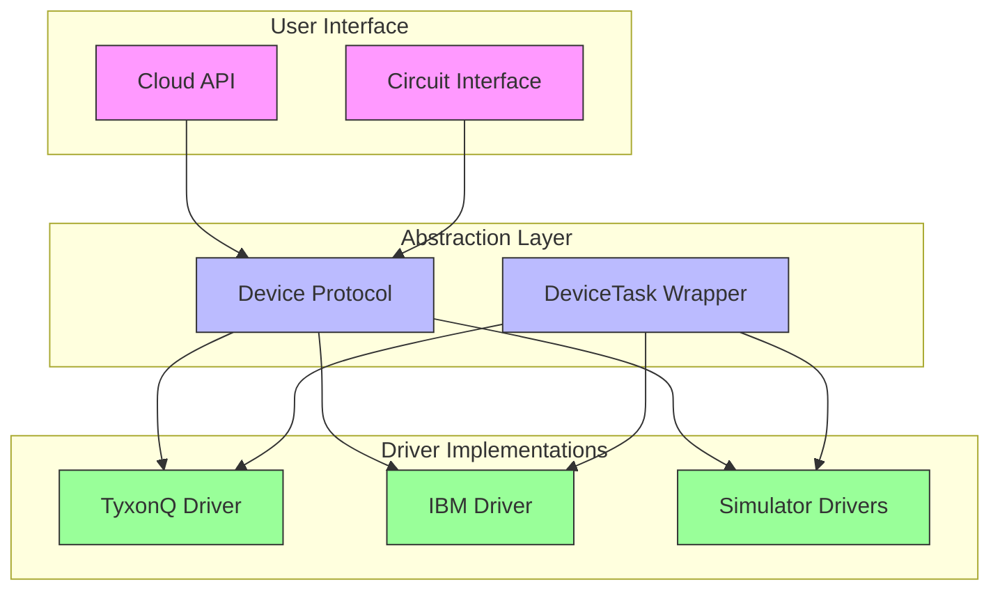
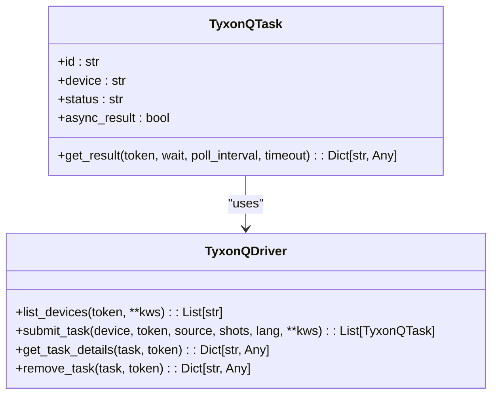
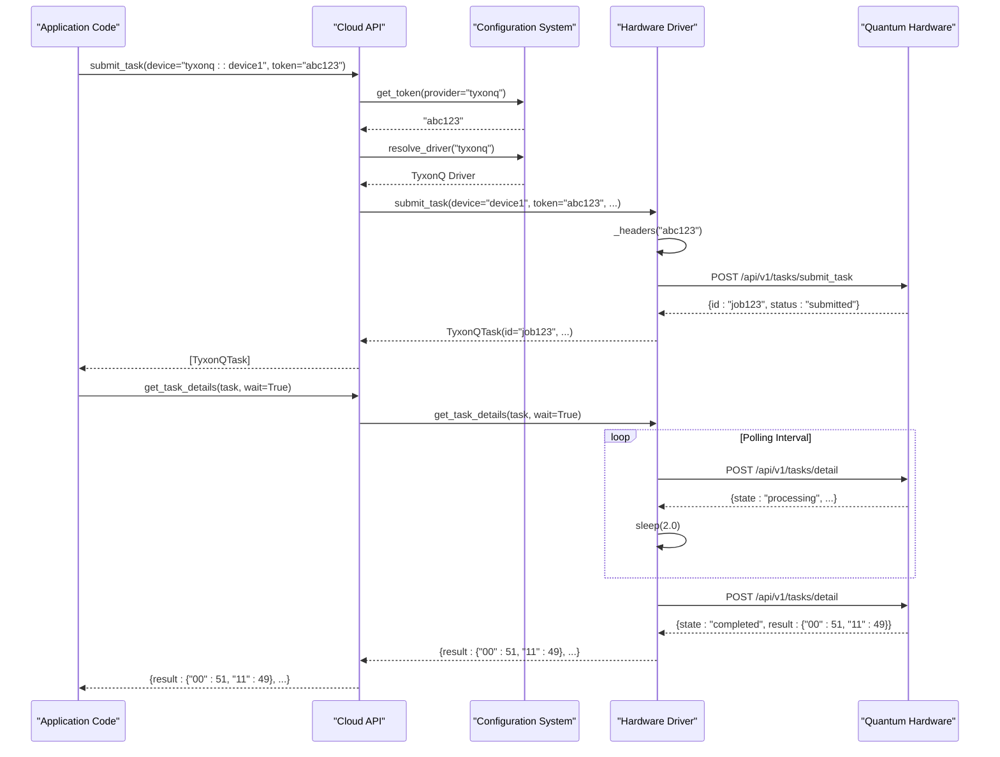
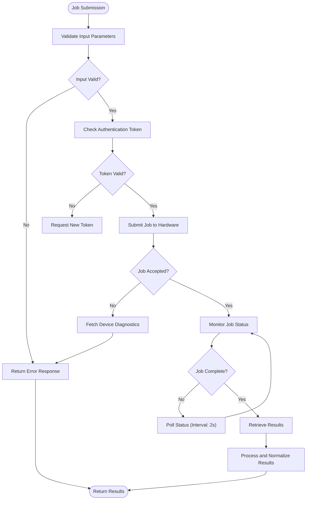
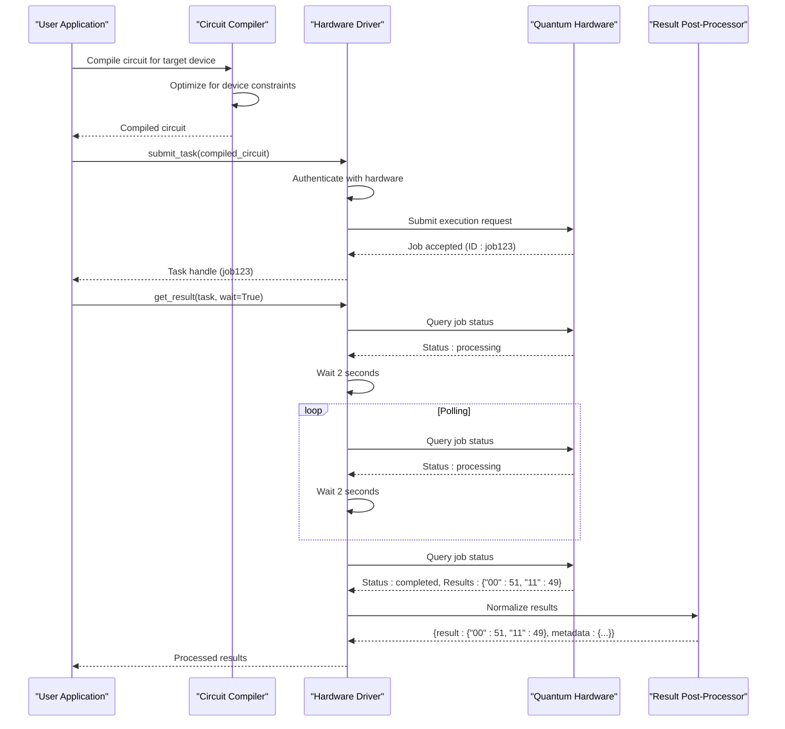

# Hardware Drivers

<cite>
**Referenced Files in This Document**   
- [src/tyxonq/devices/hardware/tyxonq/driver.py](file://src/tyxonq/devices/hardware/tyxonq/driver.py)
- [src/tyxonq/devices/hardware/ibm/driver.py](file://src/tyxonq/devices/hardware/ibm/driver.py)
- [src/tyxonq/devices/hardware/config.py](file://src/tyxonq/devices/hardware/config.py)
- [src/tyxonq/devices/base.py](file://src/tyxonq/devices/base.py)
- [src/tyxonq/cloud/api.py](file://src/tyxonq/cloud/api.py)
</cite>

## Table of Contents
1. [Introduction](#introduction)
2. [Driver Architecture Overview](#driver-architecture-overview)
3. [TyxonQ Quantum Processor Driver](#tyxonq-quantum-processor-driver)
4. [IBM Quantum System Driver](#ibm-quantum-system-driver)
5. [Connection Protocols and Authentication](#connection-protocols-and-authentication)
6. [Job Submission and Session Management](#job-submission-and-session-management)
7. [Device Constraints and Compiler Optimization](#device-constraints-and-compiler-optimization)
8. [End-to-End Execution Workflow](#end-to-end-execution-workflow)
9. [Configuration and Environment Setup](#configuration-and-environment-setup)
10. [Error Handling and Troubleshooting](#error-handling-and-troubleshooting)
11. [Best Practices for Hardware Utilization](#best-practices-for-hardware-utilization)

## Introduction

The TyxonQ framework provides hardware drivers for quantum processors, enabling seamless integration with both TyxonQ quantum systems and IBM Quantum platforms. These drivers abstract the complexities of quantum hardware interaction, providing a unified interface for circuit execution, job management, and result retrieval. The driver system is designed to handle device-specific constraints, authentication mechanisms, and long-running job workflows while maintaining compatibility with the framework's compiler and optimization pipeline.

The hardware driver architecture follows a modular design pattern, with separate implementations for different quantum computing providers while maintaining a consistent interface through the base device protocol. This design enables developers to switch between hardware backends with minimal code changes, promoting portability and ease of experimentation across different quantum computing platforms.

**Section sources**
- [src/tyxonq/devices/base.py](file://src/tyxonq/devices/base.py#L67-L78)
- [src/tyxonq/cloud/api.py](file://src/tyxonq/cloud/api.py#L0-L123)

## Driver Architecture Overview

The hardware driver system in TyxonQ follows a layered architecture that separates concerns between device abstraction, protocol implementation, and user interface. At the core of this architecture is the `Device` protocol defined in the base module, which establishes a contract for all hardware and simulator implementations. This protocol specifies essential methods such as `run` for executing circuits and `expval` for computing expectation values, ensuring consistent behavior across different backends.

The driver selection mechanism is implemented through the `resolve_driver` function, which routes requests to the appropriate hardware-specific implementation based on the provider identifier. Currently supported providers include "tyxonq" for native quantum processors and "ibm" for IBM Quantum systems, with additional support for various simulator backends. Each driver implementation exposes a standardized set of functions including `list_devices`, `submit_task`, and `get_task_details`, which are used by the higher-level cloud API to provide a unified interface to quantum hardware.

The architecture incorporates a task abstraction layer through the `DeviceTask` class, which wraps hardware-specific task handles with a consistent interface for result retrieval and status monitoring. This abstraction enables asynchronous job handling with configurable polling intervals and timeout settings, accommodating the variable execution times typical of quantum computing workloads.

**Diagram sources**
- [src/tyxonq/devices/base.py](file://src/tyxonq/devices/base.py#L67-L78)
- [src/tyxonq/devices/base.py](file://src/tyxonq/devices/base.py#L116-L129)
- [src/tyxonq/cloud/api.py](file://src/tyxonq/cloud/api.py#L0-L123)

**Section sources**
- [src/tyxonq/devices/base.py](file://src/tyxonq/devices/base.py#L67-L78)
- [src/tyxonq/devices/base.py](file://src/tyxonq/devices/base.py#L116-L129)
- [src/tyxonq/devices/base.py](file://src/tyxonq/devices/base.py#L162-L295)

## TyxonQ Quantum Processor Driver

The TyxonQ quantum processor driver provides direct integration with TyxonQ's quantum computing hardware, enabling users to execute quantum circuits on physical quantum processors. The driver implementation is located in `src/tyxonq/devices/hardware/tyxonq/driver.py` and exposes a comprehensive set of functions for device interaction, job submission, and result retrieval.

The driver's primary interface consists of three core functions: `list_devices`, `submit_task`, and `get_task_details`. The `list_devices` function queries the TyxonQ cloud API to retrieve a list of available quantum processors, returning their identifiers in a standardized format. The `submit_task` function handles circuit execution requests, accepting either raw OpenQASM source code or compiled circuit representations, and returns a `TyxonQTask` object that serves as a handle for monitoring job progress and retrieving results.

The `TyxonQTask` class implements a robust result retrieval mechanism with configurable polling behavior. When `get_result` is called with `wait=True`, the driver automatically polls the API at regular intervals until the job completes or times out. This asynchronous execution model accommodates the potentially long durations of quantum circuit execution while providing users with fine-grained control over timeout settings and polling frequency. The driver also includes error handling that captures device status information when job submission fails, aiding in diagnostics and troubleshooting.

The driver communicates with the TyxonQ cloud infrastructure through REST API endpoints defined in the configuration module. These endpoints are parameterized by API version and base URL, allowing for seamless updates to the backend infrastructure without requiring changes to client code. The communication protocol uses bearer token authentication, with tokens managed through the centralized configuration system.

**Diagram sources**
- [src/tyxonq/devices/hardware/tyxonq/driver.py](file://src/tyxonq/devices/hardware/tyxonq/driver.py#L0-L192)

**Section sources**
- [src/tyxonq/devices/hardware/tyxonq/driver.py](file://src/tyxonq/devices/hardware/tyxonq/driver.py#L0-L192)

## IBM Quantum System Driver

The IBM Quantum system driver provides a foundation for integration with IBM's quantum computing platforms, though the current implementation serves as a skeleton awaiting full integration. Located in `src/tyxonq/devices/hardware/ibm/driver.py`, this driver defines the expected interface for IBM Quantum interactions while currently raising `NotImplementedError` for all operational functions.

The driver skeleton implements the same interface contract as other hardware drivers, including `list_devices`, `submit_task`, and `get_task_details` functions. However, these functions are not yet wired to actual IBM Quantum backends. The `list_devices` function currently returns an empty list, indicating that no IBM devices are available through this interface. Both `submit_task` and `get_task_details` raise `NotImplementedError` with descriptive messages indicating that the driver is still in development.

The implementation note in the module documentation indicates that full integration with IBM backends will be achieved through Qiskit adapters in a future development phase. This approach suggests that the final implementation will leverage Qiskit's existing infrastructure for IBM Quantum communication, authentication, and job management, while presenting a unified interface consistent with other TyxonQ drivers.

Despite its incomplete state, the driver skeleton serves an important role in maintaining the framework's architectural consistency. It allows the rest of the system to reference IBM Quantum as a valid provider, facilitating future integration without requiring changes to higher-level code. The driver follows the same error handling and task abstraction patterns as other drivers, ensuring that once implemented, it will integrate seamlessly with the existing job management and result processing workflows.

**Section sources**
- [src/tyxonq/devices/hardware/ibm/driver.py](file://src/tyxonq/devices/hardware/ibm/driver.py#L0-L39)

## Connection Protocols and Authentication

The connection and authentication system in TyxonQ provides a unified mechanism for accessing quantum hardware resources across different providers. Central to this system is the configuration module (`src/tyxonq/devices/hardware/config.py`), which manages API endpoints, authentication tokens, and default settings for all hardware providers.

Authentication is handled through bearer tokens that are automatically included in HTTP headers for API requests. The system supports multiple methods for token specification: in-memory storage via `set_token`, environment variables (`TYXONQ_API_KEY`), and provider-specific defaults. The token resolution process follows a hierarchical approach, first checking for explicit token parameters, then in-memory tokens, and finally environment variables, providing flexibility for different deployment scenarios.

The configuration system defines API endpoints through the `ENDPOINTS` dictionary, which maps provider names to their base URLs and API versions. For TyxonQ systems, these values can be overridden using environment variables (`TYXONQ_BASE_URL` and `TYXONQ_API_VERSION`), enabling seamless switching between different deployment environments (development, staging, production) without code changes.

Connection parameters are abstracted through the `device_descriptor` function, which normalizes device specifications into a consistent format regardless of input syntax. This function handles various input patterns including provider.device notation, direct device identifiers, and shorthand names for common simulators. The normalization process ensures that device references are consistent throughout the system, reducing configuration errors and improving usability.

The authentication and connection system is designed to be extensible, allowing new providers to be added by extending the configuration and driver resolution mechanisms. Each provider can define its own authentication requirements and connection parameters while maintaining compatibility with the unified interface exposed to users.

**Diagram sources**
- [src/tyxonq/devices/hardware/config.py](file://src/tyxonq/devices/hardware/config.py#L0-L67)
- [src/tyxonq/devices/hardware/tyxonq/driver.py](file://src/tyxonq/devices/hardware/tyxonq/driver.py#L0-L192)
- [src/tyxonq/cloud/api.py](file://src/tyxonq/cloud/api.py#L0-L123)

**Section sources**
- [src/tyxonq/devices/hardware/config.py](file://src/tyxonq/devices/hardware/config.py#L0-L67)
- [src/tyxonq/devices/hardware/tyxonq/driver.py](file://src/tyxonq/devices/hardware/tyxonq/driver.py#L0-L192)

## Job Submission and Session Management

The job submission and session management system in TyxonQ provides a comprehensive framework for handling quantum circuit execution, from initial submission through result retrieval. The system is designed to accommodate both synchronous and asynchronous execution patterns, with built-in support for long-running jobs, error recovery, and result polling.

Job submission is handled through the `submit_task` function, which accepts circuit specifications in various formats including raw OpenQASM source code or compiled circuit representations. The function supports both single and batched submissions, allowing multiple circuits to be submitted simultaneously for efficient execution. For batched submissions, the system automatically aligns shot counts with individual circuits, ensuring consistent execution parameters across the batch.

The session management system is implemented through the `device_job_plan` function in the session module, which orchestrates segmented shot plans and aggregates results across multiple execution segments. This capability is particularly valuable for statistical analysis and error mitigation techniques that require multiple runs with different shot counts. The function maintains detailed metadata for each segment, including shot counts, measurement bases, and wire configurations, enabling sophisticated post-processing and analysis.

Result retrieval is implemented with configurable polling behavior through the `get_task_details` function. Users can choose between synchronous execution (blocking until completion) and asynchronous polling with customizable intervals and timeout settings. The system automatically normalizes result formats across different hardware providers, ensuring consistent output regardless of the underlying backend.

The job management system includes error handling mechanisms that capture diagnostic information when job submission fails. In the case of the TyxonQ driver, the system automatically retrieves device status information when a submission error occurs, providing valuable context for troubleshooting. The system also supports task cancellation through the `remove_task` function, allowing users to terminate long-running jobs when necessary.

**Diagram sources**
- [src/tyxonq/devices/hardware/tyxonq/driver.py](file://src/tyxonq/devices/hardware/tyxonq/driver.py#L0-L192)
- [src/tyxonq/devices/session.py](file://src/tyxonq/devices/session.py#L0-L50)

**Section sources**
- [src/tyxonq/devices/hardware/tyxonq/driver.py](file://src/tyxonq/devices/hardware/tyxonq/driver.py#L0-L192)
- [src/tyxonq/devices/session.py](file://src/tyxonq/devices/session.py#L0-L50)

## Device Constraints and Compiler Optimization

The hardware driver system exposes device-specific constraints to the TyxonQ framework, enabling the compiler to perform targeted optimizations for specific quantum processors. These constraints include physical limitations such as qubit topology, available gate sets, coherence times, and connectivity restrictions, which are critical for generating efficient and executable quantum circuits.

Device capabilities are described through the `DeviceRule` TypedDict, which defines optional fields for native gates, maximum qubits, connectivity information, and supported features. This declarative approach allows the framework to query device capabilities and adapt compilation strategies accordingly. For example, the compiler can map logical qubits to physical qubits based on the device's connectivity graph, minimizing the need for costly SWAP operations that degrade circuit performance.

The current implementation focuses on exposing basic device information through the `list_properties` function in the TyxonQ driver, which retrieves device details from the cloud API. While the function currently removes diagnostic information (memo field) from the response, it provides access to essential device characteristics that can inform compilation decisions. Future enhancements could expose more detailed information such as gate fidelities, coherence times, and calibration data to enable more sophisticated optimization strategies.

The framework's compiler leverages this device information to perform architecture-aware optimizations, including gate decomposition, qubit mapping, and circuit scheduling. By understanding the target device's native gate set, the compiler can decompose high-level operations into sequences of native gates with minimal overhead. Similarly, knowledge of the device's connectivity enables optimal qubit allocation that minimizes communication costs and maximizes circuit fidelity.

This tight integration between hardware drivers and the compiler system ensures that quantum circuits are optimized for the specific characteristics of the target quantum processor, improving execution success rates and result quality. The modular design allows new device types to be integrated by implementing the appropriate constraint interfaces, ensuring the framework can adapt to evolving quantum hardware technologies.

**Section sources**
- [src/tyxonq/devices/base.py](file://src/tyxonq/devices/base.py#L88-L95)
- [src/tyxonq/devices/hardware/tyxonq/driver.py](file://src/tyxonq/devices/hardware/tyxonq/driver.py#L50-L65)

## End-to-End Execution Workflow

The end-to-end execution workflow in TyxonQ encompasses the complete process of compiling a quantum circuit, submitting it to hardware, and retrieving results with proper error handling. This workflow integrates multiple components of the framework, including the compiler, hardware drivers, and result processing systems, to provide a seamless experience for quantum algorithm development and execution.

The workflow begins with circuit compilation, where high-level quantum operations are translated into device-specific instructions. The compiler analyzes the target device's capabilities and constraints, optimizing the circuit for the specific hardware backend. This optimization process includes gate decomposition, qubit mapping, and circuit scheduling to maximize execution efficiency and result fidelity.

Once compiled, the circuit is submitted to the target hardware through the driver's `submit_task` function. The system handles authentication automatically, using the configured token to establish a secure connection with the quantum processor. Upon successful submission, the system returns a task handle that can be used to monitor job progress and retrieve results.

Result retrieval follows a configurable polling pattern, with the system automatically checking job status at regular intervals until completion or timeout. The retrieved results are normalized into a consistent format regardless of the underlying hardware provider, ensuring compatibility with downstream processing and analysis tools. The system includes comprehensive error handling that captures diagnostic information at each stage of the workflow, enabling effective troubleshooting when issues arise.

The end-to-end workflow is designed to be both robust and flexible, accommodating various execution patterns from simple synchronous runs to complex asynchronous workflows with multiple concurrent jobs. This flexibility allows users to choose the appropriate execution model based on their specific requirements, whether prioritizing immediate results or managing large-scale quantum computing workloads.

**Diagram sources**
- [src/tyxonq/devices/hardware/tyxonq/driver.py](file://src/tyxonq/devices/hardware/tyxonq/driver.py#L0-L192)
- [src/tyxonq/devices/base.py](file://src/tyxonq/devices/base.py#L162-L295)

**Section sources**
- [src/tyxonq/devices/hardware/tyxonq/driver.py](file://src/tyxonq/devices/hardware/tyxonq/driver.py#L0-L192)
- [src/tyxonq/devices/base.py](file://src/tyxonq/devices/base.py#L162-L295)

## Configuration and Environment Setup

The configuration and environment setup system in TyxonQ provides multiple methods for specifying hardware backend parameters and authentication credentials. The system is designed to be flexible and secure, supporting various deployment scenarios from local development to production environments.

Configuration parameters are managed through the `config.py` module, which defines default values, environment variable overrides, and runtime configuration functions. The system uses environment variables `TYXONQ_BASE_URL` and `TYXONQ_API_VERSION` to override API endpoint settings, allowing seamless switching between different deployment environments. Authentication tokens can be specified through the `TYXONQ_API_KEY` environment variable or programmatically using the `set_token` function.

The configuration system supports provider-specific and device-specific tokens, enabling users to manage credentials for multiple quantum computing platforms simultaneously. The `set_token` function stores tokens in memory with both device-scoped and provider-scoped entries, providing flexibility in token resolution. Default provider and device settings can be configured using the `set_default` function, reducing the need to specify these parameters repeatedly in application code.

For production deployments, the system supports secure token management through environment variables, preventing credentials from being hardcoded in source code. The configuration also includes fallback mechanisms that attempt to retrieve tokens from multiple sources in a defined order, ensuring robust operation even when some configuration methods are unavailable.

The modular configuration design allows new providers to be integrated by extending the configuration system with provider-specific parameters and authentication methods. This extensibility ensures that the framework can accommodate future quantum computing platforms with different configuration requirements while maintaining a consistent user experience.

**Section sources**
- [src/tyxonq/devices/hardware/config.py](file://src/tyxonq/devices/hardware/config.py#L0-L67)

## Error Handling and Troubleshooting

The error handling and troubleshooting system in TyxonQ's hardware drivers provides comprehensive mechanisms for diagnosing and recovering from common quantum computing issues. The system is designed to capture detailed diagnostic information at each stage of the execution workflow, enabling effective troubleshooting of hardware-related problems.

When job submission fails, the TyxonQ driver implements a diagnostic capture mechanism that automatically retrieves device status information to aid in troubleshooting. This information is included in the error message, providing context about the device's current state when the submission failed. The system also includes timeout handling for long-running jobs, preventing applications from hanging indefinitely when hardware communication issues occur.

Common hardware-related issues such as device calibration drift, queue delays, failed jobs, and connectivity limitations are addressed through various mechanisms. Queue delays are managed through the polling system, which efficiently monitors job status without overwhelming the API with requests. Failed jobs are reported with detailed error messages that include both the failure reason and relevant diagnostic information.

For connectivity issues, the system implements retry logic with exponential backoff, automatically attempting to re-establish connections when transient network problems occur. The configuration system also supports multiple authentication methods, providing fallback options when primary authentication mechanisms fail.

Troubleshooting strategies include checking device availability through the `list_devices` function, verifying authentication credentials, and monitoring job status through the result polling system. The framework provides detailed logging and diagnostic information that can be used to identify the root cause of execution problems, whether they stem from configuration issues, hardware limitations, or network connectivity problems.

**Section sources**
- [src/tyxonq/devices/hardware/tyxonq/driver.py](file://src/tyxonq/devices/hardware/tyxonq/driver.py#L135-L155)
- [src/tyxonq/devices/base.py](file://src/tyxonq/devices/base.py#L347-L381)

## Best Practices for Hardware Utilization

To maximize hardware utilization and result reliability when using TyxonQ's quantum computing drivers, several best practices should be followed. These practices address configuration management, job scheduling, error handling, and performance optimization to ensure efficient and reliable quantum computing workflows.

For configuration management, use environment variables for authentication tokens and API endpoints in production environments to enhance security and facilitate deployment across different environments. Set default provider and device configurations using the `set_default` function to reduce repetitive parameter specification in application code.

When submitting jobs, consider the queue times and execution durations of quantum processors. For time-sensitive applications, monitor queue lengths through the device status information and schedule jobs during off-peak hours when possible. Use batched submissions to maximize throughput when executing multiple similar circuits, reducing the overhead of individual job submissions.

Implement robust error handling that accounts for the probabilistic nature of quantum computing. Include retry logic for transient failures and implement result validation to detect and handle anomalous outcomes. For critical applications, consider implementing redundancy by executing important jobs multiple times and comparing results.

Optimize circuit designs for the specific characteristics of the target quantum processor. Use the device constraint information exposed by the drivers to inform compilation decisions, minimizing gate counts and circuit depth to reduce the impact of noise and decoherence. Consider the connectivity topology when designing circuits to minimize the need for SWAP operations that increase circuit complexity.

Monitor hardware performance metrics such as gate fidelities and coherence times when available, and adjust algorithms accordingly. For example, shorter circuits may be preferred on devices with limited coherence times. Regularly check for device calibration updates and re-run critical experiments after calibration changes to ensure result consistency.

**Section sources**
- [src/tyxonq/devices/hardware/config.py](file://src/tyxonq/devices/hardware/config.py#L0-L67)
- [src/tyxonq/devices/hardware/tyxonq/driver.py](file://src/tyxonq/devices/hardware/tyxonq/driver.py#L0-L192)