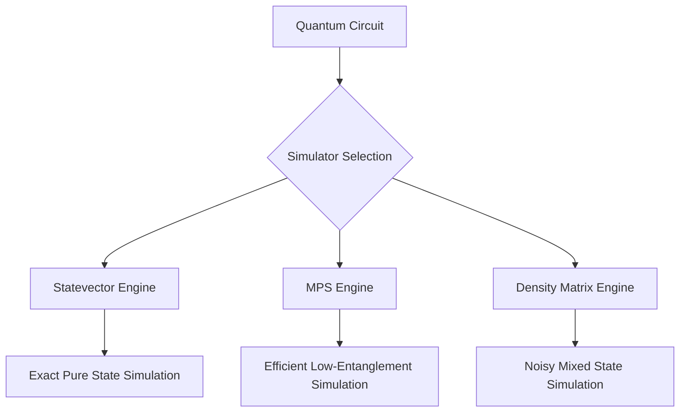
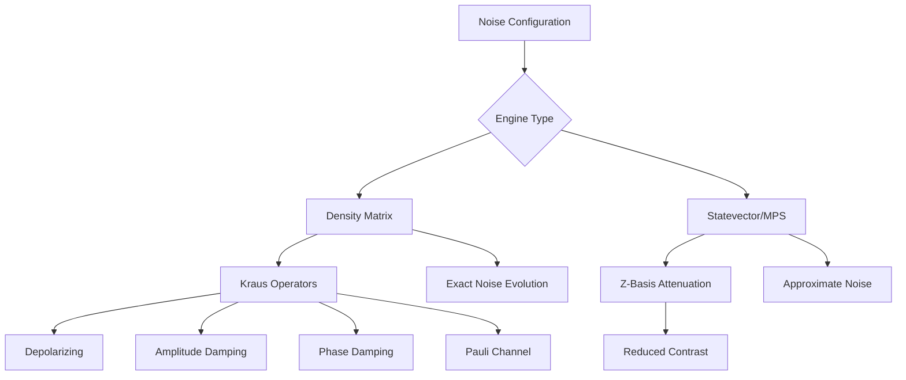
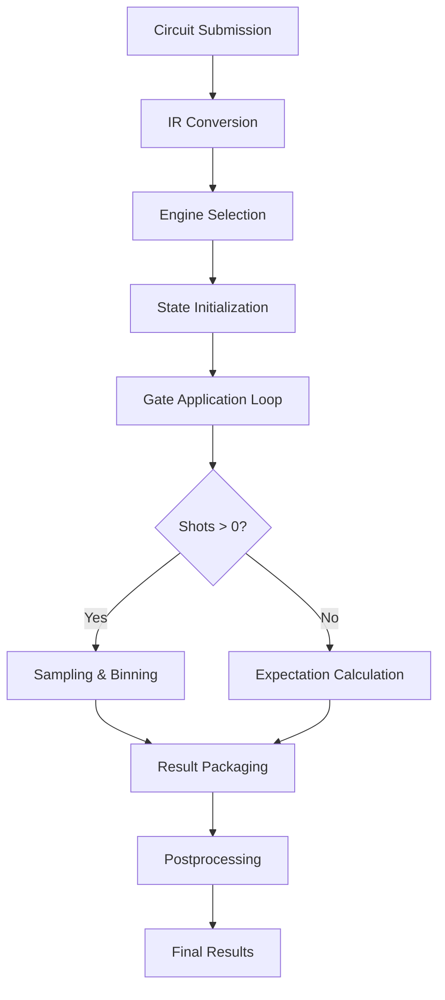

# Simulators

<cite>
**Referenced Files in This Document**   
- [driver.py](file://src/tyxonq/devices/simulators/driver.py)
- [statevector/engine.py](file://src/tyxonq/devices/simulators/statevector/engine.py)
- [matrix_product_state/engine.py](file://src/tyxonq/devices/simulators/matrix_product_state/engine.py)
- [density_matrix/engine.py](file://src/tyxonq/devices/simulators/density_matrix/engine.py)
- [noise/channels.py](file://src/tyxonq/devices/simulators/noise/channels.py)
</cite>

## Table of Contents
1. [Unified Simulator Driver Interface](#unified-simulator-driver-interface)
2. [Simulator Engines Overview](#simulator-engines-overview)
3. [Statevector Simulator](#statevector-simulator)
4. [Matrix Product State (MPS) Simulator](#matrix-product-state-mps-simulator)
5. [Density Matrix Simulator](#density-matrix-simulator)
6. [Noise Integration and Realistic Error Modeling](#noise-integration-and-realistic-error-modeling)
7. [Practical Examples and Configuration](#practical-examples-and-configuration)
8. [Internal Data Flow and Numerics Integration](#internal-data-flow-and-numerics-integration)
9. [Performance Trade-offs and Common Issues](#performance-trade-offs-and-common-issues)
10. [Backend Selection Guidelines](#backend-selection-guidelines)

## Unified Simulator Driver Interface

The unified simulator driver interface in TyxonQ provides a consistent abstraction layer for executing quantum circuits across different simulation backends. This interface standardizes the interaction pattern regardless of the underlying simulation method, enabling seamless switching between statevector, matrix product state (MPS), and density matrix engines.

The driver module (`driver.py`) exposes a uniform API through functions like `run`, `submit_task`, and `expval`, which route operations to the appropriate backend based on the specified device string. Supported devices include `"simulator::statevector"`, `"simulator::matrix_product_state"`, and `"simulator::density_matrix"`. The `_select_engine` function dynamically imports and instantiates the corresponding engine class based on the device identifier.

All simulator tasks return a `SimTask` object that encapsulates the execution result, device information, and task metadata. The interface normalizes outputs to include counts (for shot-based execution), expectations (for analytic calculations), probabilities, statevector (when available), and metadata. This consistent output structure simplifies result processing across different simulation modes.

**Section sources**
- [driver.py](file://src/tyxonq/devices/simulators/driver.py#L6-L141)

## Simulator Engines Overview

TyxonQ implements three distinct quantum simulation engines, each optimized for different types of quantum circuits and computational requirements. These engines share a common interface but employ fundamentally different mathematical representations of quantum states.

The statevector engine represents quantum states as dense complex vectors in Hilbert space, providing exact simulation of pure states. The matrix product state (MPS) engine uses tensor network representations to efficiently simulate systems with limited entanglement. The density matrix engine represents mixed states as density matrices, enabling accurate modeling of noisy quantum dynamics.

Each engine inherits from a common design pattern and implements the `run` method for circuit execution and `expval` for analytic expectation value calculation. They all support the same set of quantum gates (h, rz, rx, cx, etc.) and measurement operations, ensuring consistent behavior across backends. The engines integrate with TyxonQ's unified numerics backend system, allowing computation on CPU (numpy), GPU (pytorch), or accelerated hardware (cupynumeric).



**Diagram sources**
- [driver.py](file://src/tyxonq/devices/simulators/driver.py#L6-L141)
- [statevector/engine.py](file://src/tyxonq/devices/simulators/statevector/engine.py#L31-L261)
- [matrix_product_state/engine.py](file://src/tyxonq/devices/simulators/matrix_product_state/engine.py#L34-L209)
- [density_matrix/engine.py](file://src/tyxonq/devices/simulators/density_matrix/engine.py#L31-L205)

## Statevector Simulator

The statevector simulator engine represents quantum states as dense complex vectors in Hilbert space, with size 2^n for n qubits. This approach provides exact simulation of pure quantum states and supports both shot-based sampling and analytic expectation value calculations.

The engine applies quantum gates through matrix-vector multiplication using optimized kernels from the quantum library. Single-qubit gates are applied via `apply_1q_statevector` and two-qubit gates via `apply_2q_statevector`. The simulator supports a comprehensive set of gates including h, rz, rx, cx, cz, cry, x, s, and sdg. Measurement operations are handled through the `measure_z` instruction, which records qubits for expectation value calculation or sampling.

For shot-based execution, the simulator samples from the probability distribution derived from the squared amplitudes of the statevector. When noise modeling is enabled via the `use_noise` parameter, the engine applies attenuation factors to Z-basis expectations to approximate depolarizing noise effects. The engine also provides helper methods like `state`, `probability`, `amplitude`, and `perfect_sampling` for direct access to simulation results.

Memory complexity scales as O(2^n) and time complexity as O(poly(gates)*2^n), making this engine suitable for circuits with up to approximately 30 qubits on modern hardware.

**Section sources**
- [statevector/engine.py](file://src/tyxonq/devices/simulators/statevector/engine.py#L31-L261)

## Matrix Product State (MPS) Simulator

The Matrix Product State (MPS) simulator engine represents quantum states as tensor networks, enabling efficient simulation of systems with limited entanglement. Instead of scaling with the full Hilbert space dimension 2^n, computational resources scale with the bond dimension χ, making this approach suitable for larger systems when entanglement is constrained.

The engine initializes states as product states using `init_product_state` and applies gates through specialized MPS operations `mps_apply_1q` and `mps_apply_2q`. Two-qubit gate application includes SWAP routing to handle non-local interactions. The MPS representation allows for efficient computation of local observables and sampling through statevector reconstruction.

A key feature is the `max_bond` parameter that controls bond dimension truncation, preventing exponential growth of the representation at the cost of potential truncation errors. This parameter allows users to balance accuracy and computational resources. The engine reconstructs the full statevector when necessary for sampling or measurement, making it most efficient for circuits with shallow depth and limited entanglement propagation.

The MPS engine supports the same gate set as other simulators (h, rz, rx, cx, etc.) and integrates with the unified noise interface. However, its `expval` method currently returns a placeholder value, indicating limited support for analytic expectation calculations compared to other engines.

**Section sources**
- [matrix_product_state/engine.py](file://src/tyxonq/devices/simulators/matrix_product_state/engine.py#L34-L209)

## Density Matrix Simulator

The density matrix simulator engine represents quantum states as density matrices (ρ), enabling accurate simulation of mixed states and noisy quantum dynamics. This approach uses a 2^n × 2^n matrix representation, with memory complexity O(4^n) and time complexity O(poly(gates)*4^n), making it more computationally expensive than statevector simulation.

The engine applies quantum gates through unitary transformations on the density matrix using `apply_1q_density` and `apply_2q_density` operations. It natively supports quantum noise channels through Kraus operator formalism, providing realistic error modeling for depolarizing, amplitude damping, phase damping, and Pauli noise channels. Noise is applied after each gate operation when enabled through the `use_noise` parameter.

The simulator computes measurement outcomes from the diagonal elements of the density matrix, which represent the probability distribution over computational basis states. For expectation values, it calculates Tr(ρZ_q) for each measured qubit. The engine supports projective measurements (`project_z`) and reset operations through state projection and renormalization.

This engine is particularly valuable for studying noise resilience, error mitigation techniques, and open quantum system dynamics. Its native noise handling provides more accurate results than the approximate noise models in other simulators, at the cost of significantly higher computational requirements.

**Section sources**
- [density_matrix/engine.py](file://src/tyxonq/devices/simulators/density_matrix/engine.py#L31-L205)

## Noise Integration and Realistic Error Modeling

TyxonQ integrates noise modeling across its simulation engines through a unified interface that supports both approximate and exact noise representations. The noise system is implemented in the `noise/channels.py` module, which provides functions for generating Kraus operators for various quantum channels.

The density matrix engine provides native support for realistic noise modeling through Kraus operator application. It implements several standard quantum channels: `depolarizing` (with parameter p), `amplitude_damping` (with parameter gamma), `phase_damping` (with parameter lambda), and `pauli_channel` (with parameters px, py, pz). These channels are applied to the density matrix using the `apply_to_density_matrix` function, which performs the transformation ρ → Σ K_i ρ K_i†.

The statevector and MPS engines implement a simplified noise model that attenuates Z-basis expectation values to approximate depolarizing noise effects. This approach is computationally efficient but less accurate than full density matrix simulation. All engines support readout error modeling through calibration matrices that are applied to the final probability distribution.

Noise parameters are passed through the `noise` keyword argument in the `run` method, with a `use_noise` flag to enable or disable noise modeling. The unified interface allows users to switch between different noise models and simulation backends while maintaining consistent configuration patterns.



**Diagram sources**
- [density_matrix/engine.py](file://src/tyxonq/devices/simulators/density_matrix/engine.py#L31-L205)
- [noise/channels.py](file://src/tyxonq/devices/simulators/noise/channels.py#L1-L64)
- [statevector/engine.py](file://src/tyxonq/devices/simulators/statevector/engine.py#L31-L261)

## Practical Examples and Configuration

Configuring and running simulations in TyxonQ follows a consistent pattern across all backends. Users specify the target simulator through the device string and pass circuit and execution parameters to the `run` function. The following examples demonstrate typical usage patterns for different simulation scenarios.

For exact statevector simulation of a 10-qubit circuit with 1000 shots:
```python
result = run("simulator::statevector", circuit=circuit, shots=1000)
```

For MPS simulation of a 50-qubit circuit with bond dimension limit:
```python
result = run("simulator::matrix_product_state", circuit=circuit, shots=1000, max_bond=32)
```

For density matrix simulation with depolarizing noise:
```python
result = run("simulator::density_matrix", circuit=circuit, shots=1000, 
             use_noise=True, noise={"type": "depolarizing", "p": 0.01})
```

Analytic expectation values can be computed with shots=0:
```python
result = run("simulator::statevector", circuit=circuit, shots=0)
```

The numerics backend can be specified to leverage GPU acceleration:
```python
result = run("simulator::statevector", circuit=circuit, backend_name="pytorch")
```

These configuration options allow users to tailor simulations to their specific requirements, balancing accuracy, performance, and resource constraints.

**Section sources**
- [driver.py](file://src/tyxonq/devices/simulators/driver.py#L6-L141)
- [statevector/engine.py](file://src/tyxonq/devices/simulators/statevector/engine.py#L31-L261)
- [matrix_product_state/engine.py](file://src/tyxonq/devices/simulators/matrix_product_state/engine.py#L34-L209)
- [density_matrix/engine.py](file://src/tyxonq/devices/simulators/density_matrix/engine.py#L31-L205)

## Internal Data Flow and Numerics Integration

The internal data flow in TyxonQ's simulation system follows a consistent pattern from circuit submission to result generation. When a circuit is submitted via the `run` function, it first undergoes preprocessing in the driver module, where OpenQASM sources are converted to IR if necessary.

The circuit is then passed to the selected engine's `run` method, which initializes the appropriate state representation (statevector, MPS, or density matrix). The engine iterates through the circuit operations, applying each gate through optimized kernels that respect the unified numerics backend abstraction. These kernels are implemented in the quantum library and work with numpy, pytorch, or cupynumeric arrays interchangeably.

After circuit execution, the engine computes measurement results based on the requested shots parameter. For shot-based execution, it samples from the final probability distribution and bins the results into counts. For analytic calculations, it computes expectation values directly from the quantum state. The results are normalized and packaged into a standard format that includes counts, expectations, probabilities, and metadata.

Postprocessing operations like readout error mitigation can be applied to the results through the postprocessing module. The entire pipeline maintains compatibility with TyxonQ's vectorization and batching capabilities, allowing efficient execution of parameterized circuits and ensemble simulations.



**Diagram sources**
- [driver.py](file://src/tyxonq/devices/simulators/driver.py#L6-L141)
- [statevector/engine.py](file://src/tyxonq/devices/simulators/statevector/engine.py#L31-L261)
- [matrix_product_state/engine.py](file://src/tyxonq/devices/simulators/matrix_product_state/engine.py#L34-L209)
- [density_matrix/engine.py](file://src/tyxonq/devices/simulators/density_matrix/engine.py#L31-L205)

## Performance Trade-offs and Common Issues

Each simulator engine in TyxonQ presents distinct performance characteristics and potential issues that users should consider when designing quantum simulations.

The statevector engine faces memory exhaustion for circuits with more than approximately 30 qubits, as memory requirements grow as O(2^n). Users may encounter out-of-memory errors when simulating larger systems. This can be mitigated by using the MPS engine for circuits with limited entanglement or by leveraging GPU memory through the pytorch backend.

The MPS engine introduces truncation errors when the bond dimension exceeds the `max_bond` limit. This can lead to inaccurate results for highly entangled circuits or deep circuits where entanglement propagates across many qubits. Users should monitor bond dimensions and adjust the `max_bond` parameter based on accuracy requirements and available computational resources.

The density matrix engine suffers from performance bottlenecks due to its O(4^n) memory and time complexity. Even moderate-sized circuits (beyond 15-20 qubits) can become computationally infeasible. This engine is best suited for small-scale noise studies rather than large circuit simulation.

Common issues across engines include numerical precision limitations, particularly when computing expectation values or applying many sequential gates. Users should validate results through convergence testing and consider using higher precision numerics backends when necessary.

**Section sources**
- [statevector/engine.py](file://src/tyxonq/devices/simulators/statevector/engine.py#L31-L261)
- [matrix_product_state/engine.py](file://src/tyxonq/devices/simulators/matrix_product_state/engine.py#L34-L209)
- [density_matrix/engine.py](file://src/tyxonq/devices/simulators/density_matrix/engine.py#L31-L205)

## Backend Selection Guidelines

Selecting the appropriate simulation backend in TyxonQ depends on several factors including qubit count, circuit depth, entanglement structure, and noise requirements.

For circuits with fewer than 25 qubits and exact results needed, the statevector engine is recommended. It provides the most accurate simulation of pure states and supports both sampling and analytic calculations.

For larger circuits (25-50+ qubits) with limited entanglement, such as shallow circuits or those with local interactions, the MPS engine is optimal. Its efficiency depends on the entanglement structure, making it particularly suitable for 1D systems, quantum circuits with limited gate connectivity, or variational algorithms with structured ansatzes.

For noise studies and mixed state simulation, the density matrix engine should be used despite its computational cost. It provides the most accurate modeling of quantum noise and is essential for researching error mitigation techniques, noise resilience, and open quantum systems.

When high-performance computing resources are available, users should consider the numerics backend selection (numpy, pytorch, cupynumeric) to leverage GPU acceleration, particularly for statevector and density matrix simulations which benefit significantly from parallel computation.

**Section sources**
- [driver.py](file://src/tyxonq/devices/simulators/driver.py#L6-L141)
- [statevector/engine.py](file://src/tyxonq/devices/simulators/statevector/engine.py#L31-L261)
- [matrix_product_state/engine.py](file://src/tyxonq/devices/simulators/matrix_product_state/engine.py#L34-L209)
- [density_matrix/engine.py](file://src/tyxonq/devices/simulators/density_matrix/engine.py#L31-L205)