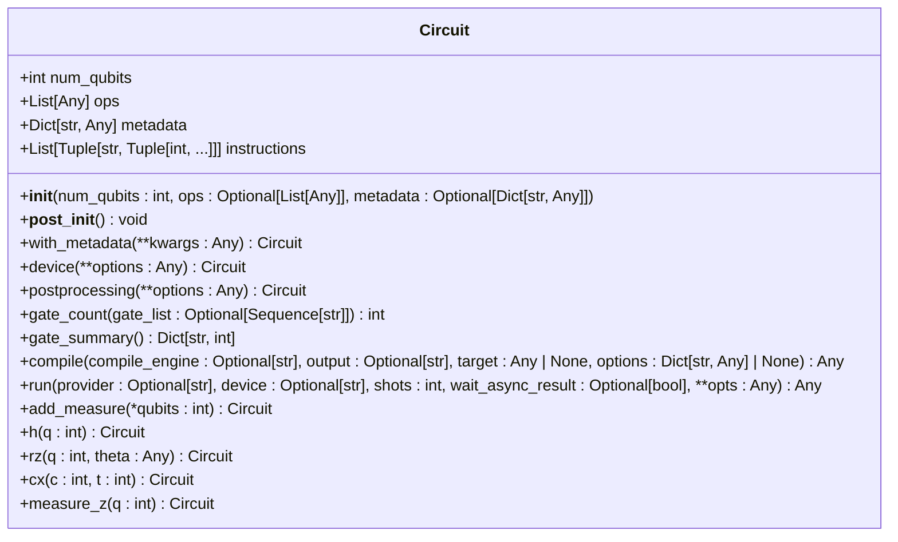
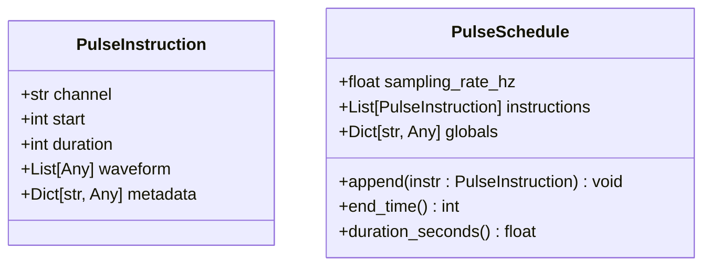
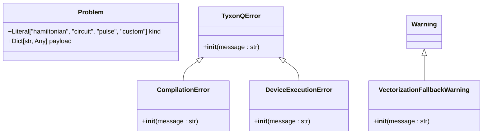
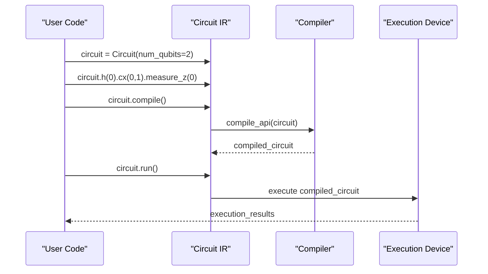

# Intermediate Representation (IR)

<cite>
**Referenced Files in This Document**   
- [circuit.py](file://src/tyxonq/core/ir/circuit.py)
- [pulse.py](file://src/tyxonq/core/ir/pulse.py)
- [__init__.py](file://src/tyxonq/core/ir/__init__.py)
- [types.py](file://src/tyxonq/core/types.py)
- [errors.py](file://src/tyxonq/core/errors.py)
</cite>

## Table of Contents
1. [Introduction](#introduction)
2. [Circuit IR Design](#circuit-ir-design)
3. [Pulse IR Design](#pulse-ir-design)
4. [Operations and Measurements](#operations-and-measurements)
5. [Types and Error Handling](#types-and-error-handling)
6. [Circuit Construction and Manipulation](#circuit-construction-and-manipulation)
7. [IR Transformations and Determinism](#ir-transformations-and-determinism)
8. [Common Issues and Debugging](#common-issues-and-debugging)
9. [Conclusion](#conclusion)

## Introduction
The Intermediate Representation (IR) system in TyxonQ serves as the foundational abstraction layer that enables seamless integration across compilation, execution, and optimization stages. This document details the design and purpose of the Circuit and Pulse IR components, which are implemented as stable, dataclass-based structures that establish a system-wide contract for quantum program representation. The IR layer provides a unified interface for both high-level algorithm development and low-level pulse programming, ensuring consistency and interoperability throughout the quantum computing pipeline.

**Section sources**
- [circuit.py](file://src/tyxonq/core/ir/circuit.py#L41-L62)
- [pulse.py](file://src/tyxonq/core/ir/pulse.py#L1-L10)

## Circuit IR Design
The Circuit IR is designed as a minimal, yet comprehensive representation of quantum circuits using Python dataclasses. It encapsulates essential circuit information including qubit count, operation sequences, and metadata handling. The core attributes of the Circuit class include `num_qubits` for specifying the quantum register size, `ops` as a sequence of operation descriptors, and `metadata` for storing arbitrary circuit annotations. The IR maintains structural validation through `__post_init__` to ensure qubit indices are within range and operations follow the expected format.

Circuit objects support chainable configuration through methods like `device()` and `postprocessing()`, which allow for fluent API usage. The design intentionally keeps the operation type generic to accommodate various backend interpretations while maintaining a consistent structural contract. This flexibility enables the IR to evolve without breaking existing code while supporting deterministic transformations across compilation stages.

**Diagram sources**
- [circuit.py](file://src/tyxonq/core/ir/circuit.py#L41-L778)

**Section sources**
- [circuit.py](file://src/tyxonq/core/ir/circuit.py#L41-L778)

## Pulse IR Design
The Pulse IR provides a low-level control abstraction for quantum hardware manipulation, consisting of `PulseInstruction` and `PulseSchedule` classes. Each `PulseInstruction` targets a specific hardware channel with precise timing parameters, including start time, duration in sample units, and waveform data. The `PulseSchedule` class organizes these instructions with a global sampling rate, enabling accurate time conversion and deterministic execution.

This pulse-level representation integrates directly with hardware drivers, allowing for fine-grained control over quantum operations. The design uses sample-based timing to remain backend-agnostic, with time conversion handled through the `sampling_rate_hz` parameter. The IR supports metadata attachment to pulse instructions, facilitating waveform parameter tracking and calibration data preservation.

**Diagram sources**
- [pulse.py](file://src/tyxonq/core/ir/pulse.py#L1-L66)

**Section sources**
- [pulse.py](file://src/tyxonq/core/ir/pulse.py#L1-L66)

## Operations and Measurements
The IR system handles quantum operations through a flexible tuple-based representation where each operation is defined by a name and parameterized arguments. Common quantum gates like H, RZ, CX, and measurement operations are supported through dedicated methods that append operations to the circuit's `ops` list. The `measure_z` operation specifically handles projective measurements in the computational basis.

Measurement instructions are managed separately through the `instructions` attribute, which stores named operations like "measure" with associated qubit indices. This separation allows for clear distinction between quantum operations and classical control instructions. The `add_measure` method provides a convenient way to append measurement instructions to the circuit, while the `positional_logical_mapping` method helps track measurement outcomes.

**Section sources**
- [circuit.py](file://src/tyxonq/core/ir/circuit.py#L555-L612)
- [circuit.py](file://src/tyxonq/core/ir/circuit.py#L142-L169)

## Types and Error Handling
The IR system employs a robust type system and error handling mechanism to ensure correctness and reliability. The `Problem` class in `types.py` serves as a domain problem wrapper with a `kind` field that categorizes problems as "hamiltonian", "circuit", "pulse", or "custom". This typing system enables the compiler and execution layers to handle different quantum computing tasks appropriately.

Error handling is implemented through a hierarchy of exceptions defined in `errors.py`, including `TyxonQError` as the base exception, `CompilationError` for compilation failures, and `DeviceExecutionError` for device-level issues. The IR validation in `__post_init__` raises appropriate exceptions for invalid qubit indices, malformed operations, and other structural issues, ensuring that only valid circuits are processed further in the pipeline.

**Diagram sources**
- [types.py](file://src/tyxonq/core/types.py#L1-L19)
- [errors.py](file://src/tyxonq/core/errors.py#L1-L17)

**Section sources**
- [types.py](file://src/tyxonq/core/types.py#L1-L19)
- [errors.py](file://src/tyxonq/core/errors.py#L1-L17)

## Circuit Construction and Manipulation
Circuit construction in TyxonQ follows a builder pattern that enables intuitive, fluent API usage. The Circuit class provides direct methods for common quantum gates, allowing for chained operations like `circuit.h(0).cx(0, 1).rz(1, 0.5)`. This pattern supports both interactive development and programmatic circuit generation.

The IR offers several manipulation methods for circuit transformation, including `extended()` for appending operations, `compose()` for combining circuits, and `remap_qubits()` for qubit index remapping. These methods return new Circuit instances, preserving immutability and enabling functional programming patterns. The `compile()` and `run()` methods provide integration points with the compiler and execution systems, allowing for seamless transition from circuit definition to execution.

**Diagram sources**
- [circuit.py](file://src/tyxonq/core/ir/circuit.py#L373-L402)
- [circuit.py](file://src/tyxonq/core/ir/circuit.py#L404-L515)

**Section sources**
- [circuit.py](file://src/tyxonq/core/ir/circuit.py#L576-L612)
- [circuit.py](file://src/tyxonq/core/ir/circuit.py#L236-L256)

## IR Transformations and Determinism
The IR system enables deterministic transformations through its immutable dataclass design and pure functional methods. Operations like `inverse()`, `extended()`, and `compose()` create new Circuit instances without modifying the original, ensuring referential transparency and enabling reliable optimization passes. The structural validation in `__post_init__` guarantees that all transformations produce valid circuits.

The IR supports both high-level algorithmic constructs and low-level pulse programming through its dual representation system. Circuit IR handles abstract quantum algorithms, while Pulse IR manages hardware-specific control sequences. This separation allows for systematic compilation from high-level descriptions to executable pulse schedules, with deterministic behavior at each transformation stage.

**Section sources**
- [circuit.py](file://src/tyxonq/core/ir/circuit.py#L300-L330)
- [circuit.py](file://src/tyxonq/core/ir/circuit.py#L202-L234)

## Common Issues and Debugging
Common issues in the IR system include invalid operation sequences, type mismatches, and qubit index out of range errors. These are caught during the `__post_init__` validation phase, providing immediate feedback on circuit construction errors. The system raises specific exceptions like `ValueError` for invalid qubit indices and `TypeError` for malformed operations.

Debugging strategies leverage IR introspection methods such as `gate_summary()`, `gate_count()`, and `to_json_obj()`. These methods allow developers to inspect circuit structure, count specific operations, and serialize circuits for analysis. The `draw()` method provides visual representation of circuits when Qiskit is available, falling back to textual summaries otherwise.

**Section sources**
- [circuit.py](file://src/tyxonq/core/ir/circuit.py#L171-L200)
- [circuit.py](file://src/tyxonq/core/ir/circuit.py#L693-L711)

## Conclusion
The Intermediate Representation system in TyxonQ provides a robust, dataclass-based foundation for quantum program representation. By establishing stable abstractions for both circuit and pulse-level operations, the IR serves as a system-wide contract that enables deterministic transformations across compilation, execution, and optimization stages. The design balances flexibility with structural integrity, supporting both high-level algorithm development and low-level hardware control while maintaining type safety and error resilience.