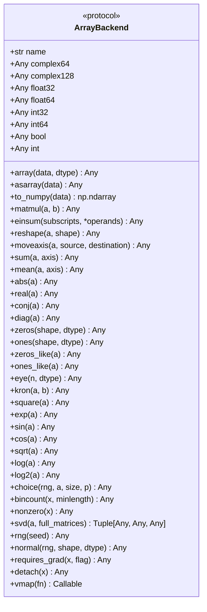
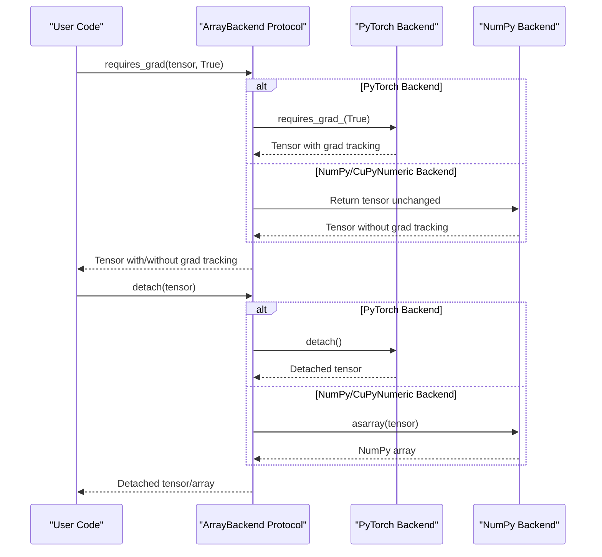
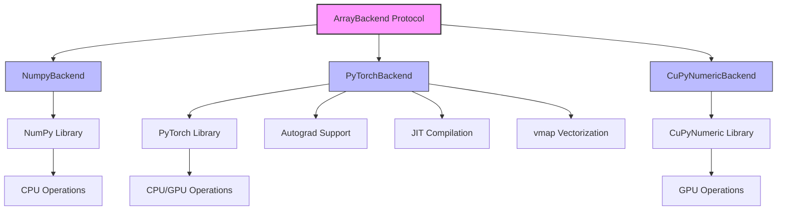

# ArrayBackend Protocol

<cite>
**Referenced Files in This Document**   
- [ArrayBackend Protocol](file://src/tyxonq/numerics/api.py)
- [NumpyBackend](file://src/tyxonq/numerics/backends/numpy_backend.py)
- [PyTorchBackend](file://src/tyxonq/numerics/backends/pytorch_backend.py)
- [CuPyNumericBackend](file://src/tyxonq/numerics/backends/cupynumeric_backend.py)
- [NumericBackend](file://src/tyxonq/numerics/__init__.py)
- [set_backend](file://src/tyxonq/numerics/context.py)
- [get_backend](file://src/tyxonq/numerics/api.py)
- [init_statevector](file://src/tyxonq/libs/quantum_library/kernels/statevector.py)
- [gates.py](file://src/tyxonq/libs/quantum_library/kernels/gates.py)
- [aces_test_for_numeric_backend.py](file://examples-ng/aces_test_for_numeric_backend.py)
</cite>

## Table of Contents
1. [Introduction](#introduction)
2. [Protocol Design and Interface](#protocol-design-and-interface)
3. [Core Array Operations](#core-array-operations)
4. [Mathematical and Linear Algebra Routines](#mathematical-and-linear-algebra-routines)
5. [Random Number Generation](#random-number-generation)
6. [Autodiff Integration: requires_grad and detach](#autodiff-integration-requires_grad-and-detach)
7. [Vectorization Support via vmap](#vectorization-support-via-vmap)
8. [Backend Implementations](#backend-implementations)
9. [Quantum Simulation Abstraction](#quantum-simulation-abstraction)
10. [Usage in Quantum Circuit Simulation](#usage-in-quantum-circuit-simulation)
11. [Implementation Challenges](#implementation-challenges)
12. [Extending the Protocol for Additional Backends](#extending-the-protocol-for-additional-backends)

## Introduction

The ArrayBackend Protocol in TyxonQ provides a unified interface for array and tensor operations across multiple numerical computing backends, including NumPy, PyTorch, and CuPyNumeric. This protocol enables backend-agnostic quantum simulations by abstracting tensor operations and providing consistent APIs for array creation, mathematical operations, linear algebra, random number generation, and automatic differentiation. The protocol is designed to support both CPU and GPU computations while maintaining compatibility with quantum circuit simulation workflows.

**Section sources**
- [ArrayBackend Protocol](file://src/tyxonq/numerics/api.py#L26-L101)
- [numerics.rst](file://docs-ng/source/next/user/numerics.rst#L0-L3)

## Protocol Design and Interface

The ArrayBackend Protocol is defined as a Python Protocol class that specifies a minimal yet comprehensive set of methods and attributes required for array/tensor operations. The protocol is intentionally designed to be minimal at its core, allowing for extension as features are migrated and new requirements emerge. It serves as a contract that all backend implementations must fulfill, ensuring consistent behavior across different numerical computing libraries.

The protocol includes required attributes such as backend name and dtype constants (complex64, complex128, float32, float64, int32, int64, bool, and int), as well as a comprehensive set of methods for array creation, conversion, algebraic operations, and mathematical functions. Optional methods like vmap provide additional functionality for vectorization when supported by the underlying backend.



**Diagram sources**
- [ArrayBackend Protocol](file://src/tyxonq/numerics/api.py#L26-L101)

**Section sources**
- [ArrayBackend Protocol](file://src/tyxonq/numerics/api.py#L26-L101)

## Core Array Operations

The ArrayBackend Protocol defines essential methods for array creation and manipulation that form the foundation of quantum simulations. These operations include array creation from data (array and asarray), conversion to NumPy arrays (to_numpy), and fundamental array manipulations such as reshaping, axis movement, and matrix operations.

Key array operations include:
- **array(data, dtype)**: Creates an array from input data with optional dtype specification
- **asarray(data)**: Converts input data to backend-native array format
- **to_numpy(data)**: Converts backend-native arrays to NumPy ndarrays for interoperability
- **reshape(a, shape)**: Reshapes array to specified dimensions
- **moveaxis(a, source, destination)**: Moves array axes from source to destination positions
- **matmul(a, b)**: Performs matrix multiplication between two arrays
- **einsum(subscripts, *operands)**: Executes Einstein summation convention for tensor operations

These operations are critical for quantum state representation and manipulation, where quantum states are typically represented as complex-valued vectors and quantum gates as unitary matrices.

**Section sources**
- [ArrayBackend Protocol](file://src/tyxonq/numerics/api.py#L26-L101)
- [NumpyBackend](file://src/tyxonq/numerics/backends/numpy_backend.py#L30-L78)

## Mathematical and Linear Algebra Routines

The protocol includes a comprehensive set of mathematical functions and linear algebra routines essential for quantum simulations. These operations enable the implementation of quantum gate operations, state evolution, and measurement calculations.

Mathematical functions include elementary operations such as:
- **exp(a)**: Element-wise exponential
- **sin(a), cos(a)**: Trigonometric functions
- **sqrt(a)**: Square root
- **log(a), log2(a)**: Logarithmic functions
- **abs(a), real(a), conj(a)**: Complex number operations
- **square(a)**: Element-wise squaring

Linear algebra operations are particularly important for quantum simulations:
- **svd(a, full_matrices)**: Singular value decomposition, used in quantum state analysis and tensor network operations
- **kron(a, b)**: Kronecker product, essential for constructing multi-qubit operators from single-qubit gates
- **diag(a)**: Creates diagonal matrix from vector or extracts diagonal from matrix

The SVD operation is implemented differently across backends, with CuPyNumeric falling back to NumPy for this operation due to limited GPU support in the underlying library.

**Section sources**
- [ArrayBackend Protocol](file://src/tyxonq/numerics/api.py#L26-L101)
- [NumpyBackend](file://src/tyxonq/numerics/backends/numpy_backend.py#L79-L107)
- [PyTorchBackend](file://src/tyxonq/numerics/backends/pytorch_backend.py#L108-L136)
- [CuPyNumericBackend](file://src/tyxonq/numerics/backends/cupynumeric_backend.py#L108-L136)

## Random Number Generation

The protocol provides a consistent interface for random number generation, which is crucial for quantum measurement simulations and stochastic algorithms. The random number generation system is designed to be reproducible through seed control while maintaining backend-specific optimizations.

Key random operations include:
- **rng(seed)**: Creates a random number generator with optional seed for reproducibility
- **normal(rng, shape, dtype)**: Generates normally distributed random numbers with specified shape and data type

The implementation varies across backends:
- NumPyBackend uses np.random.default_rng for modern random number generation
- PyTorchBackend creates a torch.Generator with optional manual seeding
- CuPyNumericBackend falls back to NumPy's random generator due to limitations in the CuPyNumeric library

This design ensures consistent random number generation behavior across backends while leveraging each library's native random number capabilities when available.

**Section sources**
- [ArrayBackend Protocol](file://src/tyxonq/numerics/api.py#L26-L101)
- [NumpyBackend](file://src/tyxonq/numerics/backends/numpy_backend.py#L118-L121)
- [PyTorchBackend](file://src/tyxonq/numerics/backends/pytorch_backend.py#L158-L161)
- [CuPyNumericBackend](file://src/tyxonq/numerics/backends/cupynumeric_backend.py#L188-L191)

## Autodiff Integration: requires_grad and detach

The ArrayBackend Protocol includes support for automatic differentiation through the requires_grad and detach methods, enabling gradient-based optimization in variational quantum algorithms. This integration allows TyxonQ to support quantum machine learning and variational quantum eigensolvers (VQE) with seamless gradient computation.

- **requires_grad(x, flag)**: Marks a tensor for gradient computation if supported by the backend. This method enables automatic differentiation by tracking operations on the tensor.
- **detach(x)**: Detaches a tensor from the autodiff computation graph, preventing further gradient tracking.

The implementation varies significantly across backends:
- PyTorchBackend fully supports autodiff through PyTorch's autograd system, calling requires_grad_ and detach methods on tensors
- NumpyBackend and CuPyNumericBackend provide no-op implementations since NumPy and CuPyNumeric lack native autodiff capabilities
- The protocol maintains API consistency by returning the input tensor unchanged in backends without autodiff support

This design allows quantum algorithms to be written in a backend-agnostic manner, with autodiff functionality automatically enabled when using PyTorch as the backend.



**Diagram sources**
- [ArrayBackend Protocol](file://src/tyxonq/numerics/api.py#L100-L101)
- [PyTorchBackend](file://src/tyxonq/numerics/backends/pytorch_backend.py#L171-L177)
- [NumpyBackend](file://src/tyxonq/numerics/backends/numpy_backend.py#L122-L126)
- [CuPyNumericBackend](file://src/tyxonq/numerics/backends/cupynumeric_backend.py#L205-L209)

**Section sources**
- [ArrayBackend Protocol](file://src/tyxonq/numerics/api.py#L100-L101)
- [PyTorchBackend](file://src/tyxonq/numerics/backends/pytorch_backend.py#L171-L177)
- [NumpyBackend](file://src/tyxonq/numerics/backends/numpy_backend.py#L122-L126)
- [CuPyNumericBackend](file://src/tyxonq/numerics/backends/cupynumeric_backend.py#L205-L209)

## Vectorization Support via vmap

The protocol includes optional support for vectorization through the vmap method, which returns a vectorized version of a function along the leading axis. This feature enables batched operations and parallel execution of quantum circuits with different parameters, significantly improving performance for certain workloads.

- **vmap(fn)**: Returns a vectorized version of the input function that operates on batches of inputs

The implementation is backend-dependent:
- PyTorchBackend leverages torch.func.vmap when available, providing efficient JIT-compiled vectorization
- When torch.func.vmap is not available, it falls back to the original function
- Other backends do not implement vmap, as vectorization is not a core feature of NumPy or CuPyNumeric

This optional method allows advanced users to exploit vectorization capabilities when available, while maintaining compatibility with backends that lack this feature. The vmap functionality is particularly valuable for quantum machine learning applications where the same circuit structure is evaluated with different parameter sets.

**Section sources**
- [ArrayBackend Protocol](file://src/tyxonq/numerics/api.py#L26-L101)
- [PyTorchBackend](file://src/tyxonq/numerics/backends/pytorch_backend.py#L180-L189)
- [NumericBackend](file://src/tyxonq/numerics/__init__.py#L172-L173)

## Backend Implementations

TyxonQ provides three concrete implementations of the ArrayBackend Protocol, each tailored to a specific numerical computing library:

### NumpyBackend
The NumpyBackend provides a reference implementation using NumPy as the underlying library. It serves as the default backend and fallback option when other backends are not available. This implementation is CPU-based and provides reliable, well-tested numerical operations with broad compatibility.

### PyTorchBackend
The PyTorchBackend leverages PyTorch's tensor operations and GPU acceleration capabilities. It provides full support for automatic differentiation through PyTorch's autograd system, making it ideal for variational quantum algorithms and quantum machine learning applications. This backend can utilize CUDA-enabled GPUs for accelerated computation.

### CuPyNumericBackend
The CuPyNumericBackend provides GPU acceleration through the CuPyNumeric library, which is designed to be a drop-in replacement for NumPy with GPU support. This backend enables high-performance computing on NVIDIA GPUs while maintaining a NumPy-like interface. It serves users who want GPU acceleration without the additional complexity of PyTorch's autograd system.

Each backend implementation follows the same interface while adapting to the specific capabilities and constraints of the underlying library. The backend system supports dynamic switching at runtime, allowing users to select the most appropriate backend for their specific use case.



**Diagram sources**
- [NumpyBackend](file://src/tyxonq/numerics/backends/numpy_backend.py)
- [PyTorchBackend](file://src/tyxonq/numerics/backends/pytorch_backend.py)
- [CuPyNumericBackend](file://src/tyxonq/numerics/backends/cupynumeric_backend.py)

**Section sources**
- [NumpyBackend](file://src/tyxonq/numerics/backends/numpy_backend.py)
- [PyTorchBackend](file://src/tyxonq/numerics/backends/pytorch_backend.py)
- [CuPyNumericBackend](file://src/tyxonq/numerics/backends/cupynumeric_backend.py)

## Quantum Simulation Abstraction

The ArrayBackend Protocol enables backend-agnostic quantum simulations by abstracting tensor operations that are fundamental to quantum computing. This abstraction allows quantum algorithms to be implemented without dependency on specific numerical libraries, making them portable across different computing environments.

Key aspects of quantum simulation abstraction include:
- **Statevector representation**: Quantum states are represented as complex-valued vectors, with operations implemented through tensor contractions and matrix multiplications
- **Gate operations**: Quantum gates are represented as unitary matrices applied to quantum states through matrix multiplication or tensor contraction
- **Measurement operations**: Expectation values and measurement probabilities are computed using inner products and norm calculations
- **Circuit simulation**: Sequential gate applications are implemented as a series of tensor operations

The protocol's design ensures that quantum simulations can run efficiently on both CPU and GPU hardware by leveraging the optimized linear algebra routines provided by each backend. This abstraction layer is particularly valuable for quantum algorithm development, as it allows researchers to focus on quantum logic rather than numerical implementation details.

**Section sources**
- [ArrayBackend Protocol](file://src/tyxonq/numerics/api.py#L26-L101)
- [init_statevector](file://src/tyxonq/libs/quantum_library/kernels/statevector.py#L10-L18)
- [gates.py](file://src/tyxonq/libs/quantum_library/kernels/gates.py)

## Usage in Quantum Circuit Simulation

The ArrayBackend Protocol is used extensively in quantum circuit simulation within TyxonQ. The following example demonstrates how the protocol enables backend-agnostic quantum simulations:

```python
import tyxonq as tq

def demo_set_numeric_backend(backend_name: str = "numpy"):
    # Set global numerics backend (numpy | pytorch | cupynumeric)
    tq.set_backend(backend_name)
    
    # Build a simple quantum circuit
    c = tq.Circuit(2)
    c.H(0)
    c.CNOT(0, 1)
    c.measure_z(0)
    c.measure_z(1)
    
    # Compile and run the circuit
    tasks = (
        c.compile()
         .device(provider="local", device="statevector", shots=0)
         .postprocessing(method=None)
         .run()
    )
    
    for t in tasks:
        print("Result:", t.details())
    return tasks
```

In this example, the same quantum circuit can be executed with different backends by simply changing the backend name. The circuit compilation and execution process automatically uses the selected backend for all numerical operations, including statevector initialization, gate application, and measurement computation.

The statevector simulation engine uses the backend's array operations to represent and manipulate the quantum state. For example, the init_statevector function creates the initial quantum state using the backend's array creation methods, while gate operations use matrix multiplication and tensor contraction operations provided by the backend.

**Section sources**
- [aces_test_for_numeric_backend.py](file://examples-ng/aces_test_for_numeric_backend.py)
- [init_statevector](file://src/tyxonq/libs/quantum_library/kernels/statevector.py#L10-L18)
- [apply_1q_statevector](file://src/tyxonq/libs/quantum_library/kernels/statevector.py#L20-L35)
- [set_backend](file://src/tyxonq/numerics/context.py#L17-L29)

## Implementation Challenges

Implementing the ArrayBackend Protocol across different numerical libraries presents several challenges that must be addressed to ensure consistent behavior and optimal performance:

### Dtype Consistency
Maintaining consistent data type handling across backends is challenging due to differences in dtype systems. NumPy, PyTorch, and CuPyNumeric have different dtype hierarchies and naming conventions. The protocol addresses this by defining standard dtype attributes (complex64, complex128, etc.) that map to the corresponding backend-specific dtypes.

### GPU Memory Management
GPU-based backends (PyTorch and CuPyNumeric) require careful memory management to avoid memory leaks and optimize performance. The protocol must handle data transfer between CPU and GPU memory, particularly when interfacing with libraries that expect NumPy arrays. The to_numpy method must efficiently transfer data from GPU to CPU memory when needed.

### Gradient Tracking Across Frameworks
Automatic differentiation support varies significantly between backends. PyTorch provides comprehensive autograd capabilities, while NumPy and CuPyNumeric lack native gradient tracking. The protocol provides a unified interface while gracefully handling the absence of autodiff features in certain backends.

### Performance Optimization
Each backend has different performance characteristics and optimization opportunities. The protocol must balance API consistency with performance, ensuring that operations are implemented efficiently on each backend. This includes leveraging JIT compilation when available (PyTorch's torch.compile) and optimizing memory access patterns.

### Error Handling and Fallbacks
The protocol includes robust error handling and fallback mechanisms, particularly for optional features. When a backend lacks certain capabilities (like SVD in CuPyNumeric), the implementation falls back to alternative methods or libraries to maintain functionality.

**Section sources**
- [PyTorchBackend](file://src/tyxonq/numerics/backends/pytorch_backend.py)
- [NumpyBackend](file://src/tyxonq/numerics/backends/numpy_backend.py)
- [CuPyNumericBackend](file://src/tyxonq/numerics/backends/cupynumeric_backend.py)
- [ArrayBackend Protocol](file://src/tyxonq/numerics/api.py)

## Extending the Protocol for Additional Backends

The ArrayBackend Protocol is designed to be extensible, allowing for the addition of new backends beyond the currently supported NumPy, PyTorch, and CuPyNumeric implementations. To create a new backend, developers must implement the ArrayBackend Protocol interface with the required methods and attributes.

Steps to extend the protocol with a new backend:
1. Create a new class that implements the ArrayBackend Protocol
2. Implement all required methods and attributes
3. Register the backend with the global backend system
4. Handle optional features appropriately (provide no-op implementations or fallbacks)

Key considerations when extending the protocol:
- **Performance**: Optimize implementations for the specific characteristics of the new backend
- **Memory management**: Implement efficient memory handling, particularly for GPU-based backends
- **Error handling**: Provide clear error messages and graceful degradation when features are not supported
- **Testing**: Ensure comprehensive test coverage to maintain compatibility with existing code

The modular design of the protocol makes it relatively straightforward to add new backends, enabling TyxonQ to support emerging numerical computing libraries and specialized hardware accelerators in the future.

**Section sources**
- [ArrayBackend Protocol](file://src/tyxonq/numerics/api.py#L26-L101)
- [get_backend](file://src/tyxonq/numerics/api.py#L159-L191)
- [set_backend](file://src/tyxonq/numerics/context.py#L17-L29)