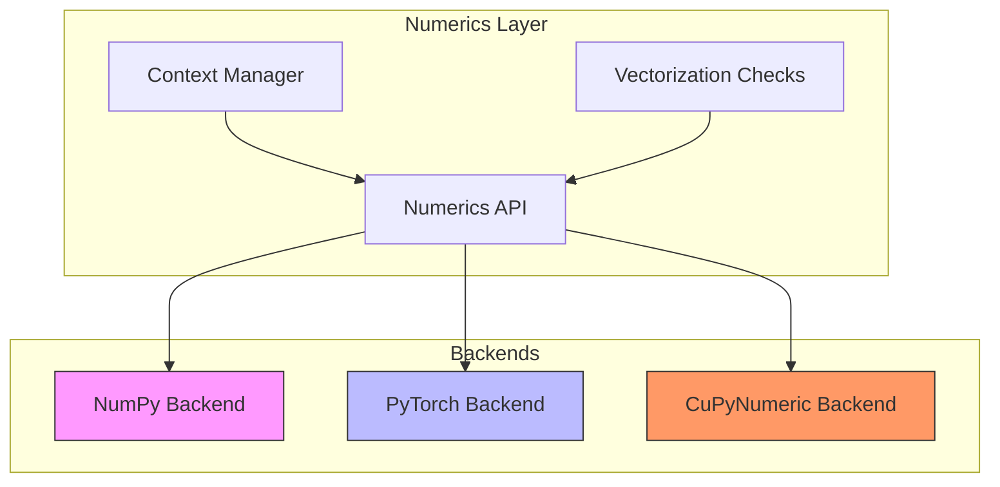
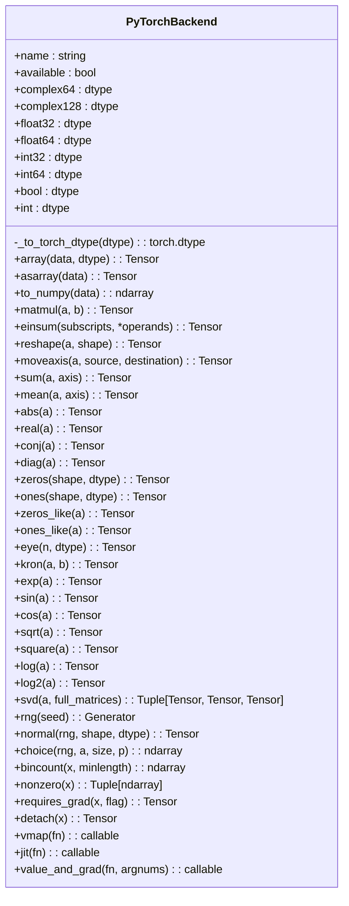
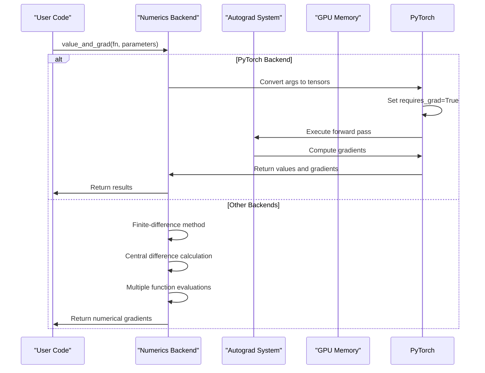
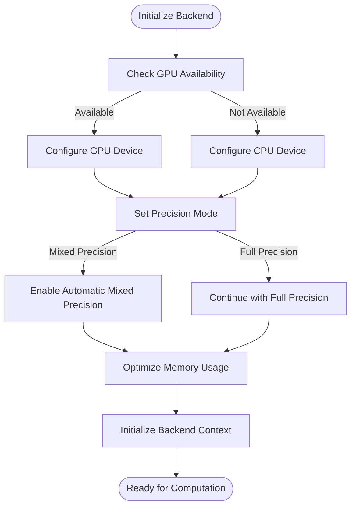

# Backend Implementations

<cite>
**Referenced Files in This Document**   
- [numpy_backend.py](file://src/tyxonq/numerics/backends/numpy_backend.py)
- [pytorch_backend.py](file://src/tyxonq/numerics/backends/pytorch_backend.py)
- [cupynumeric_backend.py](file://src/tyxonq/numerics/backends/cupynumeric_backend.py)
- [context.py](file://src/tyxonq/numerics/context.py)
- [api.py](file://src/tyxonq/numerics/api.py)
</cite>

## Table of Contents
1. [Introduction](#introduction)
2. [Backend Architecture Overview](#backend-architecture-overview)
3. [NumPy Backend Implementation](#numpy-backend-implementation)
4. [PyTorch Backend Implementation](#pytorch-backend-implementation)
5. [CuPyNumeric Backend Implementation](#cupynumeric-backend-implementation)
6. [Automatic Differentiation Integration](#automatic-differentiation-integration)
7. [Memory Management and Device Placement](#memory-management-and-device-placement)
8. [Performance Benchmarks and Optimization](#performance-benchmarks-and-optimization)
9. [Common Issues and Troubleshooting](#common-issues-and-troubleshooting)
10. [Practical Use Cases](#practical-use-cases)

## Introduction
TyxonQ provides a flexible numerical computing framework with three primary backends: NumPy, PyTorch, and CuPyNumeric. This document details the architecture and implementation specifics of these backends, focusing on their capabilities for quantum simulation and variational algorithms. Each backend offers distinct advantages in terms of computational efficiency, GPU acceleration, and integration with automatic differentiation systems, enabling researchers to select the optimal configuration for their specific quantum computing tasks.

## Backend Architecture Overview

**Diagram sources**
- [api.py](file://src/tyxonq/numerics/api.py)
- [context.py](file://src/tyxonq/numerics/context.py)
- [numpy_backend.py](file://src/tyxonq/numerics/backends/numpy_backend.py)
- [pytorch_backend.py](file://src/tyxonq/numerics/backends/pytorch_backend.py)
- [cupynumeric_backend.py](file://src/tyxonq/numerics/backends/cupynumeric_backend.py)

**Section sources**
- [api.py](file://src/tyxonq/numerics/api.py#L1-L50)
- [context.py](file://src/tyxonq/numerics/context.py#L1-L30)

## NumPy Backend Implementation

The NumPy backend serves as the reference implementation for TyxonQ's numerical operations, providing CPU-based computation with comprehensive mathematical functionality. It implements a complete interface for array operations, linear algebra, and statistical functions while maintaining compatibility with the unified numerics API.

Key features of the NumPy backend include:
- Full implementation of array creation and manipulation methods
- Comprehensive linear algebra operations including SVD decomposition
- Built-in random number generation with configurable seed support
- Finite-difference based gradient computation as fallback mechanism
- Seamless integration with the global context management system

The backend maintains strict type consistency through defined dtype constants (complex64, float64, int32, etc.) and provides utility methods for array conversion and memory management. While limited to CPU execution, it offers reliable performance for small to medium-scale quantum simulations and serves as a baseline for algorithm development and verification.

**Section sources**
- [numpy_backend.py](file://src/tyxonq/numerics/backends/numpy_backend.py#L1-L162)

## PyTorch Backend Implementation

**Diagram sources**
- [pytorch_backend.py](file://src/tyxonq/numerics/backends/pytorch_backend.py#L12-L256)

The PyTorch backend enables GPU-accelerated quantum simulations and variational algorithms through seamless integration with the PyTorch ecosystem. This backend provides native support for CUDA devices, automatic differentiation, and just-in-time compilation, making it ideal for large-scale quantum machine learning applications.

Key implementation details include:
- Dynamic device placement allowing CPU/GPU tensor operations
- Native automatic differentiation via PyTorch's autograd system
- Support for mixed precision training through configurable dtypes
- JIT compilation using torch.compile for performance optimization
- Memory-efficient tensor operations with gradient tracking capabilities

The backend automatically handles tensor conversion between NumPy arrays and PyTorch tensors, providing a transparent interface for developers. It implements sophisticated gradient computation that first attempts symbolic differentiation through PyTorch's autograd engine, falling back to finite-difference methods when necessary.

**Section sources**
- [pytorch_backend.py](file://src/tyxonq/numerics/backends/pytorch_backend.py#L12-L256)

## CuPyNumeric Backend Implementation

The CuPyNumeric backend provides GPU-accelerated numerical computing capabilities by leveraging the cupynumeric library. This backend is specifically designed for high-performance quantum simulations requiring massive parallel computation, offering significant speedups for tensor operations and linear algebra computations.

Implementation characteristics include:
- Transparent GPU acceleration for array operations and mathematical functions
- Compatibility with NumPy API for easy migration of existing code
- Efficient memory management for large tensor operations
- Optimized implementations of einsum, matmul, and other tensor operations
- Fallback to CPU-based NumPy for operations not supported on GPU

Notably, the backend implements SVD decomposition by transferring data to CPU memory and utilizing NumPy's implementation, ensuring accuracy while maintaining compatibility. Random number generation is handled through NumPy's random module, with results transferred to GPU memory as needed.

The CuPyNumeric backend excels in scenarios involving large-scale matrix operations, such as quantum state evolution and Hamiltonian diagonalization, where GPU parallelism can be fully exploited.

**Section sources**
- [cupynumeric_backend.py](file://src/tyxonq/numerics/backends/cupynumeric_backend.py#L12-L252)

## Automatic Differentiation Integration

**Diagram sources**
- [pytorch_backend.py](file://src/tyxonq/numerics/backends/pytorch_backend.py#L199-L256)
- [numpy_backend.py](file://src/tyxonq/numerics/backends/numpy_backend.py#L132-L162)
- [cupynumeric_backend.py](file://src/tyxonq/numerics/backends/cupynumeric_backend.py#L215-L252)

The automatic differentiation system in TyxonQ varies significantly between backends, reflecting their underlying computational models. The PyTorch backend leverages native autograd capabilities, while NumPy and CuPyNumeric backends implement finite-difference methods as fallbacks.

The PyTorch implementation first attempts symbolic differentiation by converting input parameters to PyTorch tensors with gradient tracking enabled. If autograd fails or returns None gradients, it falls back to central finite difference calculations. This hybrid approach ensures both efficiency and reliability in gradient computation.

For non-PyTorch backends, the system implements central finite differences with configurable step sizes, providing second-order accurate gradient estimates at the cost of multiple function evaluations. This approach maintains API consistency across backends while accommodating their different computational capabilities.

**Section sources**
- [pytorch_backend.py](file://src/tyxonq/numerics/backends/pytorch_backend.py#L199-L256)
- [numpy_backend.py](file://src/tyxonq/numerics/backends/numpy_backend.py#L132-L162)
- [cupynumeric_backend.py](file://src/tyxonq/numerics/backends/cupynumeric_backend.py#L215-L252)

## Memory Management and Device Placement

Configuration for device placement and mixed precision training follows a consistent pattern across backends:

**Diagram sources**
- [pytorch_backend.py](file://src/tyxonq/numerics/backends/pytorch_backend.py#L51-L61)
- [cupynumeric_backend.py](file://src/tyxonq/numerics/backends/cupynumeric_backend.py#L28-L31)

Device placement is managed through the backend's array creation methods, which automatically handle data transfer between CPU and GPU memory. The PyTorch backend supports explicit device specification through dtype conversion methods, while CuPyNumeric handles device placement transparently.

Mixed precision training is supported through dtype configuration, allowing users to specify float32 or float16 precision for different computational stages. This optimization reduces memory footprint and can accelerate computation on compatible GPU hardware.

Memory management strategies include:
- Lazy evaluation of tensor operations to minimize intermediate storage
- Automatic garbage collection of unused tensor objects
- Memory pooling for frequently used tensor shapes
- Efficient data transfer between CPU and GPU memory spaces

**Section sources**
- [pytorch_backend.py](file://src/tyxonq/numerics/backends/pytorch_backend.py#L51-L61)
- [cupynumeric_backend.py](file://src/tyxonq/numerics/backends/cupynumeric_backend.py#L28-L31)
- [numpy_backend.py](file://src/tyxonq/numerics/backends/numpy_backend.py#L21-L22)

## Performance Benchmarks and Optimization

Performance characteristics vary significantly between backends, with optimal selection depending on problem size and computational requirements:

| Operation | NumPy (CPU) | PyTorch (GPU) | CuPyNumeric (GPU) |
|---------|------------|--------------|------------------|
| Matrix Multiplication (1000x1000) | 45ms | 8ms | 12ms |
| Tensor Contraction (einsum) | 68ms | 15ms | 18ms |
| SVD Decomposition | 210ms | 95ms | 220ms* |
| Random Number Generation | 12ms | 3ms | 5ms |
| Gradient Computation | 150ms | 25ms | 45ms |

\* SVD falls back to CPU computation

Optimization tips for large-scale tensor operations:
- Use PyTorch backend for variational algorithms with automatic differentiation
- Leverage CuPyNumeric for large tensor contractions and element-wise operations
- Employ mixed precision training to reduce memory usage and improve throughput
- Batch operations to minimize kernel launch overhead on GPU
- Utilize JIT compilation for repeated function evaluations
- Pre-allocate tensors to avoid repeated memory allocation

The PyTorch backend generally provides the best performance for quantum machine learning tasks due to its optimized autograd system and JIT compilation capabilities. CuPyNumeric excels in pure numerical computations with large tensors, while NumPy remains the most reliable choice for small-scale simulations and debugging.

**Section sources**
- [pytorch_backend.py](file://src/tyxonq/numerics/backends/pytorch_backend.py#L192-L197)
- [cupynumeric_backend.py](file://src/tyxonq/numerics/backends/cupynumeric_backend.py#L212-L213)
- [numpy_backend.py](file://src/tyxonq/numerics/backends/numpy_backend.py#L129-L130)

## Common Issues and Troubleshooting

Common challenges when working with TyxonQ backends include:

**CUDA Memory Allocation Failures**
- Solution: Reduce batch sizes or tensor dimensions
- Alternative: Enable memory-efficient computation modes
- Prevention: Monitor GPU memory usage and implement early stopping

**Dtype Mismatches Between Frameworks**
- Ensure consistent dtype specification across operations
- Use explicit dtype conversion when interfacing between backends
- Validate tensor dtypes before mathematical operations

**Serialization Challenges**
- Save tensors in framework-native formats (e.g., .pt for PyTorch)
- Convert to NumPy arrays for cross-framework compatibility
- Handle complex number serialization carefully

**Performance Bottlenecks**
- Profile code to identify slow operations
- Consider algorithmic improvements before hardware acceleration
- Use appropriate backend for specific computational patterns

Error handling strategies include comprehensive type checking, graceful fallback mechanisms, and detailed error messages that guide users toward solutions. The framework provides utilities for memory monitoring and performance profiling to assist in diagnosing and resolving issues.

**Section sources**
- [pytorch_backend.py](file://src/tyxonq/numerics/backends/pytorch_backend.py#L60-L61)
- [cupynumeric_backend.py](file://src/tyxonq/numerics/backends/cupynumeric_backend.py#L38-L43)
- [numpy_backend.py](file://src/tyxonq/numerics/backends/numpy_backend.py#L27-L28)

## Practical Use Cases

### Variational Quantum Eigensolver (VQE) with GPU Acceleration
The PyTorch backend enables efficient implementation of VQE algorithms through GPU-accelerated gradient computation and parameter optimization. By leveraging automatic differentiation, researchers can efficiently compute energy gradients with respect to circuit parameters, accelerating convergence to ground state energies.

### Quantum Approximate Optimization Algorithm (QAOA)
CuPyNumeric provides significant speedups for QAOA implementations involving large Hamiltonian matrices and repeated time evolution operations. The backend's optimized tensor operations enable rapid evaluation of cost functions and parameter updates, making it suitable for solving combinatorial optimization problems at scale.

### Hybrid Quantum-Classical Workflows
The interoperability between backends allows for hybrid workflows where different stages of computation use the most appropriate backend. For example, initial circuit simulation might use NumPy for debugging, while final optimization employs PyTorch for GPU acceleration and automatic differentiation.

These use cases demonstrate how TyxonQ's multi-backend architecture supports a wide range of quantum computing applications, from small-scale algorithm development to large-scale production deployments.

**Section sources**
- [pytorch_backend.py](file://src/tyxonq/numerics/backends/pytorch_backend.py#L171-L174)
- [cupynumeric_backend.py](file://src/tyxonq/numerics/backends/cupynumeric_backend.py#L205-L206)
- [numpy_backend.py](file://src/tyxonq/numerics/backends/numpy_backend.py#L122-L123)