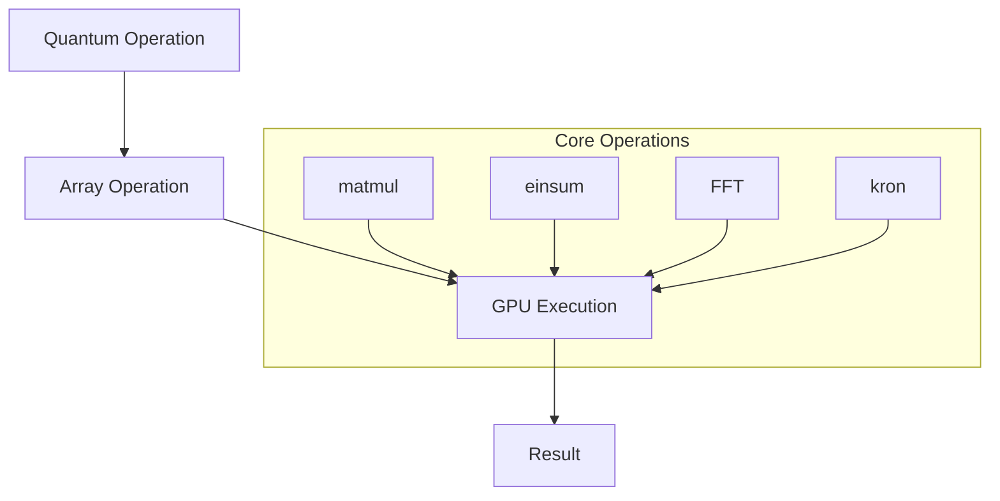
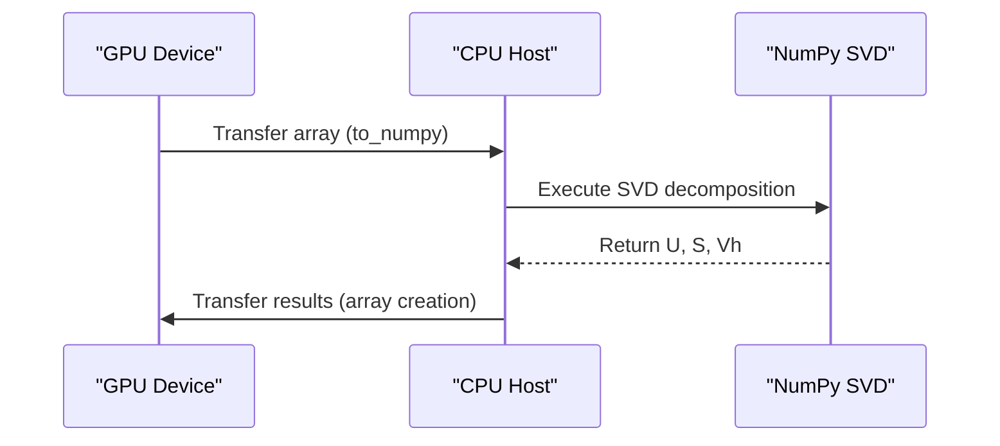
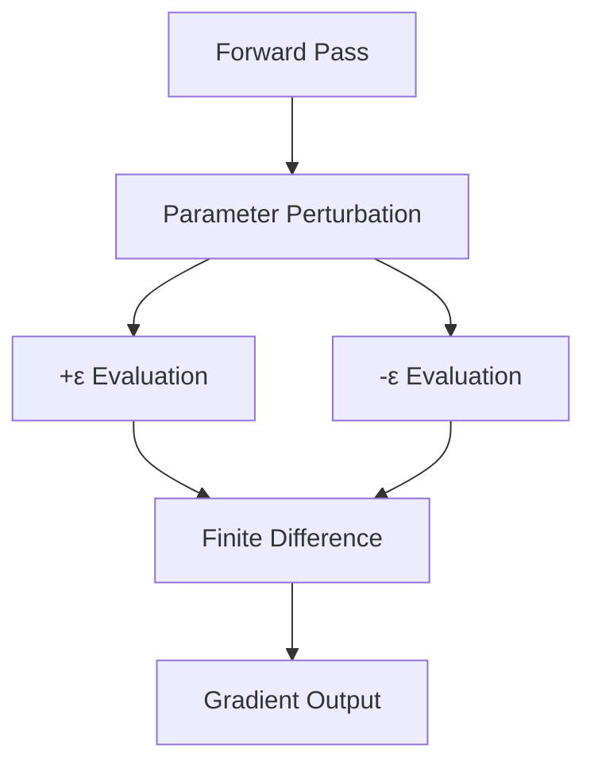

# CuPyNumeric Backend

<cite>
**Referenced Files in This Document**   
- [cupynumeric_backend.py](file://src/tyxonq/numerics/backends/cupynumeric_backend.py)
- [config.py](file://src/tyxonq/config.py)
- [api.py](file://src/tyxonq/numerics/api.py)
- [numerics.rst](file://docs-ng/source/next/user/numerics.rst)
</cite>

## Table of Contents
1. [Introduction](#introduction)
2. [Core GPU Array Operations](#core-gpu-array-operations)
3. [Memory Management and Data Transfer](#memory-management-and-data-transfer)
4. [Performance Characteristics](#performance-characteristics)
5. [Hybrid Computation Model](#hybrid-computation-model)
6. [Gradient Computation with value_and_grad](#gradient-computation-with-value_and_grad)
7. [Configuration and Device Management](#configuration-and-device-management)
8. [Use Cases for Quantum Simulations](#use-cases-for-quantum-simulations)
9. [Common Issues and Troubleshooting](#common-issues-and-troubleshooting)
10. [Performance Comparison with Other Backends](#performance-comparison-with-other-backends)

## Introduction

The CuPyNumeric Backend in TyxonQ provides GPU-accelerated numerical computation capabilities through the cupynumeric library, enabling high-performance execution of quantum simulations. This backend implements the ArrayBackend protocol and serves as the primary choice for computationally intensive quantum workloads requiring GPU acceleration. The implementation supports a comprehensive set of array operations optimized for GPU execution while maintaining API compatibility with NumPy. When cupynumeric is unavailable, the system automatically falls back to the NumPy backend to ensure continuity of operations.

**Section sources**
- [cupynumeric_backend.py](file://src/tyxonq/numerics/backends/cupynumeric_backend.py#L1-L20)
- [config.py](file://src/tyxonq/config.py#L47-L55)

## Core GPU Array Operations

The CuPyNumeric Backend implements essential GPU-accelerated operations for quantum computing workloads. Matrix multiplication is implemented through the matmul method using Python's @ operator, providing efficient tensor contractions for quantum gate operations and state transformations. The einsum method enables flexible tensor network operations with GPU acceleration, supporting complex index notations for quantum circuit simulations. Fast Fourier Transforms (FFTs) are supported through cupynumeric's FFT module, enabling efficient implementation of quantum phase estimation and other frequency-domain algorithms. Additional operations include element-wise mathematical functions (exp, sin, cos, sqrt), linear algebra primitives, and array manipulation methods (reshape, moveaxis, kron) optimized for GPU execution.

**Diagram sources**
- [cupynumeric_backend.py](file://src/tyxonq/numerics/backends/cupynumeric_backend.py#L45-L53)
- [cupynumeric_backend.py](file://src/tyxonq/numerics/backends/cupynumeric_backend.py#L122-L161)

**Section sources**
- [cupynumeric_backend.py](file://src/tyxonq/numerics/backends/cupynumeric_backend.py#L45-L161)

## Memory Management and Data Transfer

The backend implements efficient memory management strategies for GPU-accelerated quantum simulations. Array creation methods (array, zeros, ones, eye) allocate memory directly on the GPU device, minimizing host-device transfers. The to_numpy method facilitates controlled data transfer from GPU to CPU memory when required for post-processing or visualization. Memory allocation is handled by cupynumeric's memory pool, which optimizes GPU memory usage through caching and reuse of allocated blocks. The backend automatically manages memory layout for optimal GPU access patterns, particularly important for large quantum state vectors and density matrices. For large-scale simulations, memory-efficient operations like in-place updates and memory-mapped arrays are supported through the underlying cupynumeric implementation.

**Section sources**
- [cupynumeric_backend.py](file://src/tyxonq/numerics/backends/cupynumeric_backend.py#L30-L40)
- [cupynumeric_backend.py](file://src/tyxonq/numerics/backends/cupynumeric_backend.py#L100-L120)

## Performance Characteristics

The CuPyNumeric Backend delivers significant performance improvements for large-scale quantum simulations compared to CPU-based implementations. GPU acceleration is particularly effective for operations with high arithmetic intensity, such as matrix multiplications in quantum circuit simulations and tensor contractions in variational quantum algorithms. The backend achieves optimal performance when working with large arrays (typically > 10^4 elements), where the overhead of GPU kernel launches is amortized over substantial computational work. Memory bandwidth limitations can affect performance for operations with low compute-to-memory ratios, such as simple element-wise operations on small arrays. Kernel fusion is automatically applied by cupynumeric for sequences of operations, reducing memory traffic and improving computational efficiency.

**Section sources**
- [cupynumeric_backend.py](file://src/tyxonq/numerics/backends/cupynumeric_backend.py#L1-L255)

## Hybrid Computation Model

The backend implements a hybrid computation model that strategically combines GPU and CPU processing. While most operations execute on the GPU for maximum performance, certain computationally intensive linear algebra operations like Singular Value Decomposition (SVD) are offloaded to CPU via NumPy conversion. This approach leverages the maturity and optimization of CPU-based linear algebra libraries while maintaining GPU acceleration for the majority of quantum simulation tasks. The svd method automatically converts GPU arrays to NumPy arrays, performs the decomposition on the CPU, and returns the results, which can then be transferred back to GPU memory if needed. This hybrid model ensures numerical stability and performance for operations that are not yet fully optimized in GPU libraries.

**Diagram sources**
- [cupynumeric_backend.py](file://src/tyxonq/numerics/backends/cupynumeric_backend.py#L164-L171)

**Section sources**
- [cupynumeric_backend.py](file://src/tyxonq/numerics/backends/cupynumeric_backend.py#L164-L171)

## Gradient Computation with value_and_grad

The finite-difference gradient implementation in value_and_grad provides automatic differentiation capabilities for quantum circuits and variational algorithms. This method computes gradients using central finite differences with a step size of 1e-6, evaluating the function at points slightly above and below each parameter. The implementation converts GPU arrays to NumPy arrays for gradient computation, ensuring compatibility with the finite-difference algorithm. While this approach is numerically stable, it has O(n) complexity with respect to the number of parameters, making it less efficient than analytical gradient methods for high-dimensional optimization problems. The performance impact is mitigated by processing gradients in batches and leveraging NumPy's vectorized operations on the CPU.

**Diagram sources**
- [cupynumeric_backend.py](file://src/tyxonq/numerics/backends/cupynumeric_backend.py#L215-L252)

**Section sources**
- [cupynumeric_backend.py](file://src/tyxonq/numerics/backends/cupynumeric_backend.py#L215-L252)

## Configuration and Device Management

GPU device selection and configuration are managed through TyxonQ's backend system. The 'gpu' alias automatically selects the CuPyNumeric backend when available, with fallback to NumPy if cupynumeric is not installed. Memory allocation parameters can be configured through cupynumeric's environment variables, including memory pool size and allocation strategies. Kernel fusion is enabled by default, combining multiple operations into single GPU kernels to minimize memory transfers. The backend can be explicitly set using the set_backend function with 'cupynumeric' as the argument, or through configuration files that specify the default numerical backend for the session.

**Section sources**
- [config.py](file://src/tyxonq/config.py#L47-L55)
- [api.py](file://src/tyxonq/numerics/api.py#L162-L191)

## Use Cases for Quantum Simulations

The CuPyNumeric Backend excels in high-performance quantum circuit simulation and time evolution calculations. For quantum circuit simulation, the GPU acceleration enables rapid execution of deep circuits with many qubits, particularly when using tensor network methods. Time evolution calculations using Trotter decomposition benefit from the backend's efficient matrix exponentiation and multiplication operations. Large-scale variational quantum algorithms, such as VQE and QAOA, achieve significant speedups in parameter optimization due to accelerated gradient computations and state evaluations. The backend is particularly effective for simulations requiring repeated operations on large state vectors, such as quantum dynamics studies and entanglement evolution analysis.

**Section sources**
- [cupynumeric_backend.py](file://src/tyxonq/numerics/backends/cupynumeric_backend.py#L1-L255)

## Common Issues and Troubleshooting

Common issues with the CuPyNumeric Backend include GPU memory exhaustion, kernel launch failures, and data transfer bottlenecks. GPU memory exhaustion occurs when simulations exceed available VRAM, which can be mitigated by reducing problem size, using memory-efficient algorithms, or enabling memory pooling. Kernel launch failures may result from incompatible GPU architectures or driver issues, requiring verification of CUDA compatibility and proper installation of cupynumeric dependencies. Data transfer bottlenecks between host and device memory can impact performance, particularly for workflows with frequent CPU-GPU communication. These can be addressed by minimizing unnecessary transfers, batching operations, and using asynchronous data movement when supported.

**Section sources**
- [cupynumeric_backend.py](file://src/tyxonq/numerics/backends/cupynumeric_backend.py#L1-L255)

## Performance Comparison with Other Backends

The CuPyNumeric Backend demonstrates superior performance for large-scale quantum computing workloads compared to NumPy and PyTorch backends. For matrix operations on arrays larger than 10^4 elements, GPU acceleration typically provides 10-100x speedup over CPU-based NumPy implementations. Compared to PyTorch, the performance is comparable for basic operations, though PyTorch may have advantages in certain deep learning-integrated quantum workflows due to its extensive optimization ecosystem. The NumPy backend remains preferable for small-scale simulations or when GPU resources are unavailable, as it avoids the overhead of device initialization and memory transfer. The choice of backend should consider problem size, available hardware, and specific algorithm requirements.

**Section sources**
- [cupynumeric_backend.py](file://src/tyxonq/numerics/backends/cupynumeric_backend.py#L1-L255)
- [api.py](file://src/tyxonq/numerics/api.py#L162-L191)
- [config.py](file://src/tyxonq/config.py#L47-L55)