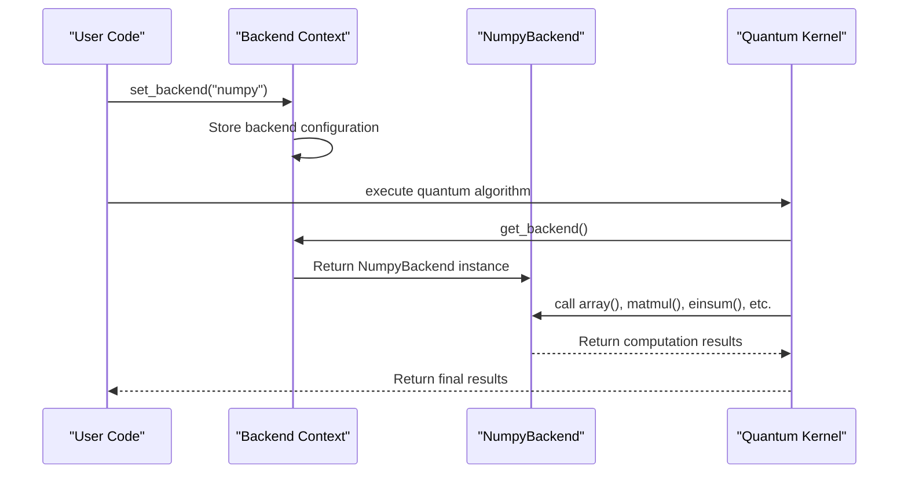

# NumPy Backend

<cite>
**Referenced Files in This Document**   
- [numpy_backend.py](file://src/tyxonq/numerics/backends/numpy_backend.py)
- [api.py](file://src/tyxonq/numerics/api.py)
- [gates.py](file://src/tyxonq/libs/quantum_library/kernels/gates.py)
- [statevector.py](file://src/tyxonq/libs/quantum_library/kernels/statevector.py)
- [aces_test_for_numeric_backend.py](file://examples-ng/aces_test_for_numeric_backend.py)
- [context.py](file://src/tyxonq/numerics/context.py)
</cite>

## Table of Contents
1. [Introduction](#introduction)
2. [Core Implementation](#core-implementation)
3. [Array Creation and Data Types](#array-creation-and-data-types)
4. [Mathematical and Linear Algebra Operations](#mathematical-and-linear-algebra-operations)
5. [Gradient Computation with value_and_grad](#gradient-computation-with-value_and_grad)
6. [Integration with Quantum Simulation Framework](#integration-with-quantum-simulation-framework)
7. [Performance Characteristics and Limitations](#performance-characteristics-and-limitations)
8. [Conclusion](#conclusion)

## Introduction

The NumPy Backend serves as the default CPU-based numerical computation engine within the TyxonQ quantum computing framework. It provides a comprehensive implementation of the `ArrayBackend` protocol, enabling quantum simulations to execute on standard hardware without requiring specialized libraries or accelerators. This backend leverages the widely adopted NumPy library to deliver reliable and predictable numerical operations essential for quantum state vector manipulations, Hamiltonian computations, and variational algorithm execution. Its role as the fallback and reference implementation ensures compatibility across diverse environments, making it ideal for development, testing, and small-to-medium scale simulations where GPU acceleration is unnecessary.

**Section sources**
- [numpy_backend.py](file://src/tyxonq/numerics/backends/numpy_backend.py#L1-L20)

## Core Implementation

The `NumpyBackend` class implements the `ArrayBackend` protocol, defining a standardized interface for array operations within TyxonQ. This design enables seamless switching between different numerical backends (such as PyTorch or CuPyNumeric) while maintaining consistent API behavior. The implementation wraps core NumPy functions with a uniform method signature, ensuring that quantum algorithms can operate agnostically of the underlying computational engine. Key architectural decisions include maintaining dtype constants for cross-backend consistency and providing no-op implementations for features not natively supported by NumPy, such as just-in-time compilation and automatic differentiation.

```mermaid
classDiagram
class ArrayBackend {
<<protocol>>
name : str
complex64 : Any
complex128 : Any
float32 : Any
float64 : Any
int32 : Any
int64 : Any
bool : Any
int : Any
array(data, dtype) : Any
asarray(data) : Any
to_numpy(data) : np.ndarray
matmul(a, b) : Any
einsum(subscripts, *operands) : Any
reshape(a, shape) : Any
moveaxis(a, source, destination) : Any
sum(a, axis) : Any
mean(a, axis) : Any
abs(a) : Any
real(a) : Any
conj(a) : Any
diag(a) : Any
zeros(shape, dtype) : Any
ones(shape, dtype) : Any
zeros_like(a) : Any
ones_like(a) : Any
eye(n, dtype) : Any
kron(a, b) : Any
square(a) : Any
exp(a) : Any
sin(a) : Any
cos(a) : Any
sqrt(a) : Any
log(a) : Any
log2(a) : Any
svd(a, full_matrices) : Tuple[Any, Any, Any]
rng(seed) : Any
normal(rng, shape, dtype) : Any
choice(rng, a, size, p) : Any
bincount(x, minlength) : Any
nonzero(x) : Any
requires_grad(x, flag) : Any
detach(x) : Any
jit(fn) : Any
value_and_grad(fn, argnums) : Any
}
class NumpyBackend {
name : str
complex64 : Any
complex128 : Any
float32 : Any
float64 : Any
int32 : Any
int64 : Any
bool : Any
int : Any
array(data, dtype) : Any
asarray(data) : Any
to_numpy(data) : np.ndarray
matmul(a, b) : Any
einsum(subscripts, *operands) : Any
reshape(a, shape) : Any
moveaxis(a, source, destination) : Any
sum(a, axis) : Any
mean(a, axis) : Any
abs(a) : Any
real(a) : Any
conj(a) : Any
diag(a) : Any
zeros(shape, dtype) : Any
ones(shape, dtype) : Any
zeros_like(a) : Any
ones_like(a) : Any
eye(n, dtype) : Any
kron(a, b) : Any
square(a) : Any
exp(a) : Any
sin(a) : Any
cos(a) : Any
sqrt(a) : Any
log(a) : Any
log2(a) : Any
svd(a, full_matrices) : Tuple[Any, Any, Any]
rng(seed) : Any
normal(rng, shape, dtype) : Any
choice(rng, a, size, p) : Any
bincount(x, minlength) : Any
nonzero(x) : Any
requires_grad(x, flag) : Any
detach(x) : Any
jit(fn) : Any
value_and_grad(fn, argnums) : Any
}
NumpyBackend --|> ArrayBackend : implements
```

**Diagram sources**
- [numpy_backend.py](file://src/tyxonq/numerics/backends/numpy_backend.py#L1-L165)
- [api.py](file://src/tyxonq/numerics/api.py#L18-L101)

**Section sources**
- [numpy_backend.py](file://src/tyxonq/numerics/backends/numpy_backend.py#L1-L165)
- [api.py](file://src/tyxonq/numerics/api.py#L18-L101)

## Array Creation and Data Types

The NumPy Backend provides a complete suite of array creation methods essential for quantum simulations. These include `array`, `zeros`, `ones`, `eye`, and `zeros_like`, all supporting explicit data type specification through the `dtype` parameter. The backend defines standard dtype constants such as `complex128`, `float64`, and `int64`, ensuring consistent type handling across operations. This is particularly important in quantum computing where complex number arithmetic and double-precision floating-point calculations are fundamental. The `asarray` method efficiently converts input data to NumPy arrays, while `to_numpy` provides a standardized way to retrieve results in NumPy format regardless of the underlying backend.

**Section sources**
- [numpy_backend.py](file://src/tyxonq/numerics/backends/numpy_backend.py#L25-L50)

## Mathematical and Linear Algebra Operations

The backend implements a comprehensive set of mathematical and linear algebra operations critical for quantum algorithm execution. Elementary functions like `exp`, `sin`, `cos`, and `sqrt` enable the construction of parameterized quantum gates and time evolution operators. Linear algebra primitives such as `matmul` (matrix multiplication) and `einsum` (Einstein summation) facilitate tensor contractions and quantum state transformations. The `svd` method provides singular value decomposition for quantum state analysis and circuit optimization. Additional operations like `kron` (Kronecker product) support the construction of multi-qubit operators from single-qubit gates, while `moveaxis` and `reshape` enable efficient tensor manipulation during quantum circuit simulation.

**Section sources**
- [numpy_backend.py](file://src/tyxonq/numerics/backends/numpy_backend.py#L50-L100)

## Gradient Computation with value_and_grad

For variational quantum algorithms requiring gradient-based optimization, the NumPy Backend provides a `value_and_grad` method that implements finite-difference differentiation. This approach computes numerical gradients by evaluating the target function at points perturbed by a small epsilon (1e-6) in each parameter direction. While less efficient than analytical gradient methods or automatic differentiation available in other backends, this finite-difference implementation ensures API uniformity and enables gradient computation on any system where NumPy is available. The method supports differentiation with respect to multiple arguments and returns both the function value and its gradient, making it compatible with optimization routines from libraries like SciPy.

**Section sources**
- [numpy_backend.py](file://src/tyxonq/numerics/backends/numpy_backend.py#L150-L165)

## Integration with Quantum Simulation Framework

The NumPy Backend integrates seamlessly with TyxonQ's quantum simulation components through the `ArrayBackend` protocol. Quantum kernels in the `quantum_library` utilize the backend's operations for state vector initialization, gate application, and expectation value computation. For example, the `init_statevector` function creates quantum states using the backend's `array` method, while `apply_1q_statevector` employs `einsum` for efficient single-qubit gate application. The framework's global backend context, managed through `set_backend` and `get_backend` functions, allows users to switch between numerical backends dynamically, enabling the same quantum algorithm code to run on NumPy, PyTorch, or CuPyNumeric without modification.

**Diagram sources**
- [numpy_backend.py](file://src/tyxonq/numerics/backends/numpy_backend.py#L1-L165)
- [api.py](file://src/tyxonq/numerics/api.py#L103-L194)
- [statevector.py](file://src/tyxonq/libs/quantum_library/kernels/statevector.py#L1-L54)
- [context.py](file://src/tyxonq/numerics/context.py#L1-L52)

**Section sources**
- [gates.py](file://src/tyxonq/libs/quantum_library/kernels/gates.py#L1-L205)
- [statevector.py](file://src/tyxonq/libs/quantum_library/kernels/statevector.py#L1-L54)
- [aces_test_for_numeric_backend.py](file://examples-ng/aces_test_for_numeric_backend.py#L1-L44)

## Performance Characteristics and Limitations

The NumPy Backend offers reliable performance for small to medium-scale quantum simulations but has inherent limitations compared to specialized backends. As a CPU-only implementation, it lacks GPU acceleration, making it unsuitable for large-scale simulations requiring high computational throughput. The absence of just-in-time (JIT) compilation means operations are executed in interpreted mode, potentially leading to slower execution compared to compiled backends. Memory usage follows standard NumPy patterns, with quantum state vectors consuming 16 bytes per amplitude (complex128), limiting practical simulation size to approximately 30 qubits on typical workstations. However, its simplicity and wide availability make it an excellent choice for algorithm development, educational purposes, and applications where computational efficiency is not the primary concern.

**Section sources**
- [numpy_backend.py](file://src/tyxonq/numerics/backends/numpy_backend.py#L1-L165)

## Conclusion

The NumPy Backend provides a robust, accessible foundation for quantum simulations within the TyxonQ framework. By implementing the standardized `ArrayBackend` protocol, it ensures compatibility with the broader ecosystem while delivering essential numerical capabilities through the well-established NumPy library. Its finite-difference gradient computation, comprehensive linear algebra support, and seamless integration with quantum simulation kernels make it a versatile tool for quantum algorithm development and testing. While performance limitations restrict its use in large-scale applications, its role as the default backend ensures that TyxonQ remains functional and accessible across diverse computing environments, serving as both a practical computational engine and a reference implementation for more advanced backends.