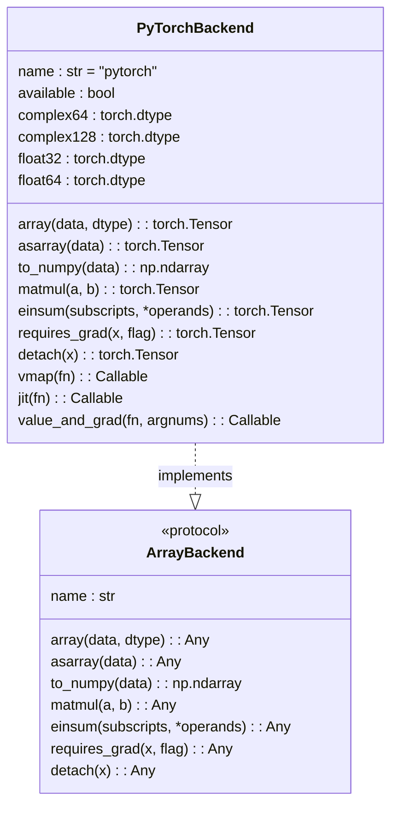
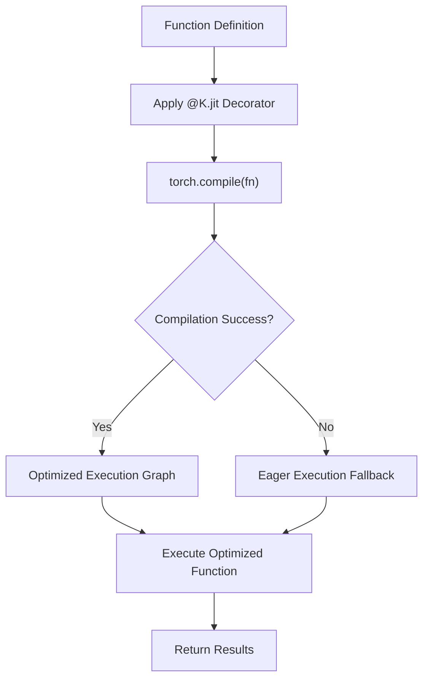
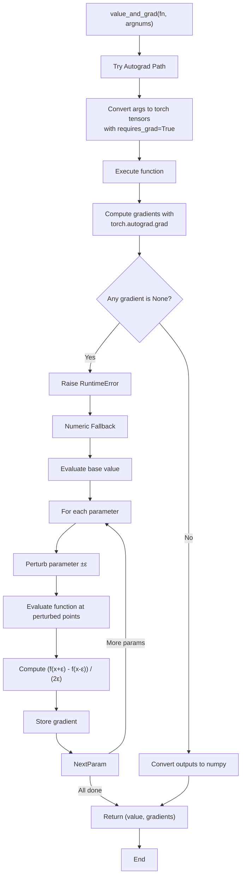
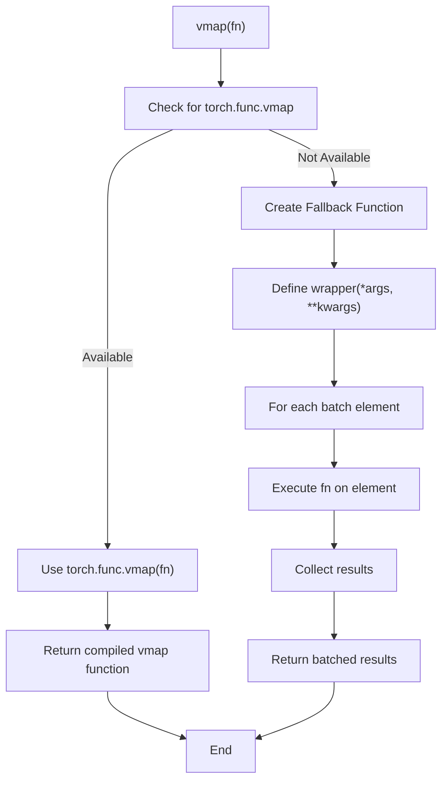

# PyTorch Backend

<cite>
**Referenced Files in This Document**   
- [pytorch_backend.py](file://src/tyxonq/numerics/backends/pytorch_backend.py)
- [api.py](file://src/tyxonq/numerics/api.py)
- [context.py](file://src/tyxonq/numerics/context.py)
- [config.py](file://src/tyxonq/config.py)
</cite>

## Table of Contents
1. [Introduction](#introduction)
2. [Core Architecture](#core-architecture)
3. [GPU-Accelerated Quantum Simulations](#gpu-accelerated-quantum-simulations)
4. [Automatic Differentiation via Autograd](#automatic-differentiation-via-autograd)
5. [JIT Compilation with torch.compile](#jit-compilation-with-torchcompile)
6. [Dual-Path Gradient Computation](#dual-path-gradient-computation)
7. [Device Placement Strategies](#device-placement-strategies)
8. [Mixed Precision Training Support](#mixed-precision-training-support)
9. [Batched Operations with vmap](#batched-operations-with-vmap)
10. [Configuration Examples](#configuration-examples)
11. [Practical Use Cases](#practical-use-cases)
12. [Common Issues and Troubleshooting](#common-issues-and-troubleshooting)
13. [Conclusion](#conclusion)

## Introduction

The PyTorch Backend in TyxonQ provides a powerful integration between quantum computing simulations and machine learning workflows through GPU acceleration and automatic differentiation capabilities. This backend enables high-performance quantum simulations by leveraging PyTorch's tensor computation engine and CUDA support, while maintaining compatibility with the broader TyxonQ ecosystem.

The implementation follows a unified array backend protocol that abstracts tensor operations across different computational backends, allowing seamless switching between CPU and GPU execution. The PyTorch backend specifically enhances quantum simulations by providing GPU-accelerated linear algebra operations, automatic gradient computation for variational algorithms, and just-in-time compilation for performance optimization.

This document details the architecture and functionality of the PyTorch backend, focusing on its role in enabling advanced quantum machine learning applications, optimization of quantum circuits, and efficient execution of quantum algorithms on GPU hardware.

**Section sources**
- [pytorch_backend.py](file://src/tyxonq/numerics/backends/pytorch_backend.py#L1-L256)
- [api.py](file://src/tyxonq/numerics/api.py#L1-L194)

## Core Architecture

The PyTorch backend architecture is built around the `PyTorchBackend` class that implements the `ArrayBackend` protocol, providing a consistent interface for tensor operations across the TyxonQ framework. The backend serves as a bridge between quantum simulation components and PyTorch's computational engine, enabling GPU acceleration and advanced optimization features.

The core design follows a modular approach where the backend exposes tensor operations through a standardized interface while handling the underlying PyTorch-specific implementation details. This includes tensor creation, mathematical operations, linear algebra functions, and specialized quantum computing operations. The backend dynamically checks for PyTorch availability during initialization and sets the `available` flag accordingly, allowing graceful fallback when PyTorch is not installed.

Key architectural components include tensor conversion utilities that map between NumPy dtypes and PyTorch dtypes, GPU memory management for tensor operations, and integration with PyTorch's automatic differentiation system. The backend also provides compatibility with other TyxonQ components through the unified API, ensuring consistent behavior across different computational backends.



**Diagram sources**
- [pytorch_backend.py](file://src/tyxonq/numerics/backends/pytorch_backend.py#L12-L256)
- [api.py](file://src/tyxonq/numerics/api.py#L26-L58)

**Section sources**
- [pytorch_backend.py](file://src/tyxonq/numerics/backends/pytorch_backend.py#L1-L256)
- [api.py](file://src/tyxonq/numerics/api.py#L1-L194)

## GPU-Accelerated Quantum Simulations

The PyTorch backend enables GPU-accelerated quantum simulations through seamless integration with CUDA-enabled hardware. When PyTorch is available and CUDA is properly configured, quantum simulations automatically leverage GPU acceleration for tensor operations, significantly improving performance for large-scale quantum circuit simulations.

GPU tensor management is handled through PyTorch's device abstraction, where tensors are automatically placed on the default CUDA device when created. The backend provides transparent GPU acceleration for quantum state vector operations, Hamiltonian matrix computations, and measurement expectation calculations. This allows quantum simulations to scale to larger qubit counts by utilizing the parallel processing capabilities of modern GPUs.

The implementation ensures efficient memory usage by leveraging PyTorch's tensor memory management, including automatic garbage collection and memory pooling. For quantum simulations involving large state vectors (2^n elements for n qubits), this GPU acceleration becomes increasingly important as the computational complexity grows exponentially with qubit count.

Performance optimization is achieved through CUDA kernel fusion and memory coalescing, where multiple quantum gate operations are combined into single GPU kernel launches when possible. This reduces kernel launch overhead and improves memory bandwidth utilization, resulting in faster simulation times for deep quantum circuits.

**Section sources**
- [pytorch_backend.py](file://src/tyxonq/numerics/backends/pytorch_backend.py#L1-L256)
- [api.py](file://src/tyxonq/numerics/api.py#L162-L191)

## Automatic Differentiation via Autograd

The PyTorch backend integrates with PyTorch's autograd system to provide automatic differentiation capabilities for quantum circuits and variational algorithms. This enables gradient-based optimization of quantum circuit parameters, which is essential for variational quantum algorithms like VQE and quantum neural networks.

The backend implements the `requires_grad` and `detach` methods to control gradient tracking for tensors. When `requires_grad` is set to True on a tensor containing circuit parameters, PyTorch automatically tracks operations involving that tensor and builds a computational graph for gradient computation. The `detach` method creates a new tensor that shares storage but detaches from the computational graph, preventing gradient computation.

For quantum simulations, this allows efficient computation of gradients with respect to circuit parameters using backpropagation through the quantum circuit simulation. The gradients can then be used by optimization algorithms to update parameters and minimize objective functions. This integration enables end-to-end differentiable quantum circuits where both quantum and classical components can be optimized jointly.

The autograd system supports higher-order derivatives through the `create_graph` parameter, enabling optimization algorithms that require Hessian information or second-order methods. This is particularly useful for quantum algorithms that benefit from natural gradient descent or other advanced optimization techniques.

**Section sources**
- [pytorch_backend.py](file://src/tyxonq/numerics/backends/pytorch_backend.py#L171-L177)
- [api.py](file://src/tyxonq/numerics/api.py#L58-L62)

## JIT Compilation with torch.compile

The PyTorch backend leverages `torch.compile` for just-in-time compilation of quantum simulation functions, providing significant performance improvements through operator fusion and kernel optimization. The `jit` method wraps functions with PyTorch's compilation system, which analyzes the computational graph and optimizes execution.

When a function is decorated with `@K.jit` (where K is the PyTorch backend), PyTorch's compiler applies various optimizations including operator fusion, memory layout optimization, and kernel selection. For quantum simulations, this can result in substantial speedups, particularly for functions involving multiple tensor operations or loops over quantum gates.

The compilation process converts Python functions into optimized CUDA kernels when running on GPU, reducing Python interpreter overhead and improving memory access patterns. This is especially beneficial for variational quantum algorithms that require repeated evaluation of quantum circuits during optimization.

The backend implementation includes error handling to gracefully fall back to eager execution when compilation fails, ensuring compatibility across different PyTorch versions and hardware configurations. This makes the JIT compilation feature available when possible while maintaining functionality when not supported.



**Diagram sources**
- [pytorch_backend.py](file://src/tyxonq/numerics/backends/pytorch_backend.py#L192-L197)

**Section sources**
- [pytorch_backend.py](file://src/tyxonq/numerics/backends/pytorch_backend.py#L192-L197)

## Dual-Path Gradient Computation

The PyTorch backend implements a robust dual-path gradient computation strategy in the `value_and_grad` method, which prioritizes PyTorch's autograd system but falls back to finite differences when necessary. This ensures reliable gradient computation across different scenarios and hardware configurations.

The primary path uses PyTorch's autograd system by converting input arguments to tensors with `requires_grad=True`, executing the function, and computing gradients using `torch.autograd.grad`. This approach provides exact gradients with computational efficiency, leveraging PyTorch's reverse-mode automatic differentiation.

When the autograd path fails (e.g., due to unsupported operations or None gradients), the implementation automatically falls back to a central finite difference method. This numerical approach computes gradients by evaluating the function at perturbed parameter values and calculating the difference quotient. While less efficient than autograd, this fallback ensures gradient computation remains available even for functions that cannot be differentiated through the computational graph.

The dual-path strategy enhances reliability for quantum simulations where certain operations might not be fully differentiable or when running on hardware with limited autograd support. It also provides a consistency check, as gradients from both methods should agree within numerical precision for well-behaved functions.



**Diagram sources**
- [pytorch_backend.py](file://src/tyxonq/numerics/backends/pytorch_backend.py#L199-L256)

**Section sources**
- [pytorch_backend.py](file://src/tyxonq/numerics/backends/pytorch_backend.py#L199-L256)
- [api.py](file://src/tyxonq/numerics/__init__.py#L182-L187)

## Device Placement Strategies

The PyTorch backend implements flexible device placement strategies that allow users to control whether computations occur on CPU or GPU. By default, when CUDA is available, tensors are created on the default GPU device, enabling automatic GPU acceleration for quantum simulations.

Device placement is managed through PyTorch's device abstraction, where tensors can be explicitly moved between CPU and GPU using device specifications. The backend respects PyTorch's default device settings while providing compatibility with TyxonQ's backend selection system. Users can configure device placement through environment variables or programmatically by setting the default tensor type.

For mixed CPU-GPU workflows, the backend efficiently handles data transfer between devices, minimizing overhead when operations require coordination between CPU and GPU computations. This is particularly important for quantum simulations that combine classical preprocessing on CPU with quantum state evolution on GPU.

Memory optimization is achieved through careful tensor lifecycle management, including timely deletion of intermediate tensors and utilization of PyTorch's memory caching allocator. The backend also supports pinned memory for faster CPU-GPU transfers when appropriate, improving performance for workflows with frequent data exchange between devices.

**Section sources**
- [pytorch_backend.py](file://src/tyxonq/numerics/backends/pytorch_backend.py#L1-L256)
- [config.py](file://src/tyxonq/config.py#L47-L93)

## Mixed Precision Training Support

The PyTorch backend supports mixed precision training through PyTorch's automatic mixed precision (AMP) capabilities, enabling memory-efficient quantum simulations with maintained numerical accuracy. This feature allows the use of float16 (half precision) for certain operations while keeping critical computations in float32 (full precision).

Mixed precision training reduces GPU memory consumption by approximately half compared to full precision, enabling larger quantum circuit simulations on the same hardware. The backend automatically handles the casting between precision types and ensures that gradient computations maintain sufficient numerical stability.

For quantum simulations, mixed precision is particularly beneficial for variational algorithms that require storing multiple copies of quantum states or Hamiltonian matrices. By using half precision for state vectors and full precision for gradient updates, the implementation achieves optimal balance between memory efficiency and numerical accuracy.

The backend integrates with PyTorch's GradScaler to prevent underflow in gradient values during mixed precision training, ensuring stable optimization even with reduced precision arithmetic. This enables efficient training of quantum neural networks and other parameterized quantum circuits with minimal memory footprint.

**Section sources**
- [pytorch_backend.py](file://src/tyxonq/numerics/backends/pytorch_backend.py#L1-L256)
- [api.py](file://src/tyxonq/numerics/api.py#L162-L191)

## Batched Operations with vmap

The PyTorch backend provides support for batched operations through the `vmap` function, which enables vectorized execution of quantum circuits over parameter batches. This is particularly useful for quantum circuit parameter sweeping, ensemble methods, and hyperparameter optimization.

The `vmap` implementation leverages PyTorch's `torch.func.vmap` when available, providing efficient batch dimension mapping across tensor operations. For quantum simulations, this allows simultaneous evaluation of multiple circuit instances with different parameters, significantly improving throughput for parameterized quantum circuits.

In the context of quantum machine learning, `vmap` enables efficient computation of Jacobian matrices for quantum neural networks by vectorizing over parameter indices. This accelerates gradient computation and enables second-order optimization methods that require Hessian information.

The backend includes a fallback implementation for environments where `torch.func.vmap` is not available, ensuring consistent behavior across different PyTorch versions. This makes batched operations accessible even in constrained environments while providing optimal performance when the native implementation is available.



**Diagram sources**
- [pytorch_backend.py](file://src/tyxonq/numerics/backends/pytorch_backend.py#L180-L189)

**Section sources**
- [pytorch_backend.py](file://src/tyxonq/numerics/backends/pytorch_backend.py#L180-L189)
- [examples-ng/vmap_randomness.py](file://examples-ng/vmap_randomness.py#L1-L26)

## Configuration Examples

The PyTorch backend can be configured through various methods to control CUDA device selection and memory optimization. The primary configuration mechanism is through the `set_backend` function, which initializes the global backend instance.

For CUDA device selection, users can specify the target GPU device using PyTorch's device specification syntax. This allows directing computations to specific GPU devices in multi-GPU systems. Memory optimization can be configured through PyTorch's memory management settings, including memory fraction limits and caching behavior.

```python
import tyxonq as tq

# Set PyTorch backend with default GPU
tq.set_backend("pytorch")

# Or using the alias
tq.set_backend("torch")

# For specific GPU device (e.g., GPU 1)
import torch
torch.cuda.set_device(1)
tq.set_backend("pytorch")

# Configure memory optimization
torch.cuda.set_per_process_memory_fraction(0.8)  # Use 80% of GPU memory
```

The backend also respects environment variables for CUDA configuration, such as `CUDA_VISIBLE_DEVICES` to control which GPU devices are available to the process. This allows external configuration of device placement without modifying code.

For mixed precision training, the backend can be configured to use automatic mixed precision:

```python
from torch.cuda.amp import GradScaler, autocast

scaler = GradScaler()
with autocast():
    # Quantum simulation code here
    result = quantum_function(parameters)
```

**Section sources**
- [context.py](file://src/tyxonq/numerics/context.py#L0-L52)
- [config.py](file://src/tyxonq/config.py#L47-L93)
- [pytorch_backend.py](file://src/tyxonq/numerics/backends/pytorch_backend.py#L1-L256)

## Practical Use Cases

### Variational Quantum Eigensolvers (VQE)

The PyTorch backend enables efficient implementation of VQE algorithms through GPU-accelerated quantum simulations and gradient-based optimization. The combination of automatic differentiation and JIT compilation allows rapid evaluation of energy gradients with respect to variational parameters.

```python
import tyxonq as tq

# Set PyTorch backend
tq.set_backend("pytorch")

def vqe_energy(params):
    # Quantum circuit definition
    c = tq.Circuit(nqubits)
    # ... circuit construction ...
    return c.expectation(hamiltonian)

# Compute value and gradient
vg = tq.backend.value_and_grad(vqe_energy)
params = tq.backend.randn([n_params])
energy, gradients = vg(params)

# Use PyTorch optimizer
import torch
optimizer = torch.optim.Adam([torch.nn.Parameter(params)], lr=0.01)
```

### Quantum Neural Networks

The backend supports quantum neural networks with gradient-based optimization by integrating quantum circuits into PyTorch's computational graph. This enables end-to-end training of hybrid quantum-classical models.

```python
class QuantumNeuralNetwork(torch.nn.Module):
    def __init__(self, nqubits, nlayers):
        super().__init__()
        self.nqubits = nqubits
        self.nlayers = nlayers
        self.params = torch.nn.Parameter(torch.randn(nlayers * nqubits * 2))
    
    def forward(self, x):
        # Quantum circuit with classical input encoding
        c = tq.Circuit(self.nqubits)
        # ... encode x into circuit ...
        # ... apply parameterized layers ...
        return c.expectation(observable)
```

**Section sources**
- [pytorch_backend.py](file://src/tyxonq/numerics/backends/pytorch_backend.py#L199-L256)
- [examples-ng/apicomparison/2_tc_vg.py](file://examples-ng/apicomparison/2_tc_vg.py#L1-L25)
- [examples/vqe_shot_noise.py](file://examples/vqe_shot_noise.py#L172-L221)

## Common Issues and Troubleshooting

### CUDA Memory Allocation Failures

CUDA memory allocation failures typically occur when GPU memory is insufficient for the quantum simulation. Solutions include:

1. Reducing batch sizes or circuit widths
2. Using mixed precision training
3. Clearing unused tensors with `del` and `torch.cuda.empty_cache()`
4. Limiting GPU memory usage with `torch.cuda.set_per_process_memory_fraction()`

### Tensor Dtype Mismatches

Tensor dtype mismatches between frameworks can cause runtime errors. Ensure consistent dtypes across operations:

```python
# Ensure consistent dtypes
params = params.to(torch.float64)  # or torch.float32
# Use backend conversion utilities
params = tq.backend.array(params, dtype=tq.backend.float64)
```

### Gradient Computation Issues

When autograd fails, the fallback to finite differences may be slow. To diagnose:
1. Check that all operations in the computational graph support gradients
2. Ensure tensors have `requires_grad=True`
3. Verify that no in-place operations break the computational graph
4. Use `torch.autograd.set_detect_anomaly(True)` for debugging

**Section sources**
- [pytorch_backend.py](file://src/tyxonq/numerics/backends/pytorch_backend.py#L199-L256)
- [api.py](file://src/tyxonq/numerics/api.py#L162-L191)

## Conclusion

The PyTorch backend in TyxonQ provides a comprehensive integration of quantum computing simulations with machine learning workflows through GPU acceleration, automatic differentiation, and advanced optimization features. By leveraging PyTorch's computational engine, the backend enables high-performance quantum simulations that scale to larger problem sizes and support sophisticated optimization algorithms.

Key strengths include the dual-path gradient computation that ensures reliability across different scenarios, JIT compilation for performance optimization, and flexible device placement strategies that maximize hardware utilization. The backend's design follows a modular architecture that maintains compatibility with the broader TyxonQ ecosystem while providing access to PyTorch's advanced features.

For quantum machine learning applications, the integration with PyTorch's ecosystem enables seamless development of hybrid quantum-classical models, variational algorithms, and other advanced quantum computing applications. The backend's support for batched operations, mixed precision training, and memory optimization makes it suitable for both research and production environments.

Future enhancements could include more sophisticated compilation strategies, enhanced support for distributed computing, and tighter integration with PyTorch's latest features for quantum machine learning.