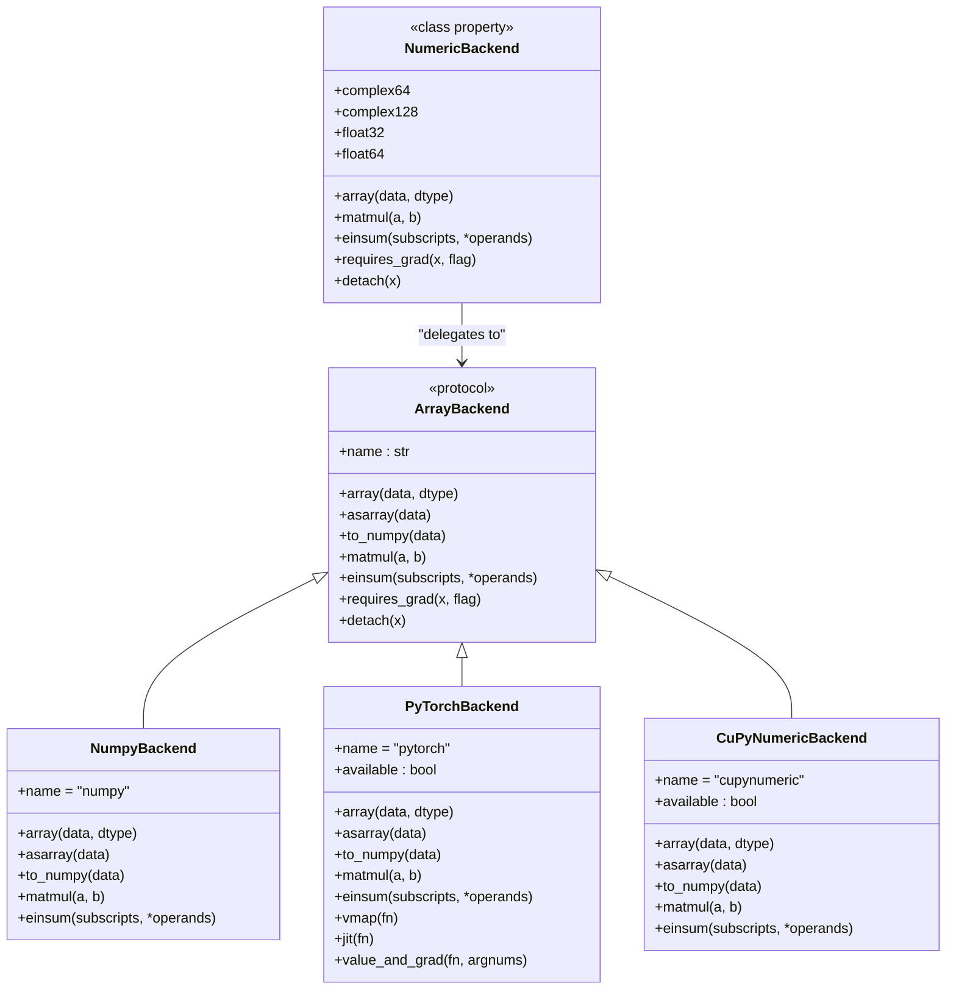
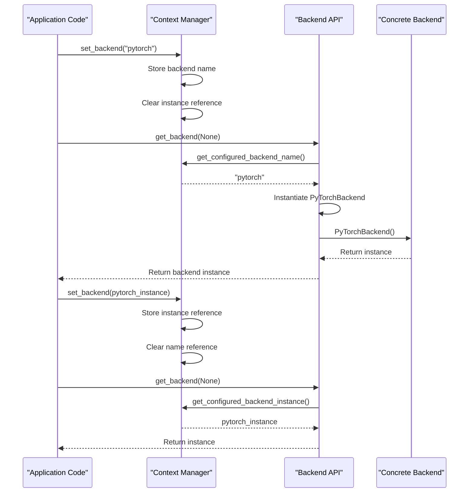
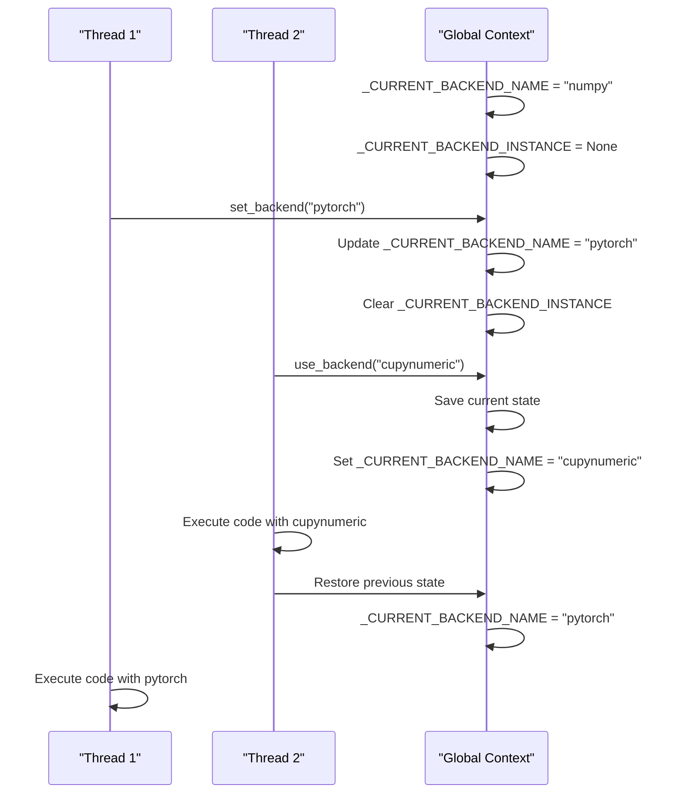

# Context Management System

<cite>
**Referenced Files in This Document**   
- [context.py](file://src/tyxonq/numerics/context.py)
- [api.py](file://src/tyxonq/numerics/api.py)
- [config.py](file://src/tyxonq/config.py)
- [numpy_backend.py](file://src/tyxonq/numerics/backends/numpy_backend.py)
- [pytorch_backend.py](file://src/tyxonq/numerics/backends/pytorch_backend.py)
- [cupynumeric_backend.py](file://src/tyxonq/numerics/backends/cupynumeric_backend.py)
- [__init__.py](file://src/tyxonq/numerics/__init__.py)
</cite>

## Table of Contents
1. [Introduction](#introduction)
2. [Core Components](#core-components)
3. [Backend Selection Mechanism](#backend-selection-mechanism)
4. [Lazy Resolution Strategy](#lazy-resolution-strategy)
5. [Context Management in Multi-Threaded Environments](#context-management-in-multi-threaded-environments)
6. [Integration with Configuration and Environment](#integration-with-configuration-and-environment)
7. [Common Issues and Debugging](#common-issues-and-debugging)
8. [Best Practices](#best-practices)
9. [Conclusion](#conclusion)

## Introduction
The Context Management System in TyxonQ's numerics backend provides a flexible and robust mechanism for managing numerical computation backends across different execution environments. This system enables seamless switching between computational backends such as NumPy, PyTorch, and CuPyNumeric, supporting both application-level and library-level use cases. The design prioritizes ease of use while maintaining the flexibility required for advanced computational workflows in quantum computing applications.

**Section sources**
- [context.py](file://src/tyxonq/numerics/context.py#L1-L53)
- [api.py](file://src/tyxonq/numerics/api.py#L1-L195)

## Core Components

The Context Management System consists of several key components that work together to provide a cohesive backend management experience. The system is built around a global state management pattern that allows for both named backend selection and direct instance pinning. The core functionality is distributed across the context module, which handles state management, and the API module, which provides the factory pattern for backend instantiation.

The system supports three primary backend implementations: NumPy for CPU-based computations, PyTorch for GPU-accelerated tensor operations with autodiff capabilities, and CuPyNumeric for GPU/accelerated computing. Each backend implements a common ArrayBackend protocol that ensures consistent interface exposure regardless of the underlying implementation.



**Diagram sources**
- [api.py](file://src/tyxonq/numerics/api.py#L15-L150)
- [numpy_backend.py](file://src/tyxonq/numerics/backends/numpy_backend.py#L1-L165)
- [pytorch_backend.py](file://src/tyxonq/numerics/backends/pytorch_backend.py#L1-L259)
- [cupynumeric_backend.py](file://src/tyxonq/numerics/backends/cupynumeric_backend.py#L1-L255)
- [__init__.py](file://src/tyxonq/numerics/__init__.py#L1-L197)

**Section sources**
- [api.py](file://src/tyxonq/numerics/api.py#L15-L150)
- [numpy_backend.py](file://src/tyxonq/numerics/backends/numpy_backend.py#L1-L165)
- [pytorch_backend.py](file://src/tyxonq/numerics/backends/pytorch_backend.py#L1-L259)
- [cupynumeric_backend.py](file://src/tyxonq/numerics/backends/cupynumeric_backend.py#L1-L255)

## Backend Selection Mechanism

The backend selection mechanism in TyxonQ provides two complementary approaches for specifying the computational backend: named selection and direct instance pinning. The `set_backend` function serves as the primary interface for configuring the global backend context. When a string identifier (e.g., 'pytorch') is passed to `set_backend`, it configures the system to use lazy resolution, where the actual backend instance is created only when first accessed through `get_backend`. This approach allows for configuration without immediate dependency resolution.

Alternatively, when a pre-instantiated backend object is passed to `set_backend`, the system pins that exact instance for all subsequent operations. This direct instance pinning is particularly useful for advanced use cases where custom backend configurations are required, such as when specific random number generator states or memory allocation strategies need to be preserved across computations.

The system also provides the `NumericBackend` class, which acts as a class-level proxy to the current backend, exposing all backend methods as class methods. This allows for convenient access to backend functionality without explicitly managing backend instances in application code.



**Diagram sources**
- [context.py](file://src/tyxonq/numerics/context.py#L17-L29)
- [api.py](file://src/tyxonq/numerics/api.py#L159-L191)
- [__init__.py](file://src/tyxonq/numerics/__init__.py#L55-L197)

**Section sources**
- [context.py](file://src/tyxonq/numerics/context.py#L17-L29)
- [api.py](file://src/tyxonq/numerics/api.py#L159-L191)
- [__init__.py](file://src/tyxonq/numerics/__init__.py#L55-L197)

## Lazy Resolution Strategy

The lazy resolution strategy is a core feature of TyxonQ's context management system, designed to optimize resource utilization and improve startup performance. When a backend is configured by name rather than by instance, the system defers the actual instantiation and initialization of the backend until the first time it is accessed through `get_backend`. This approach provides several benefits: it avoids unnecessary import and initialization costs for backends that may never be used, allows for configuration before all dependencies are available, and enables dynamic backend selection based on runtime conditions.

The resolution process follows a specific priority order: first checking for a configured backend instance, then falling back to a configured backend name, and finally defaulting to the NumPy backend if no configuration is present. This cascading resolution ensures predictable behavior while maintaining flexibility for different deployment scenarios.

```mermaid
flowchart TD
Start([get_backend(name)]) --> CheckName{"name is None?"}
CheckName --> |Yes| CheckInstance{"Instance configured?"}
CheckInstance --> |Yes| ReturnInstance["Return configured instance"]
CheckInstance --> |No| CheckNameConfig{"Name configured?"}
CheckNameConfig --> |Yes| ResolveByName["Resolve by configured name"]
CheckNameConfig --> |No| DefaultToNumpy["Return NumPy backend"]
CheckName --> |No| ResolveByNameExplicit["Resolve by provided name"]
ResolveByName --> ValidateBackend["Validate backend availability"]
ResolveByNameExplicit --> ValidateBackend
ValidateBackend --> |Valid| InstantiateBackend["Instantiate backend"]
ValidateBackend --> |Invalid| RaiseError["Raise RuntimeError"]
InstantiateBackend --> ReturnBackend["Return backend instance"]
ReturnInstance --> End([Return])
ReturnBackend --> End
DefaultToNumpy --> End
RaiseError --> End
```

**Diagram sources**
- [api.py](file://src/tyxonq/numerics/api.py#L159-L191)
- [context.py](file://src/tyxonq/numerics/context.py#L38-L52)

**Section sources**
- [api.py](file://src/tyxonq/numerics/api.py#L159-L191)
- [context.py](file://src/tyxonq/numerics/context.py#L38-L52)

## Context Management in Multi-Threaded Environments

The context management system provides thread-safe operations for backend configuration through the use of global state variables and context managers. The `use_backend` context manager enables temporary backend configuration within a specific code block, ensuring that the previous configuration is restored upon exit, even in the presence of exceptions. This is particularly valuable in multi-threaded environments and Jupyter notebooks where different code cells or threads may require different backend configurations.

In Jupyter notebook environments, the context manager pattern allows for experimentation with different backends within individual cells without affecting the global configuration. This enables researchers to compare performance characteristics of different backends on the same computational problem without the need for kernel restarts or complex state management.



**Diagram sources**
- [context.py](file://src/tyxonq/numerics/context.py#L38-L52)
- [api.py](file://src/tyxonq/numerics/api.py#L159-L191)

**Section sources**
- [context.py](file://src/tyxonq/numerics/context.py#L38-L52)

## Integration with Configuration and Environment

The context management system integrates with configuration files and environment variables to support persistent settings across application sessions. Backend preferences can be established through configuration files, which are processed at application startup to set the default backend. Environment variables provide an additional layer of configuration that can override file-based settings, enabling deployment-specific configurations without modifying configuration files.

The system also supports backend name normalization through the `normalize_backend_name` function in the config module, which maps common aliases (such as 'cpu', 'gpu', 'torch', 'pt') to their canonical backend names. This normalization ensures consistent behavior regardless of the specific naming convention used in configuration files or environment variables.

**Section sources**
- [config.py](file://src/tyxonq/config.py#L47-L93)
- [context.py](file://src/tyxonq/numerics/context.py#L17-L29)

## Common Issues and Debugging

Several common issues can arise when working with the context management system, particularly in distributed computing environments. Backend conflicts may occur when different components of a distributed system attempt to configure different backends simultaneously. Thread safety concerns can emerge when multiple threads modify the global backend state without proper synchronization, though the current implementation uses Python's GIL to provide basic protection.

Debugging backend selection problems typically involves verifying the current backend configuration through the `get_backend` function and checking for proper backend availability. The system raises descriptive RuntimeError exceptions when requested backends are not available, which can help identify missing dependencies or configuration issues. For complex debugging scenarios, examining the global state variables `_CURRENT_BACKEND_INSTANCE` and `_CURRENT_BACKEND_NAME` in the context module can provide insight into the current configuration state.

**Section sources**
- [api.py](file://src/tyxonq/numerics/api.py#L170-L191)
- [context.py](file://src/tyxonq/numerics/context.py#L1-L53)

## Best Practices

When managing backend context in library development versus application code, different best practices apply. For library development, it is recommended to avoid modifying the global backend state and instead accept backend instances as parameters or use the lazy resolution mechanism to respect the application's configured backend. This approach ensures that libraries integrate smoothly with applications without imposing specific backend requirements.

For application code, establishing the backend configuration early in the application lifecycle is recommended, preferably before importing other components that may access the backend. When working in multi-threaded environments, using the `use_backend` context manager is preferred over global state modifications to prevent interference between threads. For performance-critical applications, direct instance pinning can reduce the overhead of repeated backend resolution, while the lazy resolution strategy is generally preferred for development and experimentation due to its flexibility.

**Section sources**
- [context.py](file://src/tyxonq/numerics/context.py#L17-L52)
- [api.py](file://src/tyxonq/numerics/api.py#L159-L191)
- [__init__.py](file://src/tyxonq/numerics/__init__.py#L55-L197)

## Conclusion

The Context Management System in TyxonQ's numerics backend provides a comprehensive solution for managing computational backends in quantum computing applications. Through its flexible backend selection mechanism, lazy resolution strategy, and robust context management features, the system enables efficient and reliable numerical computations across diverse hardware and software environments. The integration of configuration management, thread safety considerations, and debugging support makes it suitable for both research and production use cases, while the clear separation between library and application concerns promotes maintainable and interoperable code.