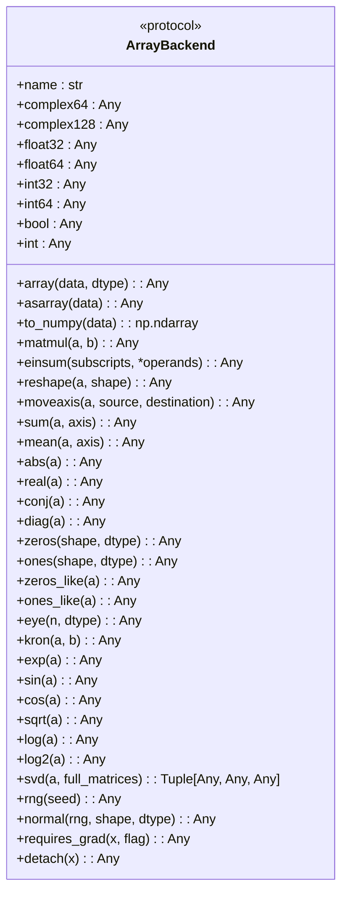
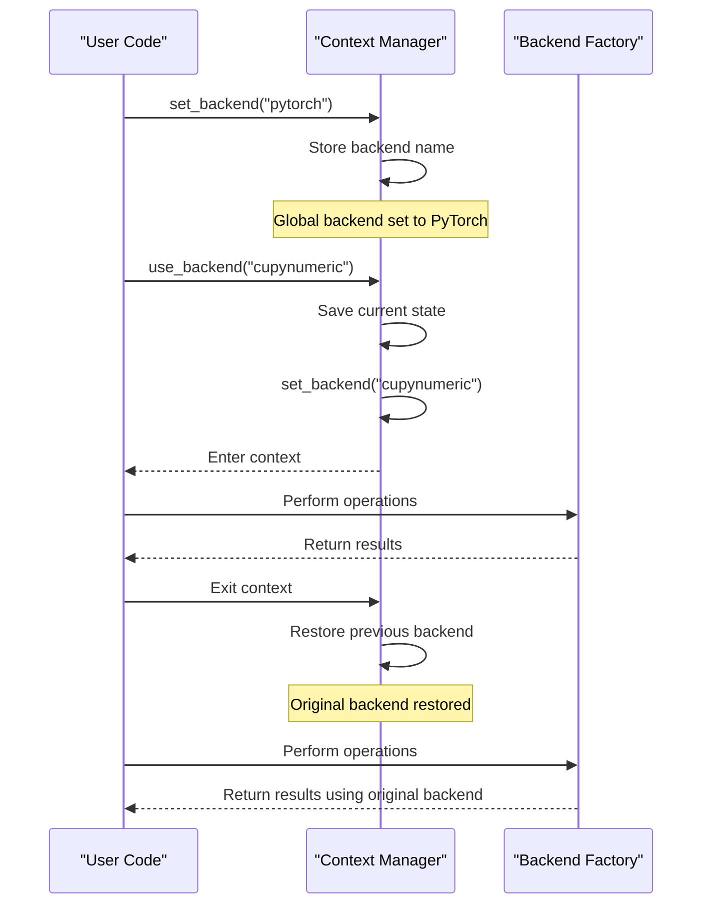
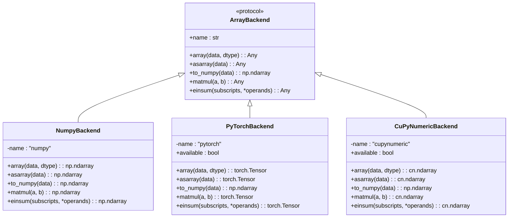
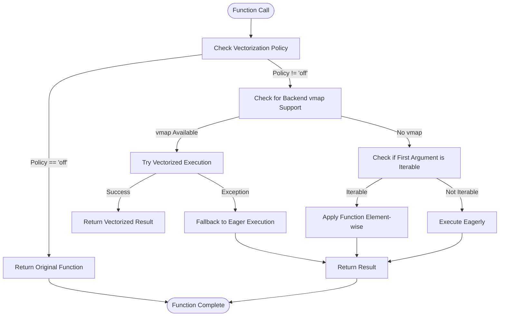
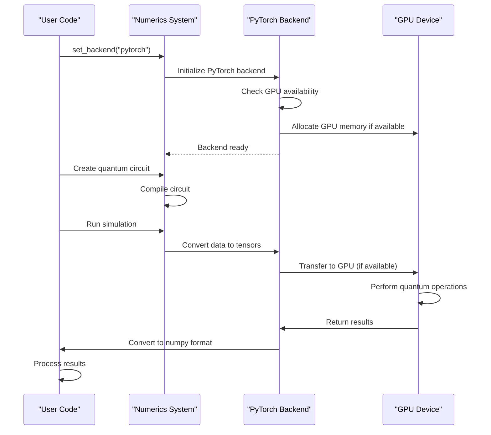

# Numerics Backend System

<cite>
**Referenced Files in This Document**   
- [api.py](file://src/tyxonq/numerics/api.py)
- [context.py](file://src/tyxonq/numerics/context.py)
- [vectorization_checks.py](file://src/tyxonq/numerics/vectorization_checks.py)
- [numpy_backend.py](file://src/tyxonq/numerics/backends/numpy_backend.py)
- [pytorch_backend.py](file://src/tyxonq/numerics/backends/pytorch_backend.py)
- [cupynumeric_backend.py](file://src/tyxonq/numerics/backends/cupynumeric_backend.py)
- [__init__.py](file://src/tyxonq/numerics/__init__.py)
- [aces_for_setting_numeric_backend.py](file://examples-ng/aces_for_setting_numeric_backend.py)
- [aces_test_for_numeric_backend.py](file://examples-ng/aces_test_for_numeric_backend.py)
</cite>

## Table of Contents
1. [Introduction](#introduction)
2. [ArrayBackend Protocol](#arraybackend-protocol)
3. [Context Management System](#context-management-system)
4. [Backend Adapter Implementations](#backend-adapter-implementations)
5. [Vectorization Checks](#vectorization-checks)
6. [GPU Acceleration and Backend Switching](#gpu-acceleration-and-backend-switching)
7. [Integration with Gradient Computation](#integration-with-gradient-computation)
8. [Common Issues and Optimization Strategies](#common-issues-and-optimization-strategies)
9. [Conclusion](#conclusion)

## Introduction
The Numerics Backend System in TyxonQ provides a unified interface for quantum simulations across multiple numerical computing frameworks. This system enables seamless switching between NumPy, PyTorch, and CuPyNumeric backends, allowing users to leverage the strengths of each framework for different computational requirements. The architecture is designed to support both CPU and GPU computations, with special attention to memory management, dtype consistency, and performance optimization for large-scale tensor operations in quantum algorithms.

**Section sources**
- [api.py](file://src/tyxonq/numerics/api.py#L1-L195)
- [context.py](file://src/tyxonq/numerics/context.py#L1-L53)

## ArrayBackend Protocol
The ArrayBackend protocol defines a unified interface for array and tensor operations across different numerical computing frameworks. This protocol ensures consistent behavior regardless of the underlying implementation, enabling backend-agnostic quantum simulations. The protocol includes essential mathematical operations such as matrix multiplication, Einstein summation, array reshaping, and linear algebra functions.

The protocol is implemented as a Python Protocol class that specifies required methods and attributes. Key components include array creation and conversion methods (array, asarray, to_numpy), algebraic operations (matmul, einsum, reshape), elementary mathematical functions (exp, sin, cos, sqrt), and autodiff bridge methods (requires_grad, detach). The protocol also includes optional vectorization support through the vmap method, allowing for efficient batch processing of quantum operations.

**Diagram sources**
- [api.py](file://src/tyxonq/numerics/api.py#L18-L101)

**Section sources**
- [api.py](file://src/tyxonq/numerics/api.py#L18-L101)

## Context Management System
The context management system provides global backend selection and configuration through a simple interface. This system allows users to set a default backend that will be used throughout the application unless explicitly overridden. The system uses global state variables to store the current backend configuration, with functions to set and retrieve the backend instance or name.

The `set_backend` function allows users to specify a backend by name (e.g., "numpy", "pytorch", "cupynumeric") or by providing an instance of a backend class. When a name is provided, the backend is lazily resolved when needed, while an instance directly pins that specific backend object for use. The `use_backend` context manager enables temporary backend switching within a specific code block, automatically restoring the previous backend configuration when exiting the context.

**Diagram sources**
- [context.py](file://src/tyxonq/numerics/context.py#L17-L49)

**Section sources**
- [context.py](file://src/tyxonq/numerics/context.py#L1-L53)

## Backend Adapter Implementations
The backend adapter implementations provide concrete classes that bridge the ArrayBackend protocol to specific numerical computing frameworks. Each adapter implements the required methods while leveraging the native capabilities of its underlying framework. The system includes three primary adapters: NumpyBackend, PyTorchBackend, and CuPyNumericBackend.

The NumpyBackend provides CPU-based numerical computations using NumPy arrays. It serves as the default backend and fallback option when other backends are not available. The PyTorchBackend enables GPU acceleration and automatic differentiation through PyTorch tensors, with special handling for gradient computation and GPU memory management. The CuPyNumericBackend provides GPU-accelerated computations through the CuPyNumeric library, offering high-performance operations for large-scale quantum simulations.

Each backend adapter handles data type conversion, memory allocation, and framework-specific optimizations. The adapters also implement framework-appropriate error handling and fallback mechanisms to ensure robust operation across different computing environments.

**Diagram sources**
- [numpy_backend.py](file://src/tyxonq/numerics/backends/numpy_backend.py#L7-L162)
- [pytorch_backend.py](file://src/tyxonq/numerics/backends/pytorch_backend.py#L12-L256)
- [cupynumeric_backend.py](file://src/tyxonq/numerics/backends/cupynumeric_backend.py#L12-L252)

**Section sources**
- [numpy_backend.py](file://src/tyxonq/numerics/backends/numpy_backend.py#L7-L162)
- [pytorch_backend.py](file://src/tyxonq/numerics/backends/pytorch_backend.py#L12-L256)
- [cupynumeric_backend.py](file://src/tyxonq/numerics/backends/cupynumeric_backend.py#L12-L252)

## Vectorization Checks
The vectorization system ensures compatibility across mathematical operations by implementing safety checks and fallback mechanisms. The `vectorize_or_fallback` function wraps operations with vectorization behavior while providing safe fallback to eager execution when needed. This system supports three vectorization policies: "auto", "force", and "off", allowing users to control the vectorization behavior based on their specific requirements.

The system performs heuristic checks to determine whether a function is safe to vectorize, monitoring for warnings that indicate potential issues such as aliasing or in-place operations. When a backend provides a native vmap implementation (like PyTorch), the system attempts to use it first, falling back to element-wise processing if any exceptions occur. For backends without native vmap support, the system emulates vectorization by applying the function element-wise along the leading axis.

**Diagram sources**
- [api.py](file://src/tyxonq/numerics/api.py#L104-L156)
- [vectorization_checks.py](file://src/tyxonq/numerics/vectorization_checks.py#L1-L56)

**Section sources**
- [api.py](file://src/tyxonq/numerics/api.py#L104-L156)
- [vectorization_checks.py](file://src/tyxonq/numerics/vectorization_checks.py#L1-L56)

## GPU Acceleration and Backend Switching
The system supports GPU acceleration through the PyTorch and CuPyNumeric backends, enabling high-performance computation for variational quantum algorithms. Users can switch between backends dynamically using the `set_backend` function or the `use_backend` context manager. This flexibility allows optimization of computational resources based on the specific requirements of different quantum algorithms.

For GPU-accelerated computations, the PyTorch backend automatically manages tensor placement on GPU devices when available, with appropriate fallback to CPU when GPU resources are limited. The CuPyNumeric backend provides similar GPU acceleration with optimized memory management for large-scale tensor operations. Examples demonstrate how to configure and use these backends for variational algorithms, with automatic handling of data transfer between CPU and GPU memory.

**Diagram sources**
- [aces_for_setting_numeric_backend.py](file://examples-ng/aces_for_setting_numeric_backend.py#L1-L51)
- [aces_test_for_numeric_backend.py](file://examples-ng/aces_test_for_numeric_backend.py#L1-L45)

**Section sources**
- [aces_for_setting_numeric_backend.py](file://examples-ng/aces_for_setting_numeric_backend.py#L1-L51)
- [aces_test_for_numeric_backend.py](file://examples-ng/aces_test_for_numeric_backend.py#L1-L45)

## Integration with Gradient Computation
The numerics system integrates with automatic differentiation frameworks through the `value_and_grad` method, enabling efficient gradient computation for variational quantum algorithms. Each backend adapter implements gradient computation according to its capabilities: the NumpyBackend uses finite-difference methods, the PyTorchBackend leverages PyTorch's autograd system, and the CuPyNumericBackend uses numpy-based finite differences.

The system provides a unified interface for gradient computation, abstracting away the underlying implementation details. When using the PyTorch backend, gradients are computed using PyTorch's automatic differentiation, with proper handling of GPU tensors and computational graphs. For other backends, the system falls back to numerical differentiation methods that maintain API consistency while ensuring reliable gradient estimates.

The integration supports both forward and backward mode differentiation, with options to specify which arguments require gradients. This flexibility enables efficient optimization of quantum circuit parameters in variational algorithms, with automatic handling of gradient accumulation and memory management.

**Section sources**
- [pytorch_backend.py](file://src/tyxonq/numerics/backends/pytorch_backend.py#L200-L256)
- [numpy_backend.py](file://src/tyxonq/numerics/backends/numpy_backend.py#L130-L162)
- [cupynumeric_backend.py](file://src/tyxonq/numerics/backends/cupynumeric_backend.py#L200-L252)

## Common Issues and Optimization Strategies
The system addresses several common issues in large-scale quantum simulations, including memory allocation failures on GPU, dtype mismatches, and performance bottlenecks. Memory management strategies include automatic fallback to CPU when GPU memory is insufficient and efficient tensor allocation patterns to minimize memory fragmentation.

For dtype mismatches, the system implements consistent type promotion rules and automatic dtype conversion between different numerical formats. Performance bottlenecks are addressed through optimized tensor operations, intelligent caching of intermediate results, and efficient memory transfer between CPU and GPU devices.

Optimization strategies for large-scale tensor operations include batch processing, operation fusion, and memory-efficient algorithms for common quantum computing patterns. The system also provides profiling tools to identify performance hotspots and memory usage patterns, enabling users to optimize their quantum algorithms for specific hardware configurations.

**Section sources**
- [pytorch_backend.py](file://src/tyxonq/numerics/backends/pytorch_backend.py#L1-L260)
- [cupynumeric_backend.py](file://src/tyxonq/numerics/backends/cupynumeric_backend.py#L1-L256)
- [numpy_backend.py](file://src/tyxonq/numerics/backends/numpy_backend.py#L1-L166)

## Conclusion
The Numerics Backend System in TyxonQ provides a comprehensive solution for backend-agnostic quantum simulations with support for multiple numerical computing frameworks. The system's modular architecture enables seamless switching between NumPy, PyTorch, and CuPyNumeric backends, allowing users to leverage the strengths of each framework for different computational requirements. The unified ArrayBackend protocol ensures consistent behavior across backends, while the context management system simplifies global configuration and temporary backend switching.

The integration with automatic differentiation frameworks and GPU acceleration support makes the system particularly well-suited for variational quantum algorithms and large-scale quantum simulations. The vectorization system and optimization strategies address common performance bottlenecks, while comprehensive error handling and fallback mechanisms ensure robust operation across different computing environments. This flexible and extensible architecture positions TyxonQ as a powerful platform for quantum computing research and development.