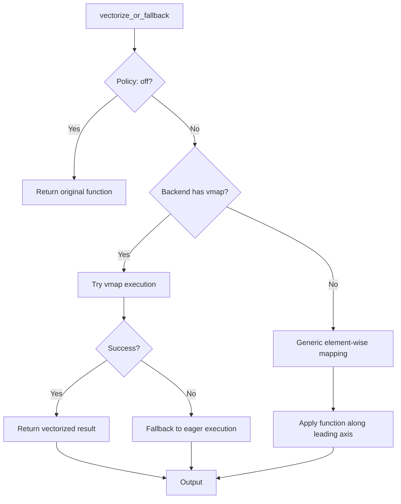
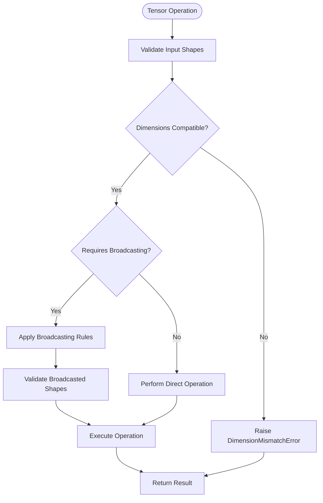

# Vectorization Compatibility System

<cite>
**Referenced Files in This Document**   
- [vectorization_checks.py](file://src/tyxonq/numerics/vectorization_checks.py)
- [api.py](file://src/tyxonq/numerics/api.py)
- [pytorch_backend.py](file://src/tyxonq/numerics/backends/pytorch_backend.py)
- [statevector.py](file://src/tyxonq/libs/quantum_library/kernels/statevector.py)
- [test_numerics_checks.py](file://tests_core_module/test_numerics_checks.py)
</cite>

## Table of Contents
1. [Introduction](#introduction)
2. [Vectorization Safety Checks](#vectorization-safety-checks)
3. [Backend Vectorization Support](#backend-vectorization-support)
4. [Tensor Operation Validation](#tensor-operation-validation)
5. [Testing Framework for Vectorization](#testing-framework-for-vectorization)
6. [Common Vectorization Errors in Quantum Circuits](#common-vectorization-errors-in-quantum-circuits)
7. [vmap Limitations and Fallback Strategies](#vmap-limitations-and-fallback-strategies)
8. [Writing Vectorization-Safe Quantum Algorithms](#writing-vectorization-safe-quantum-algorithms)
9. [Debugging Shape Mismatch Errors](#debugging-shape-mismatch-errors)
10. [Conclusion](#conclusion)

## Introduction
The Vectorization Compatibility System in TyxonQ ensures consistent mathematical operation behavior across different computational backends when executing quantum algorithms. This system provides robust validation mechanisms for tensor operations such as einsum and matmul, with special attention to broadcasting rules and dimension handling in quantum circuit simulations. The framework enables efficient batch processing of parameterized circuits while maintaining numerical correctness and preventing common vectorization pitfalls.

## Vectorization Safety Checks

The system implements heuristic-based safety checks to determine whether functions can be safely vectorized across different backends. The `safe_for_vectorization` function executes a target function with provided arguments and inspects emitted warnings to assess vectorization safety. Functions that generate specific warning types such as "AliasWarning", "CloneRequiredWarning", or mention "in-place" operations are conservatively marked as unsafe for vectorization.

The `warn_as_error` context manager enhances safety checking by converting specified warnings into exceptions, allowing precise detection of potential vectorization issues during testing. This approach enables proactive identification of operations that might behave incorrectly under vectorized execution, particularly those involving memory aliasing or mutable state modifications.

**Section sources**
- [vectorization_checks.py](file://src/tyxonq/numerics/vectorization_checks.py#L7-L25)
- [vectorization_checks.py](file://src/tyxonq/numerics/vectorization_checks.py#L29-L49)

## Backend Vectorization Support

TyxonQ's numerics system supports multiple backends including NumPy, PyTorch, and CuPyNumeric, each with varying vectorization capabilities. The `ArrayBackend` protocol defines a unified interface for array operations, with optional `vmap` support for native vectorization. The `vectorize_or_fallback` function provides a policy-driven approach to vectorization with three modes: "auto" (attempt vectorization with fallback), "force" (require vectorization), and "off" (disable vectorization).

For backends like PyTorch that support `torch.func.vmap`, the system delegates to native vectorization implementations. When native vectorization is unavailable, the system implements a generic fallback that applies functions element-wise along the leading axis. This ensures consistent behavior across backends while maximizing performance on those with optimized vectorization support.

**Diagram sources**
- [api.py](file://src/tyxonq/numerics/api.py#L100-L150)
- [pytorch_backend.py](file://src/tyxonq/numerics/backends/pytorch_backend.py#L240-L250)

**Section sources**
- [api.py](file://src/tyxonq/numerics/api.py#L100-L194)
- [pytorch_backend.py](file://src/tyxonq/numerics/backends/pytorch_backend.py#L240-L260)

## Tensor Operation Validation

The system rigorously validates tensor operations to ensure correct broadcasting and dimension handling. Core quantum operations like statevector evolution use Einstein summation (`einsum`) with explicit index specifications to maintain dimensional consistency. For example, single-qubit gate application uses the specification `ab,cd...b...->cd...a...` where the gate indices (a,b) contract with the appropriate qubit dimension in the statevector.

Matrix multiplication (`matmul`) operations are validated through shape compatibility checks before execution. The system ensures that inner dimensions match for valid matrix products and applies appropriate reshaping when necessary. These validation mechanisms prevent silent broadcasting errors that could lead to incorrect quantum state evolution in parameterized circuits.

**Diagram sources**
- [statevector.py](file://src/tyxonq/libs/quantum_library/kernels/statevector.py#L17-L28)
- [pytorch_backend.py](file://src/tyxonq/numerics/backends/pytorch_backend.py#L100-L110)

**Section sources**
- [statevector.py](file://src/tyxonq/libs/quantum_library/kernels/statevector.py#L17-L54)

## Testing Framework for Vectorization

The testing framework for vectorization correctness combines unit testing with heuristic validation. The `test_safe_for_vectorization_simple` case verifies that benign functions pass the safety check while functions emitting prohibited warnings are correctly flagged as unsafe. The `test_warn_as_error_context` demonstrates how specific warnings can be elevated to exceptions for precise control flow testing.

The framework uses synthetic test cases that simulate common vectorization pitfalls, including memory aliasing scenarios and in-place modification patterns. These tests execute functions under the `safe_for_vectorization` check with representative arguments and validate that the heuristic correctly identifies potentially problematic operations before they are subjected to vectorized execution.

**Section sources**
- [test_numerics_checks.py](file://tests_core_module/test_numerics_checks.py#L0-L22)

## Common Vectorization Errors in Quantum Circuits

Several common errors occur when vectorizing quantum circuit simulations. Shape mismatch errors arise when parameter arrays have incompatible dimensions with circuit expectations, particularly in batched parameterized circuits. Memory aliasing issues can occur when multiple circuit instances share references to mutable state, leading to unintended cross-contamination during vectorized execution.

Broadcasting errors manifest when tensor operations implicitly expand dimensions in unexpected ways, producing incorrect quantum state evolutions. In-place operation hazards occur when vectorized functions modify input arrays, potentially affecting other batch elements. The vectorization compatibility system prevents these errors through pre-execution validation and conservative fallback strategies when safety cannot be guaranteed.

## vmap Limitations and Fallback Strategies

Native vmap support varies significantly across backends, creating compatibility challenges. PyTorch's `torch.func.vmap` has limitations with certain control flow patterns and may not support all tensor operations in the quantum computing context. The system addresses these limitations through a tiered fallback strategy: first attempting native vectorization, then falling back to generic mapping when vmap fails or is unavailable.

The fallback strategy preserves functional correctness at the cost of performance, ensuring that quantum algorithms produce consistent results regardless of backend capabilities. This approach allows users to write vectorization-agnostic code while the system handles backend-specific implementation details transparently.

## Writing Vectorization-Safe Quantum Algorithms

To write vectorization-safe quantum algorithms, developers should follow several key practices. Avoid in-place operations on tensors, as these can lead to aliasing issues under vectorization. Use explicit shape specifications for all tensor operations to prevent ambiguous broadcasting behavior. Design parameter structures with consistent batch dimensions to ensure predictable vectorization behavior.

Prefer immutable data structures and pure functions where possible, as these are inherently safer for vectorization. When working with complex quantum state manipulations, validate tensor shapes at function entry points and use the `safe_for_vectorization` check for custom operations before applying vectorization policies.

## Debugging Shape Mismatch Errors

Shape mismatch errors in parameterized circuits can be debugged systematically by examining tensor dimensions at each processing stage. The system provides diagnostic tools that report input and expected shapes when dimension compatibility checks fail. Developers should verify that parameter arrays have the correct number of dimensions and that batch dimensions align properly across all circuit components.

When encountering shape errors, reduce the problem to a minimal test case with concrete tensor shapes, then trace the evolution of dimensions through each operation. Use the vectorization safety checks to determine whether the issue occurs in scalar or vectorized execution mode, as this can indicate whether the problem stems from broadcasting rules or fundamental shape incompatibilities.

## Conclusion
The Vectorization Compatibility System in TyxonQ provides a robust foundation for executing quantum algorithms across different backends with consistent mathematical behavior. By combining heuristic safety checks, backend-agnostic interfaces, and comprehensive validation of tensor operations, the system enables efficient and correct vectorization of quantum circuit simulations. The framework's fallback strategies ensure reliability even when native vectorization capabilities are limited, while its diagnostic tools help developers write and debug vectorization-safe quantum algorithms.