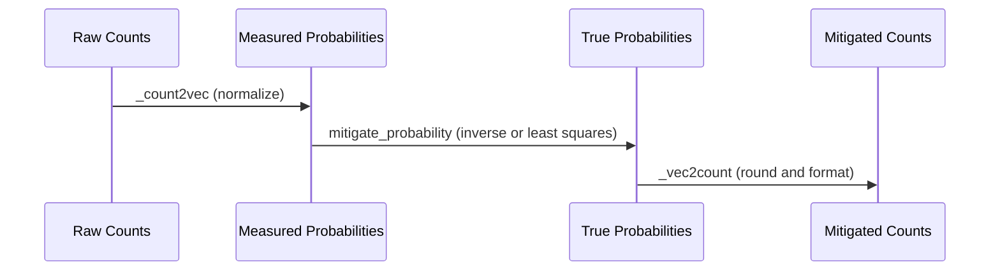
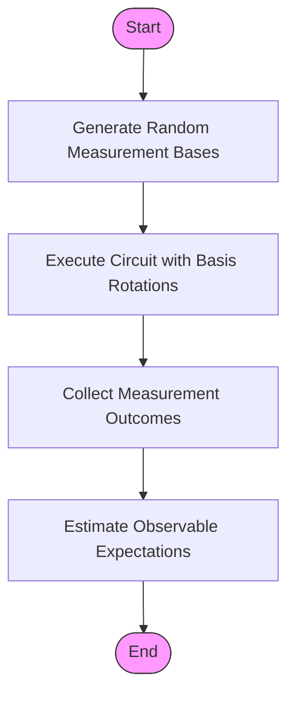
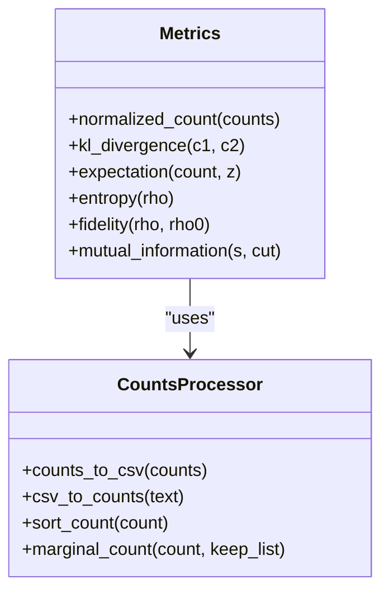

# Postprocessing Layer

<cite>
**Referenced Files in This Document**   
- [counts_expval.py](file://src/tyxonq/postprocessing/counts_expval.py)
- [readout.py](file://src/tyxonq/postprocessing/readout.py)
- [classical_shadows.py](file://src/tyxonq/postprocessing/classical_shadows.py)
- [metrics.py](file://src/tyxonq/postprocessing/metrics.py)
- [error_mitigation.py](file://src/tyxonq/postprocessing/error_mitigation.py)
- [io.py](file://src/tyxonq/postprocessing/io.py)
- [hamiltonian_grouping.py](file://src/tyxonq/libs/hamiltonian_encoding/hamiltonian_grouping.py)
- [readout_mitigation.py](file://examples/readout_mitigation.py)
- [postprocessing.rst](file://docs-ng/source/next/user/postprocessing.rst)
- [TYXONQ_TECHNICAL_WHITEPAPER.md](file://TYXONQ_TECHNICAL_WHITEPAPER.md)
</cite>

## Table of Contents
1. [Introduction](#introduction)
2. [Counts-First Semantics](#counts-first-semantics)
3. [Expectation Value Estimation](#expectation-value-estimation)
4. [Observable Grouping and Shot Allocation](#observable-grouping-and-shot-allocation)
5. [Error Mitigation Techniques](#error-mitigation-techniques)
6. [Readout Error Correction](#readout-error-correction)
7. [Classical Shadows for Noise Resilience](#classical-shadows-for-noise-resilience)
8. [Metrics System](#metrics-system)
9. [Integration with Variational Workflows](#integration-with-variational-workflows)
10. [Common Issues and Guidance](#common-issues-and-guidance)

## Introduction
The Postprocessing Layer in TyxonQ serves as a critical component for transforming raw quantum measurement outcomes into meaningful physical quantities. This layer implements counts-first semantics, ensuring consistent handling of measurement data across different quantum devices and simulators. The postprocessing pipeline enables accurate expectation value calculation, error mitigation, and performance evaluation, forming the bridge between quantum execution and scientific interpretation.

**Section sources**
- [postprocessing.rst](file://docs-ng/source/next/user/postprocessing.rst#L0-L3)
- [TYXONQ_TECHNICAL_WHITEPAPER.md](file://TYXONQ_TECHNICAL_WHITEPAPER.md#L47-L51)

## Counts-First Semantics
TyxonQ implements a counts-first approach to quantum measurement processing, where all device drivers return measurement results in a uniform counts format. This design ensures cross-vendor consistency and decouples hardware-specific measurement collection from the subsequent mathematical processing. The raw counts—histograms of bitstring outcomes—are then processed by the postprocessing layer to compute expectation values and other derived quantities.

This architecture provides several advantages:
- **Uniform interface**: All quantum backends, whether physical devices or simulators, present measurement results in the same format
- **Deterministic processing**: Expectation value calculations are performed consistently regardless of the underlying hardware
- **Flexible analysis**: Raw counts can be reused for multiple analyses without re-execution
- **Error mitigation compatibility**: Raw measurement data enables the application of various error correction techniques

The counts-first paradigm ensures that quantum algorithms produce reproducible results across different execution environments while maintaining the flexibility to optimize for specific hardware characteristics.

**Section sources**
- [TYXONQ_TECHNICAL_WHITEPAPER.md](file://TYXONQ_TECHNICAL_WHITEPAPER.md#L47-L51)
- [postprocessing.rst](file://docs-ng/source/next/user/postprocessing.rst#L0-L3)

## Expectation Value Estimation
The postprocessing layer provides robust methods for estimating expectation values from shot counts. The core function `expval_pauli_sum` in `counts_expval.py` computes the energy expectation for a Pauli-sum Hamiltonian by aggregating individual term expectations.

The estimation process follows these steps:
1. For each Pauli term in the Hamiltonian, compute its expectation value from the raw counts
2. Weight each term by its coefficient in the Hamiltonian
3. Sum all weighted terms to obtain the total energy expectation

For a Pauli-Z product term acting on qubits with indices `[q0, q1, ...]`, the expectation value is calculated as:
```
⟨Z⊗idxs⟩ = Σ(counts[bitstr] × Π(-1)^bitstr[q]) / total_shots
```
where the product runs over all qubits in the term, and each bit contributes +1 for "0" and -1 for "1".

When analytic expectations are available (e.g., from statevector simulations with zero shots), the system can use the `_expval_pauli_sum_analytic` function, which computes the expectation of a Z-product as the product of individual Z-expectations.

**Section sources**
- [counts_expval.py](file://src/tyxonq/postprocessing/counts_expval.py#L86-L111)
- [metrics.py](file://src/tyxonq/postprocessing/metrics.py#L30-L53)

## Observable Grouping and Shot Allocation
Efficient measurement of multi-term Hamiltonians requires strategic grouping of observables to minimize the number of required circuit executions. The `hamiltonian_grouping.py` module provides functions to group Pauli terms by their measurement basis.

Two primary grouping functions are available:
- `group_qubit_operator_terms`: Groups OpenFermion-like QubitOperator terms
- `group_hamiltonian_pauli_terms`: Groups Pauli-sum lists of the form [(coefficient, [(operator, qubit), ...]), ...]

These functions return a tuple containing:
- The identity constant term
- A dictionary mapping measurement bases to lists of (term, coefficient) pairs

Terms that can be measured in the same basis are grouped together, allowing simultaneous estimation with a single set of shots. This significantly reduces the total measurement overhead compared to measuring each term individually.

Shot allocation strategies can then distribute the available shots across these groups based on:
- Term coefficients (allocating more shots to higher-weight terms)
- Term variances (allocating more shots to noisier measurements)
- Computational budget constraints

This grouping approach is essential for variational algorithms like VQE and QAOA, where Hamiltonian expectation evaluation is performed repeatedly during optimization.

**Section sources**
- [hamiltonian_grouping.py](file://src/tyxonq/libs/hamiltonian_encoding/hamiltonian_grouping.py#L0-L66)
- [counts_expval.py](file://src/tyxonq/postprocessing/counts_expval.py#L0-L114)

## Error Mitigation Techniques
TyxonQ's postprocessing layer implements several error mitigation techniques to improve result accuracy in noisy quantum computations. These methods address different sources of error and can be combined for enhanced noise resilience.

The `error_mitigation.py` module contains placeholders for advanced techniques:
- Zero-Noise Extrapolation (ZNE)
- Dynamical Decoupling (DD)
- Randomized Compilation (RC)

Currently implemented mitigation strategies include readout error correction and classical shadows, which directly process the measurement outcomes to reduce the impact of noise.

These techniques are designed to be modular and composable, allowing users to apply multiple mitigation methods in sequence. The postprocessing framework supports both immediate application to raw counts and integration into automated execution pipelines.

**Section sources**
- [error_mitigation.py](file://src/tyxonq/postprocessing/error_mitigation.py#L0-L81)
- [readout.py](file://src/tyxonq/postprocessing/readout.py#L0-L142)

## Readout Error Correction
Readout error correction addresses measurement inaccuracies where the detected qubit state differs from the actual state. The `ReadoutMit` class in `readout.py` implements a comprehensive solution for readout error mitigation.

The correction process involves:
1. **Calibration**: Characterizing per-qubit readout errors using 2×2 calibration matrices that map true probabilities to measured probabilities
2. **Matrix construction**: Building the full n-qubit calibration matrix as the Kronecker product of per-qubit matrices
3. **Inversion**: Applying matrix inversion or constrained least squares to recover the true probability distribution

Two mitigation methods are supported:
- **Inverse method**: Direct matrix inversion using pseudo-inverse for numerical stability
- **Constrained least squares**: Optimization under probability simplex constraints (non-negativity and unit sum)

The implementation leverages the numeric backend system for tensor operations while using SciPy for optimization routines. The `apply_readout_mitigation` method transforms raw counts through probability vectors, applies correction, and returns mitigated counts with appropriate shot statistics.

The example in `readout_mitigation.py` demonstrates how to configure and apply readout mitigation both as a standalone postprocessing step and integrated into circuit execution pipelines.



**Diagram sources**
- [readout.py](file://src/tyxonq/postprocessing/readout.py#L14-L136)
- [readout_mitigation.py](file://examples/readout_mitigation.py#L0-L133)

**Section sources**
- [readout.py](file://src/tyxonq/postprocessing/readout.py#L0-L142)
- [readout_mitigation.py](file://examples/readout_mitigation.py#L0-L133)

## Classical Shadows for Noise Resilience
Classical shadows provide a powerful framework for estimating multiple observables from randomized measurements. The `classical_shadows.py` module implements key utilities for this approach.

The classical shadows workflow consists of:
1. **Random basis selection**: For each shot, randomly choose measurement bases (X, Y, Z) for each qubit
2. **Measurement execution**: Run the circuit with appropriate basis rotations
3. **Postprocessing estimation**: Use the measurement outcomes to estimate observable expectations

Key functions include:
- `random_pauli_basis`: Generate random measurement bases
- `estimate_expectation_pauli_product`: Estimate Pauli product expectations from shadow data
- `bitstrings_to_bits`: Convert bitstring outcomes to numerical arrays

The estimation algorithm only contributes to the final average when the measurement basis matches the target observable. For a Pauli product on qubits with operators P, the contribution is zero if any qubit was measured in a different basis, and otherwise equals the product of ±1 signs from the measurement outcomes.

This approach provides noise resilience because the randomization spreads the impact of systematic errors across many measurements, and the postprocessing can be designed to be robust against certain noise models.



**Diagram sources**
- [classical_shadows.py](file://src/tyxonq/postprocessing/classical_shadows.py#L62-L102)
- [classical_shadows.py](file://src/tyxonq/postprocessing/classical_shadows.py#L0-L114)

**Section sources**
- [classical_shadows.py](file://src/tyxonq/postprocessing/classical_shadows.py#L0-L114)

## Metrics System
The postprocessing layer includes a comprehensive metrics system for evaluating circuit performance and convergence. The `metrics.py` module provides functions for normalization, divergence calculations, and various quantum information measures.

Key metrics include:
- **Normalization**: `normalized_count` converts raw counts to probability distributions
- **Divergence**: `kl_divergence` computes Kullback-Leibler divergence between distributions
- **Expectation values**: `expectation` calculates diagonal observable expectations
- **Entanglement measures**: entropy, mutual information, and entanglement negativity
- **State fidelity**: `fidelity` computes overlap between quantum states
- **Energy functionals**: free energy, truncated free energy

These metrics support both discrete (counts-based) and continuous (statevector/density matrix) representations. The implementation is designed to be lightweight and dependency-minimal, with NumPy used only where necessary for linear algebra operations.

The metrics system enables quantitative assessment of:
- Algorithm convergence in variational workflows
- Circuit fidelity compared to ideal simulations
- Entanglement properties of quantum states
- Optimization landscape characteristics



**Diagram sources**
- [metrics.py](file://src/tyxonq/postprocessing/metrics.py#L30-L53)
- [io.py](file://src/tyxonq/postprocessing/io.py#L0-L221)

**Section sources**
- [metrics.py](file://src/tyxonq/postprocessing/metrics.py#L0-L304)
- [io.py](file://src/tyxonq/postprocessing/io.py#L0-L221)

## Integration with Variational Workflows
The postprocessing layer is tightly integrated with variational quantum algorithms such as VQE and QAOA. In these workflows, the postprocessing functions compute energy landscapes that guide the classical optimization process.

For VQE applications, the typical workflow is:
1. Prepare a parameterized ansatz circuit
2. Measure the Hamiltonian expectation using grouped observables
3. Apply error mitigation techniques to improve accuracy
4. Return the energy value to the optimizer
5. Repeat for updated parameters

The `expval_pauli_sum` function serves as the core computational kernel, transforming raw measurement counts into energy values that define the optimization landscape. This function handles both the aggregation of multiple Pauli terms and the proper weighting by Hamiltonian coefficients.

The postprocessing layer also supports gradient computation through parameter shift rules, where energy differences between shifted parameter values are calculated using the same expectation estimation pipeline.

This integration enables efficient exploration of energy landscapes while maintaining high accuracy through systematic error mitigation and optimal shot allocation across Hamiltonian terms.

**Section sources**
- [counts_expval.py](file://src/tyxonq/postprocessing/counts_expval.py#L86-L111)
- [hamiltonian_grouping.py](file://src/tyxonq/libs/hamiltonian_encoding/hamiltonian_grouping.py#L0-L66)

## Common Issues and Guidance
Several common challenges arise when working with the postprocessing layer, particularly in resource-constrained scenarios.

**Insufficient shot statistics**: Limited shot counts can lead to high variance in expectation value estimates. Mitigation strategies include:
- Prioritizing shots for high-coefficient Hamiltonian terms
- Using observable grouping to maximize information per circuit execution
- Applying classical shadows for efficient multi-observable estimation

**Mitigation overhead**: Error correction techniques introduce computational overhead and potential numerical instability. Recommendations:
- Use inverse method for readout mitigation when calibration matrices are well-conditioned
- Switch to constrained least squares when inverse method produces negative probabilities
- Validate mitigated results against known physical constraints (e.g., energy bounds)

**Accuracy-cost tradeoffs**: Balancing computational resources with result quality requires careful consideration:
- For near-term devices, allocate more shots to error mitigation calibration
- Use analytic gradients when possible to reduce sampling requirements
- Employ adaptive shot allocation that increases shots as optimization converges

The postprocessing layer provides the tools to navigate these tradeoffs, enabling users to achieve the optimal balance between accuracy and computational efficiency for their specific application and hardware constraints.

**Section sources**
- [readout.py](file://src/tyxonq/postprocessing/readout.py#L0-L142)
- [classical_shadows.py](file://src/tyxonq/postprocessing/classical_shadows.py#L0-L114)
- [metrics.py](file://src/tyxonq/postprocessing/metrics.py#L0-L304)