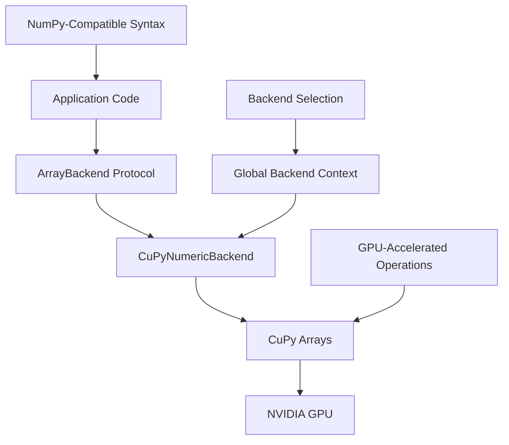
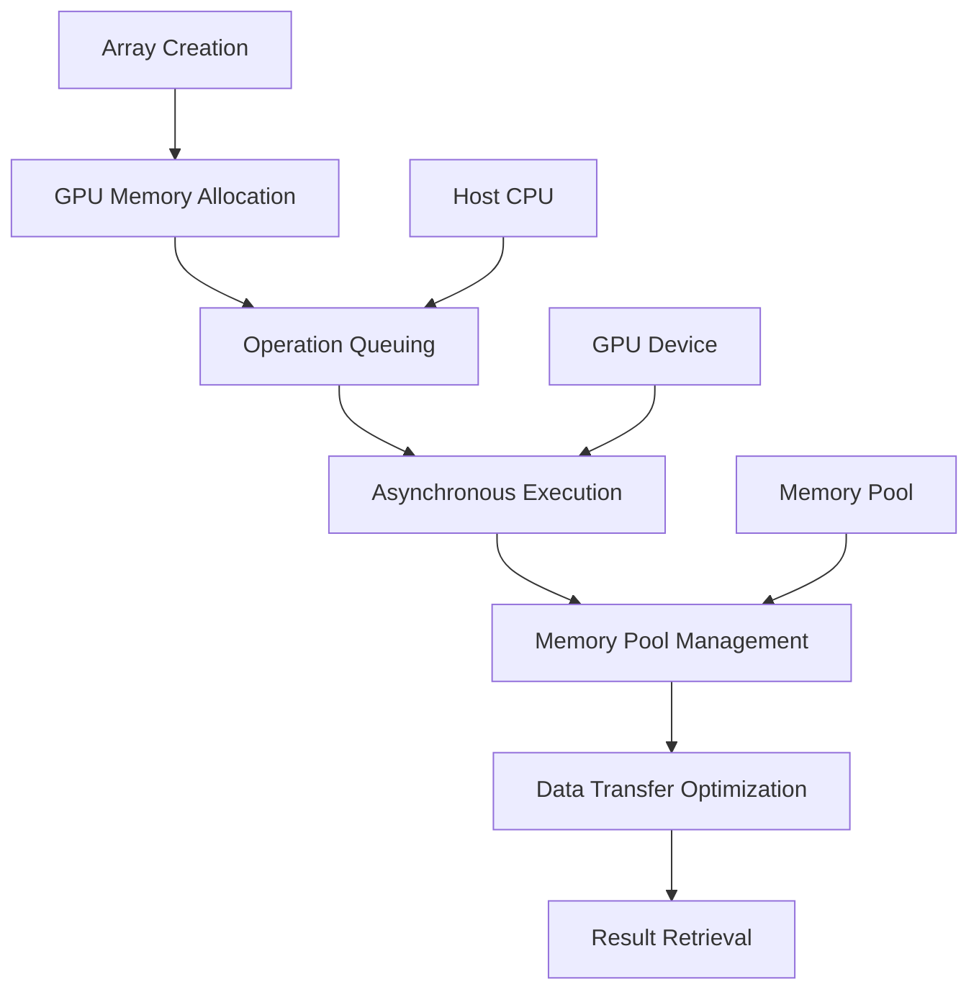
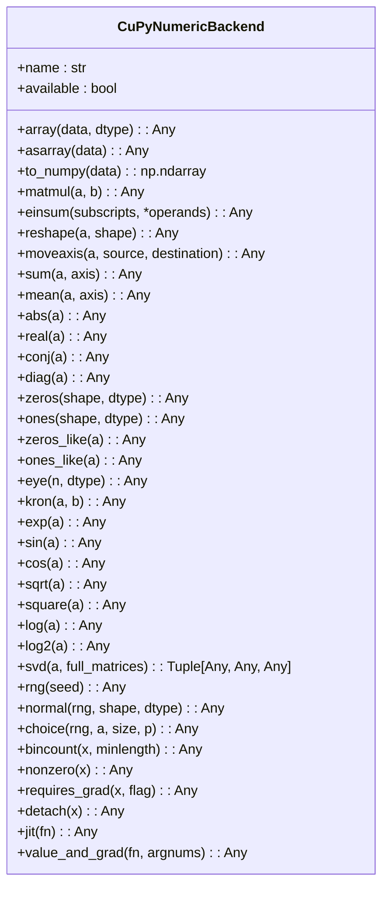
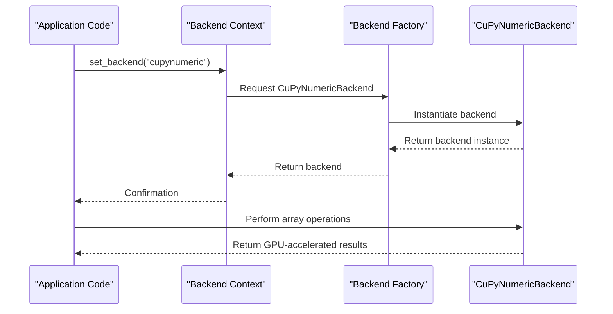

# CuPyNumeric Backend

<cite>
**Referenced Files in This Document**   
- [cupynumeric_backend.py](file://src/tyxonq/numerics/backends/cupynumeric_backend.py)
- [api.py](file://src/tyxonq/numerics/api.py)
- [context.py](file://src/tyxonq/numerics/context.py)
- [aces_for_setting_numeric_backend.py](file://examples-ng/aces_for_setting_numeric_backend.py)
- [aces_test_for_numeric_backend.py](file://examples-ng/aces_test_for_numeric_backend.py)
</cite>

## Table of Contents
1. [Introduction](#introduction)
2. [Architecture Overview](#architecture-overview)
3. [Core Components](#core-components)
4. [Memory Management and Execution Model](#memory-management-and-execution-model)
5. [Array Creation and Linear Algebra Operations](#array-creation-and-linear-algebra-operations)
6. [Backend Integration and Selection](#backend-integration-and-selection)
7. [Performance Characteristics](#performance-characteristics)
8. [Known Limitations](#known-limitations)
9. [Conclusion](#conclusion)

## Introduction
The CuPyNumeric backend provides high-performance GPU computing capabilities through a NumPy-compatible interface, enabling seamless offloading of numerical operations to NVIDIA GPUs. This backend implements the ArrayBackend protocol by wrapping CuPy arrays, allowing quantum simulations and other memory-intensive computations to leverage GPU acceleration. The implementation supports a comprehensive set of array operations, mathematical functions, and linear algebra routines optimized for GPU execution. By maintaining compatibility with existing NumPy-based code, it enables straightforward integration into quantum computing workflows while delivering significant performance advantages for large-scale tensor operations and quantum simulations.

## Architecture Overview
The CuPyNumeric backend architecture is built around the ArrayBackend protocol, which defines a unified interface for array and tensor operations across different computational backends. The CuPyNumericBackend class wraps CuPy's GPU-accelerated array implementation, exposing its functionality through the standardized protocol. This design enables transparent switching between CPU and GPU backends while maintaining consistent API behavior. The backend integrates with the global backend selection mechanism through the numerics context system, allowing both global configuration and context-specific backend selection. The architecture supports asynchronous execution by leveraging CuPy's native GPU computation model, where operations are queued on the GPU device and executed without blocking the Python interpreter.

**Diagram sources**
- [cupynumeric_backend.py](file://src/tyxonq/numerics/backends/cupynumeric_backend.py#L1-L255)
- [api.py](file://src/tyxonq/numerics/api.py#L1-L194)

## Core Components

The CuPyNumericBackend class is the central component, implementing the ArrayBackend protocol with GPU-accelerated operations. It provides methods for array creation, mathematical operations, linear algebra, and random number generation, all backed by CuPy's GPU implementation. The backend handles optional dependencies through graceful degradation, checking for CuPy availability at import time and raising appropriate runtime errors when the library is not available. Key methods include array creation (array, zeros, ones), mathematical operations (exp, sin, cos), and linear algebra functions (matmul, einsum, svd). The implementation includes special handling for operations that may not be fully supported on GPU, such as falling back to NumPy for SVD computation.

**Section sources**
- [cupynumeric_backend.py](file://src/tyxonq/numerics/backends/cupynumeric_backend.py#L1-L255)
- [api.py](file://src/tyxonq/numerics/api.py#L1-L194)

## Memory Management and Execution Model
The CuPyNumeric backend employs GPU-native memory management strategies, automatically allocating arrays in GPU memory when operations are performed. This enables efficient data locality for subsequent computations on the GPU device. The execution model is inherently asynchronous, as CuPy operations are queued on the GPU stream and executed without blocking the host CPU. This allows for overlapping computation and data transfer, maximizing GPU utilization. Memory is managed through CuPy's memory pool, which reduces allocation overhead by reusing previously allocated memory blocks. For operations requiring CPU processing, such as SVD decomposition, the backend automatically transfers data between GPU and CPU memory, minimizing unnecessary transfers through intelligent fallback mechanisms.

**Diagram sources**
- [cupynumeric_backend.py](file://src/tyxonq/numerics/backends/cupynumeric_backend.py#L1-L255)
- [context.py](file://src/tyxonq/numerics/context.py#L1-L52)

## Array Creation and Linear Algebra Operations
The CuPyNumeric backend supports comprehensive array creation and linear algebra operations optimized for GPU execution. Array creation methods like array, zeros, ones, and eye generate GPU-resident arrays with specified shapes and data types. Mathematical operations including exp, sin, cos, and log are implemented using CuPy's GPU-accelerated math libraries, providing vectorized computation across array elements. Linear algebra operations such as matmul and einsum leverage optimized GPU kernels for tensor contractions, enabling efficient computation of large-scale quantum operations. The backend also provides specialized functions like kron for Kronecker products and svd for singular value decomposition, with the latter falling back to NumPy when necessary. Random number generation is supported through the rng and normal methods, utilizing GPU-accelerated random number generators.

**Diagram sources**
- [cupynumeric_backend.py](file://src/tyxonq/numerics/backends/cupynumeric_backend.py#L1-L255)

## Backend Integration and Selection
The CuPyNumeric backend integrates with the global backend selection mechanism through the numerics context system. Users can set the backend globally using the set_backend function or temporarily within a context using the use_backend context manager. The backend is accessible through the canonical name "cupynumeric" or the alias "gpu", with automatic normalization performed by the configuration system. When the CuPyNumeric backend is selected, all subsequent array operations utilize GPU acceleration transparently. The integration includes fallback mechanisms that gracefully handle cases where CuPy is not available, either by raising appropriate errors or falling back to CPU-based computation. The backend can be accessed programmatically through the get_backend factory function, enabling dynamic backend selection based on runtime conditions.

**Diagram sources**
- [context.py](file://src/tyxonq/numerics/context.py#L1-L52)
- [api.py](file://src/tyxonq/numerics/api.py#L1-L194)
- [aces_for_setting_numeric_backend.py](file://examples-ng/aces_for_setting_numeric_backend.py#L1-L50)

## Performance Characteristics
The CuPyNumeric backend delivers significant performance advantages for memory-intensive quantum simulations and large-scale tensor operations. By leveraging GPU acceleration, it achieves substantial speedups for operations involving large arrays, particularly matrix multiplications, tensor contractions, and element-wise mathematical operations. The performance benefits are most pronounced for operations on arrays exceeding several thousand elements, where the parallel processing capabilities of GPUs can be fully utilized. Memory bandwidth limitations are mitigated through efficient memory access patterns and the use of CuPy's memory pool. The backend's asynchronous execution model enables overlapping of computation and data transfer, further improving throughput. For quantum simulations involving large state vectors or density matrices, the GPU acceleration can reduce computation time from hours to minutes, enabling previously infeasible calculations.

**Section sources**
- [cupynumeric_backend.py](file://src/tyxonq/numerics/backends/cupynumeric_backend.py#L1-L255)
- [aces_test_for_numeric_backend.py](file://examples-ng/aces_test_for_numeric_backend.py#L1-L44)

## Known Limitations
The CuPyNumeric backend has several known limitations that users should be aware of. Sparse array support is limited compared to CPU backends, as CuPy's sparse array functionality is less mature than SciPy's. Debugging GPU-accelerated code can be more complex than CPU-based implementations, with limited support for traditional debugging tools and techniques. The backend requires NVIDIA GPUs with CUDA support, limiting its portability across different hardware platforms. Memory transfer overhead between CPU and GPU can impact performance for workloads with frequent host-device communication. Some advanced linear algebra operations, such as SVD, require data transfer to CPU memory for computation, negating some performance benefits. The backend's dependency on CuPy means it is subject to the library's development roadmap and potential compatibility issues with specific CUDA versions.

**Section sources**
- [cupynumeric_backend.py](file://src/tyxonq/numerics/backends/cupynumeric_backend.py#L1-L255)
- [api.py](file://src/tyxonq/numerics/api.py#L1-L194)

## Conclusion
The CuPyNumeric backend provides a powerful solution for GPU-accelerated numerical computing in quantum simulations and other memory-intensive applications. By implementing the ArrayBackend protocol with CuPy arrays, it offers seamless integration with existing NumPy-based code while delivering significant performance improvements through GPU acceleration. The backend's comprehensive feature set, including array creation, mathematical operations, and linear algebra routines, makes it suitable for a wide range of scientific computing tasks. Its integration with the global backend selection mechanism enables flexible deployment strategies, from global configuration to context-specific backend switching. While certain limitations exist, particularly in sparse array support and debugging complexity, the performance advantages for large-scale computations make it a valuable tool for researchers and developers working with quantum systems and other computationally demanding applications.