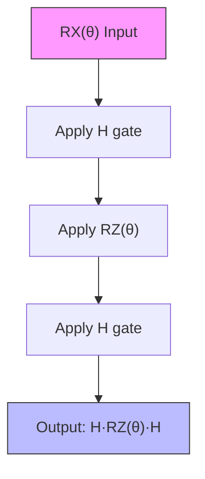
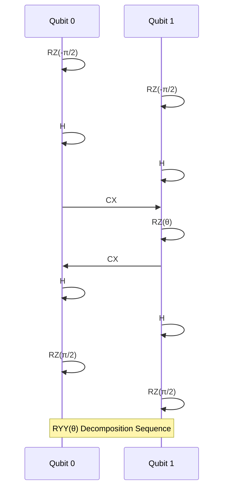
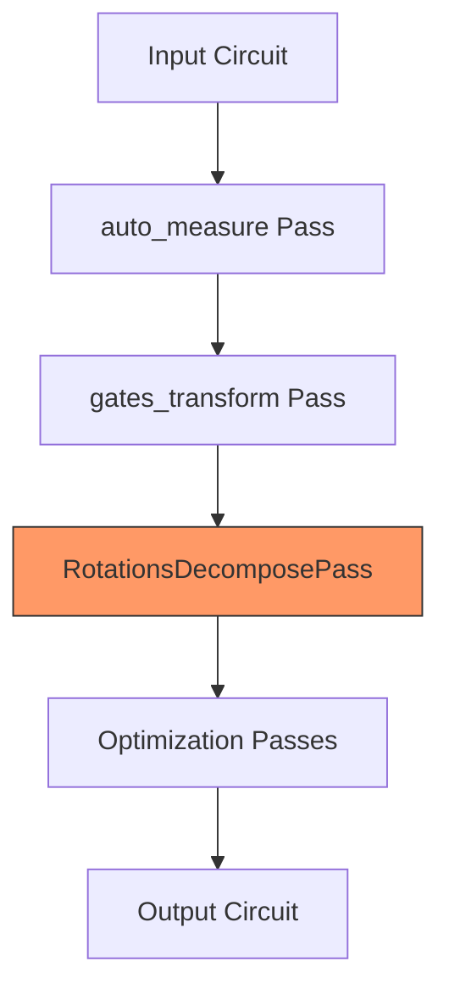

# Decomposition

<cite>
**Referenced Files in This Document**   
- [rotations.py](file://src/tyxonq/compiler/stages/decompose/rotations.py)
- [native_compiler.py](file://src/tyxonq/compiler/compile_engine/native/native_compiler.py)
- [compile_plan.py](file://src/tyxonq/compiler/compile_engine/native/compile_plan.py)
- [gates_transform.py](file://src/tyxonq/compiler/stages/rewrite/gates_transform.py)
- [circuit.py](file://src/tyxonq/core/ir/circuit.py)
</cite>

## Table of Contents
1. [Introduction](#introduction)
2. [Rotation Gate Decomposition](#rotation-gate-decomposition)
3. [Integration with Compilation Pipeline](#integration-with-compilation-pipeline)
4. [Configuration Options](#configuration-options)
5. [Troubleshooting and Performance](#troubleshooting-and-performance)
6. [Conclusion](#conclusion)

## Introduction
The Decomposition stage in the TyxonQ compiler pipeline transforms high-level quantum operations into sequences of basis gates supported by target hardware or simulation backends. This document focuses on the implementation of rotation gate decomposition, particularly how arbitrary single-qubit and two-qubit parametric rotations are broken down into native gate sets consisting of H, RZ, RX, and CX gates. The core logic resides in the `RotationsDecomposePass` class, which applies standard quantum identities to expand gates like RX, RY, RXX, RZZ, and RYY into equivalent circuits using the native basis.

**Section sources**
- [rotations.py](file://src/tyxonq/compiler/stages/decompose/rotations.py#L10-L66)

## Rotation Gate Decomposition
The `RotationsDecomposePass` class implements decomposition rules for parametric rotation gates using well-known quantum circuit identities. Each high-level rotation gate is expanded into a sequence of H, RZ, and CX gates, which form the core basis set for many quantum devices.

### Single-Qubit Rotation Decomposition
Single-qubit rotations are decomposed using Euler angle identities and gate equivalences:
- **RX(θ)**: Decomposed into H · RZ(θ) · H. This leverages the fact that the Hadamard gate can rotate the Bloch sphere to align the X-axis with the Z-axis.
- **RY(θ)**: Expanded into S† · H · RZ(θ) · H · S, where S is equivalent to RZ(π/2). This sequence rotates the Y-axis to align with the Z-axis for parameterized rotation.

**Diagram sources**
- [rotations.py](file://src/tyxonq/compiler/stages/decompose/rotations.py#L30-L33)

### Two-Qubit Rotation Decomposition
Two-qubit parametric gates are decomposed using controlled operations and basis transformations:
- **RZZ(θ)**: Implemented as CX · RZ(θ on target) · CX, where the entangling CX gates sandwich a parameterized RZ on the target qubit.
- **RXX(θ)**: Decomposed into H⊗H · CX · RZ(θ) · CX · H⊗H, applying Hadamard gates to both qubits before and after the RZZ sequence to rotate the interaction axis.
- **RYY(θ)**: Expanded using (S†H)⊗(S†H) pre-rotations and (HS)⊗(HS) post-rotations around the RZZ sequence, enabling Y-axis coupling.

**Diagram sources**
- [rotations.py](file://src/tyxonq/compiler/stages/decompose/rotations.py#L50-L65)

**Section sources**
- [rotations.py](file://src/tyxonq/compiler/stages/decompose/rotations.py#L10-L66)

## Integration with Compilation Pipeline
The decomposition stage is integrated into the NativeCompiler's default compilation pipeline through the `build_plan` function, which constructs a sequence of compilation passes. The decomposition pass is invoked as part of the circuit transformation workflow, following initial normalization stages.

### Pipeline Execution Flow
The compilation pipeline follows a structured sequence:
1. **auto_measure**: Ensures measurement operations are present
2. **gates_transform**: Rewrites gates according to basis gate preferences
3. **decompose/rotations**: Expands parametric rotations into native gates
4. Subsequent optimization and scheduling stages

**Diagram sources**
- [native_compiler.py](file://src/tyxonq/compiler/compile_engine/native/native_compiler.py#L25-L35)
- [compile_plan.py](file://src/tyxonq/compiler/compile_engine/native/compile_plan.py#L91-L94)

### Pass Resolution Mechanism
The `build_plan` function resolves stage names to actual pass instances using `_resolve_stage`. When "decompose/rotations" is specified in the compilation plan, it instantiates the `RotationsDecomposePass` class. This modular design allows flexible pipeline configuration while maintaining clean separation of concerns.

**Section sources**
- [compile_plan.py](file://src/tyxonq/compiler/compile_engine/native/compile_plan.py#L10-L94)
- [native_compiler.py](file://src/tyxonq/compiler/compile_engine/native/native_compiler.py#L25-L35)

## Configuration Options
The decomposition behavior can be controlled through compilation options, particularly via the `basis_gates` parameter. The default basis gate set ["h", "rx", "rz", "cx", "cz"] influences how gates are transformed prior to decomposition.

### Basis Gate Influence
The `gates_transform` pass, which runs immediately before decomposition, rewrites gates based on the specified basis:
- X gates are converted to RX(π) if RX is in the basis
- Y gates become RY(π) when RY is supported
- Gates like RXX and RZZ are preserved if explicitly allowed in basis_gates

This preprocessing ensures that only gates requiring decomposition reach the `RotationsDecomposePass`, optimizing the transformation workflow.

**Section sources**
- [gates_transform.py](file://src/tyxonq/compiler/stages/rewrite/gates_transform.py#L9-L49)
- [rotations.py](file://src/tyxonq/compiler/stages/decompose/rotations.py#L10-L66)

## Troubleshooting and Performance
### Common Issues
Incorrect gate expansions typically occur when:
- Missing basis gate specifications cause unexpected gate preservation
- Parameter ordering errors in multi-qubit gates lead to incorrect decomposition
- Floating-point precision issues affect rotation angles, particularly π/2 values

### Performance Implications
Deep decomposition chains can significantly increase circuit depth:
- Each RX gate becomes 3 gates (H-RZ-H)
- RY gates expand to 5 gates
- Two-qubit rotations like RYY generate 12+ gate sequences
This expansion impacts both simulation performance and hardware execution fidelity, particularly on noisy devices.

**Section sources**
- [rotations.py](file://src/tyxonq/compiler/stages/decompose/rotations.py#L10-L66)
- [circuit.py](file://src/tyxonq/core/ir/circuit.py#L48-L727)

## Conclusion
The decomposition stage plays a critical role in translating high-level quantum algorithms into executable circuits on physical devices. By systematically applying quantum gate identities, the `RotationsDecomposePass` enables compatibility with hardware-limited gate sets while preserving computational equivalence. Its integration into the NativeCompiler pipeline ensures that rotation gates are properly expanded after initial circuit normalization and gate rewriting, forming a crucial step in the quantum compilation workflow.