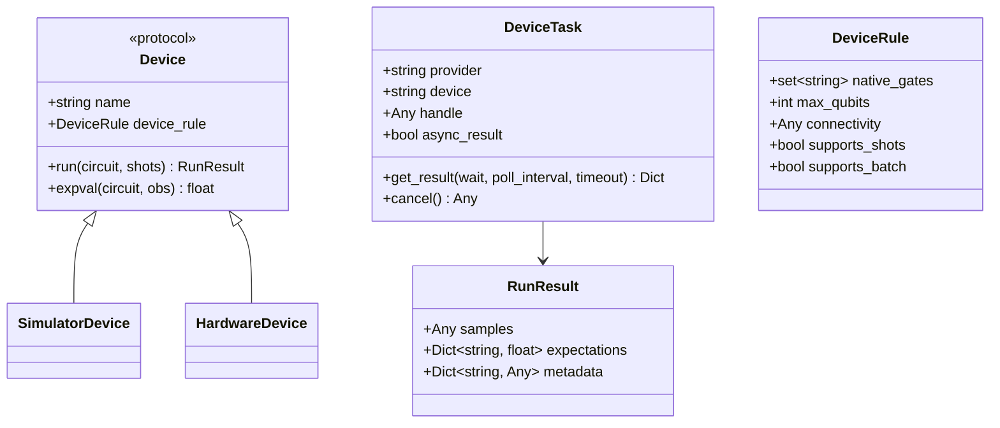
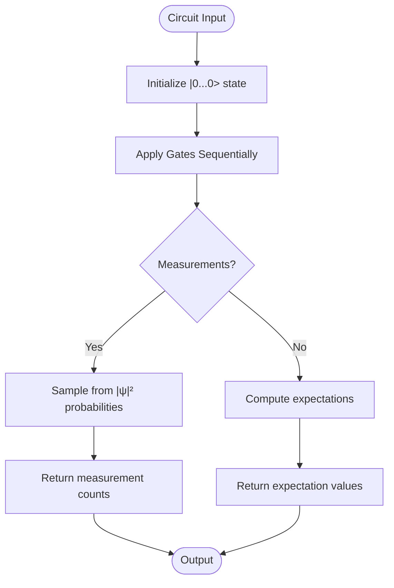
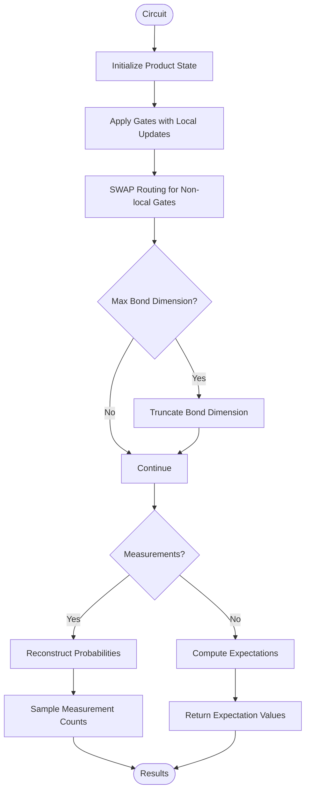
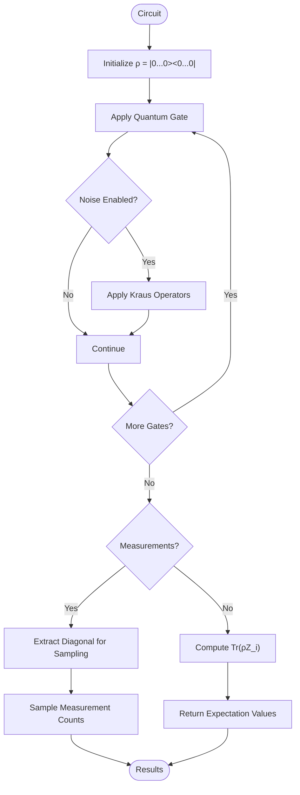
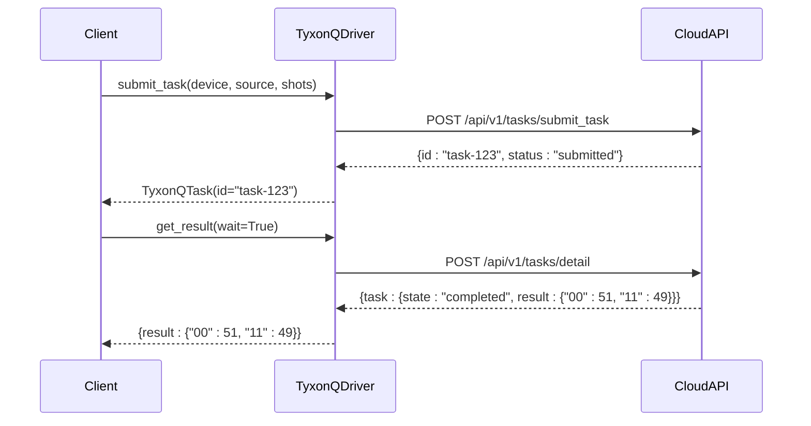
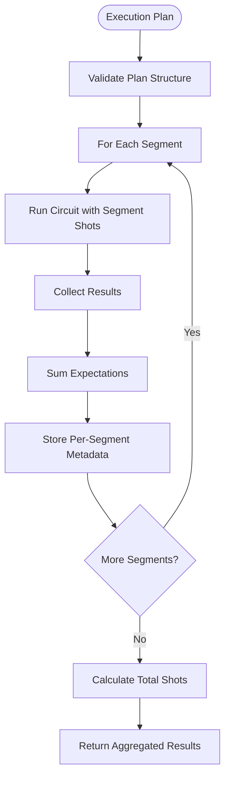

# Device Abstraction

<cite>
**Referenced Files in This Document**   
- [base.py](file://src/tyxonq/devices/base.py)
- [session.py](file://src/tyxonq/devices/session.py)
- [statevector/engine.py](file://src/tyxonq/devices/simulators/statevector/engine.py)
- [matrix_product_state/engine.py](file://src/tyxonq/devices/simulators/matrix_product_state/engine.py)
- [density_matrix/engine.py](file://src/tyxonq/devices/simulators/density_matrix/engine.py)
- [simulators/driver.py](file://src/tyxonq/devices/simulators/driver.py)
- [hardware/tyxonq/driver.py](file://src/tyxonq/devices/hardware/tyxonq/driver.py)
- [hardware/ibm/driver.py](file://src/tyxonq/devices/hardware/ibm/driver.py)
- [hardware/config.py](file://src/tyxonq/devices/hardware/config.py)
- [devices.rst](file://docs-ng/source/next/user/devices.rst)
</cite>

## Table of Contents
1. [Introduction](#introduction)
2. [Core Components](#core-components)
3. [Simulator Types](#simulator-types)
4. [Hardware Integration](#hardware-integration)
5. [Configuration and Session Management](#configuration-and-session-management)
6. [Performance and Accuracy Trade-offs](#performance-and-accuracy-trade-offs)
7. [Error Handling and Device Constraints](#error-handling-and-device-constraints)
8. [Conclusion](#conclusion)

## Introduction

The Device Abstraction layer in TyxonQ provides a unified execution interface across quantum simulators and hardware backends. This abstraction enables consistent API usage regardless of the underlying execution platform, supporting both local simulation and cloud-based quantum hardware access. The system is designed to streamline quantum circuit execution, measurement, and result processing through standardized interfaces and extensible driver architecture.

**Section sources**
- [devices.rst](file://docs-ng/source/next/user/devices.rst#L1-L7)

## Core Components

The Device Abstraction layer is built around two primary components: the `Device` protocol and `Session` management system. The `Device` protocol defines a standardized interface for quantum execution backends, requiring implementations to support circuit execution (`run`) and expectation value computation (`expval`). All devices expose their capabilities through the `device_rule` attribute, which includes metadata such as native gate sets, qubit limits, and supported features.

The `DeviceTask` class provides a unified wrapper for execution results, normalizing the interface between synchronous simulators and asynchronous hardware executions. Tasks from simulators return immediately with results, while hardware tasks support polling via the `get_result(wait=True)` method. The `run()` function serves as the primary entry point, routing execution requests to appropriate drivers based on provider and device specifications.



**Diagram sources**
- [base.py](file://src/tyxonq/devices/base.py#L20-L200)

**Section sources**
- [base.py](file://src/tyxonq/devices/base.py#L20-L404)

## Simulator Types

### Statevector Simulator

The Statevector simulator provides full state simulation using dense statevectors of size 2^n. It offers exact quantum state representation with O(2^n) memory complexity and supports standard gate operations (h, rz, rx, cx) along with measurement in the Z-basis. The engine computes expectation values analytically when shots=0 and supports optional noise modeling through depolarizing channels that attenuate Z-expectations.



**Diagram sources**
- [statevector/engine.py](file://src/tyxonq/devices/simulators/statevector/engine.py#L50-L200)

**Section sources**
- [statevector/engine.py](file://src/tyxonq/devices/simulators/statevector/engine.py#L1-L265)

### Matrix Product State (MPS) Simulator

The MPS simulator represents quantum states as Matrix Product States, enabling efficient simulation of larger systems when entanglement is limited. Memory and time complexity scale with bond dimension χ rather than 2^n, making it suitable for simulating deep circuits on narrow architectures. The engine supports bond dimension truncation via the `max_bond` parameter and uses SWAP routing for non-local gates. Measurement expectations are computed by reconstructing local probabilities from the MPS representation.



**Diagram sources**
- [matrix_product_state/engine.py](file://src/tyxonq/devices/simulators/matrix_product_state/engine.py#L50-L150)

**Section sources**
- [matrix_product_state/engine.py](file://src/tyxonq/devices/simulators/matrix_product_state/engine.py#L1-L213)

### Density Matrix Simulator

The Density Matrix simulator models mixed quantum states using density matrices of size 2^n × 2^n. With O(4^n) memory complexity, it is computationally more expensive than statevector simulation but provides native support for noise modeling through Kraus operators. The engine supports depolarizing, amplitude damping, phase damping, and Pauli noise channels applied after gate operations. This makes it particularly suitable for studying noisy quantum processes and error mitigation techniques.



**Diagram sources**
- [density_matrix/engine.py](file://src/tyxonq/devices/simulators/density_matrix/engine.py#L50-L150)

**Section sources**
- [density_matrix/engine.py](file://src/tyxonq/devices/simulators/density_matrix/engine.py#L1-L209)

## Hardware Integration

### TyxonQ Cloud Driver

The TyxonQ hardware driver provides cloud-based access to quantum processors through REST API calls. It implements asynchronous task submission and retrieval, with `submit_task` sending OpenQASM source code to the cloud backend and returning immediately with a task handle. The `get_task_details` method polls for completion when `wait=True`, normalizing the response format to match the unified result schema. Device discovery is supported through the `list_devices` endpoint, which queries available hardware configurations.



**Diagram sources**
- [hardware/tyxonq/driver.py](file://src/tyxonq/devices/hardware/tyxonq/driver.py#L50-L150)

**Section sources**
- [hardware/tyxonq/driver.py](file://src/tyxonq/devices/hardware/tyxonq/driver.py#L1-L193)

### IBM Hardware Driver

The IBM hardware driver provides a skeleton interface for integration with IBM Quantum systems. Currently implementing the required protocol methods (`list_devices`, `submit_task`, `get_task_details`), it raises `NotImplementedError` for actual execution. Future implementations will wire these methods to Qiskit providers, enabling access to IBM's quantum hardware through the same unified interface used for other backends.

**Section sources**
- [hardware/ibm/driver.py](file://src/tyxonq/devices/hardware/ibm/driver.py#L1-L40)

## Configuration and Session Management

### Configuration System

The configuration system manages provider defaults and authentication tokens through the `hardware/config.py` module. Default provider and device settings are stored in `_DEFAULTS`, with `tyxonq::simulator:mps` as the default configuration. Authentication tokens can be set programmatically via `set_token()` or through environment variables (`TYXONQ_API_KEY`). The `ENDPOINTS` dictionary defines API base URLs, with support for environment variable overrides.

```mermaid
flowchart LR
ConfigInput([Configuration Input]) --> TokenSource{"Token Source?"}
TokenSource --> |set_token()| MemoryStore["Store in _TOKENS dict"]
TokenSource --> |Environment| EnvVar["Read TYXONQ_API_KEY"]
TokenSource --> |File| AuthFile["Read ~/.tyxonq.auth.json"]
MemoryStore --> TokenOutput
EnvVar --> TokenOutput
AuthFile --> TokenOutput
TokenOutput([Active Token]) --> Driver
Driver --> APIRequest
```

**Diagram sources**
- [hardware/config.py](file://src/tyxonq/devices/hardware/config.py#L10-L50)

**Section sources**
- [hardware/config.py](file://src/tyxonq/devices/hardware/config.py#L1-L68)

### Session Management

The session module provides structured execution plans through the `device_job_plan` function, which executes segmented shot plans and aggregates results. Each segment in the plan can specify different shot counts, allowing for adaptive measurement strategies. The function returns aggregated expectations and metadata including per-segment execution records, enabling detailed analysis of multi-phase experiments.



**Diagram sources**
- [session.py](file://src/tyxonq/devices/session.py#L10-L30)

**Section sources**
- [session.py](file://src/tyxonq/devices/session.py#L1-L51)

## Performance and Accuracy Trade-offs

| Simulator Type | Memory Complexity | Time Complexity | Max Qubits | Accuracy | Best Use Cases |
|---------------|------------------|----------------|-----------|----------|---------------|
| Statevector | O(2^n) | O(poly(gates)×2^n) | ~30-35 | Exact | Small-scale exact simulation, algorithm verification |
| Matrix Product State | O(χ×n) | O(χ³×gates) | 50+ | Approximate | Large systems with limited entanglement, deep circuits |
| Density Matrix | O(4^n) | O(poly(gates)×4^n) | ~15-20 | Exact (with noise) | Noise characterization, error mitigation studies |

The Statevector simulator provides exact results but is limited by exponential memory growth. The MPS simulator trades exact representation for scalability, with accuracy depending on bond dimension and entanglement structure. The Density Matrix simulator offers the most physically accurate noise modeling at the highest computational cost, making it ideal for studying decoherence and gate errors.

**Section sources**
- [statevector/engine.py](file://src/tyxonq/devices/simulators/statevector/engine.py#L1-L10)
- [matrix_product_state/engine.py](file://src/tyxonq/devices/simulators/matrix_product_state/engine.py#L1-L10)
- [density_matrix/engine.py](file://src/tyxonq/devices/simulators/density_matrix/engine.py#L1-L10)

## Error Handling and Device Constraints

The Device Abstraction layer implements comprehensive error handling through standardized exceptions and result normalization. Hardware execution constraints are enforced at the API level: hardware runs require pre-compiled source code (typically OpenQASM), while simulator runs accept both IR circuits and source code. The `run()` function validates these requirements and raises `ValueError` for invalid execution paths.

Device-specific constraints are communicated through the `device_rule` structure, which includes `max_qubits`, `native_gates`, and connectivity information. The TyxonQ cloud driver performs additional validation through its API, returning detailed error information including device status when submissions fail. Simulator engines handle unsupported operations by ignoring them with appropriate logging, ensuring robust execution even with incomplete gate set coverage.

**Section sources**
- [base.py](file://src/tyxonq/devices/base.py#L250-L350)
- [hardware/tyxonq/driver.py](file://src/tyxonq/devices/hardware/tyxonq/driver.py#L100-L150)

## Conclusion

The Device Abstraction layer in TyxonQ provides a comprehensive and unified interface for quantum computation across diverse backends. By standardizing the execution API through the `Device` protocol and `DeviceTask` wrapper, it enables seamless switching between simulation and hardware execution. The three simulator types—Statevector, MPS, and Density Matrix—offer complementary capabilities for different research needs, from exact small-scale simulation to large-system approximation and noise-aware modeling. Integration with cloud hardware through TyxonQ and planned IBM backends extends this capability to real quantum processors, while the configuration and session management systems provide the flexibility needed for complex experimental workflows.