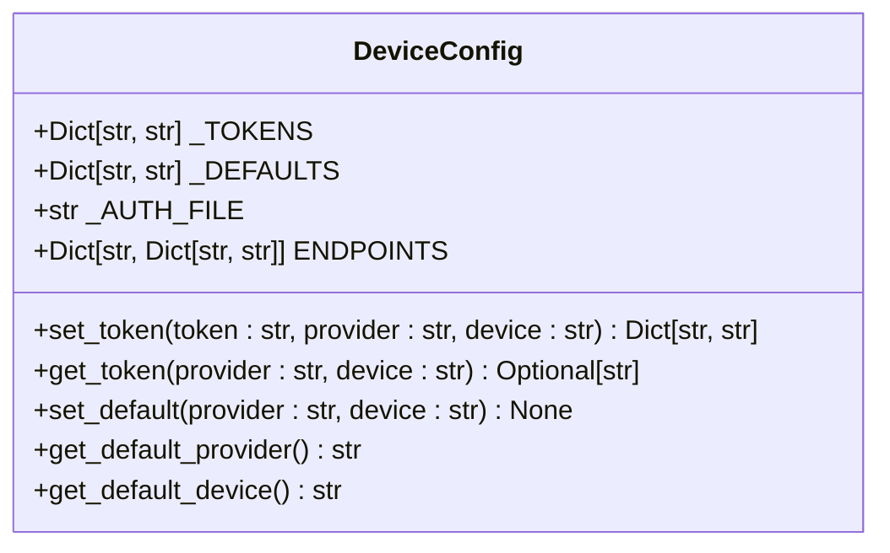
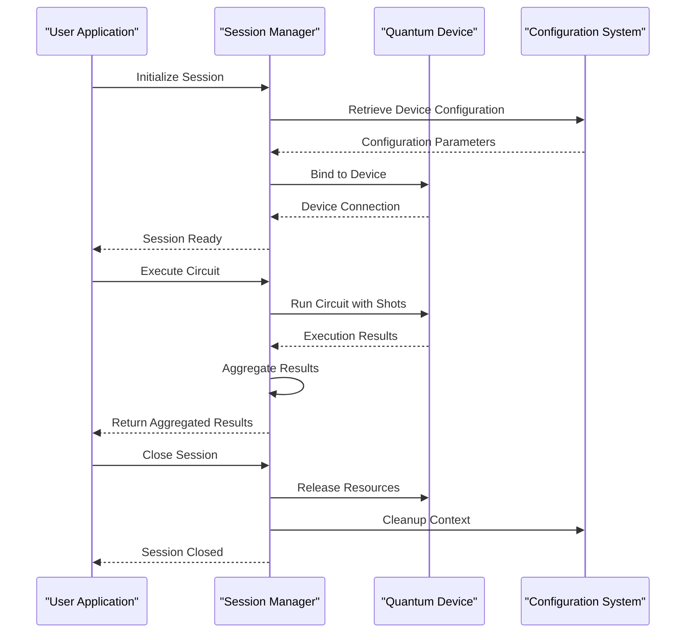
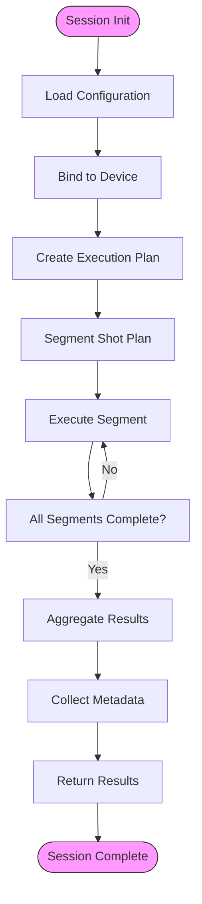
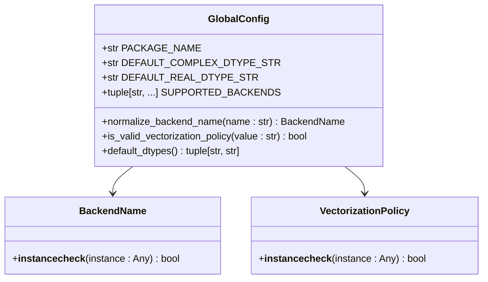

# Device Configuration and Session Management

<cite>
**Referenced Files in This Document**   
- [devices.rst](file://docs-ng/source/next/user/devices.rst)
- [config.py](file://src/tyxonq/devices/hardware/config.py)
- [session.py](file://src/tyxonq/devices/session.py)
- [config.py](file://src/tyxonq/config.py)
</cite>

## Table of Contents
1. [Introduction](#introduction)
2. [Device Configuration System](#device-configuration-system)
3. [Session Lifecycle Management](#session-lifecycle-management)
4. [Session Execution and Resource Management](#session-execution-and-resource-management)
5. [Configuration Options and Execution Parameters](#configuration-options-and-execution-parameters)
6. [Common Issues and Troubleshooting](#common-issues-and-troubleshooting)
7. [Performance Considerations](#performance-considerations)
8. [Conclusion](#conclusion)

## Introduction
This document provides a comprehensive overview of the device configuration and session management system in the TyxonQ quantum computing framework. It details the configuration mechanisms that define execution parameters, backend selection, and resource allocation policies. The document also explains the Session class responsible for managing execution context, device binding, and state persistence across multiple circuit executions. Key aspects such as session initialization, context propagation, cleanup procedures, and automatic resource deallocation are covered in detail.

## Device Configuration System

The device configuration system in TyxonQ provides a centralized mechanism for managing hardware and simulation device settings, authentication tokens, and default execution parameters. The configuration is primarily handled through the `src/tyxonq/devices/hardware/config.py` module, which implements a flexible system for token management, endpoint configuration, and default device selection.

The configuration system maintains provider-specific settings and supports both device-scoped and provider-scoped configurations. It reads environment variables for base URL and API version, allowing for flexible deployment across different environments. The system also supports storing authentication tokens in memory with fallback to environment variables, providing multiple layers of configuration options.

**Diagram sources**
- [config.py](file://src/tyxonq/devices/hardware/config.py#L0-L67)

**Section sources**
- [config.py](file://src/tyxonq/devices/hardware/config.py#L0-L67)

## Session Lifecycle Management

The session management system in TyxonQ is designed to handle the complete lifecycle of quantum circuit execution, from initialization to cleanup. The core functionality is implemented in the `device_job_plan` function in `src/tyxonq/devices/session.py`, which orchestrates the execution of segmented shot plans and aggregates results across multiple execution segments.

Session initialization involves setting up the execution context with the specified device and configuration parameters. The system supports binding to specific hardware devices or simulation backends, with automatic resource allocation based on the configured policies. During the session, the execution context is maintained across multiple circuit runs, allowing for efficient reuse of resources and consistent state management.

**Diagram sources**
- [session.py](file://src/tyxonq/devices/session.py#L9-L47)
- [config.py](file://src/tyxonq/devices/hardware/config.py#L0-L67)

**Section sources**
- [session.py](file://src/tyxonq/devices/session.py#L9-L47)

## Session Execution and Resource Management

The session execution system in TyxonQ implements a robust resource management framework that ensures proper allocation and deallocation of computational resources. The `device_job_plan` function serves as the core execution engine, processing segmented shot plans and aggregating results across multiple execution segments.

Resource allocation is handled automatically based on the configuration parameters and device capabilities. The system supports both synchronous and asynchronous execution modes, with automatic resource deallocation upon session termination. The execution plan is divided into segments, each with a specified number of shots, allowing for fine-grained control over resource usage and execution time.

The system also implements comprehensive metadata tracking, recording per-segment execution details including shot counts, basis states, wire configurations, and basis mappings. This metadata is aggregated along with the expectation values, providing a complete record of the execution process for analysis and debugging purposes.

**Diagram sources**
- [session.py](file://src/tyxonq/devices/session.py#L9-L47)

**Section sources**
- [session.py](file://src/tyxonq/devices/session.py#L9-L47)

## Configuration Options and Execution Parameters

The configuration system in TyxonQ provides a comprehensive set of options for controlling execution parameters, backend selection, and resource allocation policies. These options are accessible through both programmatic interfaces and environment variables, allowing for flexible configuration across different deployment scenarios.

Key configuration options include:
- **Execution mode**: Controls whether circuits are executed synchronously or asynchronously
- **Shot count defaults**: Specifies the default number of shots for circuit execution
- **Error mitigation settings**: Configures error mitigation strategies for noisy quantum devices
- **Backend selection**: Determines the computational backend (CPU, GPU, or specialized hardware)
- **Resource allocation policies**: Defines how computational resources are allocated and managed

The global configuration in `src/tyxonq/config.py` defines canonical backend names and provides normalization functions for backend aliases, ensuring consistent backend selection across the framework. The system supports multiple backends including 'numpy', 'pytorch', and 'cupynumeric', with aliases for common deployment scenarios.

**Diagram sources**
- [config.py](file://src/tyxonq/config.py#L0-L96)

**Section sources**
- [config.py](file://src/tyxonq/config.py#L0-L96)

## Common Issues and Troubleshooting

The device configuration and session management system may encounter several common issues that require troubleshooting. Understanding these issues and their resolution strategies is essential for maintaining reliable quantum circuit execution.

**Session Timeouts**: Long-running sessions may encounter timeout issues, particularly when executing on remote hardware devices. The configuration system allows for adjusting timeout parameters through environment variables, and the session management system implements automatic retry mechanisms for transient failures.

**Device Busy States**: Quantum hardware devices may be unavailable due to maintenance or high demand. The system provides device status information through the `list_properties` function, allowing users to check device availability before initiating sessions. When a device is busy, the system can automatically queue execution requests or redirect to alternative devices based on configuration policies.

**Configuration Conflicts**: Conflicting configuration settings between environment variables, configuration files, and programmatic settings can lead to unexpected behavior. The configuration system implements a clear precedence hierarchy, with programmatic settings taking precedence over environment variables, which in turn take precedence over default values.

**Resource Exhaustion**: Long-running sessions or complex circuit executions may exhaust available computational resources. The session management system implements resource monitoring and automatic cleanup procedures to prevent resource leaks. Users can also manually trigger resource cleanup by explicitly closing sessions.

**Section sources**
- [config.py](file://src/tyxonq/devices/hardware/config.py#L0-L67)
- [session.py](file://src/tyxonq/devices/session.py#L9-L47)

## Performance Considerations

Effective performance management in the device configuration and session management system requires careful consideration of several factors, particularly for long-running sessions and multi-device workflows.

For long-running sessions, thread safety and concurrency patterns are critical. The configuration system uses thread-safe data structures for storing tokens and defaults, ensuring that concurrent access from multiple threads does not lead to race conditions. The session management system implements proper locking mechanisms to coordinate access to shared resources.

In multi-device workflows, efficient resource allocation and context switching are essential for optimal performance. The system supports rapid device switching by maintaining separate configuration contexts for each device, minimizing the overhead of context changes. The segmented shot plan execution model allows for efficient batching of circuit executions, reducing the overhead of device communication.

The vectorization policy configuration option allows users to control how operations are vectorized across computational resources, with options for automatic optimization, forced vectorization, or disabling vectorization entirely. This flexibility enables users to tune performance based on their specific hardware and workload characteristics.

**Section sources**
- [config.py](file://src/tyxonq/config.py#L0-L96)
- [session.py](file://src/tyxonq/devices/session.py#L9-L47)

## Conclusion

The device configuration and session management system in TyxonQ provides a robust framework for managing quantum circuit execution across diverse hardware and simulation backends. The centralized configuration system enables consistent parameter management and resource allocation, while the session management system ensures reliable execution context and state persistence.

Key strengths of the system include its flexible configuration options, comprehensive resource management, and support for both local and remote execution environments. The system's design emphasizes reliability, performance, and ease of use, making it suitable for both research and production quantum computing applications.

By understanding the configuration options, session lifecycle, and performance characteristics described in this document, users can effectively leverage the Tyxonq framework for their quantum computing workflows, ensuring optimal execution and resource utilization.