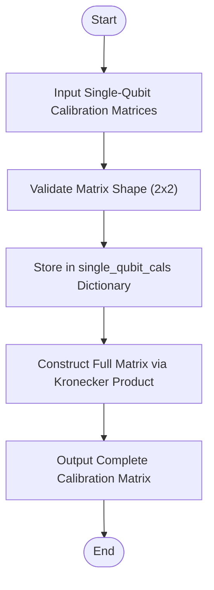
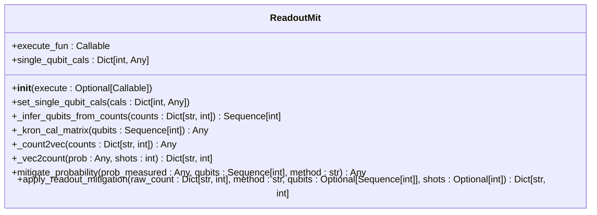
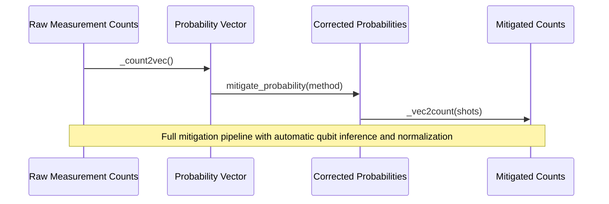
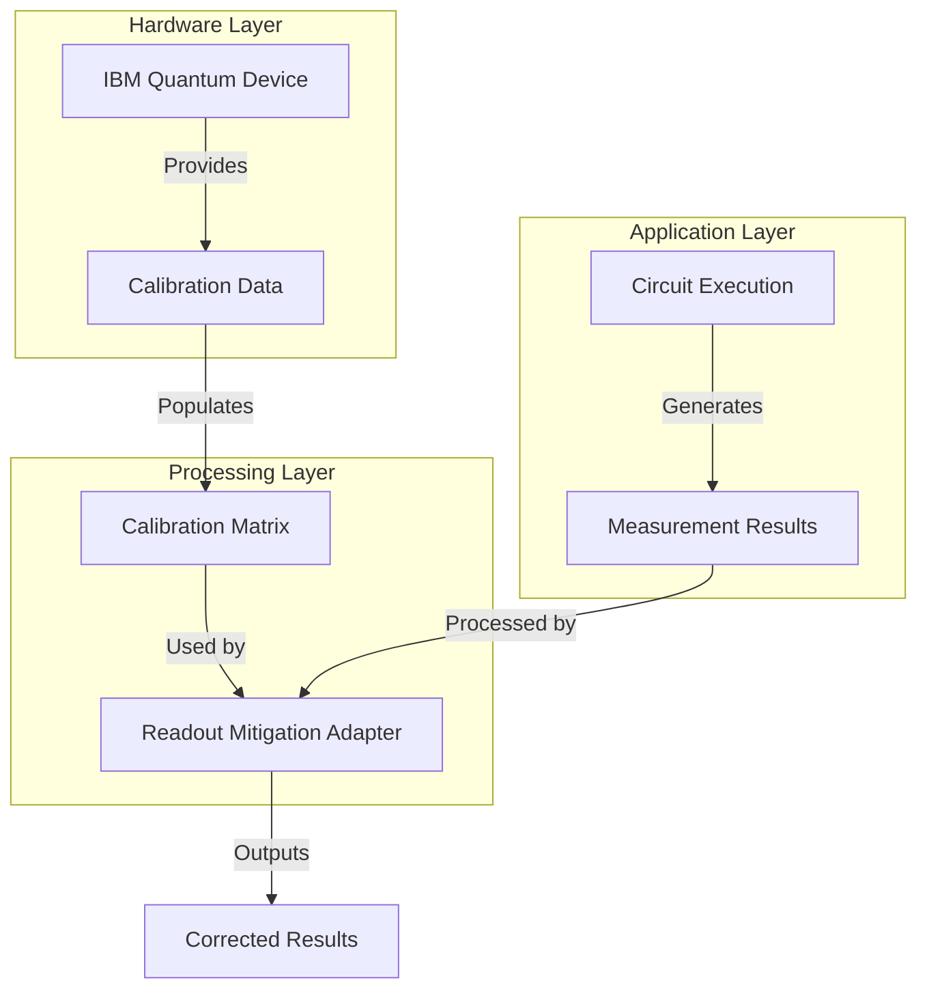

# Error Mitigation Techniques

<cite>
**Referenced Files in This Document**   
- [readout.py](file://src/tyxonq/postprocessing/readout.py)
- [readout_mitigation.py](file://examples/readout_mitigation.py)
- [error_mitigation.py](file://src/tyxonq/postprocessing/error_mitigation.py)
- [test_postprocessing_readout_adapter.py](file://tests_core_module/test_postprocessing_readout_adapter.py)
</cite>

## Table of Contents
1. [Introduction](#introduction)
2. [Core Components](#core-components)
3. [Readout Calibration Matrix Generation](#readout-calibration-matrix-generation)
4. [Inversion Techniques for Readout Correction](#inversion-techniques-for-readout-correction)
5. [Noise-Adaptive Processing Workflow](#noise-adaptive-processing-workflow)
6. [Integration with Hardware Device Profiles](#integration-with-hardware-device-profiles)
7. [Best Practices and Performance Trade-offs](#best-practices-and-performance-trade-offs)
8. [Conclusion](#conclusion)

## Introduction
This document details error mitigation techniques in quantum computing with a focus on readout error correction and noise-adaptive processing. It explains the implementation of calibration matrix generation, inversion methods (inverse, least-squares, and Tikhonov regularization), and the application of mitigation adapters to raw measurement counts. The workflow for capturing device-specific noise characteristics is described alongside integration with hardware profiles and automated characterization pipelines. Practical examples from `readout.py` illustrate calibration circuit generation and correction matrix application. Best practices for mitigating overfitting in low-shot regimes and performance trade-offs between accuracy and computational overhead are also discussed.

## Core Components

The primary component for readout error mitigation is the `ReadoutMit` class defined in `readout.py`. This class provides functionality to set per-qubit calibration matrices, infer qubit configurations from measurement counts, construct full calibration matrices via Kronecker products, and apply various correction methods to mitigate readout errors.

Key methods include:
- `set_single_qubit_cals`: Sets 2x2 calibration matrices for individual qubits
- `_kron_cal_matrix`: Constructs the full multi-qubit calibration matrix
- `mitigate_probability`: Applies inversion techniques to correct probabilities
- `apply_readout_mitigation`: End-to-end mitigation pipeline from raw counts

The implementation supports multiple mitigation strategies and integrates with the numeric backend system for efficient computation.

**Section sources**
- [readout.py](file://src/tyxonq/postprocessing/readout.py#L14-L136)

## Readout Calibration Matrix Generation

Calibration matrices are generated by characterizing the readout errors of individual qubits. Each qubit's calibration matrix is a 2x2 row-stochastic matrix that maps true quantum states to measured outcomes. The diagonal elements represent correct readout probabilities, while off-diagonal elements capture error rates (e.g., probability of measuring |0⟩ when the true state is |1⟩).

In practice, these matrices are obtained through experimental characterization of quantum devices. The `ReadoutMit` class accepts these matrices via the `set_single_qubit_cals` method, which validates their shape and stores them for later use in error mitigation.

For multi-qubit systems, the full calibration matrix is constructed as the Kronecker product of individual qubit matrices in ascending wire order. This approach assumes local readout errors without cross-talk, enabling scalable error modeling.



**Diagram sources**
- [readout.py](file://src/tyxonq/postprocessing/readout.py#L48-L59)
- [readout.py](file://src/tyxonq/postprocessing/readout.py#L32-L42)

**Section sources**
- [readout.py](file://src/tyxonq/postprocessing/readout.py#L32-L59)

## Inversion Techniques for Readout Correction

The `ReadoutMit` class implements several inversion techniques to correct measured probabilities using the calibration matrix. These methods transform raw measurement outcomes into estimates of the true underlying quantum state probabilities.

### Inverse Method
The inverse method computes the pseudoinverse of the calibration matrix using SciPy's `pinv` function for numerical stability. This approach directly inverts the noise model:
```
p_true = pinv(A) @ p_measured
```
where A is the calibration matrix and p represents probability vectors.

### Constrained Least Squares
The least-squares method formulates error mitigation as an optimization problem with physical constraints:
- Minimizes ||A @ x - p_measured||²
- Subject to: Σxᵢ = 1 (probability conservation)
- With bounds: 0 ≤ xᵢ ≤ 1 (valid probabilities)

This constrained optimization is solved using SciPy's SLSQP algorithm, ensuring physically meaningful results even when the inverse method produces negative probabilities.

### Implementation Details
Both methods include post-processing steps to ensure valid probability distributions:
- Clipping values to [0,1] range
- Normalizing to unit sum
- Handling edge cases (zero shots, near-zero sums)

The choice of method involves trade-offs between computational cost and robustness, particularly in low-shot regimes where statistical fluctuations can amplify inversion artifacts.



**Diagram sources**
- [readout.py](file://src/tyxonq/postprocessing/readout.py#L93-L128)

**Section sources**
- [readout.py](file://src/tyxonq/postprocessing/readout.py#L93-L128)

## Noise-Adaptive Processing Workflow

The error mitigation workflow follows a systematic process from raw measurement counts to corrected results:

1. **Raw Count Input**: Accepts measurement results in dictionary format (bitstring → frequency)
2. **Vector Conversion**: Transforms counts into probability vectors using `_count2vec`
3. **Qubit Inference**: Automatically determines qubit configuration from bitstring length
4. **Matrix Construction**: Builds full calibration matrix via Kronecker product
5. **Probability Correction**: Applies selected mitigation method
6. **Result Formatting**: Converts corrected probabilities back to count dictionaries

The workflow is demonstrated in the `readout_mitigation.py` example, which constructs a Bell-like circuit, simulates readout errors using calibration matrices, and applies mitigation to recover ideal counts. The example shows both direct numeric application and integration with circuit execution pipelines.

Integration with hardware devices occurs through the device configuration interface, where readout error parameters can be specified and automatically applied during execution. Post-processing adapters then apply correction based on pre-characterized noise profiles.



**Diagram sources**
- [readout.py](file://src/tyxonq/postprocessing/readout.py#L130-L136)
- [readout_mitigation.py](file://examples/readout_mitigation.py#L60-L130)

**Section sources**
- [readout.py](file://src/tyxonq/postprocessing/readout.py#L62-L91)
- [readout.py](file://src/tyxonq/postprocessing/readout.py#L130-L136)
- [readout_mitigation.py](file://examples/readout_mitigation.py#L60-L130)

## Integration with Hardware Device Profiles

Error mitigation integrates with hardware device profiles through standardized interfaces that capture device-specific noise characteristics. Calibration data can be loaded from device configuration files or obtained through automated characterization routines.

The system supports both pre-characterized calibration matrices and dynamic noise profiling. For IBM hardware, device profiles would be obtained through the IBM Quantum Experience API, though the current implementation provides a skeleton interface awaiting full integration.

Mitigation adapters are applied during the post-processing phase of circuit execution, allowing seamless integration with existing workflows. The `postprocessing` method in circuit execution accepts calibration data and mitigation parameters, automatically applying corrections to measurement results.

Device-specific noise characteristics are captured in calibration matrices that reflect:
- Readout fidelity for each qubit
- Asymmetric error rates (|0⟩→|1⟩ vs |1⟩→|0⟩)
- Temporal variations in error rates
- Environmental factors affecting measurement accuracy



**Diagram sources**
- [readout.py](file://src/tyxonq/postprocessing/readout.py#L14-L136)
- [driver.py](file://src/tyxonq/devices/hardware/ibm/driver.py#L1-L40)

**Section sources**
- [readout.py](file://src/tyxonq/postprocessing/readout.py#L14-L136)
- [driver.py](file://src/tyxonq/devices/hardware/ibm/driver.py#L1-L40)

## Best Practices and Performance Trade-offs

### Mitigating Overfitting in Low-Shot Regimes
In low-shot experiments, statistical fluctuations can lead to overfitting during matrix inversion. Recommended practices include:
- Using pseudoinverse instead of direct inverse for numerical stability
- Applying constrained optimization to maintain physical probability bounds
- Regularizing solutions when calibration matrices are ill-conditioned
- Increasing shot counts when possible to improve statistical significance

### Method Selection Guidelines
- **Inverse method**: Fastest computation, suitable for high-fidelity devices with well-conditioned calibration matrices
- **Least-squares method**: More robust to noise and statistical fluctuations, preferred for low-shot regimes or noisy devices
- **Tikhonov regularization**: Not currently implemented but would provide additional control over solution smoothness

### Performance Considerations
The computational complexity grows exponentially with qubit count due to the 2ⁿ×2ⁿ calibration matrix. For large systems:
- Memory requirements scale as O(4ⁿ)
- Matrix inversion complexity is O(8ⁿ)
- Practical limits typically occur around 10-12 qubits without approximation methods

The current implementation uses backend-agnostic operations through the numeric backend system, allowing optimization across different computational platforms (NumPy, CuPy, PyTorch).

### Accuracy vs. Overhead Trade-offs
| Method | Computational Cost | Robustness | Recommended Use Case |
|--------|-------------------|------------|---------------------|
| Inverse | Low | Medium | High-shot, high-fidelity devices |
| Least-Squares | High | High | Low-shot, noisy devices |
| Pseudoinverse | Medium | High | General purpose, recommended default |

**Section sources**
- [readout.py](file://src/tyxonq/postprocessing/readout.py#L93-L128)
- [test_postprocessing_readout_adapter.py](file://tests_core_module/test_postprocessing_readout_adapter.py#L1-L27)

## Conclusion
The error mitigation framework provides comprehensive tools for readout error correction through calibration matrix generation and inversion techniques. The `ReadoutMit` class offers flexible methods for correcting measurement errors using inverse and least-squares approaches, with proper handling of physical constraints and numerical stability. Integration with hardware device profiles enables automated noise characterization and mitigation, while the workflow supports both direct application and pipeline integration. Best practices emphasize method selection based on shot count and device fidelity, with attention to the exponential scaling of computational resources. Future enhancements could include Tikhonov regularization and approximate methods for larger qubit counts.