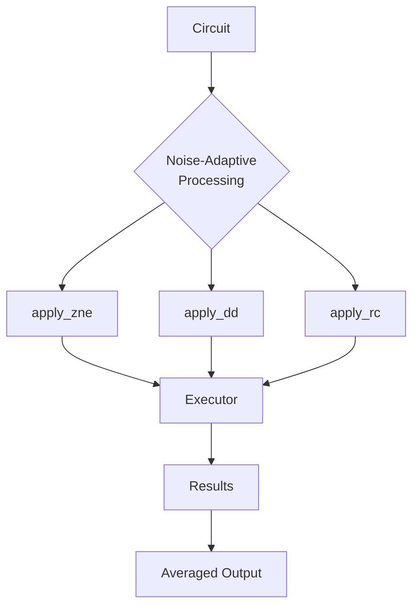

# Noise-Adaptive Processing

<cite>
**Referenced Files in This Document**   
- [error_mitigation.py](file://src/tyxonq/postprocessing/error_mitigation.py)
- [noise_controls_demo.py](file://examples/noise_controls_demo.py)
</cite>

## Table of Contents
1. [Introduction](#introduction)
2. [Core Noise-Adaptive Techniques](#core-noise-adaptive-techniques)
3. [Zero-Noise Extrapolation (ZNE)](#zero-noise-extrapolation-zne)
4. [Dynamical Decoupling (DD)](#dynamical-decoupling-dd)
5. [Randomized Compiling (RC)](#randomized-compiling-rc)
6. [Usage Examples and Integration](#usage-examples-and-integration)
7. [Current Limitations and Roadmap](#current-limitations-and-roadmap)
8. [Method Selection Guidance](#method-selection-guidance)

## Introduction

Noise-Adaptive Processing represents a critical layer in quantum computing workflows, designed to mitigate the effects of hardware noise and improve the fidelity of quantum computations. This document details the implementation and usage of three primary noise-adaptive techniques within the TyxonQ framework: Zero-Noise Extrapolation (ZNE), Dynamical Decoupling (DD), and Randomized Compiling (RC). These methods are implemented as post-processing functions that can be integrated into quantum execution pipelines to enhance result accuracy. The current implementation provides foundational scaffolding for these techniques, with plans for more sophisticated integration in future releases.

**Section sources**
- [error_mitigation.py](file://src/tyxonq/postprocessing/error_mitigation.py#L1-L82)

## Core Noise-Adaptive Techniques

The TyxonQ framework implements noise-adaptive processing through three core functions: `apply_zne`, `apply_dd`, and `apply_rc`. These functions follow a consistent executor-based pattern, accepting a quantum circuit and an execution function as primary inputs. Each technique employs statistical averaging over multiple circuit executions to suppress different types of quantum noise. The functions are designed to be composable, allowing for chaining of multiple noise mitigation strategies within a single computational workflow. The current implementation serves as a placeholder for more advanced algorithms, focusing on the core pattern of repeated execution and result aggregation.



**Diagram sources**
- [error_mitigation.py](file://src/tyxonq/postprocessing/error_mitigation.py#L6-L75)

**Section sources**
- [error_mitigation.py](file://src/tyxonq/postprocessing/error_mitigation.py#L6-L75)

## Zero-Noise Extrapolation (ZNE)

### Function Overview

The `apply_zne` function implements the foundational pattern for Zero-Noise Extrapolation, a technique that aims to estimate the ideal (noise-free) expectation value by extrapolating from results obtained at different noise levels. The current implementation serves as a minimal placeholder that establishes the function signature and execution pattern for future Mitiq-based enhancements.

### Implementation Details

The function accepts a quantum circuit and an executor function, along with parameters for noise scaling and trial averaging. It executes the circuit multiple times (controlled by `num_to_average`) and returns the mean of the results. The parameters `factory` and `scale_noise` are included in the function signature to support future ZNE implementations that will scale noise levels systematically and perform extrapolation to the zero-noise limit.

The current implementation does not modify the circuit or scale noise levels, instead focusing on establishing the executor pattern and averaging mechanism. This design allows for backward compatibility when more sophisticated ZNE methods are integrated, as the core interface remains consistent.

### Integration Points

The function is designed to integrate with the Mitiq library in future releases, which will provide advanced noise scaling strategies and extrapolation methods. The placeholder implementation ensures that user code written with the current API will continue to function when the full ZNE capabilities are implemented.

**Section sources**
- [error_mitigation.py](file://src/tyxonq/postprocessing/error_mitigation.py#L6-L22)

## Dynamical Decoupling (DD)

### Function Overview

The `apply_dd` function provides the framework for Dynamical Decoupling, a pulse-level error suppression technique that inserts control sequences to average out environmental noise. The current implementation establishes the function signature and execution pattern for this technique, serving as a foundation for future pulse-level control integration.

### Implementation Details

The function accepts parameters for specifying DD rules (`rule`), rule arguments (`rule_args`), and trial configuration (`num_trials`). It executes the circuit multiple times and averages the results, with special handling for count-based outputs. When `iscount=True`, the function performs element-wise averaging of measurement dictionaries, preserving the statistical distribution of outcomes.

The `full_output` parameter enables diagnostic mode, returning both the averaged result and a list of executed circuits. This feature supports debugging and analysis of the noise mitigation process. The parameters `ignore_idle_qubit`, `fulldd`, and `iscount` are included to support various DD configurations in future implementations.

### Current Limitations

The current implementation does not modify the circuit with DD pulse sequences, instead focusing on the execution and averaging framework. Future versions will integrate pulse-level control to insert DD sequences at idle periods in the circuit, effectively suppressing decoherence errors.

**Section sources**
- [error_mitigation.py](file://src/tyxonq/postprocessing/error_mitigation.py#L25-L51)

## Randomized Compiling (RC)

### Function Overview

The `apply_rc` function implements the framework for Randomized Compiling, a technique that suppresses coherent errors by randomizing quantum gates while preserving the overall computation. The function establishes the execution pattern for this method, with support for statistical averaging over multiple circuit realizations.

### Implementation Details

The function executes the input circuit multiple times (controlled by `num_to_average`) and returns the averaged result along with a list of executed circuits. When `iscount=True`, it performs element-wise averaging of measurement dictionaries, similar to the DD implementation. The `simplify` parameter is included to support circuit optimization in future RC implementations.

The function returns a tuple containing the averaged result and the list of executed circuits, enabling analysis of the statistical properties of the randomized compilation process. This design supports both immediate result usage and detailed diagnostic analysis.

### Execution Pattern

The RC implementation follows the same executor pattern as the other noise-adaptive techniques, ensuring consistency across the framework. This uniform interface allows users to easily switch between different noise mitigation strategies or combine them in a single workflow.

**Section sources**
- [error_mitigation.py](file://src/tyxonq/postprocessing/error_mitigation.py#L54-L75)

## Usage Examples and Integration

### Executor Chaining

The noise-adaptive functions are designed to be used in executor chains, where a circuit is processed through multiple stages of execution and post-processing. The functions accept any callable executor, enabling integration with various quantum backends and simulation methods.

### Basic Usage Pattern

```python
# Example pattern (from noise_controls_demo.py)
result = apply_zne(
    circuit=circuit,
    executor=simulator_run,
    num_to_average=10
)
```

### Noise Scaling Parameters

While the current implementations do not utilize noise scaling, the function signatures include parameters for future use:
- `apply_zne`: `scale_noise` parameter for noise level scaling
- `apply_dd`: `rule` and `rule_args` for DD sequence configuration
- `apply_rc`: `num_to_average` for controlling statistical sampling

### Full Output Mode

All three functions support diagnostic modes that return additional information:
- `apply_dd`: `full_output=True` returns (result, circuit_list)
- `apply_rc`: Always returns (result, circuit_list)
- `apply_zne`: Returns scalar result (future versions may support full output)

This diagnostic data enables users to analyze the noise mitigation process and verify the statistical properties of the results.

**Section sources**
- [error_mitigation.py](file://src/tyxonq/postprocessing/error_mitigation.py#L6-L75)
- [noise_controls_demo.py](file://examples/noise_controls_demo.py#L1-L47)

## Current Limitations and Roadmap

### Current Limitations

The current implementation of noise-adaptive processing techniques has several limitations:
- **Placeholder implementations**: All three methods currently only perform statistical averaging without implementing their core noise suppression mechanisms
- **No circuit modification**: DD and RC do not modify circuits with control sequences or randomized gates
- **No noise scaling**: ZNE does not scale noise levels or perform extrapolation
- **Limited parameter utilization**: Many function parameters are not yet implemented

### Roadmap for Advanced Algorithms

The development roadmap includes:
1. **Mitiq integration**: Full ZNE implementation with noise scaling and extrapolation
2. **Pulse-level control**: DD implementation with actual pulse sequence insertion
3. **Gate randomization**: RC implementation with proper gate compilation and randomization
4. **Advanced error models**: Support for more sophisticated noise characterization
5. **Automated parameter selection**: Intelligent selection of noise mitigation parameters based on hardware profiles

Future releases will transform these placeholder functions into fully functional noise-adaptive processing tools, significantly enhancing the accuracy of quantum computations on noisy hardware.

**Section sources**
- [error_mitigation.py](file://src/tyxonq/postprocessing/error_mitigation.py#L6-L75)

## Method Selection Guidance

### Selection Criteria

When selecting among ZNE, DD, and RC, consider the following factors:

| Method | Best For | Computational Cost | Hardware Requirements |
|--------|---------|-------------------|----------------------|
| ZNE | Systematic errors, near-term devices | High (multiple noise levels) | Any device with controllable noise |
| DD | Decoherence errors, idle periods | Medium (multiple trials) | Pulse-level control capability |
| RC | Coherent errors, gate-level noise | Medium (multiple realizations) | Fast recompilation capability |

### Computational Budget Considerations

- **Low budget**: Use single-execution without noise mitigation
- **Medium budget**: Use statistical averaging (current implementations)
- **High budget**: Wait for full implementations with higher overhead but better error suppression

### Hardware Noise Profile Matching

- **High decoherence**: Prioritize DD (when implemented)
- **Coherent errors**: Prioritize RC (when implemented)
- **Systematic errors**: Prioritize ZNE (when implemented)
- **Unknown noise profile**: Start with statistical averaging as a baseline

As the full implementations become available, these guidelines will be updated to reflect the enhanced capabilities of each method.