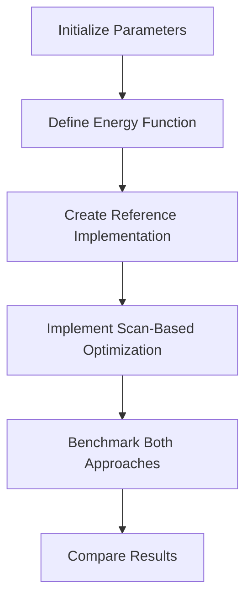
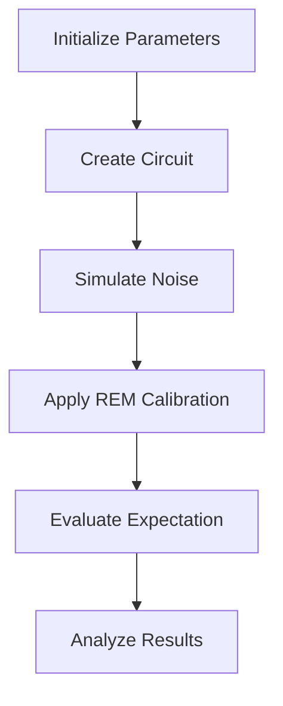
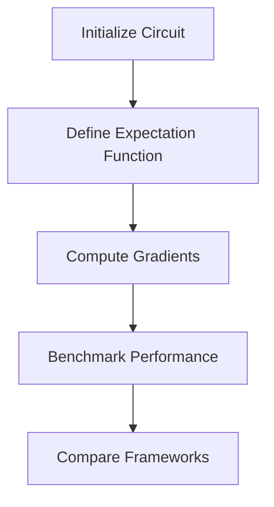
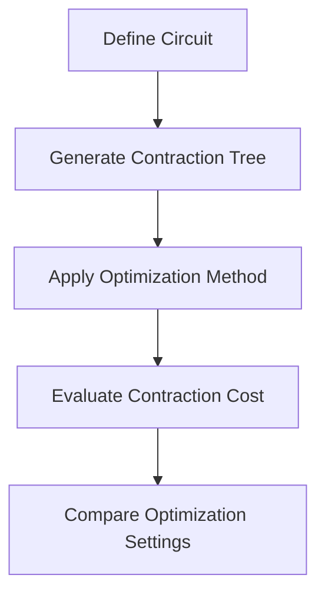
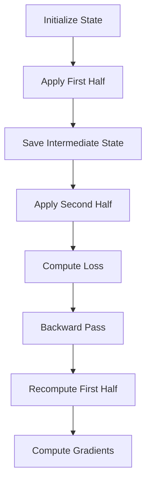
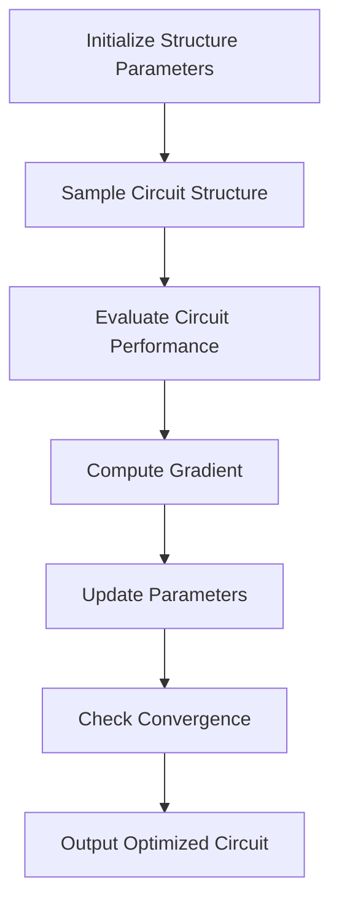
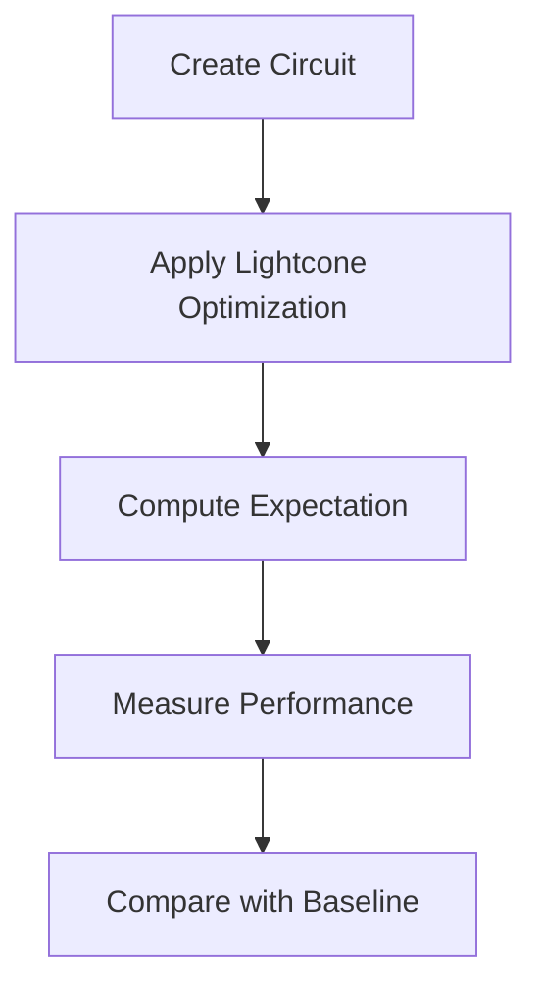

# Advanced Computing Examples

<cite>
**Referenced Files in This Document**   
- [hea_scan_jit_acc.py](file://examples-ng/hea_scan_jit_acc.py)
- [hybrid_gpu_pipeline.py](file://examples-ng/hybrid_gpu_pipeline.py)
- [rem_super_large_scale.py](file://examples-ng/rem_super_large_scale.py)
- [bp_benchmark.py](file://examples-ng/bp_benchmark.py)
- [cotengra_setting_bench.py](file://examples-ng/cotengra_setting_bench.py)
- [checkpoint_memsave.py](file://examples-ng/checkpoint_memsave.py)
- [clifford_optimization.py](file://examples-ng/clifford_optimization.py)
- [lightcone_simplify.py](file://examples-ng/lightcone_simplify.py)
</cite>

## Table of Contents
1. [Introduction](#introduction)
2. [JIT-Accelerated HEA Parameter Scanning](#jit-accelerated-hea-parameter-scanning)
3. [Hybrid GPU Pipelines](#hybrid-gpu-pipelines)
4. [Memory-Efficient Large-Scale Simulations](#memory-efficient-large-scale-simulations)
5. [Backpropagation Benchmarking](#backpropagation-benchmarking)
6. [Tensor Contraction Optimization](#tensor-contraction-optimization)
7. [Memory-Saving Checkpointing Techniques](#memory-saving-checkpointing-techniques)
8. [Clifford Circuit Optimization](#clifford-circuit-optimization)
9. [Lightcone-Based Circuit Simplification](#lightcone-based-circuit-simplification)
10. [Performance Tuning and Resource Management](#performance-tuning-and-resource-management)
11. [Conclusion](#conclusion)

## Introduction
This document presents advanced computing examples in quantum simulation, focusing on high-performance and large-scale computational techniques. The examples demonstrate optimization strategies for quantum circuits, including JIT acceleration, hybrid GPU pipelines, memory-efficient simulations, and various benchmarking methodologies. These implementations showcase practical approaches to enhancing computational efficiency, managing resources effectively, and scaling quantum simulations to handle complex workloads. The document covers techniques for parameter scanning, backpropagation benchmarking, tensor contraction optimization, memory-saving checkpointing, Clifford circuit optimization, and lightcone-based circuit simplification.

## JIT-Accelerated HEA Parameter Scanning
The `hea_scan_jit_acc.py` example demonstrates how to reduce JIT compilation time using a scan-based approach for Hardware-Efficient Ansatz (HEA) parameter scanning. The implementation compares a plain approach with a scan-optimized version, showing significant improvements in both compilation and execution time. The scan methodology processes circuit layers in chunks, enabling more efficient JIT compilation, particularly beneficial for the PyTorch backend. This approach is especially effective for deep circuits with multiple layers, where traditional compilation methods become prohibitively expensive.

**Diagram sources**
- [hea_scan_jit_acc.py](file://examples-ng/hea_scan_jit_acc.py#L20-L78)

**Section sources**
- [hea_scan_jit_acc.py](file://examples-ng/hea_scan_jit_acc.py#L1-L78)

## Hybrid GPU Pipelines
The `hybrid_gpu_pipeline.py` example illustrates a hybrid quantum-classical pipeline where both quantum and neural network components run on GPU using PyTorch. This implementation demonstrates end-to-end training of a quantum neural network on the MNIST dataset, with quantum circuits integrated as differentiable layers within a classical neural network. The pipeline leverages GPU acceleration for both quantum state evolution and classical parameter optimization, enabling efficient training of hybrid models. The example includes data preprocessing, quantum circuit definition, and integration with PyTorch's automatic differentiation system.

**Diagram sources**
- [hybrid_gpu_pipeline.py](file://examples-ng/hybrid_gpu_pipeline.py#L1-L123)

**Section sources**
- [hybrid_gpu_pipeline.py](file://examples-ng/hybrid_gpu_pipeline.py#L1-L123)

## Memory-Efficient Large-Scale Simulations
The `rem_super_large_scale.py` example demonstrates the limitations of readout error mitigation (REM) techniques when scaling to large qubit systems. This implementation shows how the effectiveness of REM degrades as the number of qubits increases relative to the error probability. The simulation creates circuits with all-zero and all-one states, applies probabilistic bit-flip noise, and evaluates the performance of REM calibration. This example highlights the challenges of error mitigation in large-scale quantum simulations and provides insights into the scalability of current error correction techniques.

**Diagram sources**
- [rem_super_large_scale.py](file://examples-ng/rem_super_large_scale.py#L1-L58)

**Section sources**
- [rem_super_large_scale.py](file://examples-ng/rem_super_large_scale.py#L1-L58)

## Backpropagation Benchmarking
The `bp_benchmark.py` example provides a comprehensive benchmark for evaluating barren plateau phenomena in quantum neural networks. This implementation compares the performance of TyxonQ with PennyLane for gradient computation in variational quantum circuits. The benchmark measures both staging time (compilation/initialization) and running time (execution) for gradient calculations, providing insights into the efficiency of different quantum computing frameworks. The example includes a custom circuit with random unitary operations and entangling gates, simulating realistic variational quantum algorithms.

**Diagram sources**
- [bp_benchmark.py](file://examples-ng/bp_benchmark.py#L1-L131)

**Section sources**
- [bp_benchmark.py](file://examples-ng/bp_benchmark.py#L1-L131)

## Tensor Contraction Optimization
The `cotengra_setting_bench.py` example demonstrates optimization of tensor contraction paths using the cotengra library. This implementation explores various optimization strategies for tensor network contractions in quantum circuit simulations. The benchmark evaluates different combinations of optimization methods, libraries, post-processing techniques, and cost functions to determine the most efficient contraction paths. This approach is critical for reducing computational complexity in large-scale quantum simulations, where tensor contractions represent a significant portion of the computational workload.

**Diagram sources**
- [cotengra_setting_bench.py](file://examples-ng/cotengra_setting_bench.py#L1-L159)

**Section sources**
- [cotengra_setting_bench.py](file://examples-ng/cotengra_setting_bench.py#L1-L159)

## Memory-Saving Checkpointing Techniques
The `checkpoint_memsave.py` example demonstrates memory-saving techniques for variational quantum eigensolvers (VQE) using recursive checkpointing. This implementation shows how to reduce memory consumption during gradient computation by trading off computation time for memory efficiency. The recursive checkpointing approach divides the circuit into segments, recomputing intermediate states during backpropagation instead of storing them. This technique is particularly valuable for deep circuits where memory requirements would otherwise exceed available resources.

**Diagram sources**
- [checkpoint_memsave.py](file://examples-ng/checkpoint_memsave.py#L1-L119)

**Section sources**
- [checkpoint_memsave.py](file://examples-ng/checkpoint_memsave.py#L1-L119)

## Clifford Circuit Optimization
The `clifford_optimization.py` example presents a DQAS-style optimization approach for discrete Clifford-type quantum circuits. This implementation uses a probabilistic model to optimize circuit structures, where gate choices are represented as continuous parameters that are gradually sharpened during optimization. The method combines softmax sampling with gradient-based updates to explore the discrete space of Clifford gates efficiently. This approach enables optimization over circuit architectures rather than just continuous parameters, expanding the search space for quantum circuit design.

**Diagram sources**
- [clifford_optimization.py](file://examples-ng/clifford_optimization.py#L1-L202)

**Section sources**
- [clifford_optimization.py](file://examples-ng/clifford_optimization.py#L1-L202)

## Lightcone-Based Circuit Simplification
The `lightcone_simplify.py` example demonstrates the efficiency gains from lightcone-based circuit simplification in expectation value calculations. This implementation compares the performance of quantum circuit evaluation with and without lightcone optimization. The lightcone method identifies and removes gates that do not affect the measured qubits, significantly reducing computational complexity. This optimization is particularly effective for local measurements in deep circuits, where only a subset of gates influence the final measurement outcomes.

**Diagram sources**
- [lightcone_simplify.py](file://examples-ng/lightcone_simplify.py#L1-L66)

**Section sources**
- [lightcone_simplify.py](file://examples-ng/lightcone_simplify.py#L1-L66)

## Performance Tuning and Resource Management
The examples collectively demonstrate several key principles for performance tuning and resource management in quantum simulations:

1. **Hardware Acceleration**: Leveraging GPU acceleration through PyTorch backend integration enables significant speedups in both quantum state evolution and classical parameter optimization.

2. **Memory Management**: Techniques like checkpointing and lightcone simplification help manage memory consumption, enabling simulations of larger quantum systems.

3. **Compilation Optimization**: JIT compilation strategies, particularly scan-based approaches, reduce compilation overhead and improve execution efficiency.

4. **Algorithmic Efficiency**: Tensor contraction optimization and circuit simplification techniques reduce computational complexity at the algorithmic level.

5. **Scalability Considerations**: The examples highlight the challenges of scaling quantum simulations, particularly in error mitigation and memory requirements.

6. **Hybrid Computing**: Integrating quantum circuits with classical neural networks creates powerful hybrid models that leverage the strengths of both paradigms.

These techniques provide a comprehensive toolkit for optimizing quantum simulations across various dimensions of performance, from hardware utilization to algorithmic efficiency.

## Conclusion
The advanced computing examples presented in this document demonstrate sophisticated techniques for high-performance and large-scale quantum simulations. By combining JIT acceleration, hybrid GPU pipelines, memory-efficient algorithms, and various optimization strategies, these examples provide practical solutions for overcoming the computational challenges in quantum computing. The implementations showcase how to effectively leverage hardware acceleration, manage resources efficiently, and scale quantum simulations to handle complex workloads. These techniques are essential for advancing quantum computing research and applications, enabling more sophisticated quantum algorithms and larger-scale simulations. The examples serve as valuable references for researchers and developers working on high-performance quantum computing applications.