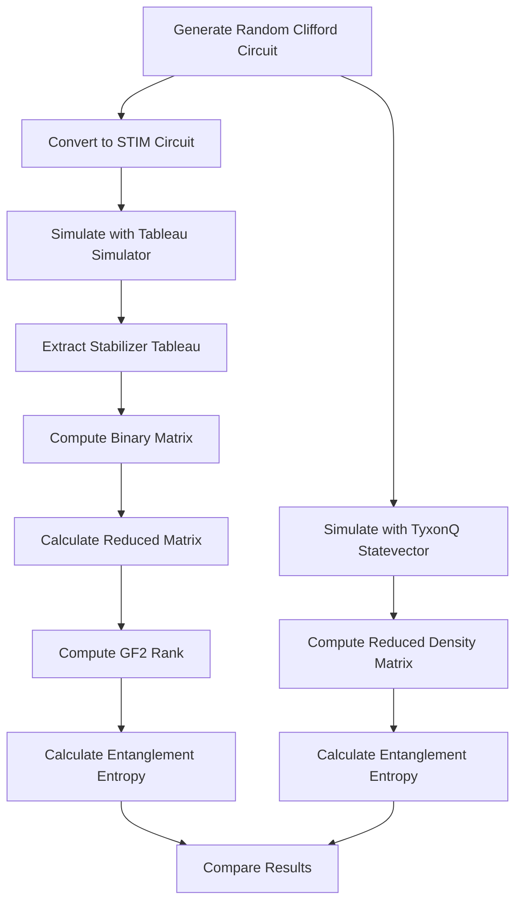
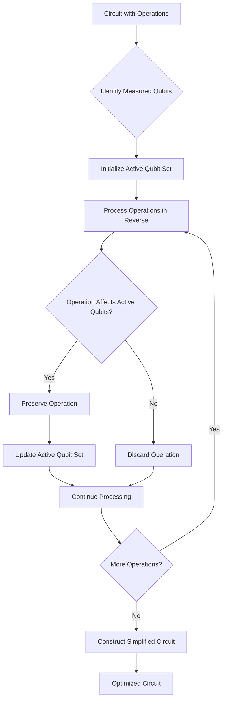

# Circuit Optimization Techniques

<cite>
**Referenced Files in This Document**   
- [clifford_optimization.py](file://examples-ng/clifford_optimization.py)
- [stabilizer_simulation.py](file://examples-ng/stabilizer_simulation.py)
- [lightcone_simplify.py](file://examples-ng/lightcone_simplify.py)
- [chaotic_behavior.py](file://examples-ng/chaotic_behavior.py)
- [lightcone.py](file://src/tyxonq/compiler/stages/simplify/lightcone.py)
</cite>

## Table of Contents
1. [Introduction](#introduction)
2. [Clifford Circuit Optimization](#clifford-circuit-optimization)
3. [Stabilizer State Simulation](#stabilizer-state-simulation)
4. [Lightcone-Based Circuit Simplification](#lightcone-based-circuit-simplification)
5. [Chaotic Behavior in Deep Circuits](#chaotic-behavior-in-deep-circuits)
6. [Practical Applications](#practical-applications)
7. [Integration with Compiler Pipeline](#integration-with-compiler-pipeline)
8. [Conclusion](#conclusion)

## Introduction
This document presents advanced circuit optimization techniques implemented in the TyxonQ framework, focusing on algorithmic and structural improvements for quantum circuits. The techniques cover Clifford circuit optimization using stabilizer formalism, efficient simulation of stabilizer states, lightcone-based simplification for reducing gate counts, and analysis of chaotic behavior in deep circuits. These methods enable circuit compression, noise resilience, and simulation speedup, with direct integration into the compiler pipeline for automated optimization workflows.

## Clifford Circuit Optimization

The `clifford_optimization.py` example implements DQAS-style (Differentiable Quantum Architecture Search) optimization for discrete Clifford-type circuits. It uses a parameterized ansatz where single-qubit and two-qubit gate choices are represented as continuous parameters that are discretized during optimization. The optimization process employs a Monte Carlo gradient estimation technique based on a naive mean-field probabilistic model.

The circuit structure is defined by two parameter tensors: `structureo` for single-qubit operations and `structuret` for two-qubit operations. These parameters control a weighted combination of Clifford gates (I, X, Y, Z, H, S, SD for single-qubit; II, CNOT, CZ for two-qubit). During optimization, the parameters are sampled to create discrete circuit instances, and gradients are computed using a custom Monte Carlo gradient function that accounts for the discrete nature of gate selection.

The optimization objective focuses on maximizing entanglement entropy by minimizing the negative entropy of the reduced density matrix, encouraging the discovery of circuits with complex entanglement patterns. The implementation leverages PyTorch's automatic differentiation and JIT compilation for efficient gradient computation and optimization.

**Section sources**
- [clifford_optimization.py](file://examples-ng/clifford_optimization.py#L0-L202)

## Stabilizer State Simulation

The `stabilizer_simulation.py` module provides an efficient method for simulating Clifford circuits with mid-circuit measurements using stabilizer formalism. It implements a hybrid approach that combines TyxonQ's circuit simulation capabilities with the STIM library for tableau-based stabilizer simulation.

The implementation generates random Clifford circuits containing H, X, Y, Z, S, and CNOT gates, with optional mid-circuit measurements. For circuits with measurements, the simulation uses post-selection to maintain consistency with measurement outcomes. The entanglement entropy is computed using the binary matrix representation of stabilizer generators, where the rank of the reduced binary matrix determines the entropy value.

The module validates its implementation by comparing entanglement entropy calculations between the stabilizer-based approach (using STIM) and full statevector simulation (using TyxonQ). The results demonstrate numerical equivalence, confirming the correctness of both implementations. This technique enables efficient simulation of large stabilizer circuits that would be infeasible with full statevector methods, providing exponential speedup for Clifford-dominated circuits.

**Diagram sources**
- [stabilizer_simulation.py](file://examples-ng/stabilizer_simulation.py#L0-L151)

**Section sources**
- [stabilizer_simulation.py](file://examples-ng/stabilizer_simulation.py#L0-L151)

## Lightcone-Based Circuit Simplification

Lightcone-based circuit simplification reduces gate counts by eliminating operations that do not influence measured qubits. The `lightcone_simplify.py` example demonstrates this technique by comparing expectation value computation with and without lightcone optimization. The implementation shows significant efficiency improvements, particularly for shallow circuits with localized measurements.

The core algorithm performs a backward slice from measured qubits to identify the "lightcone" of operations that affect the measurement outcomes. Single-qubit gates and entangling gates that act on qubits within the lightcone are preserved, while operations outside this causal cone are removed. Two-qubit gates propagate dependencies, expanding the active qubit set when they connect to measured qubits.

The compiler integration is implemented in `src/tyxonq/compiler/stages/simplify/lightcone.py` as the `LightconeSimplifyPass`. This pass processes the circuit operations in reverse order, maintaining an active set of qubits that eventually influence measurements. When an operation acts on any active qubit, it is preserved and its qubits are added to the active set. This approach ensures correctness while maximizing gate reduction.

**Diagram sources**
- [lightcone.py](file://src/tyxonq/compiler/stages/simplify/lightcone.py#L0-L98)
- [lightcone_simplify.py](file://examples-ng/lightcone_simplify.py#L0-L66)

**Section sources**
- [lightcone_simplify.py](file://examples-ng/lightcone_simplify.py#L0-L66)
- [lightcone.py](file://src/tyxonq/compiler/stages/simplify/lightcone.py#L0-L98)

## Chaotic Behavior in Deep Circuits

The `chaotic_behavior.py` module analyzes sensitivity in deep quantum circuits, illustrating how small parameter changes can lead to significant state variations. This chaotic behavior has important implications for optimization stability, particularly in deep variational circuits where the parameter space becomes increasingly rugged.

The implementation constructs a brickwall ansatz with alternating layers of single-qubit Y-rotations and nearest-neighbor CNOT gates. It computes various quantum information measures, including entanglement entropy of the reduced density matrix, which serves as a proxy for circuit complexity and scrambling. The frame potential is calculated to quantify the degree of randomness in the circuit's unitary evolution.

The module also demonstrates advanced differentiation techniques, including Jacobian computation for sensitivity analysis and Hessian calculation for curvature information. These derivatives reveal the highly non-linear nature of deep circuits, where small parameter changes can lead to orthogonal quantum states. The optimization example shows gradient descent dynamics, highlighting the challenges of navigating chaotic landscapes where gradients can be noisy and unstable.

**Section sources**
- [chaotic_behavior.py](file://examples-ng/chaotic_behavior.py#L0-L100)

## Practical Applications

These optimization techniques enable several practical applications in quantum computing:

### Circuit Compression
Lightcone simplification significantly reduces gate counts by eliminating irrelevant operations, leading to more compact circuits that are less susceptible to noise. This compression is particularly effective for circuits with localized measurements or when only specific qubits are of interest.

### Noise Resilience
Simplified circuits with fewer gates have shorter execution times and reduced exposure to decoherence and gate errors. Clifford optimization produces circuits with inherently better noise resilience due to the error-correcting properties of Clifford gates and the stabilizer formalism.

### Simulation Speedup
Stabilizer-based simulation provides exponential speedup for Clifford-dominated circuits, enabling the analysis of larger systems than possible with full statevector methods. The lightcone optimization also accelerates expectation value computations by reducing the effective circuit depth.

### Optimization Stability
Understanding chaotic behavior helps design more stable optimization protocols. By characterizing the sensitivity of deep circuits, researchers can develop regularization techniques, adaptive learning rates, and initialization strategies that mitigate the effects of chaotic landscapes.

**Section sources**
- [clifford_optimization.py](file://examples-ng/clifford_optimization.py#L0-L202)
- [stabilizer_simulation.py](file://examples-ng/stabilizer_simulation.py#L0-L151)
- [lightcone_simplify.py](file://examples-ng/lightcone_simplify.py#L0-L66)
- [chaotic_behavior.py](file://examples-ng/chaotic_behavior.py#L0-L100)

## Integration with Compiler Pipeline

The lightcone simplification technique is integrated into the TyxonQ compiler pipeline as a dedicated optimization pass. The `LightconeSimplifyPass` is registered in the compilation plan system and can be composed with other passes such as decomposition, measurement rewriting, and scheduling.

The compiler pipeline executes passes sequentially, with each pass transforming the circuit representation according to specific optimization goals. The lightcone pass operates on the intermediate representation (IR) of the circuit, analyzing operation dependencies and pruning irrelevant gates. This integration enables automated optimization workflows where circuit simplification occurs transparently during compilation.

The pass supports configuration options such as `assume_measure_all`, which treats all qubits as measured when no explicit measurements are present. This flexibility allows the optimization to adapt to different circuit patterns and use cases. The integration follows the composable pipeline design, allowing users to include or exclude the lightcone optimization based on their specific requirements.

**Diagram sources**
- [lightcone.py](file://src/tyxonq/compiler/stages/simplify/lightcone.py#L0-L98)
- [compile_plan.py](file://src/tyxonq/compiler/compile_engine/native/compile_plan.py#L0-L94)

**Section sources**
- [lightcone.py](file://src/tyxonq/compiler/stages/simplify/lightcone.py#L0-L98)
- [compile_plan.py](file://src/tyxonq/compiler/compile_engine/native/compile_plan.py#L0-L94)

## Conclusion
The circuit optimization techniques presented in this document provide powerful methods for improving quantum circuit efficiency and performance. Clifford optimization enables discovery of high-entanglement circuits through differentiable architecture search, while stabilizer simulation offers exponential speedup for Clifford-dominated circuits. Lightcone-based simplification reduces gate counts by eliminating irrelevant operations, and analysis of chaotic behavior informs more stable optimization strategies.

These techniques are not isolated tools but form an integrated ecosystem within the TyxonQ framework, with compiler-level support for automated optimization. The practical applications in circuit compression, noise resilience, and simulation speedup make these methods essential for advancing quantum computing research and applications. Future work could extend these techniques to hybrid quantum-classical optimization, dynamic circuit optimization, and integration with error mitigation strategies.