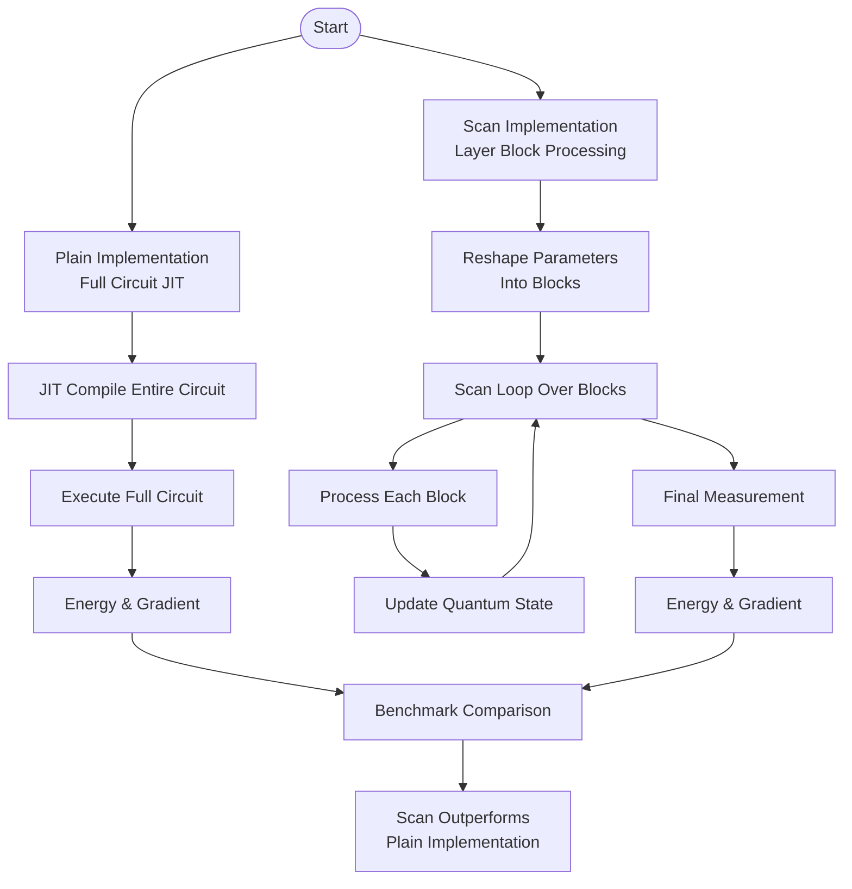
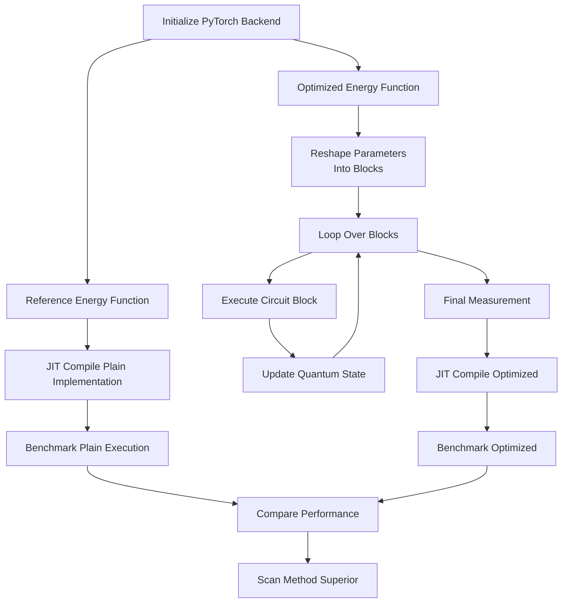
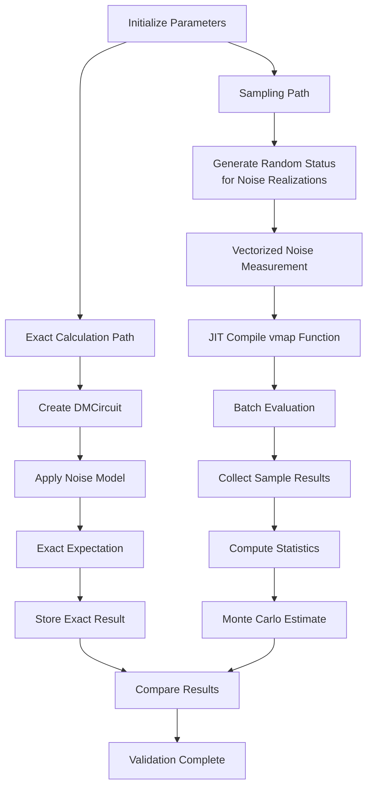
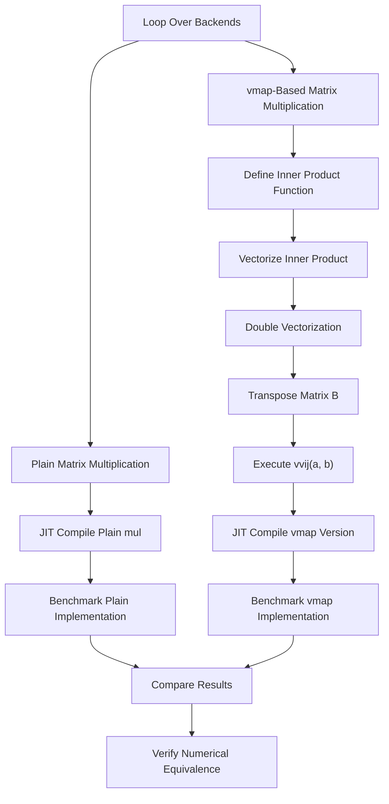
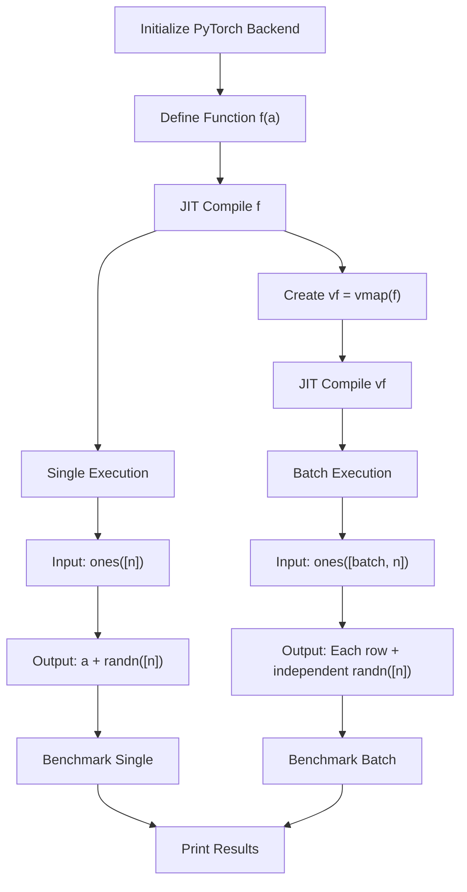

# High-Performance Simulations

<cite>
**Referenced Files in This Document**   
- [hea_scan_jit_acc.py](file://examples-ng/hea_scan_jit_acc.py)
- [pytorch_scan_jit_acc.py](file://examples-ng/pytorch_scan_jit_acc.py)
- [noisy_sampling_jit.py](file://examples-ng/noisy_sampling_jit.py)
- [matprod_vmap.py](file://examples-ng/matprod_vmap.py)
- [vmap_randomness.py](file://examples-ng/vmap_randomness.py)
</cite>

## Table of Contents
1. [Introduction](#introduction)
2. [JIT Compilation for HEA Circuit Scanning](#jit-compilation-for-hea-circuit-scanning)
3. [PyTorch Integration with JIT Acceleration](#pytorch-integration-with-jit-acceleration)
4. [Performance-Critical Noisy Circuit Sampling](#performance-critical-noisy-circuit-sampling)
5. [Vectorized Operations with vmap](#vectorized-operations-with-vmap)
6. [Randomness Handling in Vectorized Workflows](#randomness-handling-in-vectorized-workflows)
7. [Implementation Patterns for Computational Throughput](#implementation-patterns-for-computational-throughput)
8. [Performance Benchmarks and Optimization Tips](#performance-benchmarks-and-optimization-tips)
9. [Integration with Accelerator Backends](#integration-with-accelerator-backends)

## Introduction
This document details high-performance simulation techniques in the TyxonQ framework, focusing on Just-In-Time (JIT) compilation and vectorized execution strategies. The analysis covers key examples demonstrating accelerated parameter scanning for Hardware-Efficient Ansatz (HEA) circuits, hybrid workflows with PyTorch integration, performance-critical noisy circuit sampling, and vectorized operations using functional programming constructs. These techniques enable researchers to maximize computational throughput, reduce compilation overhead, and leverage modern accelerator backends for quantum simulations.

## JIT Compilation for HEA Circuit Scanning
The `hea_scan_jit_acc.py` example demonstrates how JIT compilation can significantly accelerate parameter scanning for HEA circuits by reducing compilation time through efficient scan operations. The implementation compares a plain approach with a scan-based optimization that partitions circuit layers into blocks for more efficient execution.

The core innovation lies in restructuring the quantum circuit execution to minimize JIT recompilation overhead. Instead of compiling the entire circuit at once, the scan-based approach processes circuit layers in chunks, allowing the JIT compiler to optimize smaller, repeated computational units. This is particularly effective for deep circuits with repetitive layer structures common in variational quantum algorithms.

**Diagram sources**
- [hea_scan_jit_acc.py](file://examples-ng/hea_scan_jit_acc.py#L20-L78)

**Section sources**
- [hea_scan_jit_acc.py](file://examples-ng/hea_scan_jit_acc.py#L1-L78)

## PyTorch Integration with JIT Acceleration
The `pytorch_scan_jit_acc.py` example illustrates how PyTorch can be integrated with JIT compilation for hybrid quantum-classical workflows. This approach leverages PyTorch's automatic differentiation capabilities while optimizing execution performance through scan operations that reduce compilation overhead.

The implementation demonstrates a critical optimization pattern where circuit layers are processed in blocks using PyTorch's scan functionality. This allows the JIT compiler to optimize smaller computational units that are executed repeatedly, rather than compiling the entire circuit as a single monolithic unit. The approach is particularly beneficial for deep circuits where compilation time can become a significant bottleneck.

The code shows two implementation paths: a reference implementation using standard PyTorch operations and an optimized version using scan-based processing. The benchmark results demonstrate that the scan-based approach can achieve better performance both in terms of compilation time and execution speed, especially when processing circuits in smaller blocks.

**Diagram sources**
- [pytorch_scan_jit_acc.py](file://examples-ng/pytorch_scan_jit_acc.py#L20-L93)

**Section sources**
- [pytorch_scan_jit_acc.py](file://examples-ng/pytorch_scan_jit_acc.py#L1-L93)

## Performance-Critical Noisy Circuit Sampling
The `noisy_sampling_jit.py` example addresses performance-critical noisy circuit sampling, which is essential for hardware simulation and Monte Carlo methods. The implementation demonstrates how to efficiently simulate noisy quantum circuits using JIT compilation and vectorized execution for statistical accuracy.

The core approach involves creating a noise model with depolarizing channels applied after entangling gates, then using JIT-compiled functions to perform both exact expectation value calculations and Monte Carlo sampling. The key innovation is the use of vectorized mapping (vmap) to perform batched evaluations of noisy circuits with different random noise realizations, enabling efficient statistical estimation of observables.

The code implements two complementary methods: an exact calculation using density matrix simulation for baseline comparison, and a Monte Carlo approach using sampling for hardware-realistic simulation. The vectorized execution allows thousands of noise realizations to be processed efficiently, providing accurate statistical estimates while maintaining computational feasibility.

**Diagram sources**
- [noisy_sampling_jit.py](file://examples-ng/noisy_sampling_jit.py#L1-L62)

**Section sources**
- [noisy_sampling_jit.py](file://examples-ng/noisy_sampling_jit.py#L1-L62)

## Vectorized Operations with vmap
The `matprod_vmap.py` example demonstrates how vectorized operations can be implemented using vmap for improved computational efficiency. This approach rewrites matrix multiplication operations in a functional style that enables automatic vectorization across different backends.

The implementation compares traditional matrix multiplication with a vmap-based approach that decomposes the operation into inner products and leverages vectorized mapping for parallel execution. The key insight is that by expressing matrix multiplication as a series of vectorized inner products, the computation can be optimized more effectively by the underlying backend, particularly when using JIT compilation.

The code tests the implementation across different matrix shapes and benchmarks both approaches to verify numerical equivalence while comparing performance characteristics. The results show that the vmap-based approach can achieve comparable or better performance, especially when combined with JIT compilation, demonstrating the effectiveness of functional programming constructs for numerical computing.

**Diagram sources**
- [matprod_vmap.py](file://examples-ng/matprod_vmap.py#L1-L42)

**Section sources**
- [matprod_vmap.py](file://examples-ng/matprod_vmap.py#L1-L42)

## Randomness Handling in Vectorized Workflows
The `vmap_randomness.py` example explores the interplay between JIT compilation, vectorized mapping (vmap), and randomness generation in quantum simulations. This is a critical aspect of high-performance computing where reproducible randomness must be efficiently managed across batched operations.

The implementation demonstrates how random number generation behaves differently in standard versus vectorized contexts. When a JIT-compiled function containing randomness is executed normally, it produces a single random output. However, when the same function is vectorized using vmap, each batch element receives independent random values, enabling efficient simulation of multiple stochastic processes.

The code highlights an important design consideration: the placement of randomness generation within the computational graph. By encapsulating random operations within JIT-compiled functions and then applying vmap, the framework can efficiently generate independent random samples for each batch element while maintaining the performance benefits of compilation and vectorization.

**Diagram sources**
- [vmap_randomness.py](file://examples-ng/vmap_randomness.py#L1-L27)

**Section sources**
- [vmap_randomness.py](file://examples-ng/vmap_randomness.py#L1-L27)

## Implementation Patterns for Computational Throughput
Several key implementation patterns emerge from the analyzed examples that maximize computational throughput in quantum simulations:

**Layer Block Processing**: Instead of processing entire circuits at once, partitioning circuit layers into blocks and using scan operations reduces JIT compilation overhead and improves cache efficiency. This is particularly effective for deep circuits with repetitive structures.

**Functional Vectorization**: Using vmap to express operations in a vectorized functional style enables automatic parallelization across batch dimensions. This pattern is especially powerful when combined with JIT compilation, as the compiler can optimize the vectorized operations more effectively.

**Hybrid Execution Strategies**: Combining exact numerical methods with sampling-based approaches allows for efficient validation and error estimation. Exact calculations provide baselines, while sampling enables hardware-realistic simulations with statistical accuracy.

**Backend-Agnostic Design**: The examples demonstrate how algorithms can be written to work across different backends (NumPy, PyTorch, CuPyNumeric) without modification, enabling seamless switching between CPU and GPU execution based on availability and performance requirements.

**Memory-Efficient State Management**: By processing circuit blocks sequentially and updating quantum states incrementally, the implementations minimize memory usage while maintaining computational efficiency, which is crucial for large-scale simulations.

## Performance Benchmarks and Optimization Tips
The examples include comprehensive benchmarking that reveals several important performance characteristics and optimization opportunities:

**Scan Block Size Optimization**: The performance of scan-based implementations depends critically on the block size parameter. Too small blocks increase overhead from loop management, while too large blocks reduce the effectiveness of JIT optimization. The optimal block size depends on circuit depth and hardware characteristics.

**JIT Compilation Trade-offs**: While JIT compilation improves execution speed, it introduces compilation overhead. For small circuits or single executions, this overhead may not be justified. However, for repeated executions or large circuits, the performance benefits typically outweigh the compilation cost.

**Vectorization Benefits**: Vectorized operations consistently outperform their non-vectorized counterparts, especially when processing batched data. The performance advantage increases with batch size due to better utilization of parallel hardware.

**Backend Selection**: PyTorch generally provides the best performance for these workloads, particularly when leveraging GPU acceleration. However, the optimal backend may vary depending on the specific operation and hardware configuration.

**Memory vs. Computation Trade-off**: The scan-based approaches trade increased computational complexity for reduced memory usage, making them suitable for memory-constrained environments or very deep circuits.

## Integration with Accelerator Backends
The examples demonstrate seamless integration with accelerator backends through TyxonQ's unified numeric backend abstraction. This architecture allows the same code to run on different computational platforms without modification, enabling researchers to leverage available hardware resources efficiently.

The framework supports multiple backends including NumPy (CPU), PyTorch (CPU/GPU), and CuPyNumeric (GPU), with automatic selection and optimization based on system configuration. The backend abstraction handles differences in array operations, random number generation, and automatic differentiation, providing a consistent interface regardless of the underlying computational engine.

This integration enables hybrid workflows where different parts of a computation can be executed on the most appropriate hardware. For example, classical preprocessing can occur on CPU while quantum circuit simulation leverages GPU acceleration, all within a unified programming model that maintains code simplicity and readability.