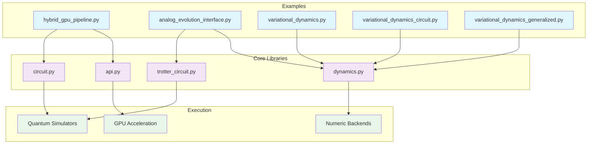
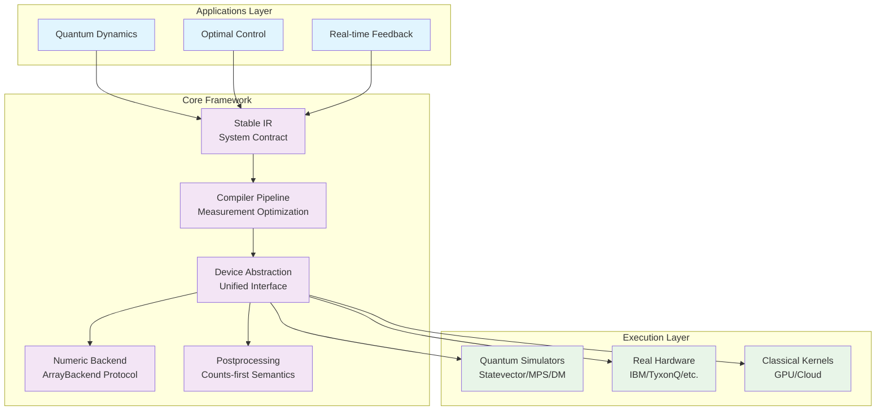
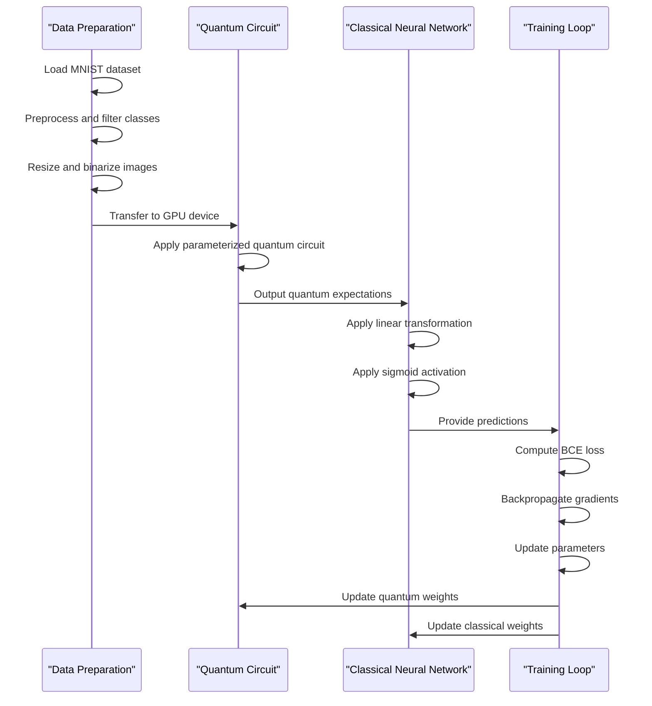
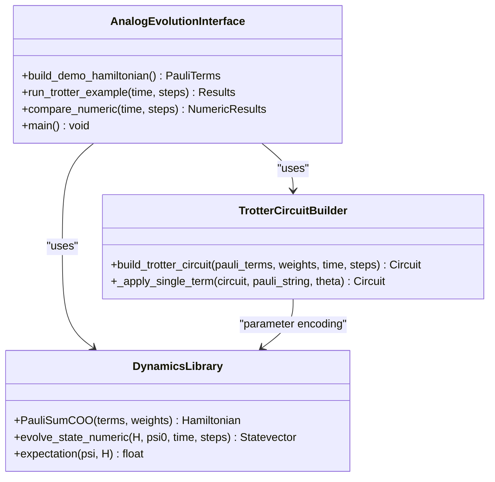
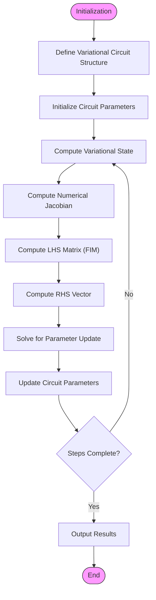
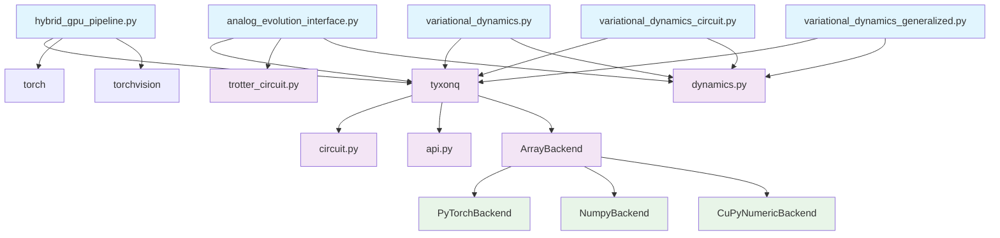

# Hybrid Computing Pipelines

<cite>
**Referenced Files in This Document**   
- [hybrid_gpu_pipeline.py](file://examples-ng/hybrid_gpu_pipeline.py)
- [analog_evolution_interface.py](file://examples-ng/analog_evolution_interface.py)
- [variational_dynamics.py](file://examples-ng/variational_dynamics.py)
- [variational_dynamics_circuit.py](file://examples-ng/variational_dynamics_circuit.py)
- [variational_dynamics_generalized.py](file://examples-ng/variational_dynamics_generalized.py)
- [trotter_circuit.py](file://src/tyxonq/libs/circuits_library/trotter_circuit.py)
- [dynamics.py](file://src/tyxonq/libs/quantum_library/dynamics.py)
- [circuit.py](file://src/tyxonq/core/ir/circuit.py)
- [api.py](file://src/tyxonq/numerics/api.py)
</cite>

## Table of Contents
1. [Introduction](#introduction)
2. [Project Structure](#project-structure)
3. [Core Components](#core-components)
4. [Architecture Overview](#architecture-overview)
5. [Detailed Component Analysis](#detailed-component-analysis)
6. [Dependency Analysis](#dependency-analysis)
7. [Performance Considerations](#performance-considerations)
8. [Troubleshooting Guide](#troubleshooting-guide)
9. [Conclusion](#conclusion)

## Introduction
This document provides comprehensive documentation for hybrid computing pipelines in the TyxonQ framework, focusing on the integration of quantum and classical processing units. The analysis covers key components including `hybrid_gpu_pipeline.py` for orchestrating quantum simulations with GPU-accelerated classical computation, `analog_evolution_interface.py` for analog Hamiltonian evolution, and `variational_dynamics*.py` scripts for dynamical quantum simulations with classical optimization loops. The document details data flow between quantum and classical components, synchronization patterns, resource allocation in heterogeneous computing environments, and use cases in quantum dynamics, optimal control, and real-time feedback systems.

## Project Structure
The hybrid computing pipeline components are organized within the examples-ng directory of the TyxonQ repository, with core functionality distributed across multiple modules in the src/tyxonq directory. The architecture follows a layered approach with clear separation between quantum algorithms, classical computation, and execution layers.

**Diagram sources**
- [hybrid_gpu_pipeline.py](file://examples-ng/hybrid_gpu_pipeline.py)
- [analog_evolution_interface.py](file://examples-ng/analog_evolution_interface.py)
- [variational_dynamics.py](file://examples-ng/variational_dynamics.py)
- [variational_dynamics_circuit.py](file://examples-ng/variational_dynamics_circuit.py)
- [variational_dynamics_generalized.py](file://examples-ng/variational_dynamics_generalized.py)

**Section sources**
- [hybrid_gpu_pipeline.py](file://examples-ng/hybrid_gpu_pipeline.py)
- [analog_evolution_interface.py](file://examples-ng/analog_evolution_interface.py)
- [variational_dynamics.py](file://examples-ng/variational_dynamics.py)
- [variational_dynamics_circuit.py](file://examples-ng/variational_dynamics_circuit.py)
- [variational_dynamics_generalized.py](file://examples-ng/variational_dynamics_generalized.py)

## Core Components
The hybrid computing pipeline consists of three main components: the GPU-accelerated hybrid pipeline, analog evolution interface, and variational dynamics framework. These components enable seamless integration between quantum simulations and classical optimization, leveraging GPU acceleration for improved performance. The system supports various quantum algorithms including variational quantum eigensolvers and time evolution simulations, with flexible backend configuration through the ArrayBackend protocol.

**Section sources**
- [hybrid_gpu_pipeline.py](file://examples-ng/hybrid_gpu_pipeline.py)
- [analog_evolution_interface.py](file://examples-ng/analog_evolution_interface.py)
- [variational_dynamics.py](file://examples-ng/variational_dynamics.py)

## Architecture Overview
The hybrid computing architecture implements a dual-path execution model with semantic consistency between device and numeric paths. The framework utilizes a stable intermediate representation (IR) as a system-wide contract, compiler-driven measurement optimization with explicit grouping and shot scheduling, and a single numeric backend abstraction enabling seamless integration with machine learning frameworks.

**Diagram sources**
- [hybrid_gpu_pipeline.py](file://examples-ng/hybrid_gpu_pipeline.py)
- [analog_evolution_interface.py](file://examples-ng/analog_evolution_interface.py)
- [variational_dynamics.py](file://examples-ng/variational_dynamics.py)
- [circuit.py](file://src/tyxonq/core/ir/circuit.py)
- [api.py](file://src/tyxonq/numerics/api.py)

## Detailed Component Analysis

### Hybrid GPU Pipeline Analysis
The hybrid_gpu_pipeline.py implementation demonstrates quantum-classical integration with both components running on GPU. The pipeline uses PyTorch as the backend for both quantum and classical computations, enabling efficient data transfer through DLPack. The architecture employs TorchLayer to integrate quantum circuits as differentiable layers within neural networks, facilitating end-to-end training.

**Diagram sources**
- [hybrid_gpu_pipeline.py](file://examples-ng/hybrid_gpu_pipeline.py)

**Section sources**
- [hybrid_gpu_pipeline.py](file://examples-ng/hybrid_gpu_pipeline.py)

### Analog Evolution Interface Analysis
The analog_evolution_interface.py component provides functionality for analog Hamiltonian evolution through Trotterization. The implementation constructs evolution circuits from Pauli string decompositions and supports both quantum simulation and classical numeric comparison. The interface enables verification of quantum results against classical numeric solutions.

**Diagram sources**
- [analog_evolution_interface.py](file://examples-ng/analog_evolution_interface.py)
- [trotter_circuit.py](file://src/tyxonq/libs/circuits_library/trotter_circuit.py)
- [dynamics.py](file://src/tyxonq/libs/quantum_library/dynamics.py)

**Section sources**
- [analog_evolution_interface.py](file://examples-ng/analog_evolution_interface.py)
- [trotter_circuit.py](file://src/tyxonq/libs/circuits_library/trotter_circuit.py)
- [dynamics.py](file://src/tyxonq/libs/quantum_library/dynamics.py)

### Variational Dynamics Analysis
The variational_dynamics*.py scripts implement variational quantum simulation algorithms for quantum dynamics. These components use parameterized quantum circuits to represent time-evolving quantum states, with classical optimization loops to update circuit parameters according to equations of motion.

**Diagram sources**
- [variational_dynamics.py](file://examples-ng/variational_dynamics.py)
- [variational_dynamics_generalized.py](file://examples-ng/variational_dynamics_generalized.py)
- [variational_dynamics_circuit.py](file://examples-ng/variational_dynamics_circuit.py)

**Section sources**
- [variational_dynamics.py](file://examples-ng/variational_dynamics.py)
- [variational_dynamics_generalized.py](file://examples-ng/variational_dynamics_generalized.py)
- [variational_dynamics_circuit.py](file://examples-ng/variational_dynamics_circuit.py)

## Dependency Analysis
The hybrid computing pipeline components exhibit a well-defined dependency structure with clear separation between quantum algorithms, classical computation, and execution layers. The system relies on the ArrayBackend protocol for numeric operations, enabling backend flexibility while maintaining consistent interfaces.

**Diagram sources**
- [hybrid_gpu_pipeline.py](file://examples-ng/hybrid_gpu_pipeline.py)
- [analog_evolution_interface.py](file://examples-ng/analog_evolution_interface.py)
- [variational_dynamics.py](file://examples-ng/variational_dynamics.py)
- [variational_dynamics_circuit.py](file://examples-ng/variational_dynamics_circuit.py)
- [variational_dynamics_generalized.py](file://examples-ng/variational_dynamics_generalized.py)
- [circuit.py](file://src/tyxonq/core/ir/circuit.py)
- [api.py](file://src/tyxonq/numerics/api.py)

**Section sources**
- [hybrid_gpu_pipeline.py](file://examples-ng/hybrid_gpu_pipeline.py)
- [analog_evolution_interface.py](file://examples-ng/analog_evolution_interface.py)
- [variational_dynamics.py](file://examples-ng/variational_dynamics.py)
- [variational_dynamics_circuit.py](file://examples-ng/variational_dynamics_circuit.py)
- [variational_dynamics_generalized.py](file://examples-ng/variational_dynamics_generalized.py)
- [circuit.py](file://src/tyxonq/core/ir/circuit.py)
- [api.py](file://src/tyxonq/numerics/api.py)

## Performance Considerations
The hybrid computing pipeline is designed for optimal performance in heterogeneous computing environments. Key performance features include GPU acceleration through PyTorch backend, efficient data transfer via DLPack, JIT compilation of quantum operations, and vectorized execution of parameterized circuits. The framework supports multiple numeric backends (NumPy, PyTorch, CuPy) allowing users to select the most appropriate backend for their hardware configuration. For large-scale simulations, the system can leverage matrix product state (MPS) and density matrix simulators to manage computational complexity.

**Section sources**
- [hybrid_gpu_pipeline.py](file://examples-ng/hybrid_gpu_pipeline.py)
- [api.py](file://src/tyxonq/numerics/api.py)

## Troubleshooting Guide
Common issues in hybrid computing pipelines typically relate to backend configuration, GPU memory management, and numerical stability. Ensure the correct numeric backend is configured using `tq.set_backend()`. For GPU out-of-memory errors, reduce batch sizes or use mixed precision training. When comparing quantum and classical results, verify that the same Hamiltonian representation and evolution parameters are used in both paths. For convergence issues in variational algorithms, adjust the learning rate or increase the number of Trotter steps. Always validate circuit compilation and measurement settings before execution.

**Section sources**
- [hybrid_gpu_pipeline.py](file://examples-ng/hybrid_gpu_pipeline.py)
- [analog_evolution_interface.py](file://examples-ng/analog_evolution_interface.py)
- [variational_dynamics.py](file://examples-ng/variational_dynamics.py)

## Conclusion
The hybrid computing pipeline in TyxonQ provides a comprehensive framework for integrating quantum and classical processing units. The architecture supports various quantum algorithms including variational quantum eigensolvers and time evolution simulations, with flexible backend configuration and GPU acceleration. The system's modular design enables seamless integration of new algorithms and hardware platforms while maintaining consistent interfaces across different execution paths. This approach facilitates research and development in quantum dynamics, optimal control, and real-time feedback systems, providing a robust foundation for hybrid quantum-classical applications.