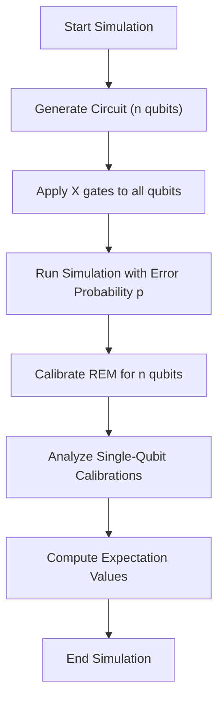
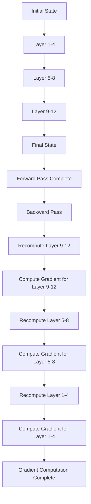
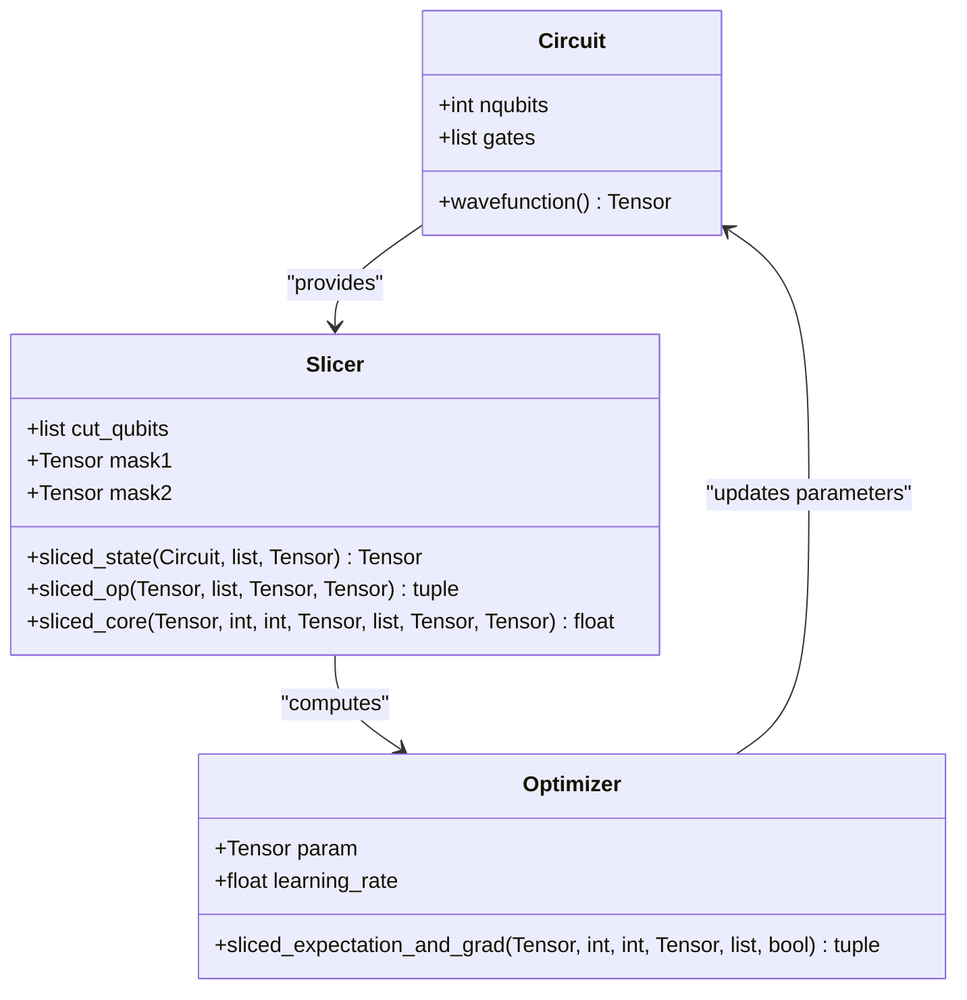
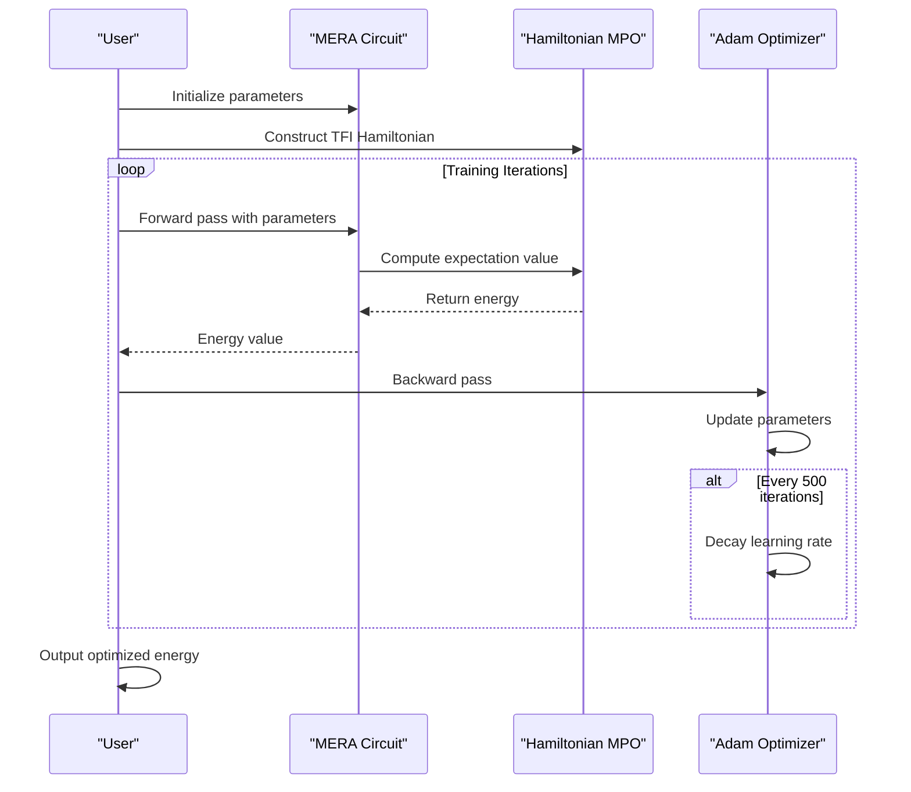
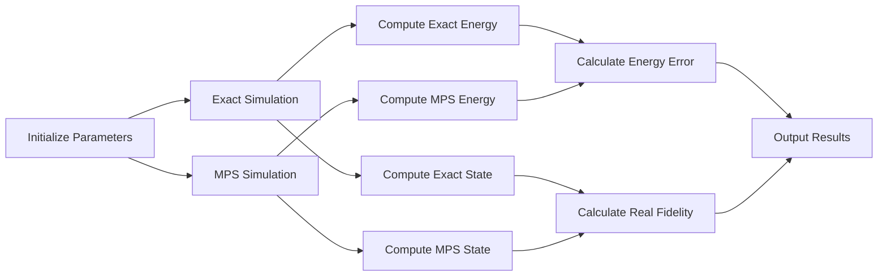

# Large-Scale Computing

<cite>
**Referenced Files in This Document**   
- [rem_super_large_scale.py](file://examples-ng/rem_super_large_scale.py)
- [checkpoint_memsave.py](file://examples-ng/checkpoint_memsave.py)
- [slicing_wavefunction_vqa.py](file://examples-ng/slicing_wavefunction_vqa.py)
- [mera_extra_mpo.py](file://examples-ng/mera_extra_mpo.py)
- [mpsvsexact.py](file://examples-ng/mpsvsexact.py)
</cite>

## Table of Contents
1. [Introduction](#introduction)
2. [Core Components](#core-components)
3. [Memory-Efficient Quantum Simulation Strategies](#memory-efficient-quantum-simulation-strategies)
4. [Scalable Variational Quantum Algorithms](#scalable-variational-quantum-algorithms)
5. [MERA and MPO-Based Simulations](#mera-and-mpo-based-simulations)
6. [Accuracy and Approximation Analysis](#accuracy-and-approximation-analysis)
7. [Configuration and Resource Management](#configuration-and-resource-management)
8. [Best Practices for Large-Scale Quantum Computing](#best-practices-for-large-scale-quantum-computing)

## Introduction
This document provides comprehensive coverage of memory-efficient and scalable quantum algorithms within the TyxonQ framework. It focuses on advanced techniques for simulating large quantum systems that exceed standard hardware memory limits, with particular emphasis on resource management, memory-saving checkpointing, wavefunction slicing, and tensor network-based simulations. The content addresses critical challenges in quantum many-body physics simulations, including memory bottlenecks, accuracy-scalability trade-offs, and practical implementation strategies for variational quantum algorithms (VQAs) and matrix product state (MPS) simulations.

## Core Components

The TyxonQ framework implements several specialized components for large-scale quantum computation, each addressing specific aspects of memory efficiency and scalability. These include rem_super_large_scale.py for readout error mitigation in large systems, checkpoint_memsave.py for memory-saving execution of deep circuits, slicing_wavefunction_vqa.py for wavefunction slicing in variational contexts, mera_extra_mpo.py for MERA-based simulations using matrix product operators, and mpsvsexact.py for accuracy comparison between MPS and exact simulations.

**Section sources**
- [rem_super_large_scale.py](file://examples-ng/rem_super_large_scale.py#L1-L58)
- [checkpoint_memsave.py](file://examples-ng/checkpoint_memsave.py#L1-L119)
- [slicing_wavefunction_vqa.py](file://examples-ng/slicing_wavefunction_vqa.py#L1-L204)
- [mera_extra_mpo.py](file://examples-ng/mera_extra_mpo.py#L1-L127)
- [mpsvsexact.py](file://examples-ng/mpsvsexact.py#L1-L91)

## Memory-Efficient Quantum Simulation Strategies

### Resource Management in Large Quantum Systems
The rem_super_large_scale.py module demonstrates the limitations of readout error mitigation (REM) techniques as qubit count increases relative to error probability. It implements a simplified simulation engine that models bit-flip errors during measurement, showing how REM calibration becomes impractical when the number of qubits significantly exceeds the inverse of the error rate. This highlights the need for alternative error mitigation strategies in large-scale systems.

**Diagram sources**
- [rem_super_large_scale.py](file://examples-ng/rem_super_large_scale.py#L1-L58)

**Section sources**
- [rem_super_large_scale.py](file://examples-ng/rem_super_large_scale.py#L1-L58)

### Memory-Saving Checkpointing in Deep Circuits
The checkpoint_memsave.py implementation provides a memory-efficient approach for computing gradients in deep quantum circuits through recursive checkpointing. By trading off computation time for reduced memory usage, this technique enables the simulation of deeper circuits that would otherwise exceed available memory. The implementation uses PyTorch as backend with complex64 precision and employs cotengra for tensor contraction optimization.

The recursive checkpointing strategy breaks down the circuit evolution into segments, recomputing intermediate states during backpropagation rather than storing them. This approach is particularly valuable for variational quantum algorithms with many layers, where gradient computation typically requires substantial memory for storing intermediate wavefunctions.

**Diagram sources**
- [checkpoint_memsave.py](file://examples-ng/checkpoint_memsave.py#L1-L119)

**Section sources**
- [checkpoint_memsave.py](file://examples-ng/checkpoint_memsave.py#L1-L119)

## Scalable Variational Quantum Algorithms

### Wavefunction Slicing for VQA Optimization
The slicing_wavefunction_vqa.py module implements a memory-saving technique for variational quantum algorithms by slicing the wavefunction across selected qubits. This approach decomposes the full Hilbert space into manageable subspaces, enabling the computation of expectation values without storing the complete wavefunction.

The implementation uses tensor network contraction with strategic slicing of specified qubits (defined by the 'cut' parameter). For each Pauli operator term, it computes contributions from all possible basis states on the sliced qubits, combining them to obtain the total expectation value. This method significantly reduces memory requirements while maintaining accuracy, making it suitable for large-scale VQA implementations.

**Diagram sources**
- [slicing_wavefunction_vqa.py](file://examples-ng/slicing_wavefunction_vqa.py#L1-L204)

**Section sources**
- [slicing_wavefunction_vqa.py](file://examples-ng/slicing_wavefunction_vqa.py#L1-L204)

## MERA and MPO-Based Simulations

### Multiscale Entanglement Renormalization Ansatz
The mera_extra_mpo.py implementation demonstrates the use of MERA (Multiscale Entanglement Renormalization Ansatz) for quantum simulation with Hamiltonian expectation computed via matrix product operators (MPOs). MERA provides an efficient representation of quantum states with hierarchical entanglement structure, making it particularly suitable for critical systems and quantum field theories.

The implementation constructs a MERA circuit with alternating disentangler and isometry layers, parameterized by rotation angles. It uses tensornetwork for MPO representation of the Hamiltonian and cotengra for optimized tensor contraction. The training loop supports batched parameter updates and includes learning rate scheduling for improved convergence.

**Diagram sources**
- [mera_extra_mpo.py](file://examples-ng/mera_extra_mpo.py#L1-L127)

**Section sources**
- [mera_extra_mpo.py](file://examples-ng/mera_extra_mpo.py#L1-L127)

## Accuracy and Approximation Analysis

### MPS Simulation Accuracy Benchmarking
The mpsvsexact.py module provides a benchmark for evaluating the approximation power of matrix product state (MPS) simulations compared to exact statevector methods. It computes the energy of a transverse field Ising model using both exact and MPS-based approaches, comparing results across different bond dimensions.

The implementation quantifies approximation quality through multiple metrics: energy relative error, estimated fidelity from the MPS simulator, and real fidelity computed as the overlap between MPS and exact wavefunctions. This comprehensive comparison reveals how approximation accuracy improves with increasing bond dimension and highlights the entanglement limitations of MPS representations.

**Diagram sources**
- [mpsvsexact.py](file://examples-ng/mpsvsexact.py#L1-L91)

**Section sources**
- [mpsvsexact.py](file://examples-ng/mpsvsexact.py#L1-L91)

## Configuration and Resource Management

Effective large-scale quantum simulation requires careful configuration of computational resources and algorithmic parameters. Key configuration settings include backend selection (PyTorch, NumPy, or CuPy), data type precision (complex64 or complex128), tensor contraction optimization strategies, and memory management policies.

The examples demonstrate various configuration approaches:
- Using cotengra's ReusableHyperOptimizer with greedy method for fast contraction path finding
- Setting static memory limits for tensor contractions to prevent out-of-memory errors
- Implementing JIT compilation and vectorized operations for performance optimization
- Configuring logging and profiling for monitoring resource usage

Memory profiling techniques are essential for identifying bottlenecks in large-scale simulations. The framework supports integration with external profiling tools and provides built-in timing measurements for critical operations, enabling users to optimize their simulations based on empirical performance data.

**Section sources**
- [checkpoint_memsave.py](file://examples-ng/checkpoint_memsave.py#L1-L119)
- [mera_extra_mpo.py](file://examples-ng/mera_extra_mpo.py#L1-L127)
- [mpsvsexact.py](file://examples-ng/mpsvsexact.py#L1-L91)

## Best Practices for Large-Scale Quantum Computing

### Handling Memory Bottlenecks
When simulating quantum systems beyond standard hardware limits, several strategies can mitigate memory bottlenecks:
1. Use recursive checkpointing to trade computation time for reduced memory usage
2. Implement wavefunction slicing to decompose large Hilbert spaces
3. Employ tensor network methods (MPS, MERA) with controlled bond dimensions
4. Utilize mixed-precision arithmetic where appropriate
5. Optimize tensor contraction paths using advanced optimizers like cotengra

### Accuracy-Scalability Trade-offs
Quantum simulations inevitably face trade-offs between accuracy and scalability:
- Higher bond dimensions in MPS/MERA improve accuracy but increase computational cost
- Reduced precision formats (complex64 vs complex128) enhance performance but may affect convergence
- Approximate contraction methods speed up computation but may introduce numerical errors
- Slicing techniques reduce memory usage but require summing over additional terms

### Real-World Applications in Quantum Many-Body Physics
These techniques are particularly valuable for simulating quantum many-body systems such as:
- Transverse field Ising models for studying quantum phase transitions
- Heisenberg spin chains for investigating magnetic properties
- Fermionic systems in quantum chemistry applications
- Critical systems requiring multiscale analysis

The demonstrated methods enable researchers to explore larger system sizes and more complex Hamiltonians than previously possible, advancing the frontier of classical quantum simulation capabilities.

**Section sources**
- [rem_super_large_scale.py](file://examples-ng/rem_super_large_scale.py#L1-L58)
- [checkpoint_memsave.py](file://examples-ng/checkpoint_memsave.py#L1-L119)
- [slicing_wavefunction_vqa.py](file://examples-ng/slicing_wavefunction_vqa.py#L1-L204)
- [mera_extra_mpo.py](file://examples-ng/mera_extra_mpo.py#L1-L127)
- [mpsvsexact.py](file://examples-ng/mpsvsexact.py#L1-L91)