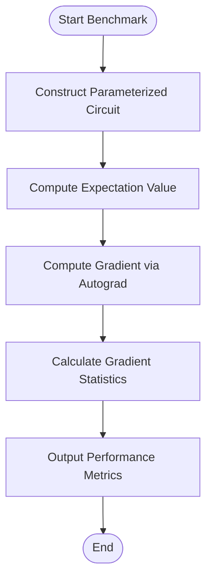
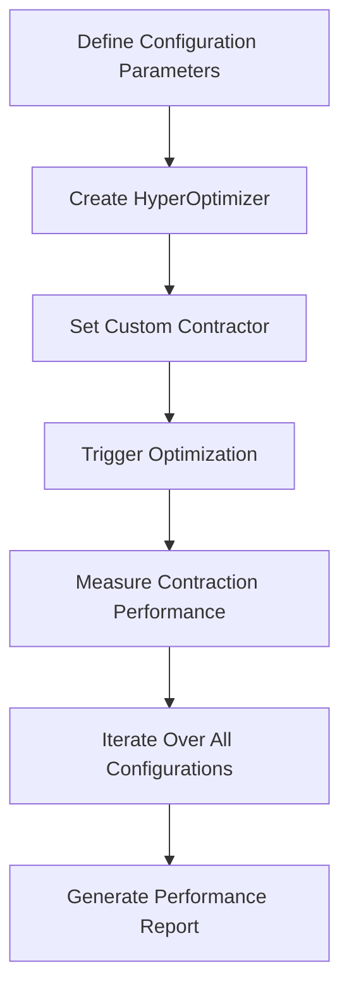
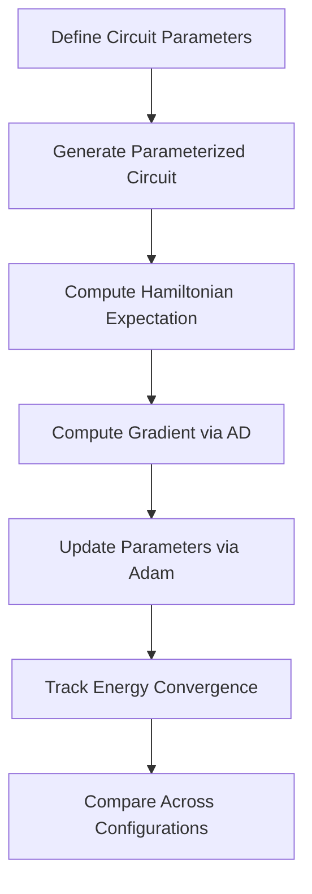
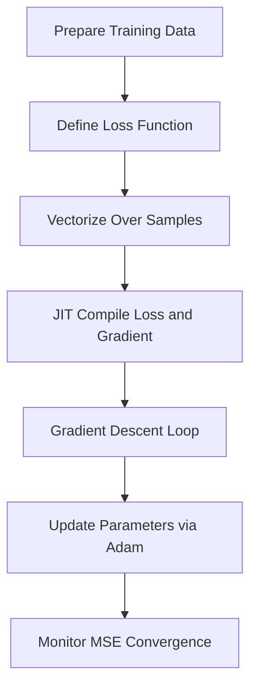

# Optimization and Benchmarking

<cite>
**Referenced Files in This Document**   
- [bp_benchmark.py](file://examples-ng/bp_benchmark.py)
- [bp_validation.py](file://examples-ng/bp_validation.py)
- [cotengra_setting_bench.py](file://examples-ng/cotengra_setting_bench.py)
- [optperformance_comparison.py](file://examples-ng/optperformance_comparison.py)
- [universal_lr.py](file://examples-ng/universal_lr.py)
</cite>

## Table of Contents
1. [Introduction](#introduction)
2. [Benchmarking Methodologies](#benchmarking-methodologies)
3. [Backpropagation Performance Analysis](#backpropagation-performance-analysis)
4. [Tensor Contraction Optimization](#tensor-contraction-optimization)
5. [Optimizer Benchmarking](#optimizer-benchmarking)
6. [Learning Rate Adaptation](#learning-rate-adaptation)
7. [Performance Profiling Tools](#performance-profiling-tools)
8. [Best Practices for Reproducible Benchmarking](#best-practices-for-reproducible-benchmarking)
9. [Conclusion](#conclusion)

## Introduction
This document provides comprehensive guidance on optimization and benchmarking within the TyxonQ framework, focusing on performance evaluation and algorithmic efficiency in quantum-classical workflows. It covers key aspects including backpropagation performance analysis, tensor contraction optimization using Opt-einsum via cotengra, optimizer benchmarking, and learning rate adaptation strategies. The documentation details benchmarking methodologies, computational efficiency metrics, and profiling tools essential for evaluating quantum workflows. Special attention is given to practical implementation through analysis of core benchmarking scripts: `bp_benchmark.py`, `bp_validation.py`, `cotengra_setting_bench.py`, `optperformance_comparison.py`, and `universal_lr.py`.

## Benchmarking Methodologies
The TyxonQ framework implements systematic benchmarking methodologies to evaluate computational performance across various quantum algorithms and configurations. The core approach involves measuring both staging time (compilation and setup overhead) and running time (execution duration) using the built-in `benchmark` utility. This methodology enables accurate assessment of computational efficiency by separating initialization costs from steady-state execution performance.

The benchmarking process typically follows a standardized pattern:
1. Function execution to trigger just-in-time (JIT) compilation
2. Warm-up runs to stabilize execution environment
3. Multiple timed executions to gather statistically significant measurements
4. Calculation of average running time across trials

This approach ensures reliable performance evaluation that accounts for both compilation overhead and runtime execution characteristics.

**Section sources**
- [bp_benchmark.py](file://examples-ng/bp_benchmark.py#L15-L25)
- [src/tyxonq/utils.py](file://src/tyxonq/utils.py#L180-L207)

## Backpropagation Performance Analysis
Backpropagation performance analysis in TyxonQ focuses on evaluating gradient computation efficiency and investigating phenomena such as barren plateaus in quantum neural networks. Two primary scripts support this analysis: `bp_benchmark.py` and `bp_validation.py`.

The `bp_benchmark.py` script implements comparative benchmarking between TyxonQ and PennyLane frameworks for gradient computation. It constructs parameterized quantum circuits with random unitary operations and measures the performance of expectation value calculations and gradient computations. The benchmark specifically evaluates the standard deviation of gradients across multiple circuit instances, providing insights into trainability and optimization landscape characteristics.

**Diagram sources**
- [bp_benchmark.py](file://examples-ng/bp_benchmark.py#L45-L85)

The `bp_validation.py` script focuses on validating the barren plateau phenomenon by computing gradients with single-qubit random Haar averaging. It implements a layered ansatz circuit with XXZ gates and measures the vanishing gradient problem through systematic averaging over multiple random unitaries. The script demonstrates how gradient magnitudes decrease exponentially with system size, confirming theoretical predictions about optimization challenges in deep quantum circuits.

**Section sources**
- [bp_benchmark.py](file://examples-ng/bp_benchmark.py#L1-L131)
- [bp_validation.py](file://examples-ng/bp_validation.py#L1-L92)

## Tensor Contraction Optimization
Tensor contraction optimization in TyxonQ leverages the cotengra library to find optimal contraction paths for tensor networks arising from quantum circuit simulations. The `cotengra_setting_bench.py` script provides comprehensive benchmarking of different optimization strategies and parameters for tensor contraction.

The optimization framework evaluates multiple configuration dimensions:
- Graph topologies (1D lattice, 2D lattice, all-to-all connected)
- Optimization methods (greedy, kahypar, labels, spinglass)
- Optimization libraries (optuna, random, baytune, nevergrad)
- Post-processing strategies (slicing, reconfiguration, simulated annealing)
- Cost minimization objectives (flops, size, write, combo)

**Diagram sources**
- [cotengra_setting_bench.py](file://examples-ng/cotengra_setting_bench.py#L64-L158)

The script systematically explores the combinatorial space of these parameters, providing insights into the relative performance of different optimization strategies under various circuit configurations. This enables users to select optimal settings for their specific use cases based on empirical evidence rather than theoretical assumptions.

**Section sources**
- [cotengra_setting_bench.py](file://examples-ng/cotengra_setting_bench.py#L1-L159)

## Optimizer Benchmarking
Optimizer benchmarking in TyxonQ is implemented through the `optperformance_comparison.py` script, which evaluates optimization performance across different densities of two-qubit gates in random circuit layouts. The benchmark focuses on the performance of variational quantum algorithms under varying entanglement patterns and circuit depths.

The methodology involves:
1. Generating parameterized quantum circuits with probabilistic two-qubit gate application
2. Computing expectation values for transverse field Ising model (TFIM) Hamiltonians
3. Performing gradient-based optimization using Adam optimizer
4. Tracking energy convergence across optimization steps
5. Comparing performance across different gate density parameters

The script systematically varies the probability parameter `a` that controls the density of entangling gates, enabling analysis of how entanglement structure affects optimization efficiency and convergence behavior. This provides valuable insights into the trade-offs between circuit expressivity and trainability.

**Diagram sources**
- [optperformance_comparison.py](file://examples-ng/optperformance_comparison.py#L25-L84)

**Section sources**
- [optperformance_comparison.py](file://examples-ng/optperformance_comparison.py#L1-L84)

## Learning Rate Adaptation
Learning rate adaptation in quantum-classical training loops is demonstrated in the `universal_lr.py` script, which implements a backend-agnostic linear regression example. This script showcases TyxonQ's capability to serve as a unified machine learning library while highlighting key features relevant to quantum-classical hybrid training.

The implementation features:
- Backend-agnostic operations that work across numpy, pytorch, and cupynumeric
- Just-in-time (JIT) compilation for performance optimization
- Vectorized operations (vmap) for efficient batch processing
- Automatic differentiation (AD) for gradient computation
- Integration with standard optimizers like Adam

The script demonstrates how TyxonQ's numerical backend abstraction enables seamless switching between computational frameworks without code modifications, facilitating reproducible research and deployment across different hardware environments.

**Diagram sources**
- [universal_lr.py](file://examples-ng/universal_lr.py#L25-L75)

**Section sources**
- [universal_lr.py](file://examples-ng/universal_lr.py#L1-L75)

## Performance Profiling Tools
TyxonQ provides several performance profiling tools to support optimization and benchmarking activities. The core profiling functionality is built around the `benchmark` utility, which measures both staging time (compilation overhead) and running time (execution duration) of quantum operations.

Key profiling capabilities include:
- Timing of JIT compilation and function staging
- Measurement of steady-state execution performance
- Support for multiple trial runs to ensure statistical significance
- Integration with various numerical backends (numpy, pytorch, cupynumeric)
- Detailed contraction information and debugging output

The framework also supports advanced profiling through integration with external libraries like cotengra, which provides detailed information about tensor contraction paths, memory usage, and computational complexity. This enables fine-grained analysis of performance bottlenecks in tensor network simulations.

**Section sources**
- [src/tyxonq/utils.py](file://src/tyxonq/utils.py#L180-L207)
- [examples/sample_benchmark.py](file://examples/sample_benchmark.py#L50-L89)

## Best Practices for Reproducible Benchmarking
To ensure reproducible and meaningful benchmarking results in TyxonQ, several best practices should be followed:

1. **Consistent Configuration**: Use fixed random seeds and well-defined circuit parameters to ensure comparability across runs.
2. **Warm-up Executions**: Perform initial executions to trigger JIT compilation before timing measurements.
3. **Multiple Trials**: Conduct multiple timed runs to account for system variability and obtain statistically robust measurements.
4. **Environment Isolation**: Run benchmarks in isolated environments to minimize interference from other processes.
5. **Parameter Documentation**: Record all configuration parameters and system specifications with benchmark results.
6. **Cross-Validation**: Validate results across different hardware platforms and software versions when possible.

These practices ensure that benchmarking results are reliable, comparable, and useful for guiding optimization decisions in quantum algorithm development.

## Conclusion
The optimization and benchmarking capabilities in TyxonQ provide a comprehensive framework for evaluating and improving the performance of quantum algorithms. Through specialized scripts like `bp_benchmark.py`, `cotengra_setting_bench.py`, and `optperformance_comparison.py`, researchers can systematically analyze various aspects of quantum computation efficiency. The integration of advanced optimization libraries like cotengra, combined with robust profiling tools and backend-agnostic design principles, enables sophisticated performance analysis across diverse quantum computing scenarios. By following the methodologies and best practices outlined in this document, users can effectively optimize their quantum workflows and make informed decisions about algorithm design and implementation strategies.