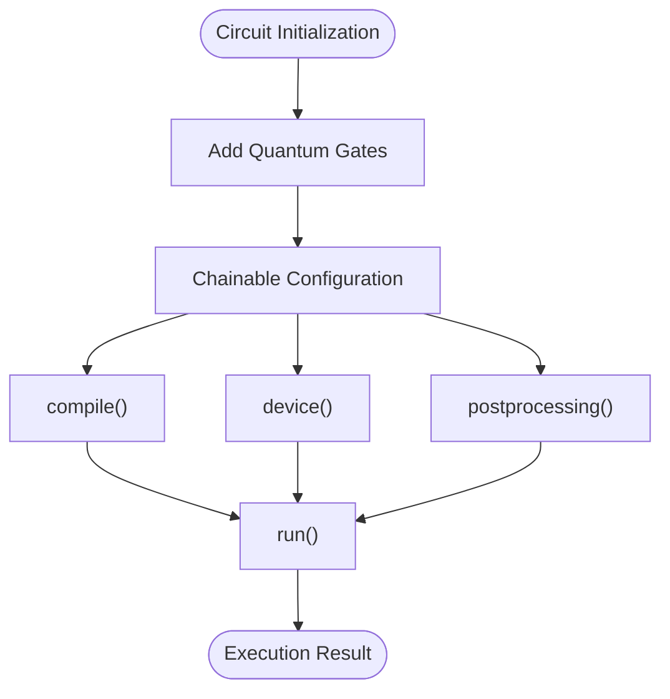
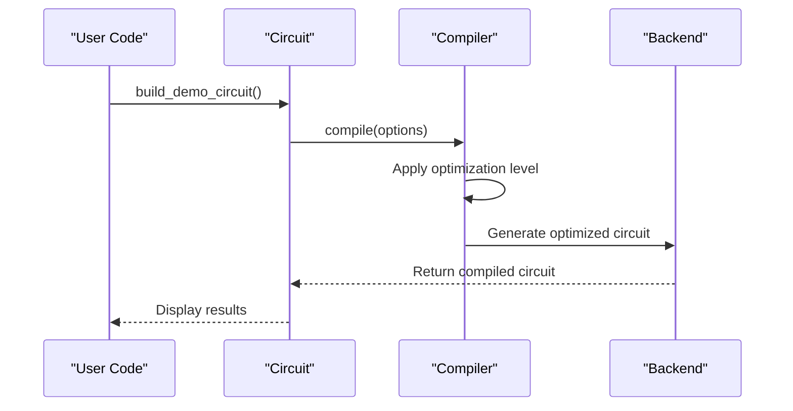
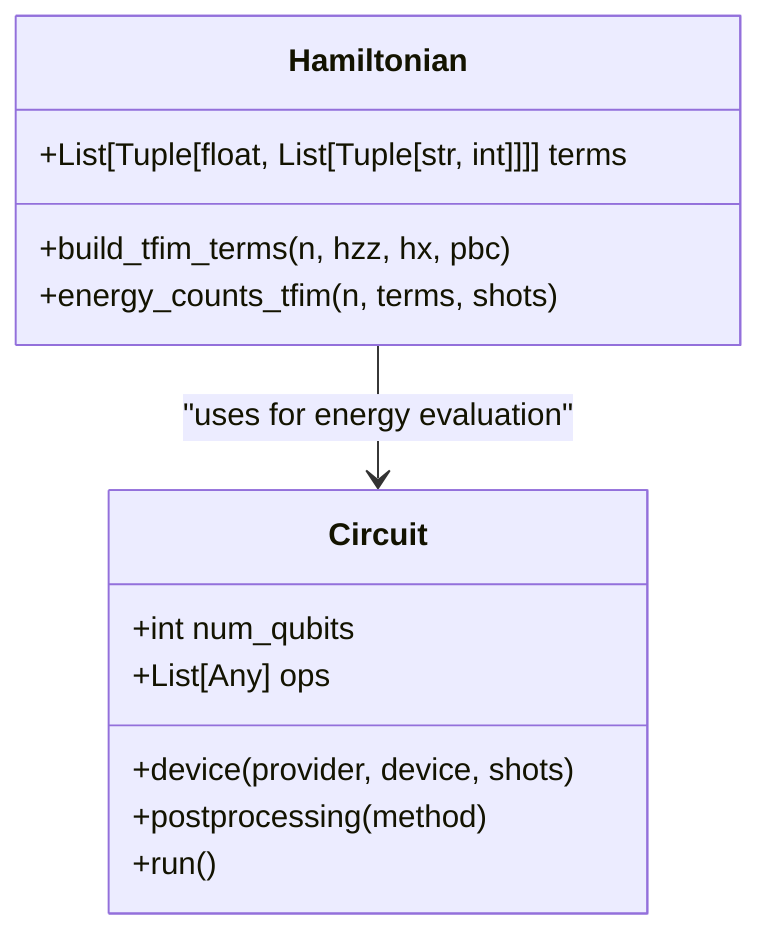
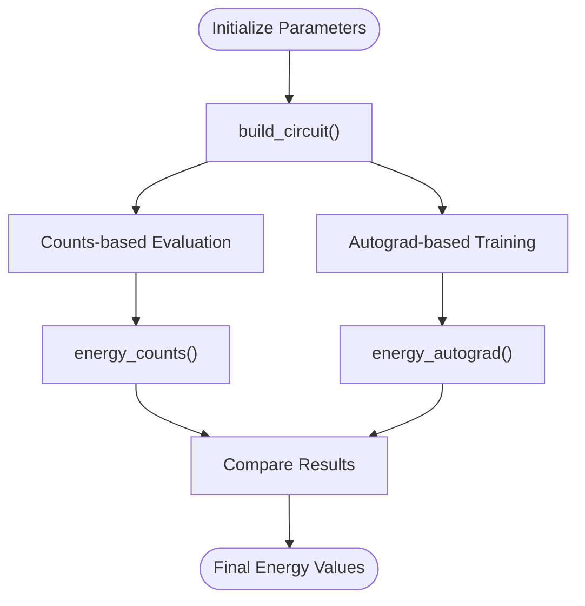
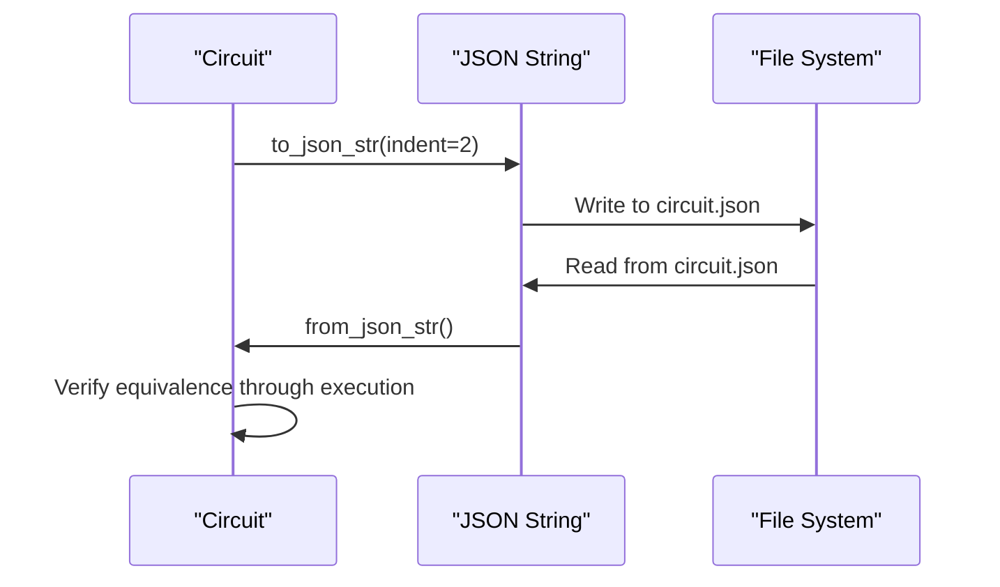

# Basic Examples

<cite>
**Referenced Files in This Document**   
- [circuit_chain_demo.py](file://examples/circuit_chain_demo.py)
- [circuit_compiler.py](file://examples/circuit_compiler.py)
- [hamiltonian_building.py](file://examples/hamiltonian_building.py)
- [incremental_twoqubit.py](file://examples/incremental_twoqubit.py)
- [jsonio.py](file://examples/jsonio.py)
- [circuit.py](file://src/tyxonq/core/ir/circuit.py)
</cite>

## Table of Contents
1. [Introduction](#introduction)
2. [Circuit Construction with Chain API](#circuit-construction-with-chain-api)
3. [Compilation Workflows](#compilation-workflows)
4. [Hamiltonian Building Techniques](#hamiltonian-building-techniques)
5. [Incremental Circuit Construction](#incremental-circuit-construction)
6. [Data Serialization with JSON](#data-serialization-with-json)
7. [Core Concepts](#core-concepts)
8. [Best Practices and Common Pitfalls](#best-practices-and-common-pitfalls)

## Introduction
This document provides fundamental usage patterns of TyxonQ for beginners. It covers circuit construction using the chain API, compilation workflows, Hamiltonian building, incremental circuit development, and data serialization. The examples are designed to establish strong foundational knowledge for users new to quantum computing frameworks.

## Circuit Construction with Chain API

The chain API in TyxonQ enables fluent circuit construction through method chaining. This approach allows for readable and concise quantum circuit definitions.

**Diagram sources**
- [circuit_chain_demo.py](file://examples/circuit_chain_demo.py#L1-L305)
- [circuit.py](file://src/tyxonq/core/ir/circuit.py#L48-L779)

**Section sources**
- [circuit_chain_demo.py](file://examples/circuit_chain_demo.py#L1-L305)
- [circuit.py](file://src/tyxonq/core/ir/circuit.py#L48-L779)

## Compilation Workflows

The compilation workflow in TyxonQ demonstrates how circuits can be compiled using different optimization levels and output formats.

**Diagram sources**
- [circuit_compiler.py](file://examples/circuit_compiler.py#L1-L53)
- [circuit.py](file://src/tyxonq/core/ir/circuit.py#L373-L402)

**Section sources**
- [circuit_compiler.py](file://examples/circuit_compiler.py#L1-L53)

## Hamiltonian Building Techniques

Hamiltonian construction in TyxonQ uses a list-of-terms representation for efficient energy evaluation through measurement counts.

**Diagram sources**
- [hamiltonian_building.py](file://examples/hamiltonian_building.py#L1-L94)
- [circuit.py](file://src/tyxonq/core/ir/circuit.py#L48-L779)

**Section sources**
- [hamiltonian_building.py](file://examples/hamiltonian_building.py#L1-L94)

## Incremental Circuit Construction

The incremental_twoqubit.py example demonstrates progressive construction of parameterized circuits with dense two-qubit interactions.

**Diagram sources**
- [incremental_twoqubit.py](file://examples/incremental_twoqubit.py#L1-L168)

**Section sources**
- [incremental_twoqubit.py](file://examples/incremental_twoqubit.py#L1-L168)

## Data Serialization with JSON

The jsonio.py example illustrates how circuits can be serialized to JSON format and reconstructed without loss of information.

**Diagram sources**
- [jsonio.py](file://examples/jsonio.py#L1-L81)
- [circuit.py](file://src/tyxonq/core/ir/circuit.py#L345-L354)

**Section sources**
- [jsonio.py](file://examples/jsonio.py#L1-L81)

## Core Concepts

### Circuit Chaining
Circuit chaining allows multiple configuration methods to be called in sequence, creating a fluent interface for circuit definition and execution.

### Operation Sequencing
Operations are sequenced in the order they are added to the circuit, with each quantum gate operation modifying the circuit's state.

### IR Generation
The Intermediate Representation (IR) is generated when circuits are compiled, providing a standardized format for execution across different backends.

## Best Practices and Common Pitfalls

### Best Practices
- Use method chaining for readable circuit definitions
- Leverage automatic completion for simplified configuration
- Utilize global defaults for consistent settings across circuits
- Employ JSON serialization for circuit persistence and sharing

### Common Pitfalls
- Forgetting to add measurement operations before execution
- Misunderstanding qubit indexing in circuit composition
- Overlooking the difference between simulation-only and hardware-supported operations
- Not handling exceptions in backend-specific code paths