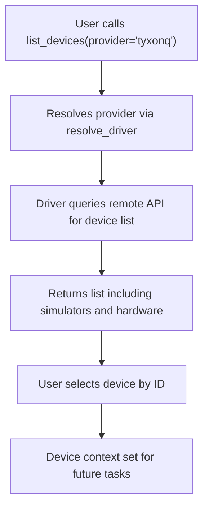
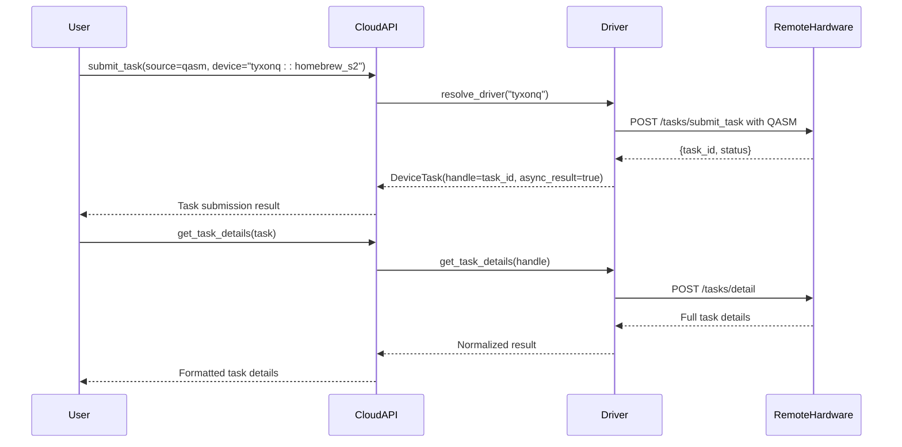
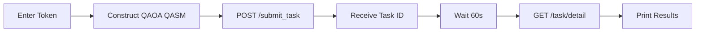
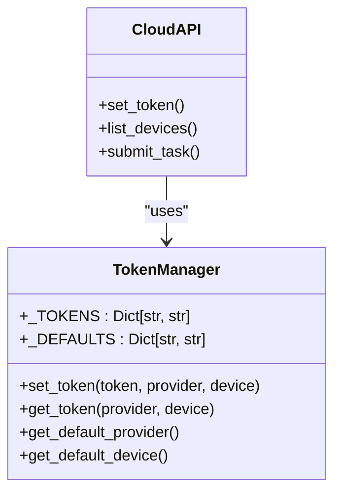
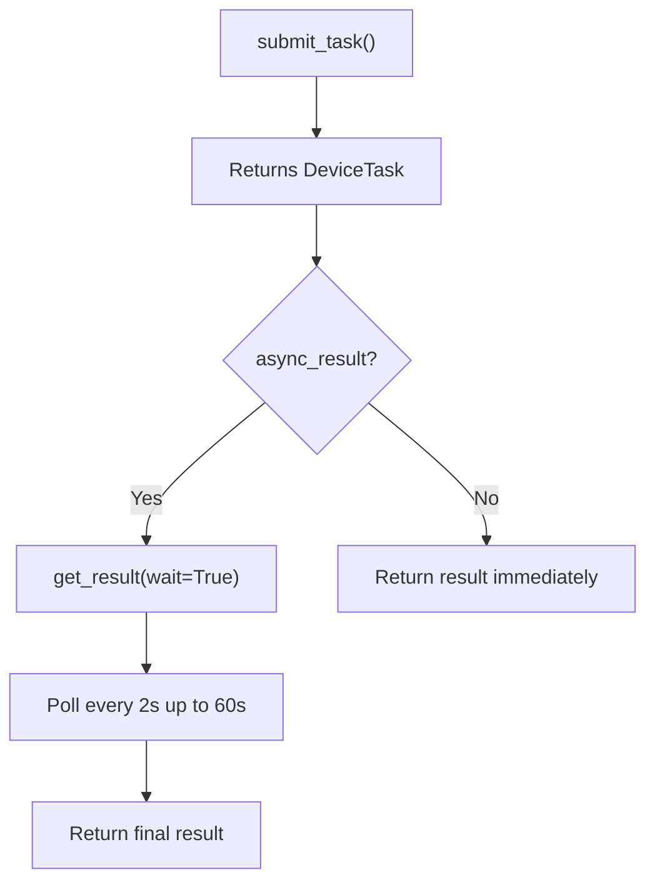
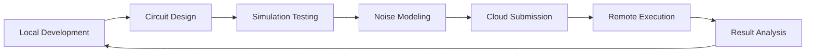

# Cloud Integration Examples

<cite>
**Referenced Files in This Document**   
- [cloud_api_devices.py](file://examples/cloud_api_devices.py)
- [cloud_api_task.py](file://examples/cloud_api_task.py)
- [cloud_api_task_qaoa.py](file://examples/cloud_api_task_qaoa.py)
- [api.py](file://src/tyxonq/cloud/api.py)
- [config.py](file://src/tyxonq/devices/hardware/config.py)
- [base.py](file://src/tyxonq/devices/base.py)
- [driver.py](file://src/tyxonq/devices/hardware/tyxonq/driver.py)
</cite>

## Table of Contents
1. [Introduction](#introduction)
2. [Device Access Patterns](#device-access-patterns)
3. [Task Submission Workflows](#task-submission-workflows)
4. [QAOA Execution on Cloud Platforms](#qaoa-execution-on-cloud-platforms)
5. [Authentication Mechanisms](#authentication-mechanisms)
6. [Job Queuing and Result Retrieval](#job-queuing-and-result-retrieval)
7. [Error Handling in Distributed Environments](#error-handling-in-distributed-environments)
8. [Configuration Guidelines for Cloud Providers](#configuration-guidelines-for-cloud-providers)
9. [Best Practices for Remote Quantum Computations](#best-practices-for-remote-quantum-computations)
10. [Troubleshooting Network-Related Issues](#troubleshooting-network-related-issues)
11. [Latency Optimization Strategies](#latency-optimization-strategies)
12. [Cloud Integration in Execution Workflow](#cloud-integration-in-execution-workflow)

## Introduction
This document provides a comprehensive overview of cloud integration within the TyxonQ framework, focusing on interactions with remote quantum hardware and cloud services. It details device access, task submission, QAOA execution, authentication, job management, error handling, configuration, and best practices. The integration enables seamless transition from local development to production deployment by abstracting cloud complexities through a unified API facade.

## Device Access Patterns
The device access pattern in TyxonQ is facilitated through the `cloud.api` module, which provides a high-level interface for listing and selecting quantum devices available via cloud providers. The `list_devices()` function queries the backend to retrieve a list of accessible devices, filtered optionally by provider.

Device identifiers follow a standardized format: `provider::device_name`, allowing consistent referencing across different environments. Users can set default devices using `set_default()`, which influences subsequent operations unless explicitly overridden.



**Diagram sources**
- [cloud_api_devices.py](file://examples/cloud_api_devices.py#L15-L25)
- [api.py](file://src/tyxonq/cloud/api.py#L45-L55)
- [base.py](file://src/tyxonq/devices/base.py#L345-L365)

**Section sources**
- [cloud_api_devices.py](file://examples/cloud_api_devices.py#L1-L28)
- [api.py](file://src/tyxonq/cloud/api.py#L45-L55)

## Task Submission Workflows
TyxonQ supports two primary task submission workflows: legacy-style direct QASM submission and chain-style circuit compilation and execution.

In the **legacy-style**, users submit raw OPENQASM code directly using `submit_task()`. This bypasses local compilation and relies on server-side processing. In the **chain-style**, a `Circuit` object is built, compiled into QASM, and submitted via a fluent interface (`compile().device().run()`), enabling better integration with local tooling and preprocessing.

Both workflows ultimately invoke the unified `run()` function in `base.py`, which delegates execution to the appropriate driver based on provider and device type.



**Diagram sources**
- [cloud_api_task.py](file://examples/cloud_api_task.py#L30-L64)
- [api.py](file://src/tyxonq/cloud/api.py#L57-L85)
- [base.py](file://src/tyxonq/devices/base.py#L200-L340)

**Section sources**
- [cloud_api_task.py](file://examples/cloud_api_task.py#L1-L64)
- [api.py](file://src/tyxonq/cloud/api.py#L57-L85)

## QAOA Execution on Cloud Platforms
The `cloud_api_task_qaoa.py` example demonstrates execution of a Quantum Approximate Optimization Algorithm (QAOA) circuit on remote hardware. The workflow involves constructing a parameterized QASM string representing the QAOA ansatz, submitting it as a task, and retrieving results after a delay to allow for execution.

Unlike higher-level interfaces, this example uses direct HTTP calls via the `requests` library to interact with the TyxonQ cloud API endpoint. This low-level approach gives fine-grained control over submission parameters such as shots, priority, and remarks.

The execution flow includes:
1. Manual token input via `getpass`
2. Construction of OPENQASM source with RZZ and RX gates
3. HTTP POST to `/tasks/submit_task` with authorization
4. Polling of task status after waiting period
5. Retrieval of final results from `/tasks/detail`



**Diagram sources**
- [cloud_api_task_qaoa.py](file://examples/cloud_api_task_qaoa.py#L1-L84)
- [driver.py](file://src/tyxonq/devices/hardware/tyxonq/driver.py#L1-L100)

**Section sources**
- [cloud_api_task_qaoa.py](file://examples/cloud_api_task_qaoa.py#L1-L84)

## Authentication Mechanisms
Authentication in TyxonQ is managed through bearer tokens stored in memory or environment variables. The `set_token()` function allows users to configure credentials for specific providers and devices. Tokens are scoped hierarchically: device-specific tokens take precedence over provider-level tokens.

Tokens can be provided via:
- Environment variable `TYXONQ_API_KEY`
- Interactive input using `getpass.getpass()`
- Direct API call to `set_token()`

The `config.py` module maintains an in-memory dictionary `_TOKENS` that maps provider and device combinations to their respective tokens. It also supports fallback to environment variables when no explicit token is set.



**Diagram sources**
- [config.py](file://src/tyxonq/devices/hardware/config.py#L1-L67)
- [api.py](file://src/tyxonq/cloud/api.py#L25-L35)

**Section sources**
- [config.py](file://src/tyxonq/devices/hardware/config.py#L1-L67)
- [cloud_api_devices.py](file://examples/cloud_api_devices.py#L15-L20)

## Job Queuing and Result Retrieval
Job queuing is handled transparently by the cloud backend. When a task is submitted via `submit_task()`, the system returns a task handle immediately, enabling asynchronous execution. The actual execution occurs in the cloud queue, and results become available once processing completes.

Result retrieval is performed using `get_task_details()`, which accepts a task identifier and optionally polls until completion. The polling behavior is controlled by parameters such as `wait`, `poll_interval`, and `timeout`. For asynchronous tasks (`async_result=True`), the method will poll the backend; for simulator tasks, results are returned immediately.

The `DeviceTask` wrapper normalizes responses across providers, ensuring consistent access to results regardless of execution environment.



**Diagram sources**
- [base.py](file://src/tyxonq/devices/base.py#L13-L38)
- [api.py](file://src/tyxonq/cloud/api.py#L87-L103)

**Section sources**
- [base.py](file://src/tyxonq/devices/base.py#L13-L38)
- [cloud_api_task.py](file://examples/cloud_api_task.py#L50-L60)

## Error Handling in Distributed Environments
Error handling in distributed quantum computing involves managing network failures, timeout conditions, and backend-specific errors. TyxonQ wraps these in a unified exception model where possible, though raw HTTP errors may propagate from direct API calls.

The `get_task_details()` function includes built-in timeout protection and graceful degradation when polling fails. It returns partial information if the task does not complete within the specified timeout. Additionally, the `DeviceTask.get_result()` method normalizes result schemas to prevent downstream processing errors due to missing fields.

For robust applications, it is recommended to wrap API calls in try-except blocks and implement retry logic with exponential backoff for transient network issues.

```python
# Example error handling pattern
try:
    details = tq.api.get_task_details(task)
except Exception as e:
    print("Task detail error:", e)
```

**Section sources**
- [cloud_api_task.py](file://examples/cloud_api_task.py#L55-L58)
- [base.py](file://src/tyxonq/devices/base.py#L370-L395)

## Configuration Guidelines for Cloud Providers
Configuration for cloud providers is centralized in the `ENDPOINTS` dictionary within `config.py`. Each provider (e.g., `tyxonq`, `ibm`) has a base URL and API version defined, which can be overridden via environment variables (`TYXONQ_BASE_URL`, `TYXONQ_API_VERSION`).

Users should:
- Set default provider and device using `set_default()`
- Configure tokens early in the execution flow
- Use environment variables in production to avoid hardcoding secrets
- Validate connectivity before submitting long-running tasks

Provider resolution is performed by `resolve_driver()`, which dynamically imports the appropriate driver module based on the provider name.

**Section sources**
- [config.py](file://src/tyxonq/devices/hardware/config.py#L10-L15)
- [base.py](file://src/tyxonq/devices/base.py#L116-L129)

## Best Practices for Remote Quantum Computations
To ensure reliable and efficient use of remote quantum resources:
- Always authenticate before submitting tasks
- Use the chain-style API for better circuit validation and optimization
- Prefer `run(wait_async_result=True)` for blocking execution when immediate results are needed
- Implement result caching for repeated experiments
- Monitor task status rather than assuming immediate availability
- Use simulator backends (`simulator::matrix_product_state`) for rapid prototyping
- Validate QASM syntax before submission to avoid backend rejection

Avoid submitting large batches without rate limiting, as this may trigger throttling on the server side.

**Section sources**
- [cloud_api_task.py](file://examples/cloud_api_task.py#L40-L64)
- [base.py](file://src/tyxonq/devices/base.py#L200-L340)

## Troubleshooting Network-Related Issues
Common network issues include:
- Token expiration or invalid credentials
- Timeouts during result polling
- DNS resolution failures for API endpoints
- Firewall restrictions on outbound HTTPS

Troubleshooting steps:
1. Verify token validity and correct provider configuration
2. Check network connectivity to `api.tyxonq.com`
3. Test with a simple simulator task first
4. Increase timeout values for slow connections
5. Enable debug logging if available

The 60-second sleep in `cloud_api_task_qaoa.py` illustrates a manual workaround for expected execution delays, though automated polling is preferred in production.

**Section sources**
- [cloud_api_task_qaoa.py](file://examples/cloud_api_task_qaoa.py#L75-L78)
- [base.py](file://src/tyxonq/devices/base.py#L370-L395)

## Latency Optimization Strategies
To minimize latency in cloud quantum computing:
- Reuse authenticated sessions to avoid repeated token validation
- Submit batched tasks when supported by the backend
- Use efficient QASM representations to reduce upload time
- Prefetch device lists and cache capabilities
- Overlap computation with result retrieval using async patterns
- Choose geographically closer endpoints when multiple regions are available

The framework’s unified `run()` interface allows for future optimizations such as connection pooling and persistent sessions without requiring changes to user code.

**Section sources**
- [base.py](file://src/tyxonq/devices/base.py#L200-L340)
- [cloud_api_task.py](file://examples/cloud_api_task.py#L40-L64)

## Cloud Integration in Execution Workflow
Cloud integration fits into the broader execution workflow as the final deployment stage. Development typically begins with local simulation (`simulator::statevector`), progresses to noise modeling (`simulator::density_matrix`), and culminates in execution on real hardware via cloud providers.

The abstraction layer provided by `cloud.api` ensures that switching from local to remote execution requires minimal code changes—often just updating the device target. This enables a smooth transition from algorithm design to production deployment.



**Diagram sources**
- [cloud_api_task.py](file://examples/cloud_api_task.py#L40-L64)
- [cloud_api_devices.py](file://examples/cloud_api_devices.py#L15-L25)

**Section sources**
- [cloud_api_task.py](file://examples/cloud_api_task.py#L1-L64)
- [cloud_api_devices.py](file://examples/cloud_api_devices.py#L1-L28)