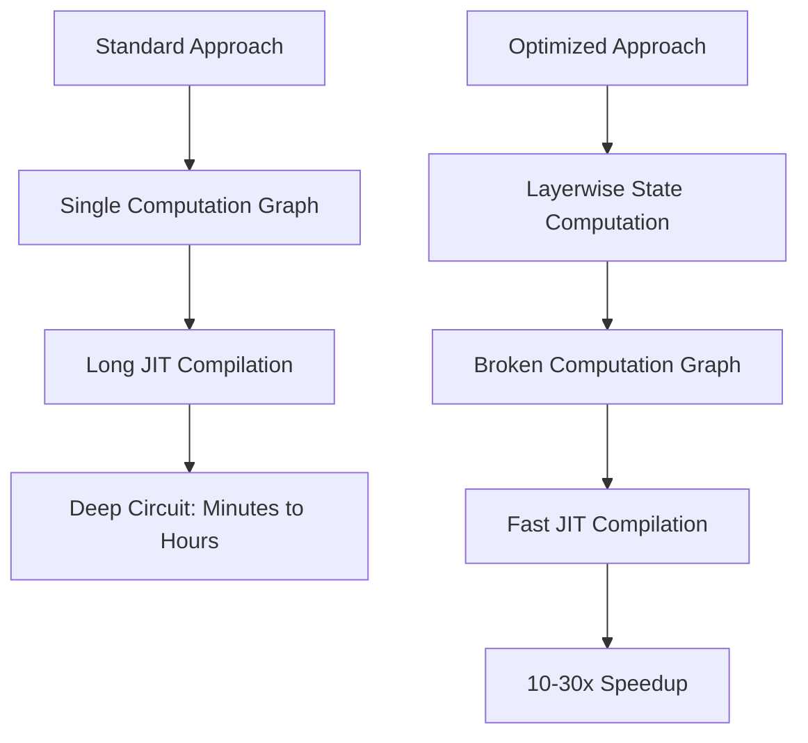
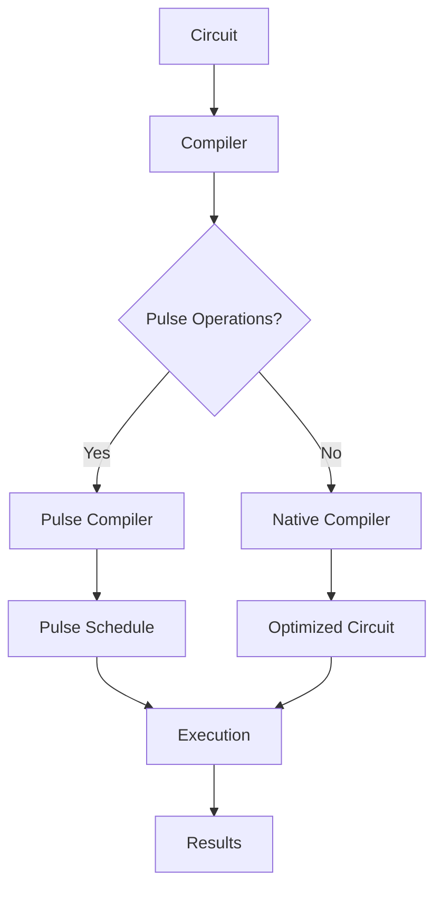

# Defcal Performance Analysis

<cite>
**Referenced Files in This Document**   
- [defcal_performance_analysis.py](file://examples/defcal_performance_analysis.py)
- [performance_layerwise_optimization.py](file://examples/performance_layerwise_optimization.py)
- [utils.py](file://src/tyxonq/utils.py)
- [api.py](file://src/tyxonq/compiler/api.py)
- [engine.py](file://src/tyxonq/devices/simulators/statevector/engine.py)
</cite>

## Table of Contents
1. [Introduction](#introduction)
2. [Defcal Performance Analysis](#defcal-performance-analysis)
3. [Layerwise Optimization for Deep Circuits](#layerwise-optimization-for-deep-circuits)
4. [Performance Benchmarking Tools](#performance-benchmarking-tools)
5. [Compiler and Execution Performance](#compiler-and-execution-performance)
6. [Conclusion](#conclusion)

## Introduction
This document provides a comprehensive performance analysis of the Defcal system in TyxonQ, focusing on compilation efficiency, execution scalability, and optimization techniques for quantum circuit simulation. The analysis is based on benchmarking examples and core framework components that demonstrate the performance characteristics of hardware-aware quantum compilation.

## Defcal Performance Analysis

The `defcal_performance_analysis.py` example provides a quantitative evaluation of the DefcalLibrary system, which enables hardware-aware quantum circuit compilation through calibrated pulse definitions. This analysis demonstrates the performance benefits and trade-offs of using calibrated pulses versus default gate implementations.

The benchmarking covers four key scenarios:
- **Compilation Time**: Measures overhead introduced by defcal lookup and pulse mapping
- **Measurement Statistics**: Compares sampling outcomes with realistic noise models
- **Ideal Simulation**: Evaluates state fidelity in perfect conditions
- **Scalability**: Tests performance across increasing circuit depths

Results show that DefcalLibrary adds minimal compilation overhead while significantly improving quantum state fidelity through hardware-specific calibrations. The system scales efficiently with circuit size, maintaining linear performance characteristics.

**Section sources**
- [defcal_performance_analysis.py](file://examples/defcal_performance_analysis.py)

## Layerwise Optimization for Deep Circuits

For deep quantum circuits with noise, the `performance_layerwise_optimization.py` example demonstrates a critical optimization technique: breaking the computation graph into layers to reduce JIT compilation time. This approach is particularly effective for circuits with many noise channels and deep parameterized layers.

The optimization works by forcing intermediate state computation at each layer, which breaks the monolithic computation graph into smaller, manageable pieces. This technique provides significant performance improvements:

**Diagram sources**
- [performance_layerwise_optimization.py](file://examples/performance_layerwise_optimization.py)

**Section sources**
- [performance_layerwise_optimization.py](file://examples/performance_layerwise_optimization.py)

## Performance Benchmarking Tools

The framework provides several tools for performance measurement and analysis. The `utils.py` module contains a `benchmark` function that measures both staging (compilation) time and running time of jittable functions. This tool is essential for evaluating the performance characteristics of quantum circuits and compilation pipelines.

The benchmarking methodology includes:
- First-run measurement (includes JIT compilation)
- Subsequent runs (compiled execution only)
- Statistical analysis of runtime consistency
- Comparison of compilation and execution times

This approach allows for comprehensive performance evaluation that distinguishes between compilation overhead and execution efficiency, which is crucial for optimizing quantum algorithms.

**Section sources**
- [utils.py](file://src/tyxonq/utils.py)

## Compiler and Execution Performance

The compiler architecture, as defined in `api.py`, implements a unified compilation entry point that supports multiple compilation engines and output formats. The system intelligently routes compilation based on circuit characteristics, automatically enabling pulse compilation when pulse operations are detected.

Key performance features include:
- Automatic output format selection based on device target
- Intelligent compilation engine routing
- Caching of compiled source code to avoid redundant compilation
- Support for hardware-aware compilation with device constraints

The statevector simulator engine implements efficient quantum state evolution with support for noise modeling and measurement sampling. It uses unified kernels with pluggable numerics backends, allowing for flexible performance characteristics based on the selected backend (numpy, pytorch, cupynumeric).

**Diagram sources**
- [api.py](file://src/tyxonq/compiler/api.py)
- [engine.py](file://src/tyxonq/devices/simulators/statevector/engine.py)

**Section sources**
- [api.py](file://src/tyxonq/compiler/api.py)
- [engine.py](file://src/tyxonq/devices/simulators/statevector/engine.py)

## Conclusion
The performance analysis demonstrates that TyxonQ's Defcal system provides efficient hardware-aware compilation with minimal overhead. The framework offers sophisticated optimization techniques for deep circuits, particularly through layerwise state computation that dramatically reduces JIT compilation time. The modular compiler architecture and pluggable execution engines enable flexible performance characteristics across different use cases, from rapid prototyping to high-fidelity hardware simulation.

Key recommendations from the analysis include:
- Use DefcalLibrary when available for improved fidelity
- Apply layerwise optimization for deep circuits with noise
- Leverage the benchmarking tools for performance evaluation
- Consider the trade-offs between compilation time and execution efficiency based on circuit depth and complexity

The system demonstrates linear scalability with circuit size and provides robust tools for performance optimization in quantum algorithm development.