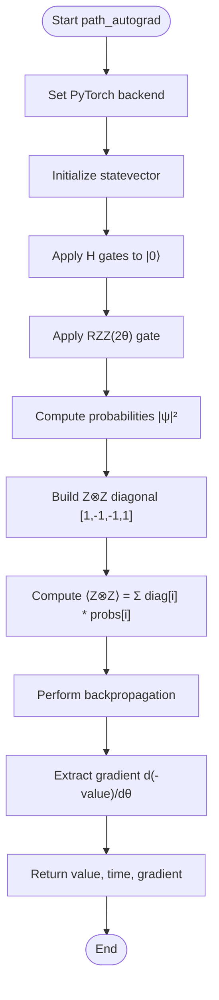
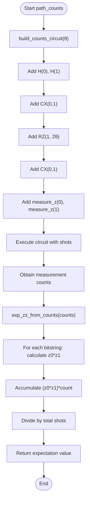
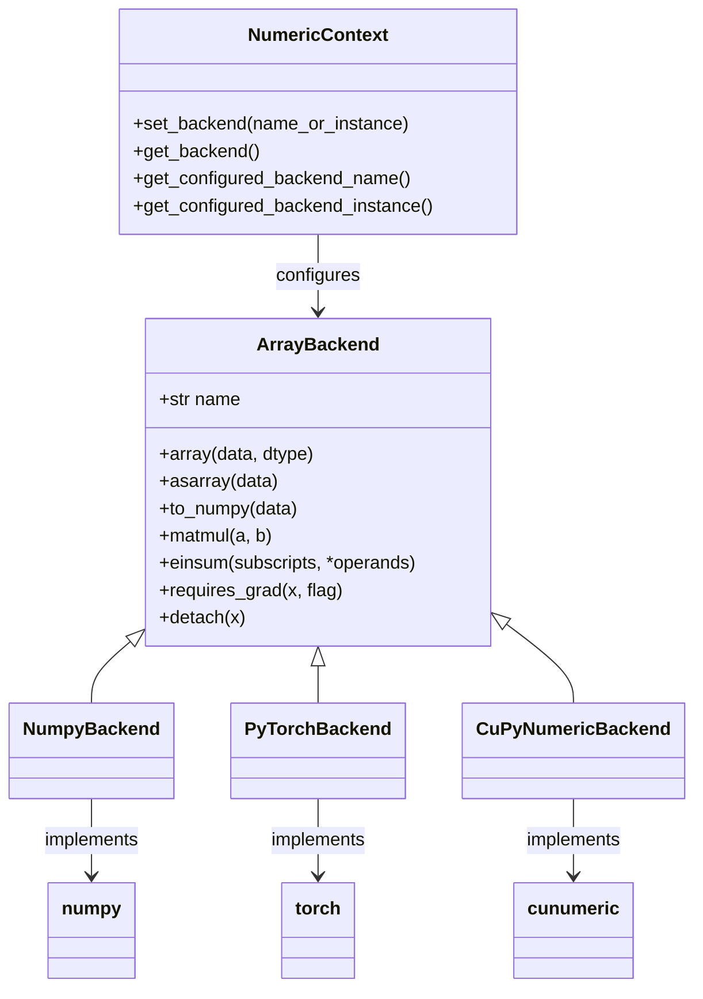

# Autograd vs Counts-Based Differentiation

<cite>
**Referenced Files in This Document**   
- [autograd_vs_counts.py](file://examples/autograd_vs_counts.py)
- [circuit.py](file://src/tyxonq/core/ir/circuit.py)
- [statevector.py](file://src/tyxonq/libs/quantum_library/kernels/statevector.py)
- [gates.py](file://src/tyxonq/libs/quantum_library/kernels/gates.py)
- [counts_expval.py](file://src/tyxonq/postprocessing/counts_expval.py)
- [context.py](file://src/tyxonq/numerics/context.py)
- [api.py](file://src/tyxonq/numerics/api.py)
- [pytorch_backend.py](file://src/tyxonq/numerics/backends/pytorch_backend.py)
</cite>

## Table of Contents
1. [Introduction](#introduction)
2. [Core Components](#core-components)
3. [Path A: Autograd-Based Differentiation](#path-a-autograd-based-differentiation)
4. [Path B: Counts-Based Estimation](#path-b-counts-based-estimation)
5. [Comparison of Accuracy and Performance](#comparison-of-accuracy-and-performance)
6. [Backend Configuration and Numerical Stability](#backend-configuration-and-numerical-stability)
7. [Use Cases and Trade-offs](#use-cases-and-trade-offs)
8. [Conclusion](#conclusion)

## Introduction
This document provides a detailed analysis of the `autograd_vs_counts.py` example, which demonstrates two distinct approaches for computing the expectation value of the ZZ operator on a two-qubit quantum circuit. The first approach, Path A, leverages automatic differentiation via PyTorch's autograd system using a statevector simulator backend. The second approach, Path B, relies on sampling-based estimation from measurement counts obtained through circuit execution. This comparison highlights fundamental trade-offs in accuracy, performance, and differentiability between exact simulation and sampling-based methods in quantum computing workflows.

## Core Components

The implementation revolves around four primary functions: `build_counts_circuit`, `exp_zz_from_counts`, `path_counts`, and `path_autograd`. These functions encapsulate the logic for constructing quantum circuits, processing measurement outcomes, and computing expectation values through both sampling and exact differentiation paths. The core functionality is built upon TyxonQ's unified numeric backend abstraction, enabling seamless integration of PyTorch for gradient computation while maintaining compatibility with classical simulation and hardware execution paradigms.

**Section sources**
- [autograd_vs_counts.py](file://examples/autograd_vs_counts.py#L15-L90)

## Path A: Autograd-Based Differentiation

Path A implements exact expectation value computation using a numeric backend with statevector simulation and automatic differentiation. The `path_autograd` function configures the PyTorch backend via `tq.set_backend("pytorch")`, enabling gradient tracking for quantum parameters. It initializes a statevector for two qubits and applies Hadamard gates to both qubits to prepare the |++⟩ state. The ZZ interaction is implemented using the `gate_rzz` operation with angle 2θ, matching the decomposition used in the counts-based path. The expectation value ⟨Z⊗Z⟩ is computed by constructing the diagonal observable [1, -1, -1, 1] and taking the dot product with the probability distribution derived from the statevector amplitudes. Crucially, the function performs backpropagation via `(-val).backward()` to compute the gradient with respect to the input parameter θ, demonstrating end-to-end differentiability.



**Diagram sources**
- [autograd_vs_counts.py](file://examples/autograd_vs_counts.py#L50-L75)
- [pytorch_backend.py](file://src/tyxonq/numerics/backends/pytorch_backend.py#L200-L250)

**Section sources**
- [autograd_vs_counts.py](file://examples/autograd_vs_counts.py#L50-L75)
- [statevector.py](file://src/tyxonq/libs/quantum_library/kernels/statevector.py#L20-L50)
- [gates.py](file://src/tyxonq/libs/quantum_library/kernels/gates.py#L150-L170)

## Path B: Counts-Based Estimation

Path B implements sampling-based estimation of the ZZ expectation value using measurement counts. The `build_counts_circuit` function constructs a two-qubit circuit that prepares the |++⟩ state via Hadamard gates and implements the ZZ(θ) interaction through the standard decomposition: CX-RZ(2θ)-CX. The circuit concludes with Z-basis measurements on both qubits. The `path_counts` function executes this circuit on a statevector simulator with a specified number of shots, obtaining a histogram of measurement outcomes. The `exp_zz_from_counts` function computes the expectation value by iterating over all observed bitstrings, assigning +1 or -1 based on the parity of the measured Z values (0→+1, 1→-1), and calculating the weighted average. This approach introduces statistical noise proportional to 1/√shots, reflecting the inherent uncertainty in sampling-based estimation.



**Diagram sources**
- [autograd_vs_counts.py](file://examples/autograd_vs_counts.py#L15-L45)
- [counts_expval.py](file://src/tyxonq/postprocessing/counts_expval.py#L10-L30)

**Section sources**
- [autograd_vs_counts.py](file://examples/autograd_vs_counts.py#L15-L45)
- [circuit.py](file://src/tyxonq/core/ir/circuit.py#L180-L200)
- [counts_expval.py](file://src/tyxonq/postprocessing/counts_expval.py#L10-L30)

## Comparison of Accuracy and Performance

The two paths exhibit fundamentally different accuracy and performance characteristics. Path A provides exact expectation values with zero statistical error, as it computes the result analytically from the full statevector. Its computational complexity scales exponentially with the number of qubits (O(2^n)), making it suitable only for small-scale simulations. Path B introduces shot noise proportional to 1/√shots, with accuracy improving at the cost of increased execution time. However, its memory footprint remains constant regardless of system size, enabling execution on real quantum hardware. In terms of performance, Path A typically executes faster for small circuits due to the absence of sampling overhead, while Path B's runtime scales linearly with the number of shots. The autograd path enables direct gradient computation through backpropagation, whereas estimating gradients via finite differences with counts requires multiple circuit executions, amplifying statistical uncertainty.

```mermaid
graph TD
A[Path A: Autograd] --> |Accuracy| A1[Exact, No Sampling Error]
A --> |Performance| A2[Fast for small n, O(2^n) scaling]
A --> |Differentiability| A3[Native gradient support]
A --> |Hardware| A4[Simulation only]
B[Path B: Counts] --> |Accuracy| B1[Noisy, O(1/√shots) error]
B --> |Performance| B2[Slower, linear in shots]
B --> |Differentiability| B3[Finite differences required]
B --> |Hardware| B4[Runs on real devices]
C[Trade-offs] --> D[Choose A for: Gradient-based optimization, Small systems, Exact results]
C --> E[Choose B for: Hardware execution, Large systems, Sampling effects study]
```

**Diagram sources**
- [autograd_vs_counts.py](file://examples/autograd_vs_counts.py#L15-L90)

## Backend Configuration and Numerical Stability

The example demonstrates TyxonQ's flexible backend configuration system through the `tq.set_backend("pytorch")` call, which activates PyTorch as the numerical backend for automatic differentiation. The framework's `ArrayBackend` protocol abstracts array operations across NumPy, PyTorch, and CuPyNumeric, ensuring algorithmic code remains backend-agnostic. Numerical stability in Path A is excellent due to the use of double-precision floating-point arithmetic in PyTorch. Path B's stability depends on the number of shots, with low-shot regimes exhibiting significant variance. The implementation properly handles edge cases such as empty count dictionaries by defaulting to a total of 1 to avoid division by zero. The use of Einstein summation (`einsum`) in statevector operations ensures numerically stable tensor contractions, while the direct diagonal observable construction avoids potential errors from operator decomposition.



**Diagram sources**
- [api.py](file://src/tyxonq/numerics/api.py#L30-L200)
- [context.py](file://src/tyxonq/numerics/context.py#L17-L29)
- [pytorch_backend.py](file://src/tyxonq/numerics/backends/pytorch_backend.py#L10-L50)

**Section sources**
- [api.py](file://src/tyxonq/numerics/api.py#L30-L200)
- [context.py](file://src/tyxonq/numerics/context.py#L17-L29)

## Use Cases and Trade-offs

The choice between autograd-based and counts-based methods depends on the specific use case and constraints. Path A excels in gradient-based optimization scenarios such as Variational Quantum Eigensolvers (VQE) or Quantum Machine Learning (QML), where exact gradients enable efficient convergence. It is ideal for algorithm development, testing, and small-scale simulations where computational resources permit statevector simulation. Path B is essential for executing on real quantum hardware, studying sampling noise effects, validating error mitigation techniques, or working with large quantum systems beyond the reach of statevector simulation. The counts-based approach also enables the study of finite-shot effects and the development of robust algorithms that perform well under realistic noise conditions. Hybrid workflows often combine both approaches: using autograd for rapid prototyping and optimization, then validating results through counts-based execution on hardware.

**Section sources**
- [autograd_vs_counts.py](file://examples/autograd_vs_counts.py#L15-L90)

## Conclusion

The `autograd_vs_counts.py` example effectively illustrates the fundamental trade-offs between exact, differentiable simulation and sampling-based estimation in quantum computing. Path A leverages automatic differentiation for precise gradient computation, enabling efficient optimization but limited to small-scale simulations. Path B provides a realistic model of hardware execution with inherent statistical uncertainty but enables large-scale and real-device applications. The TyxonQ framework's unified backend abstraction allows researchers to seamlessly switch between these paradigms, facilitating both algorithm development and practical deployment. Understanding these trade-offs is crucial for designing quantum algorithms that are both theoretically sound and practically viable in near-term quantum computing environments.