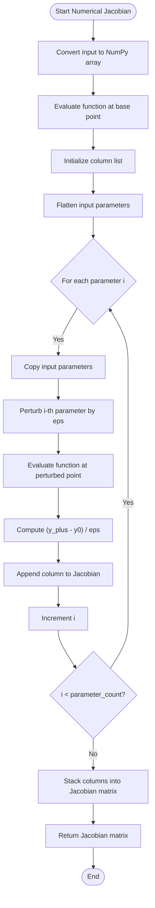
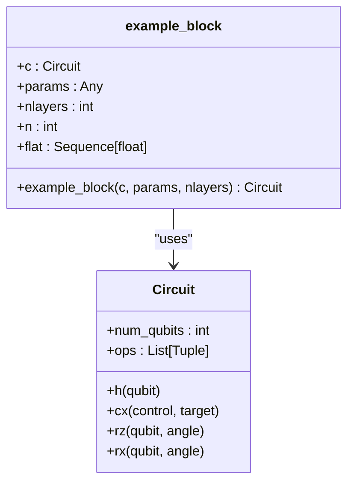
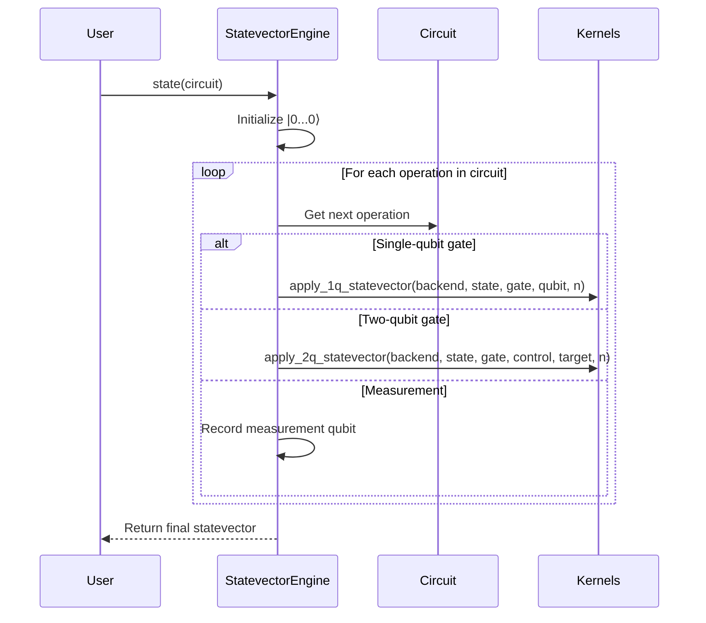
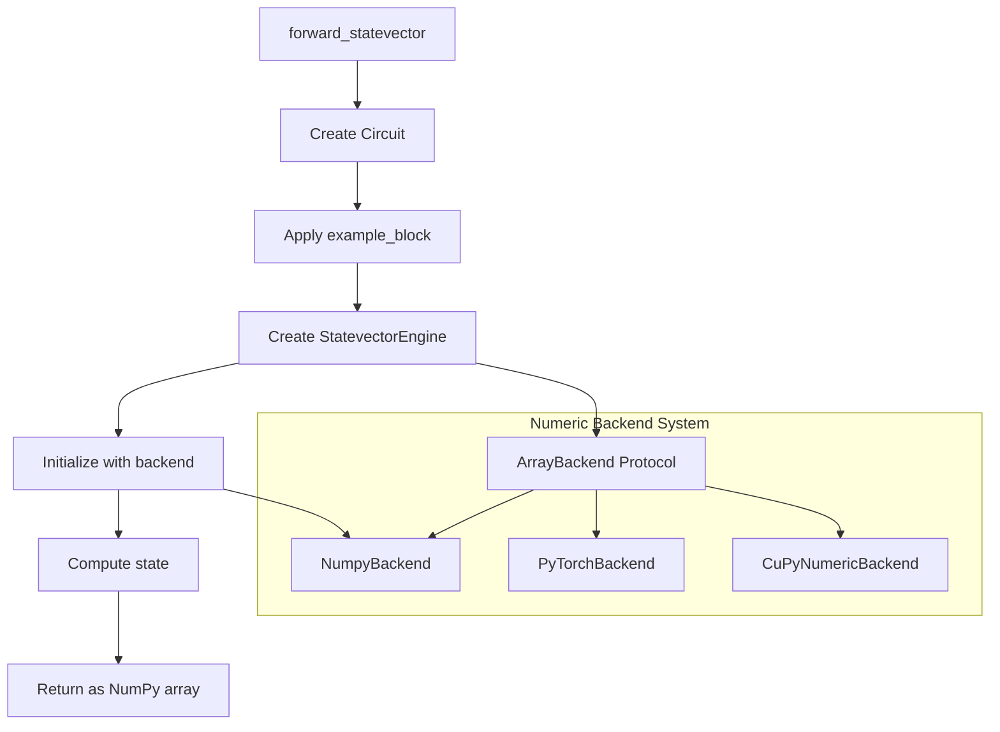
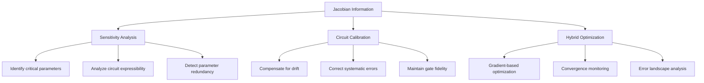
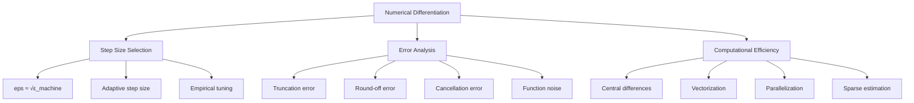

# Jacobian Calculation and Numerical Differentiation

<cite>
**Referenced Files in This Document**   
- [jacobian_cal.py](file://examples/jacobian_cal.py)
- [blocks.py](file://src/tyxonq/libs/circuits_library/blocks.py)
- [engine.py](file://src/tyxonq/devices/simulators/statevector/engine.py)
- [numpy_backend.py](file://src/tyxonq/numerics/backends/numpy_backend.py)
- [api.py](file://src/tyxonq/numerics/api.py)
- [context.py](file://src/tyxonq/numerics/context.py)
</cite>

## Table of Contents
1. [Introduction](#introduction)
2. [Core Components](#core-components)
3. [Numerical Jacobian Computation](#numerical-jacobian-computation)
4. [Circuit Construction and Statevector Simulation](#circuit-construction-and-statevector-simulation)
5. [Numeric Backend Integration](#numeric-backend-integration)
6. [Precision and Data Type Analysis](#precision-and-data-type-analysis)
7. [Use Cases and Applications](#use-cases-and-applications)
8. [Best Practices for Numerical Differentiation](#best-practices-for-numerical-differentiation)
9. [Conclusion](#conclusion)

## Introduction
This document provides a comprehensive analysis of the `jacobian_cal.py` example in the TyxonQ quantum computing framework. The example demonstrates numerical Jacobian computation for quantum circuit outputs with respect to input parameters, showcasing the integration of classical numerical methods with quantum simulation. The analysis covers the `_numerical_jacobian` function that uses finite differences to estimate derivatives of the statevector output from `forward_statevector`, the use of `example_block` from `circuits_library` to construct parameterized circuits, and the role of `StatevectorEngine` in computing the full quantum state. The document also examines the implications of using NumPy for numerical differentiation while leveraging TyxonQ's numeric backend for circuit execution, analyzes precision differences between float32 and float64 inputs, and discusses critical use cases such as sensitivity analysis, circuit calibration, and hybrid quantum-classical optimization.

## Core Components

The jacobian calculation example consists of several interconnected components that work together to compute numerical derivatives of quantum circuit outputs. The primary components include the numerical Jacobian computation function, the statevector forward pass function, the circuit building block, and the statevector simulation engine. These components demonstrate a clear separation of concerns between numerical differentiation, quantum circuit construction, and quantum state simulation.

**Section sources**
- [jacobian_cal.py](file://examples/jacobian_cal.py#L12-L57)
- [blocks.py](file://src/tyxonq/libs/circuits_library/blocks.py#L41-L83)
- [engine.py](file://src/tyxonq/devices/simulators/statevector/engine.py#L31-L261)

## Numerical Jacobian Computation

The `_numerical_jacobian` function implements finite difference methods to estimate the derivatives of a function with respect to its input parameters. This function serves as the core numerical differentiation engine in the example, computing the Jacobian matrix that represents the partial derivatives of the output with respect to each input parameter.



**Diagram sources**
- [jacobian_cal.py](file://examples/jacobian_cal.py#L12-L23)

The function takes three parameters: the function `f` to differentiate, the input parameters `x`, and the step size `eps` for finite differences (defaulting to 1e-6). It first converts the input to a NumPy array and evaluates the function at the base point to obtain `y0`. Then, for each parameter in the flattened input, it creates a perturbed version by adding `eps` to that parameter, evaluates the function at the perturbed point, and computes the finite difference quotient. The resulting partial derivatives are collected as columns in the Jacobian matrix, which is returned as a stacked NumPy array. This implementation uses forward differences rather than central differences, which provides a balance between computational efficiency and numerical stability.

**Section sources**
- [jacobian_cal.py](file://examples/jacobian_cal.py#L12-L23)

## Circuit Construction and Statevector Simulation

### Circuit Building Block

The `example_block` function from `circuits_library` constructs a parameterized quantum circuit using a hardware-efficient ansatz pattern. This building block creates a circuit structure that is commonly used in variational quantum algorithms, featuring alternating layers of entangling gates and parameterized single-qubit rotations.



**Diagram sources**
- [blocks.py](file://src/tyxonq/libs/circuits_library/blocks.py#L41-L83)

The function takes a circuit `c`, parameters `params`, and the number of layers `nlayers` as inputs. It first determines the number of qubits from the circuit and converts the parameters to a flat sequence of floating-point values. The circuit construction begins with an initial layer of Hadamard gates on all qubits, creating a superposition state. Then, for each layer, it applies a chain of CNOT gates between adjacent qubits to create entanglement, followed by parameterized RZ and RX rotations on each qubit. The parameters are organized such that for each layer `j`, the first `n` parameters correspond to RZ angles and the next `n` parameters correspond to RX angles, where `n` is the number of qubits. This pattern repeats for the specified number of layers, creating a deep parameterized circuit that can represent complex quantum states.

**Section sources**
- [blocks.py](file://src/tyxonq/libs/circuits_library/blocks.py#L41-L83)

### Statevector Engine

The `StatevectorEngine` class provides a full statevector simulation of quantum circuits, representing the quantum state as a complex vector of size 2^n for n qubits. This engine implements the core quantum operations needed to simulate the evolution of the quantum state through the circuit.



**Diagram sources**
- [engine.py](file://src/tyxonq/devices/simulators/statevector/engine.py#L186-L216)

The engine's `state` method takes a quantum circuit as input and returns the final statevector after applying all operations in the circuit. It initializes the state to the computational basis state |0...0⟩ and then iterates through each operation in the circuit, applying the corresponding unitary transformation to the statevector. For single-qubit gates like H, RZ, RX, and RY, it uses the `apply_1q_statevector` kernel function, which reshapes the statevector into a tensor, applies the 2x2 gate matrix via Einstein summation, and then reshapes back to a vector. For two-qubit gates like CX and CZ, it uses the `apply_2q_statevector` kernel function, which similarly applies the 4x4 gate matrix to the appropriate qubits. The engine supports a variety of quantum gates and can handle circuits with measurements, though the example focuses on the statevector output without measurement collapse.

**Section sources**
- [engine.py](file://src/tyxonq/devices/simulators/statevector/engine.py#L31-L261)
- [jacobian_cal.py](file://examples/jacobian_cal.py#L26-L34)

## Numeric Backend Integration

The integration of numeric backends in TyxonQ enables flexible computation across different numerical frameworks while maintaining a consistent API. The `forward_statevector` function demonstrates this integration by using the `StatevectorEngine` with a specified backend, allowing the quantum simulation to leverage different computational backends.



**Diagram sources**
- [api.py](file://src/tyxonq/numerics/api.py#L0-L194)
- [context.py](file://src/tyxonq/numerics/context.py#L0-L52)
- [numpy_backend.py](file://src/tyxonq/numerics/backends/numpy_backend.py#L0-L165)

The `StatevectorEngine` is initialized with a backend name (in this case "numpy"), which is resolved through the `get_backend` function in the numerics API. This function checks for a configured global backend or creates a new backend instance based on the requested name. The `ArrayBackend` protocol defines a common interface for array operations across different backends, ensuring that the quantum simulation kernels can work with NumPy, PyTorch, or CuPyNumeric arrays interchangeably. In the `forward_statevector` function, the engine uses the specified backend to perform the statevector operations, but the final result is converted to a NumPy array for compatibility with the numerical differentiation function. This design allows the quantum simulation to benefit from optimized backends while keeping the numerical differentiation in NumPy for clarity and consistency.

**Section sources**
- [api.py](file://src/tyxonq/numerics/api.py#L0-L194)
- [context.py](file://src/tyxonq/numerics/context.py#L0-L52)
- [numpy_backend.py](file://src/tyxonq/numerics/backends/numpy_backend.py#L0-L165)
- [jacobian_cal.py](file://examples/jacobian_cal.py#L26-L34)

## Precision and Data Type Analysis

The `get_jac` function demonstrates a careful analysis of numerical precision by comparing Jacobian computations with different floating-point precisions. This analysis is crucial for understanding the numerical stability of quantum circuit differentiation and ensuring reliable results in practical applications.

```mermaid
flowchart TD
A[get_jac] --> B[Define f_state function]
B --> C[Create float32 params]
C --> D[Compute n1 = _numerical_jacobian]
D --> E[Compute n2 = _numerical_jacobian]
E --> F[Convert to float64]
F --> G[Compute n3 = _numerical_jacobian]
G --> H[Extract real part n4]
H --> I[Return all Jacobians]
subgraph "Precision Comparison"
J[float32 Jacobian n1]
K[float32 Jacobian n2]
L[float64 Jacobian n3]
M[Real part of n3]
J < --> K: Assert close
L < --> M: Assert real close
end
```

**Diagram sources**
- [jacobian_cal.py](file://examples/jacobian_cal.py#L39-L50)

The function creates a closure `f_state` that wraps the `forward_statevector` function and returns the real part of the statevector. It then creates a parameter vector with float32 precision and computes the Jacobian twice to verify consistency. Next, it converts the parameters to float64 precision and computes the Jacobian again, also extracting the real part of the result. The main script asserts that the two float32 Jacobians are close (within relative tolerance 1e-6 and absolute tolerance 1e-6), and that the real part of the float64 Jacobian matches the explicitly computed real part. This comparison reveals important insights about numerical precision in quantum circuit differentiation: float64 provides higher precision and reduced rounding errors, which is particularly important for gradient-based optimization where small differences can affect convergence. The example demonstrates best practices for numerical analysis by systematically comparing results across different precisions and validating the consistency of computations.

**Section sources**
- [jacobian_cal.py](file://examples/jacobian_cal.py#L39-L57)

## Use Cases and Applications

The numerical Jacobian computation demonstrated in this example has several important applications in quantum computing research and development. These use cases leverage the sensitivity information provided by the Jacobian to improve quantum algorithms, calibrate devices, and optimize hybrid quantum-classical systems.

### Sensitivity Analysis
The Jacobian matrix provides a complete picture of how sensitive each output amplitude is to changes in each input parameter. This information is valuable for understanding the behavior of parameterized quantum circuits and identifying which parameters have the most significant impact on the output state. Sensitivity analysis can help researchers design more effective ansatz circuits by focusing on parameters that provide the most expressive power.

### Circuit Calibration
In experimental quantum computing, device parameters often drift over time due to environmental factors. The Jacobian can be used in calibration procedures to determine how to adjust control parameters to compensate for these drifts. By comparing the observed output with the expected output and using the Jacobian to compute the necessary parameter adjustments, researchers can maintain high-fidelity quantum operations.

### Hybrid Quantum-Classical Optimization
Variational quantum algorithms, such as the Variational Quantum Eigensolver (VQE) and Quantum Approximate Optimization Algorithm (QAOA), rely on classical optimization of quantum circuit parameters. The Jacobian provides the gradient information needed for gradient-based optimizers, enabling faster convergence to optimal solutions. While analytical gradients are preferred when available, numerical Jacobians serve as a reliable fallback and validation method.



**Diagram sources**
- [jacobian_cal.py](file://examples/jacobian_cal.py#L12-L57)

These applications highlight the importance of reliable numerical differentiation methods in quantum computing. The example provides a foundation for implementing these use cases by demonstrating a robust approach to Jacobian computation that can be extended to more complex scenarios.

**Section sources**
- [jacobian_cal.py](file://examples/jacobian_cal.py#L12-L57)

## Best Practices for Numerical Differentiation

When performing numerical differentiation of quantum circuits, several best practices should be followed to ensure accurate and reliable results. These practices address common challenges such as step size selection, error sources, and computational efficiency.

### Step Size Selection
The choice of step size `eps` is critical for numerical differentiation. If `eps` is too large, the finite difference approximation will have significant truncation error. If `eps` is too small, round-off errors from floating-point arithmetic will dominate. A common rule of thumb is to set `eps` to the square root of machine epsilon, which is approximately 1e-8 for float64 and 1e-4 for float32. However, the optimal step size may vary depending on the specific function and parameter scale, so adaptive methods or empirical testing may be necessary.

### Error Sources
Numerical differentiation is subject to several error sources:
- **Truncation error**: Due to the finite difference approximation of the derivative
- **Round-off error**: From floating-point arithmetic limitations
- **Cancellation error**: When subtracting nearly equal numbers in the difference quotient
- **Function evaluation error**: Noise or stochasticity in the function evaluation

These errors can be mitigated by using central differences instead of forward differences, increasing numerical precision, and averaging multiple evaluations when the function is stochastic.

### Computational Efficiency
Computing the full Jacobian requires n+1 function evaluations for forward differences or 2n function evaluations for central differences, where n is the number of parameters. For large parameter spaces, this can be computationally expensive. Techniques such as vectorization, parallelization, and sparse Jacobian estimation can improve efficiency. The example demonstrates a straightforward implementation that prioritizes clarity over optimization, but production systems should consider these efficiency factors.



**Diagram sources**
- [jacobian_cal.py](file://examples/jacobian_cal.py#L12-L23)

Following these best practices ensures that numerical Jacobian computations are both accurate and efficient, providing reliable gradient information for quantum computing applications.

**Section sources**
- [jacobian_cal.py](file://examples/jacobian_cal.py#L12-L23)

## Conclusion
The `jacobian_cal.py` example provides a comprehensive demonstration of numerical Jacobian computation for quantum circuits, showcasing the integration of classical numerical methods with quantum simulation. The analysis reveals a well-designed system where the `_numerical_jacobian` function implements finite differences for derivative estimation, the `example_block` creates parameterized quantum circuits, and the `StatevectorEngine` computes the full quantum state using a pluggable numeric backend. The example carefully considers numerical precision by comparing float32 and float64 computations, highlighting the importance of precision in quantum circuit differentiation. The demonstrated techniques have broad applications in sensitivity analysis, circuit calibration, and hybrid quantum-classical optimization, forming a foundation for advanced quantum algorithm development. By following best practices for step size selection and error management, researchers can leverage these methods to obtain reliable gradient information for optimizing quantum circuits and improving quantum computing performance.