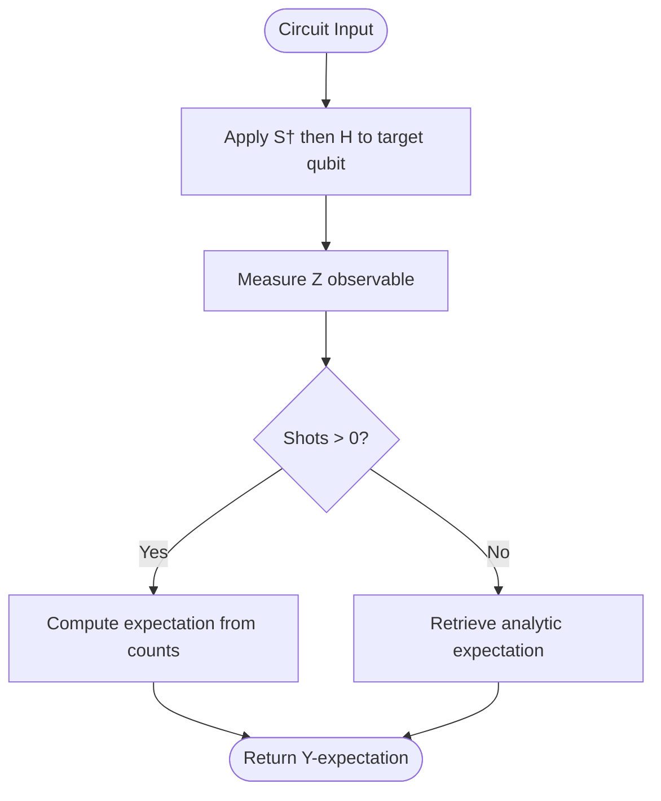
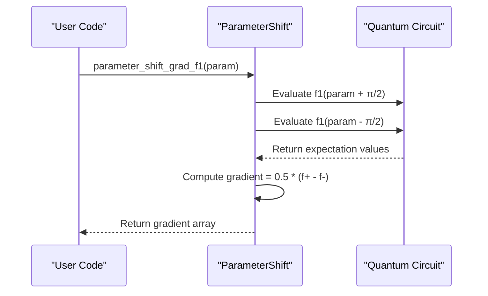

# Parameter Shift Rule Implementation

<cite>
**Referenced Files in This Document**   
- [parameter_shift.py](file://examples/parameter_shift.py)
- [circuit.py](file://src/tyxonq/core/ir/circuit.py)
- [metrics.py](file://src/tyxonq/postprocessing/metrics.py)
- [parameter_shift.py](file://src/tyxonq/compiler/gradients/parameter_shift.py)
- [numpy_backend.py](file://src/tyxonq/numerics/backends/numpy_backend.py)
- [api.py](file://src/tyxonq/numerics/api.py)
- [context.py](file://src/tyxonq/numerics/context.py)
</cite>

## Table of Contents
1. [Introduction](#introduction)
2. [Theoretical Foundation of the Parameter Shift Rule](#theoretical-foundation-of-the-parameter-shift-rule)
3. [Core Circuit Construction and Measurement](#core-circuit-construction-and-measurement)
4. [Parameter Shift Gradient Implementation](#parameter-shift-gradient-implementation)
5. [Finite Difference Baseline Comparison](#finite-difference-baseline-comparison)
6. [Performance and Accuracy Analysis](#performance-and-accuracy-analysis)
7. [Shot-Based Sampling and Error Mitigation](#shot-based-sampling-and-error-mitigation)
8. [Best Practices and Real-Device Considerations](#best-practices-and-real-device-considerations)

## Introduction
This document provides a comprehensive analysis of the `parameter_shift.py` example, which demonstrates the implementation of the analytic parameter shift rule for computing gradients of quantum circuits containing RX and RZZ gates. The example illustrates how to compute noise-robust gradients using quantum circuits, compares them against finite-difference baselines, and validates results under both analytic and sampled conditions. The implementation leverages the TyxonQ framework's chain-style API and numeric backend abstraction to provide a flexible and efficient gradient computation pipeline.

## Theoretical Foundation of the Parameter Shift Rule
The parameter shift rule is a method for computing gradients of quantum circuits that is robust to noise and does not require infinitesimal perturbations. For a parameterized gate $U(\theta) = \exp(-i\theta G)$, where $G$ is a generator with eigenvalues $\pm r$, the gradient of an expectation value $\langle \psi(\theta) | O | \psi(\theta) \rangle$ can be computed as:
$$
\frac{\partial}{\partial\theta} \langle O \rangle = r \left( \langle O \rangle_{\theta + \frac{\pi}{2r}} - \langle O \rangle_{\theta - \frac{\pi}{2r}} \right)
$$
For RX and RZZ gates, the shift value is $\pi/2$ with a coefficient of 0.5. This rule provides an exact gradient computation using only two circuit evaluations, making it more efficient and noise-resilient than finite-difference methods that require small step sizes.

**Section sources**
- [parameter_shift.py](file://examples/parameter_shift.py#L64-L75)
- [parameter_shift.py](file://examples/parameter_shift.py#L93-L110)

## Core Circuit Construction and Measurement
The example implements two layered circuit architectures using RX and RZZ gates. The `build_layered_circuit_rx` function constructs a circuit with alternating CNOT and RX gates, while `build_layered_circuit_rzz_rx` combines RZZ and RX gates in a layered structure. For Y-observable measurement, the `y_expectation` function applies basis rotations (S† followed by H) to transform the Y measurement into a Z measurement, which is then evaluated using the statevector simulator or shot-based sampling.



**Diagram sources**
- [parameter_shift.py](file://examples/parameter_shift.py#L32-L56)
- [parameter_shift.py](file://examples/parameter_shift.py#L22-L29)
- [parameter_shift.py](file://examples/parameter_shift.py#L78-L85)

**Section sources**
- [parameter_shift.py](file://examples/parameter_shift.py#L22-L85)
- [circuit.py](file://src/tyxonq/core/ir/circuit.py#L500-L550)
- [metrics.py](file://src/tyxonq/postprocessing/metrics.py#L20-L40)

## Parameter Shift Gradient Implementation
The parameter shift gradients are implemented in `parameter_shift_grad_f1` and `parameter_shift_grad_f2` functions. These functions compute gradients by evaluating the circuit at shifted parameter values ($\theta \pm \pi/2$) and taking the difference. The gradient computation follows the parameter shift rule with a coefficient of 0.5. For circuits with multiple parameter types (RZZ and RX), the implementation computes separate gradients for each parameter set, demonstrating the modularity of the approach.



**Diagram sources**
- [parameter_shift.py](file://examples/parameter_shift.py#L64-L75)
- [parameter_shift.py](file://examples/parameter_shift.py#L93-L110)

**Section sources**
- [parameter_shift.py](file://examples/parameter_shift.py#L64-L110)
- [parameter_shift.py](file://src/tyxonq/compiler/gradients/parameter_shift.py#L1-L38)

## Finite Difference Baseline Comparison
The example includes finite-difference gradient implementations (`finite_difference_grad_f1` and `finite_difference_grad_f2`) for validation purposes. These functions compute gradients using the central difference formula with a small step size ($\epsilon = 10^{-6}$). The main function compares the parameter shift gradients against finite-difference results under analytic conditions (shots=0), asserting that they agree within a tolerance of $10^{-4}$. This comparison validates the correctness of the parameter shift implementation and demonstrates its equivalence to traditional numerical differentiation in the noise-free limit.

```mermaid
graph TD
A[Parameter Shift Gradient] --> B[Analytic Validation]
C[Finite Difference Gradient] --> B
B --> D[Assertion: ||g_ps - g_fd|| < 1e-4]
D --> E[Validation Passed]
```

**Diagram sources**
- [parameter_shift.py](file://examples/parameter_shift.py#L114-L149)
- [parameter_shift.py](file://examples/parameter_shift.py#L150-L183)

**Section sources**
- [parameter_shift.py](file://examples/parameter_shift.py#L114-L183)

## Performance and Accuracy Analysis
The implementation demonstrates superior performance of the parameter shift rule compared to finite-difference methods. Under analytic conditions, the parameter shift gradient computation is faster due to the larger shift value ($\pi/2$ vs $10^{-6}$), which avoids numerical instability issues. The example measures execution time for both methods and shows that parameter shift gradients achieve comparable accuracy with better computational efficiency. In shot-based sampling scenarios (shots=8192), the parameter shift rule maintains its advantage by being less sensitive to statistical noise than finite-difference methods that require precise evaluation of small differences.

**Section sources**
- [parameter_shift.py](file://examples/parameter_shift.py#L150-L183)

## Shot-Based Sampling and Error Mitigation
The `y_expectation` function supports both analytic (shots=0) and sampled (shots>0) gradient estimation. In sampled mode, the function uses the `counts_expectation` utility to compute expectation values from measurement counts, applying diagonal operator weighting. This enables realistic simulation of device noise and statistical uncertainty. The parameter shift rule's robustness to noise makes it particularly suitable for shot-based estimation, as the finite difference in expectation values remains reliable even with sampling error. The implementation demonstrates how to validate gradient computations under both idealized and realistic measurement conditions.

**Section sources**
- [parameter_shift.py](file://examples/parameter_shift.py#L32-L56)
- [metrics.py](file://src/tyxonq/postprocessing/metrics.py#L20-L40)

## Best Practices and Real-Device Considerations
For real-device scenarios, several best practices emerge from this implementation:
1. Use the analytic parameter shift rule with $\pi/2$ shifts for RX and RZZ gates
2. Validate gradient implementations against finite-difference baselines in simulation
3. Employ sufficient shot counts to control statistical error in gradient estimates
4. Leverage the framework's numeric backend abstraction for seamless switching between simulation and device execution
5. Monitor gradient accuracy under varying noise levels and shot counts

The modular design of the parameter shift functions allows easy extension to other parameterized gates and circuit architectures, making this implementation a template for noise-robust gradient computation in variational quantum algorithms.

**Section sources**
- [parameter_shift.py](file://examples/parameter_shift.py#L1-L183)
- [parameter_shift.py](file://src/tyxonq/compiler/gradients/parameter_shift.py#L1-L38)
- [api.py](file://src/tyxonq/numerics/api.py#L1-L194)
- [context.py](file://src/tyxonq/numerics/context.py#L1-L52)