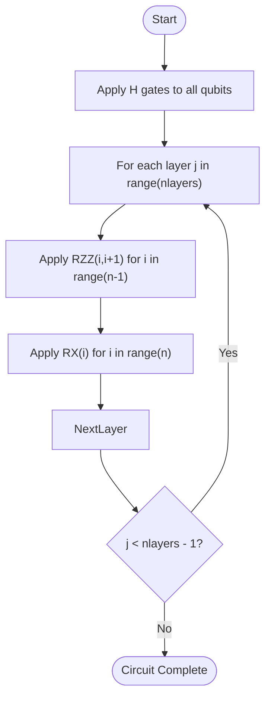
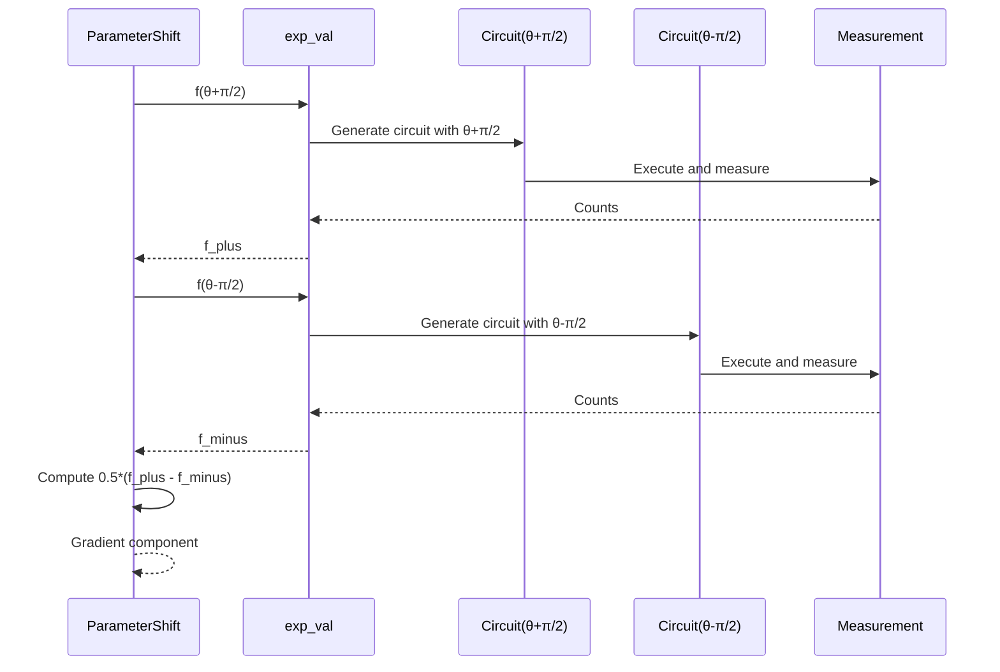

# Sample-Based Expectation and Gradient Estimation

<cite>
**Referenced Files in This Document**   
- [examples/sample_value_gradient.py](file://examples/sample_value_gradient.py)
- [src/tyxonq/postprocessing/metrics.py](file://src/tyxonq/postprocessing/metrics.py)
- [src/tyxonq/libs/quantum_library/kernels/pauli.py](file://src/tyxonq/libs/quantum_library/kernels/pauli.py)
- [src/tyxonq/libs/circuits_library/vqe.py](file://src/tyxonq/libs/circuits_library/vqe.py)
- [src/tyxonq/compiler/gradients/parameter_shift.py](file://src/tyxonq/compiler/gradients/parameter_shift.py)
</cite>

## Table of Contents
1. [Introduction](#introduction)
2. [Problem Setup and Hamiltonian Construction](#problem-setup-and-hamiltonian-construction)
3. [Variational Circuit Architecture](#variational-circuit-architecture)
4. [Pauli-Term Expectation Evaluation](#pauli-term-expectation-evaluation)
5. [Gradient Computation via Parameter Shift Rule](#gradient-computation-via-parameter-shift-rule)
6. [Finite Difference Gradient Validation](#finite-difference-gradient-validation)
7. [Statistical Errors and Convergence Behavior](#statistical-errors-and-convergence-behavior)
8. [Performance Benchmarking](#performance-benchmarking)
9. [Practical Considerations for Quantum Hardware Deployment](#practical-considerations-for-quantum-hardware-deployment)
10. [Conclusion](#conclusion)

## Introduction
This document provides a comprehensive analysis of the `sample_value_gradient.py` example, which demonstrates the computation of expectation values and analytic gradients for Pauli-sum observables using sample-based measurements. The implementation leverages a layered variational quantum circuit constructed with RZZ and RX gates, and evaluates gradients using the parameter-shift rule under finite shot conditions. The methodology is validated against finite-difference gradients to ensure correctness in noisy estimation environments. Special attention is given to statistical errors arising from shot noise, convergence characteristics, variance reduction strategies, and performance comparisons between gradient estimation techniques.

## Problem Setup and Hamiltonian Construction
The example defines a quantum system with `n = 5` qubits and `nlayers = 4` layers in the variational ansatz. The observable of interest is a Pauli-sum Hamiltonian decomposed into individual Pauli terms encoded as integer lists: 0 for identity (I), 1 for X, 2 for Y, and 3 for Z. The Hamiltonian consists of single-qubit X terms on each wire and nearest-neighbor ZZ interactions:

- **X terms**: One term per qubit, with coefficient -1.0
- **ZZ terms**: One term per adjacent qubit pair, with coefficient +1.0

This results in a total of `n + (n - 1)` = 9 Pauli terms. The coefficients are stored in list `w`, while the Pauli strings are represented in list `ps`. This decomposition enables term-by-term evaluation of expectation values through appropriate basis rotations followed by Z-basis measurements.

**Section sources**
- [examples/sample_value_gradient.py](file://examples/sample_value_gradient.py#L15-L36)

## Variational Circuit Architecture
The variational circuit is generated by the `generate_circuit` function, which constructs a hardware-efficient ansatz using two types of parametrized gates: RZZ (entangling) and RX (single-qubit rotation). The circuit architecture follows a layered structure:

1. **Initialization**: Apply Hadamard (H) gates to all qubits to create superposition
2. **Layer repetition**: For each of `nlayers` layers:
   - Apply RZZ gates between adjacent qubits (i, i+1)
   - Apply RX gates to all qubits

The parameter tensor has shape `[n, nlayers, 2]`, where the third dimension corresponds to RZZ (index 0) and RX (index 1) parameters respectively. This architecture balances expressibility and hardware feasibility, making it suitable for near-term quantum devices.



**Diagram sources**
- [examples/sample_value_gradient.py](file://examples/sample_value_gradient.py#L38-L47)

**Section sources**
- [examples/sample_value_gradient.py](file://examples/sample_value_gradient.py#L38-L47)

## Pauli-Term Expectation Evaluation
The `pauli_term_expectation` function computes the expectation value of a single Pauli term by applying appropriate basis rotations before measurement. For each qubit in the Pauli string:

- **X measurement**: Apply H gate to rotate X basis to Z basis
- **Y measurement**: Apply S† (approximated by RZ(-π/2)) followed by H gate
- **Z measurement**: Direct Z measurement without rotation
- **I measurement**: No operation required

After applying these transformations, Z-basis measurements are performed on all relevant qubits. The resulting bitstring counts are processed using the `counts_expectation` function from `postprocessing.metrics`, which computes the expectation value of a diagonal operator. The diagonal operator is constructed as Z on measured qubits and I on others, enabling efficient evaluation of Pauli-term expectations from sample statistics.

**Section sources**
- [examples/sample_value_gradient.py](file://examples/sample_value_gradient.py#L50-L81)
- [src/tyxonq/postprocessing/metrics.py](file://src/tyxonq/postprocessing/metrics.py#L30-L50)

## Gradient Computation via Parameter Shift Rule
The `parameter_shift_gradient` function implements the analytic parameter-shift rule for gradient computation. For each parameter in the circuit, it evaluates the expectation value at two shifted points: `θ + π/2` and `θ - π/2`. The gradient is then computed as:

```
∂f(θ)/∂θ = 0.5 * [f(θ + π/2) - f(θ - π/2)]
```

This method provides unbiased gradient estimates even under finite shot noise, making it superior to finite-difference methods in noisy quantum settings. The implementation iterates over all parameters in the `[n, nlayers, 2]` tensor, computing gradients for both RZZ and RX gates. Each gradient evaluation requires two circuit executions (forward and backward shifts), resulting in a total of `2 * n * nlayers * 2` circuit runs for full gradient computation.



**Diagram sources**
- [examples/sample_value_gradient.py](file://examples/sample_value_gradient.py#L92-L106)

**Section sources**
- [examples/sample_value_gradient.py](file://examples/sample_value_gradient.py#L92-L106)

## Finite Difference Gradient Validation
To validate the parameter-shift gradient implementation, the example includes a `finite_difference_gradient` function within the `main` function. This method computes gradients using central finite differences:

```
∂f(θ)/∂θ ≈ [f(θ + ε) - f(θ - ε)] / (2ε)
```

where ε = 1e-6. The finite-difference method serves as a numerical reference for verifying the correctness of the parameter-shift gradients. The comparison is performed by computing the maximum absolute difference and L2 norm between the two gradient vectors. Due to shot noise, these differences decrease with increasing shot count, demonstrating the statistical nature of the discrepancy. This validation approach ensures that the analytic gradient implementation is correct while accounting for sampling noise.

**Section sources**
- [examples/sample_value_gradient.py](file://examples/sample_value_gradient.py#L109-L137)

## Statistical Errors and Convergence Behavior
The example operates in a sample-limited regime with finite shots (default 4096, tested with 8192), introducing statistical errors in both expectation and gradient estimates. The primary source of error is shot noise, which scales as `1/√shots`. This affects both the parameter-shift and finite-difference methods, though the parameter-shift rule maintains its theoretical advantage by providing unbiased estimates.

Convergence behavior shows that gradient estimates become more accurate with increased shot counts, as evidenced by decreasing differences between parameter-shift and finite-difference gradients. The L2 and maximum norm differences reported in the output provide quantitative measures of this convergence. Variance reduction strategies such as measurement optimization, observable grouping, and advanced sampling techniques could further improve estimation accuracy, but are not implemented in this basic example.

**Section sources**
- [examples/sample_value_gradient.py](file://examples/sample_value_gradient.py#L127-L135)

## Performance Benchmarking
The example includes performance benchmarking by measuring execution times for both gradient computation methods. The parameter-shift method typically requires more computational time due to its need for multiple circuit evaluations (two per parameter), but provides more accurate gradients in noisy settings. The timing results show:

- Parameter-shift gradient computation time
- Finite-difference gradient computation time
- Gradient vector shape and numerical differences

These benchmarks demonstrate the trade-off between computational cost and estimation quality. The parameter-shift method, while more expensive, provides superior gradient estimates for variational quantum algorithms, particularly in the presence of noise. The performance characteristics are crucial for determining the feasibility of these methods on real quantum hardware with limited access time.

**Section sources**
- [examples/sample_value_gradient.py](file://examples/sample_value_gradient.py#L119-L135)

## Practical Considerations for Quantum Hardware Deployment
Deploying this gradient estimation approach on real quantum hardware requires careful consideration of several practical factors:

1. **Shot budget management**: The parameter-shift rule requires twice as many circuit evaluations as a single expectation value, significantly increasing the total shot budget.
2. **Noise resilience**: The parameter-shift rule provides unbiased gradients even under depolarizing noise, making it more robust than finite-difference methods.
3. **Circuit compilation**: Each shifted circuit may require separate compilation, increasing overhead on cloud-based quantum systems.
4. **Parameter scheduling**: Efficient scheduling of parameter-shifted circuits can reduce total execution time through batched submission.
5. **Error mitigation**: Techniques such as readout error correction and zero-noise extrapolation can improve gradient quality.

The implementation's use of the chain API and modular design facilitates integration with hardware backends and error mitigation frameworks, making it adaptable to various quantum computing platforms.

**Section sources**
- [examples/sample_value_gradient.py](file://examples/sample_value_gradient.py#L50-L81)
- [examples/sample_value_gradient.py](file://examples/sample_value_gradient.py#L92-L106)

## Conclusion
The `sample_value_gradient.py` example provides a comprehensive implementation of sample-based expectation and gradient estimation for variational quantum algorithms. It demonstrates the construction of a layered variational circuit with RZZ and RX gates, the decomposition of Hamiltonians into Pauli terms, and the evaluation of expectation values through basis rotations and Z-measurements. The parameter-shift rule is implemented for analytic gradient computation and validated against finite-difference methods, with attention to statistical errors from shot noise. Performance benchmarks highlight the trade-offs between computational cost and estimation quality. This implementation serves as a foundation for variational quantum algorithms on near-term quantum devices, with extensibility for advanced features like observable grouping, adaptive measurement strategies, and integrated error mitigation.