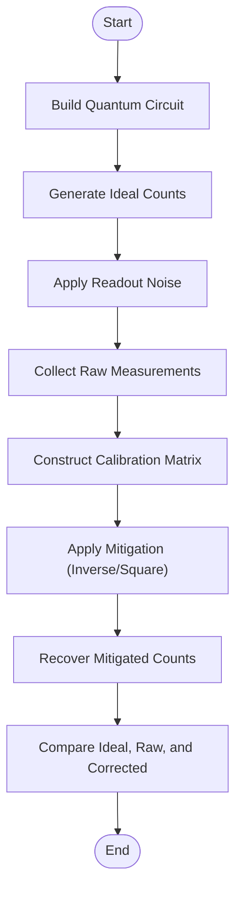
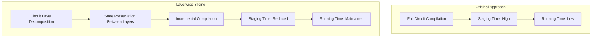
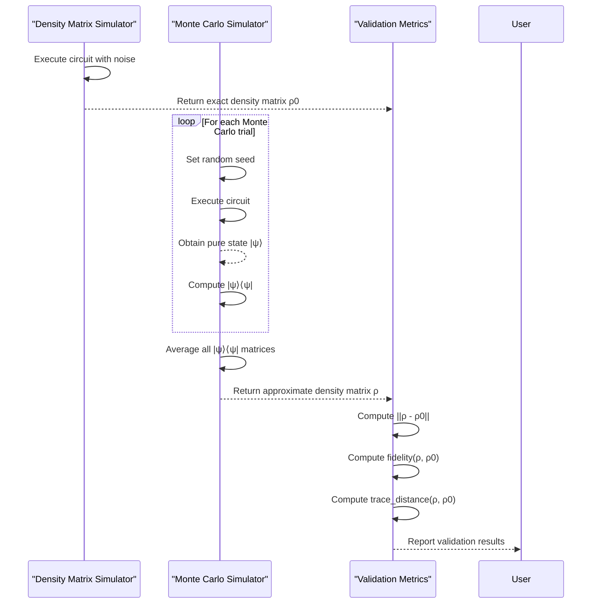
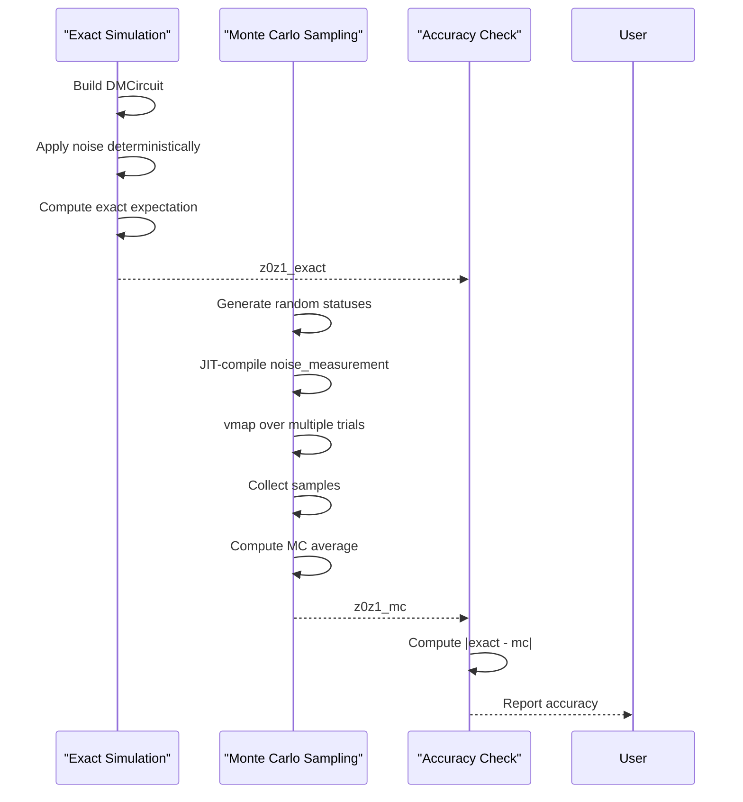
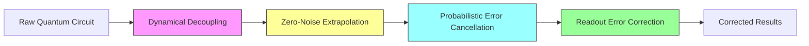

# Error Mitigation Examples

<cite>
**Referenced Files in This Document**   
- [readout_mitigation.py](file://examples/readout_mitigation.py)
- [mcnoise_boost.py](file://examples-ng/mcnoise_boost.py)
- [mcnoise_boost_v2.py](file://examples-ng/mcnoise_boost_v2.py)
- [mcnoise_check.py](file://examples-ng/mcnoise_check.py)
- [noise_calibration.py](file://examples-ng/noise_calibration.py)
- [noisy_qml.py](file://examples-ng/noisy_qml.py)
- [noisy_sampling_jit.py](file://examples-ng/noisy_sampling_jit.py)
- [readout.py](file://src/tyxonq/postprocessing/readout.py)
- [channels.py](file://src/tyxonq/devices/simulators/noise/channels.py)
</cite>

## Table of Contents
1. [Introduction](#introduction)
2. [Readout Error Correction](#readout-error-correction)
3. [Monte Carlo Noise Boosting](#monte-carlo-noise-boosting)
4. [Noise Characterization and Validation](#noise-characterization-and-validation)
5. [Noise Calibration Procedures](#noise-calibration-procedures)
6. [Noisy Quantum Machine Learning](#noisy-quantum-machine-learning)
7. [JIT-Compiled Noisy Sampling](#jit-compiled-noisy-sampling)
8. [Combining Error Mitigation Strategies](#combining-error-mitigation-strategies)
9. [Evaluation of Mitigation Effectiveness](#evaluation-of-mitigation-effectiveness)
10. [Conclusion](#conclusion)

## Introduction
This document provides comprehensive coverage of error mitigation techniques in noisy quantum systems, focusing on practical implementations within the TyxonQ framework. The content addresses readout error correction, Monte Carlo noise simulation methods, noise characterization, calibration procedures, and applications in quantum machine learning. Each technique is analyzed with respect to its underlying principles, assumptions, limitations, and implementation details. The document also covers advanced topics such as JIT-compiled noisy sampling and strategies for combining multiple error mitigation approaches to improve result accuracy on real quantum hardware.

## Readout Error Correction
The readout error correction implementation in `readout_mitigation.py` demonstrates a complete workflow for mitigating measurement errors in quantum circuits. The approach follows a two-step process: first characterizing the readout error through calibration matrices, then applying inverse correction to measured counts. The example uses a Bell-like circuit to generate ideal counts, simulates readout errors using per-qubit calibration matrices, and applies mitigation to recover the original distribution.

The core functionality is implemented in the `ReadoutMit` class from `postprocessing.readout`, which supports both matrix inversion and constrained least squares methods for correction. The calibration matrices are row-stochastic, representing the probability that a true state is measured as a different state. For multi-qubit systems, the full calibration matrix is constructed as the Kronecker product of per-qubit matrices in ascending wire order.



**Diagram sources**
- [readout_mitigation.py](file://examples/readout_mitigation.py#L0-L133)
- [readout.py](file://src/tyxonq/postprocessing/readout.py#L0-L142)

**Section sources**
- [readout_mitigation.py](file://examples/readout_mitigation.py#L0-L133)
- [readout.py](file://src/tyxonq/postprocessing/readout.py#L0-L142)

## Monte Carlo Noise Boosting
The Monte Carlo noise boosting techniques in `mcnoise_boost.py` and `mcnoise_boost_v2.py` address performance optimization in noisy quantum simulations. The primary challenge in Monte Carlo simulations is the computational cost of staging time, particularly when dealing with general noise channels applied at each circuit layer. The solution implements circuit layerwise slicing to improve JIT compilation efficiency and reduce staging overhead.

The original implementation (`mcnoise_boost.py`) uses separate template functions for different circuit operations (CNOT, noise application, RZ gates), while the improved version (`mcnoise_boost_v2.py`) introduces a `precompute` function that captures the quantum state after each layer and uses it as input for subsequent operations. This approach significantly reduces the computational graph size and improves compilation times, especially for deep circuits with multiple noisy layers.



**Diagram sources**
- [mcnoise_boost.py](file://examples-ng/mcnoise_boost.py#L0-L97)
- [mcnoise_boost_v2.py](file://examples-ng/mcnoise_boost_v2.py#L0-L85)

**Section sources**
- [mcnoise_boost.py](file://examples-ng/mcnoise_boost.py#L0-L97)
- [mcnoise_boost_v2.py](file://examples-ng/mcnoise_boost_v2.py#L0-L85)

## Noise Characterization and Validation
The `mcnoise_check.py` example provides a rigorous validation framework for comparing different quantum simulation methods. It cross-checks the results of density matrix simulation against Monte Carlo trajectory simulation to ensure numerical consistency. The validation process computes key metrics such as fidelity and trace distance between the density matrix obtained from exact simulation and the ensemble average of Monte Carlo trajectories.

The implementation uses a circuit with phasedamping channels applied at each layer, generating multiple Monte Carlo trajectories with different random seeds. The final density matrix is reconstructed by averaging the outer products of the pure state vectors. This approach validates that the Monte Carlo method correctly approximates the mixed state evolution described by the density matrix formalism.



**Diagram sources**
- [mcnoise_check.py](file://examples-ng/mcnoise_check.py#L0-L81)

**Section sources**
- [mcnoise_check.py](file://examples-ng/mcnoise_check.py#L0-L81)

## Noise Calibration Procedures
The `noise_calibration.py` module implements comprehensive procedures for characterizing and calibrating quantum device noise. It addresses two primary noise types: readout errors and thermal relaxation (T1/T2) processes. The readout error mitigation uses a complete set of basis state preparations to construct the full calibration matrix, while the thermal relaxation calibration employs specialized pulse sequences to extract T1 and T2 time constants.

For readout error characterization, the system prepares all possible computational basis states and measures the resulting distributions. This yields a complete confusion matrix that maps ideal states to measured outcomes. The thermal relaxation calibration uses inversion recovery (for T1) and Hahn echo (for T2) sequences, fitting the measured signal decay to exponential models to extract the relaxation time constants.

```mermaid
flowchart TD
subgraph "Readout Calibration"
R1[Prepare All Basis States]
R2[Measure with Readout Errors]
R3[Construct Confusion Matrix]
R4[Invert Matrix for Correction]
end
subgraph "T1 Calibration"
T1[Prepare |1⟩ State]
T2[Wait Time t]
T3[Measure Z Expectation]
T4[Repeat for Multiple t]
T5[Fit to A*exp(-t/T1) + C]
end
subgraph "T2 Calibration"
U1[Prepare |+⟩ State]
U2[Wait Time t]
U3[Apply π Pulse]
U4[Wait Time t]
U5[Measure Z Expectation]
U6[Repeat for Multiple t]
U7[Fit to A*exp(-t/T2) + C]
end
R1 --> R2 --> R3 --> R4
T1 --> T2 --> T3 --> T4 --> T5
U1 --> U2 --> U3 --> U4 --> U5 --> U6 --> U7
```

**Diagram sources**
- [noise_calibration.py](file://examples-ng/noise_calibration.py#L0-L214)

**Section sources**
- [noise_calibration.py](file://examples-ng/noise_calibration.py#L0-L214)

## Noisy Quantum Machine Learning
The `noisy_qml.py` example demonstrates quantum machine learning with explicit noise modeling using Monte Carlo simulation. The implementation trains a variational quantum classifier on MNIST data while incorporating depolarizing noise in the quantum circuit. The noise is modeled using vmapped Monte Carlo trajectories, allowing efficient gradient computation through noisy circuits.

The architecture uses a parameterized quantum circuit (PQC) with data encoding through RX rotations and variational layers with CNOT entanglement and RZ/RX rotations. Depolarizing noise is applied after each CNOT gate, with noise status parameters enabling different noise realizations across Monte Carlo samples. The training loop computes gradients using vectorized automatic differentiation, averaging results across multiple noise trajectories to obtain robust parameter updates.

```mermaid
graph TB
subgraph "Data Processing"
D1[Load MNIST Data]
D2[Filter Classes 0,1]
D3[Resize to √n×√n]
D4[Binarize Images]
D5[Reshape to n Features]
end
subgraph "Noisy PQC"
Q1[Data Encoding: RX(θ)]
Q2[CNOT Entanglement]
Q3[Depolarizing Noise]
Q4[RZ(θ) Variational]
Q5[RX(θ) Variational]
Q6[Repeat m Layers]
Q7[Measure Z Expectations]
end
subgraph "Training Loop"
T1[Sample Noise Status]
T2[VMAP over Noise Trajectories]
T3[Compute Loss Average]
T4[Backpropagate Gradients]
T5[Update Parameters]
end
D1 --> D2 --> D3 --> D4 --> D5 --> Q1
Q1 --> Q2 --> Q3 --> Q4 --> Q5 --> Q6 --> Q7 --> T2
T2 --> T3 --> T4 --> T5
```

**Diagram sources**
- [noisy_qml.py](file://examples-ng/noisy_qml.py#L0-L227)

**Section sources**
- [noisy_qml.py](file://examples-ng/noisy_qml.py#L0-L227)

## JIT-Compiled Noisy Sampling
The `noisy_sampling_jit.py` example demonstrates high-performance noisy quantum simulation using JIT compilation and vectorization. It compares exact density matrix simulation results with Monte Carlo sampling estimates, validating the accuracy of the sampling approach. The implementation uses PyTorch as the backend with complex64 precision for optimal performance.

The core innovation is the use of `K.vmap` to batch multiple Monte Carlo trials, enabling efficient parallel execution on GPU hardware. The noise status parameter allows explicit control over noise realizations, ensuring reproducibility while maintaining statistical independence across samples. The comparison between exact expectation values (from density matrix simulation) and Monte Carlo estimates provides a quantitative measure of sampling accuracy.



**Diagram sources**
- [noisy_sampling_jit.py](file://examples-ng/noisy_sampling_jit.py#L0-L62)

**Section sources**
- [noisy_sampling_jit.py](file://examples-ng/noisy_sampling_jit.py#L0-L62)

## Combining Error Mitigation Strategies
Effective error mitigation often requires combining multiple techniques to address different noise sources. The TyxonQ framework supports a modular approach where readout error correction, zero-noise extrapolation (ZNE), dynamical decoupling (DD), and probabilistic error cancellation (PEC) can be applied in sequence. The `postprocessing/error_mitigation.py` module provides placeholder implementations for ZNE, DD, and RC (randomized compiling), which can be integrated with the readout mitigation techniques.

A typical combined workflow might first apply dynamical decoupling pulses to suppress coherent errors, then use zero-noise extrapolation to characterize and extrapolate away stochastic errors, and finally apply readout error correction to mitigate measurement inaccuracies. The order of operations is crucial, as later stages should not reintroduce errors that were mitigated in earlier stages.



**Diagram sources**
- [error_mitigation.py](file://src/tyxonq/postprocessing/error_mitigation.py#L0-L81)
- [readout.py](file://src/tyxonq/postprocessing/readout.py#L0-L142)

**Section sources**
- [error_mitigation.py](file://src/tyxonq/postprocessing/error_mitigation.py#L0-L81)
- [readout.py](file://src/tyxonq/postprocessing/readout.py#L0-L142)

## Evaluation of Mitigation Effectiveness
Evaluating the effectiveness of error mitigation strategies requires careful benchmarking against known ground truths or theoretical expectations. The examples provide several approaches for assessment: direct comparison of mitigated results with ideal counts, computation of fidelity and trace distance between quantum states, and monitoring of convergence behavior in variational algorithms.

Key metrics for evaluation include:
- **Relative improvement**: Reduction in error magnitude after mitigation
- **Fidelity preservation**: Maintenance of quantum state overlap
- **Statistical significance**: Confidence intervals for estimated observables
- **Computational overhead**: Trade-off between accuracy improvement and resource cost

The framework supports both synthetic benchmarks with known solutions and real hardware validation through cloud API integration. For production use, it's recommended to establish a calibration routine that periodically updates error models and mitigation parameters based on current device performance.

**Section sources**
- [mcnoise_check.py](file://examples-ng/mcnoise_check.py#L0-L81)
- [noise_calibration.py](file://examples-ng/noise_calibration.py#L0-L214)
- [readout_mitigation.py](file://examples/readout_mitigation.py#L0-L133)

## Conclusion
The error mitigation examples in TyxonQ provide a comprehensive toolkit for improving result accuracy in noisy quantum systems. The implementations cover the full spectrum from basic readout error correction to advanced Monte Carlo simulation techniques and quantum machine learning with explicit noise modeling. Key strengths include the modular design of mitigation strategies, efficient JIT-compiled execution, and comprehensive validation frameworks.

For optimal results, users should combine multiple mitigation techniques in a pipeline tailored to their specific hardware and application requirements. Regular calibration of noise parameters and systematic evaluation of mitigation effectiveness are essential for maintaining high accuracy. The framework's extensible design allows for easy integration of additional error mitigation methods as they become available.