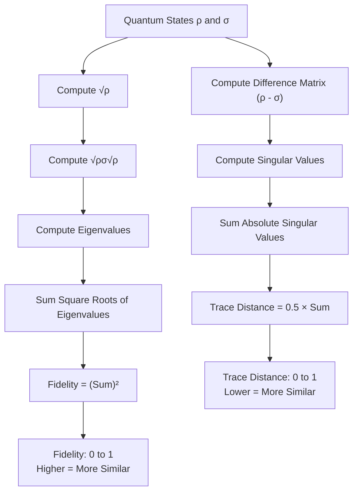
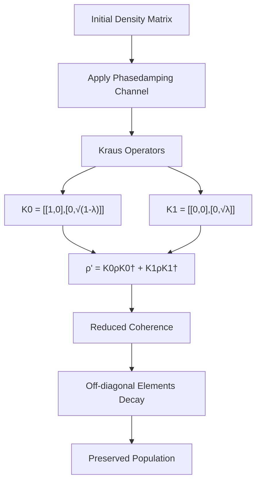

# Correctness Validation

<cite>
**Referenced Files in This Document**   
- [mcnoise_check.py](file://examples-ng/mcnoise_check.py)
- [engine.py](file://src/tyxonq/devices/simulators/density_matrix/engine.py)
- [channels.py](file://src/tyxonq/devices/simulators/noise/channels.py)
- [metrics.py](file://src/tyxonq/postprocessing/metrics.py)
</cite>

## Table of Contents
1. [Introduction](#introduction)
2. [Cross-Validation Methodology](#cross-validation-methodology)
3. [Fidelity and Trace Distance Metrics](#fidelity-and-trace-distance-metrics)
4. [Trajectory Averaging and Density Matrix Reconstruction](#trajectory-averaging-and-density-matrix-reconstruction)
5. [Numerical Stability with PyTorch](#numerical-stability-with-pytorch)
6. [Sample Count Convergence](#sample-count-convergence)
7. [Phasedamping Channel Impact](#phasedamping-channel-impact)
8. [Validation Best Practices](#validation-best-practices)

## Introduction
This document details the correctness validation framework for Monte Carlo noise simulations in the TyxonQ quantum computing platform. The core methodology centers on cross-validating Monte Carlo trajectory results against a ground truth density matrix simulation using the `mcnoise_check.py` validation script. This approach ensures accurate noise modeling by quantitatively comparing stochastic trajectory outcomes with exact quantum state evolution. The validation process leverages fidelity and trace distance metrics to measure agreement between simulation methods, with particular attention to numerical stability when using PyTorch for exact state evolution. The framework addresses key aspects of quantum noise simulation including trajectory averaging, convergence behavior with increasing sample counts, and the specific impact of phasedamping channels on state evolution.

## Cross-Validation Methodology
The cross-validation methodology implemented in `mcnoise_check.py` establishes a rigorous framework for verifying Monte Carlo noise simulation correctness by comparing results against a density matrix simulation ground truth. The process begins by creating two parallel simulation paths: one using a density matrix circuit (`tq.DMCircuit2`) to compute the exact mixed state evolution, and another using a standard circuit (`tq.Circuit`) to generate Monte Carlo trajectories. The density matrix simulation serves as the reference ground truth (rho0), computed through exact quantum state evolution that natively handles mixed states and noise channels. Simultaneously, the Monte Carlo approach generates multiple quantum trajectories by executing the same circuit structure with randomized noise realizations across many trials (mctries). Each trajectory produces a pure state vector, which is then used to reconstruct an approximate density matrix through ensemble averaging. The cross-validation is completed by quantitatively comparing the reconstructed Monte Carlo density matrix with the exact density matrix ground truth using fidelity and trace distance metrics. This dual-path approach effectively validates whether the stochastic Monte Carlo method accurately captures the same physical behavior as the deterministic density matrix method.

**Section sources**
- [mcnoise_check.py](file://examples-ng/mcnoise_check.py#L1-L81)

## Fidelity and Trace Distance Metrics
The validation framework employs two complementary quantum information metrics—fidelity and trace distance—to quantitatively assess the agreement between Monte Carlo simulation results and the density matrix ground truth. Fidelity measures the "closeness" between two quantum states, with values approaching 1.0 indicating nearly identical states. In the context of noise simulation validation, high fidelity (typically >0.99) confirms that the Monte Carlo trajectory averaging accurately reconstructs the mixed state predicted by the density matrix method. The implementation in `metrics.py` computes fidelity using the formula F(ρ,σ) = (Tr[√√ρσ√ρ])², which calculates the overlap between the two density matrices. Trace distance, on the other hand, provides a measure of distinguishability between quantum states, with values ranging from 0 (identical states) to 1 (perfectly distinguishable). It is computed as half the sum of the singular values of the difference matrix (ρ - σ), offering a robust metric for detecting discrepancies in state populations and coherences. Together, these metrics provide a comprehensive assessment of simulation accuracy, with fidelity emphasizing state similarity and trace distance highlighting detectable differences. The validation script outputs both metrics to give developers multiple perspectives on simulation correctness.

**Diagram sources**
- [metrics.py](file://src/tyxonq/postprocessing/metrics.py#L250-L270)

**Section sources**
- [mcnoise_check.py](file://examples-ng/mcnoise_check.py#L75-L80)
- [metrics.py](file://src/tyxonq/postprocessing/metrics.py#L250-L270)

## Trajectory Averaging and Density Matrix Reconstruction
The Monte Carlo noise simulation framework reconstructs the system's density matrix through trajectory averaging, a process that converts an ensemble of pure state trajectories into an approximation of the mixed quantum state. Each Monte Carlo trial generates a pure state vector |ψᵢ⟩ by executing the quantum circuit with a specific noise realization. The outer product |ψᵢ⟩⟨ψᵢ| creates a rank-1 density matrix representing that individual trajectory. By averaging N such trajectory density matrices, the framework reconstructs the overall system density matrix as ρ ≈ (1/N)∑|ψᵢ⟩⟨ψᵢ|. This process effectively simulates the decoherence and mixed state behavior that arises from environmental interactions. The reconstruction quality depends critically on the number of trajectories, with more samples reducing statistical fluctuations in the estimated density matrix elements. The implementation in `mcnoise_check.py` performs this averaging iteratively, accumulating the outer products of state vectors and normalizing by the total number of trials. This approach bridges the gap between the pure state formalism used in trajectory simulations and the mixed state formalism required for accurate noise modeling, enabling direct comparison with the density matrix simulator's output.

**Section sources**
- [mcnoise_check.py](file://examples-ng/mcnoise_check.py#L65-L70)

## Numerical Stability with PyTorch
The validation framework addresses numerical stability challenges when performing exact quantum state evolution with PyTorch, particularly in the context of density matrix simulations. The `mcnoise_check.py` script includes explicit warnings about potential numerical inaccuracies when using PyTorch for exact simulations, reflecting the trade-offs between computational efficiency and numerical precision. The density matrix simulator in `engine.py` employs several strategies to maintain numerical stability: it uses complex128 precision for density matrix operations, applies clipping to ensure positive semi-definiteness of eigenvalues, and normalizes states after projection operations to prevent norm drift. When reconstructing the density matrix from Monte Carlo trajectories, the framework carefully manages tensor reshaping and conjugation operations to preserve numerical accuracy. The use of PyTorch's automatic differentiation and JIT compilation (via `@K.jit`) improves computational efficiency but requires careful handling of numerical edge cases. The validation process itself serves as a numerical stability check, with significant discrepancies between Monte Carlo and density matrix results potentially indicating numerical instability in either simulation path. Developers are advised to monitor both fidelity and trace distance metrics across different problem sizes to detect emerging numerical issues.

**Section sources**
- [mcnoise_check.py](file://examples-ng/mcnoise_check.py#L40-L41)
- [engine.py](file://src/tyxonq/devices/simulators/density_matrix/engine.py#L100-L120)

## Sample Count Convergence
The convergence of Monte Carlo noise simulations depends critically on the number of trajectories (sample count), with larger sample counts reducing statistical uncertainty in the reconstructed density matrix. The `mcnoise_check.py` script demonstrates this relationship by using a configurable `mctries` parameter that determines the number of Monte Carlo trials. With insufficient samples, the trajectory averaging process produces a noisy estimate of the true density matrix, leading to lower fidelity and higher trace distance when compared to the ground truth. As the sample count increases, the law of large numbers ensures that the Monte Carlo estimate converges to the exact result from the density matrix simulator. The validation framework allows developers to study this convergence behavior by systematically varying the `mctries` parameter and observing the resulting fidelity and trace distance metrics. Practical considerations include the computational cost of additional samples versus the required accuracy, with typical validation runs using thousands to hundreds of thousands of trajectories depending on the desired precision. The convergence rate depends on the specific noise model and circuit depth, with stronger noise generally requiring more samples to achieve the same level of accuracy.

**Section sources**
- [mcnoise_check.py](file://examples-ng/mcnoise_check.py#L10-L11)

## Phasedamping Channel Impact
The phasedamping channel plays a central role in the validation framework, serving as a representative noise model to test the accuracy of Monte Carlo simulations. Implemented in `channels.py`, the phasedamping channel models pure dephasing processes that destroy quantum coherence without energy relaxation. The channel is parameterized by a damping coefficient (λ=0.15 in the validation script), which determines the strength of the dephasing effect. In the density matrix simulator, phasedamping is applied natively through Kraus operator formalism, where the channel's effect is computed exactly using the `apply_to_density_matrix` function. The Monte Carlo implementation approximates this same physical process by randomly applying phase-flip operations according to the channel's probability distribution. The validation process specifically tests whether this stochastic approximation accurately reproduces the exact dephasing behavior across multiple qubits and circuit layers. The phasedamping channel's impact is particularly evident in the off-diagonal elements of the density matrix, which decay according to the damping parameter. By comparing how both simulation methods handle this coherence decay, the framework verifies the correctness of the noise modeling implementation.

**Diagram sources**
- [channels.py](file://src/tyxonq/devices/simulators/noise/channels.py#L45-L55)
- [mcnoise_check.py](file://examples-ng/mcnoise_check.py#L37-L38)

**Section sources**
- [mcnoise_check.py](file://examples-ng/mcnoise_check.py#L37-L38)
- [channels.py](file://src/tyxonq/devices/simulators/noise/channels.py#L45-L55)

## Validation Best Practices
Effective validation of Monte Carlo noise simulations requires adherence to several best practices to ensure accurate and reliable results. First, developers should use the density matrix simulator as a ground truth reference for small to medium-sized systems where exact simulation is computationally feasible. Second, multiple validation metrics (fidelity and trace distance) should be monitored simultaneously to detect different types of discrepancies. Third, convergence testing with increasing sample counts is essential to distinguish between statistical noise and systematic errors in the implementation. Fourth, the validation should be performed across a range of noise parameters and circuit depths to ensure robustness. Fifth, developers should verify that both simulation paths use identical circuit structures and noise models, with particular attention to random seed management in the Monte Carlo trajectories. Finally, the numerical precision of the simulation should be monitored, with complex128 precision recommended for critical validation runs. These practices ensure that the Monte Carlo noise simulation accurately captures the intended physical behavior and can be trusted for larger-scale quantum computations where exact validation is not feasible.

**Section sources**
- [mcnoise_check.py](file://examples-ng/mcnoise_check.py#L1-L81)