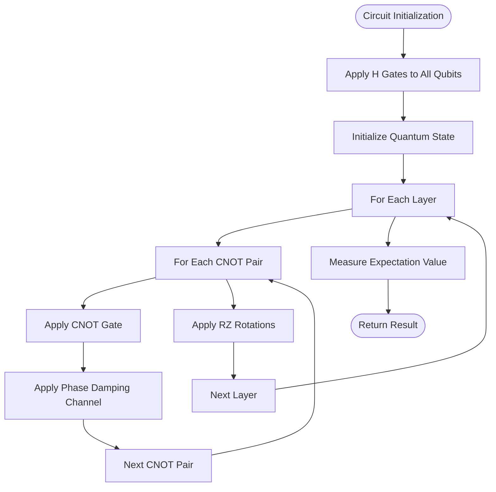
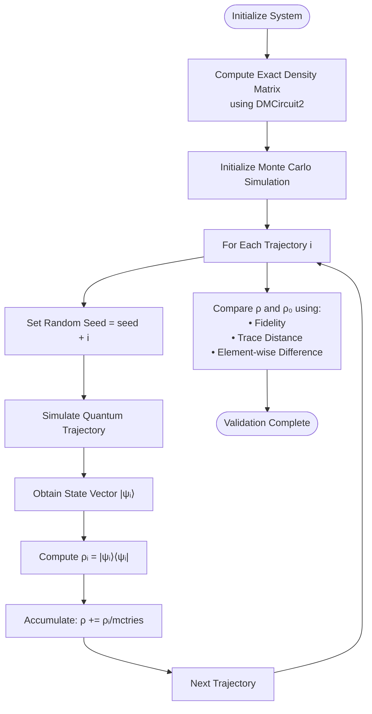
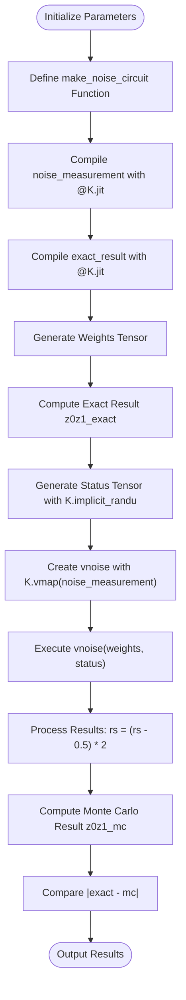
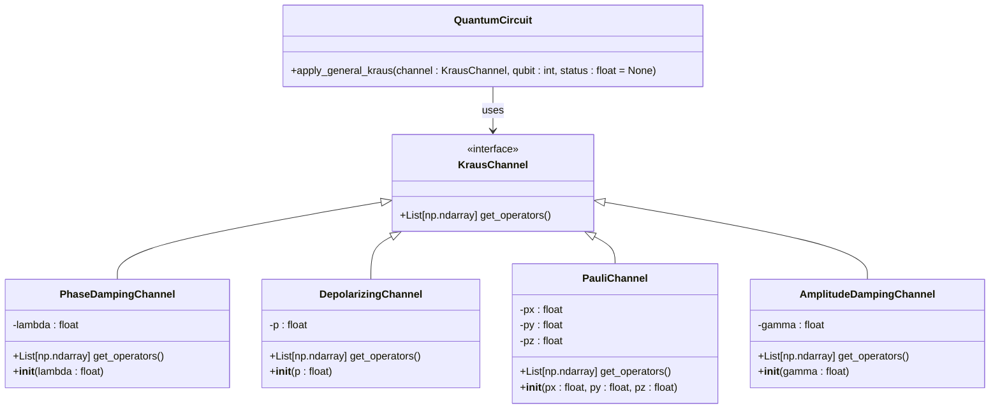
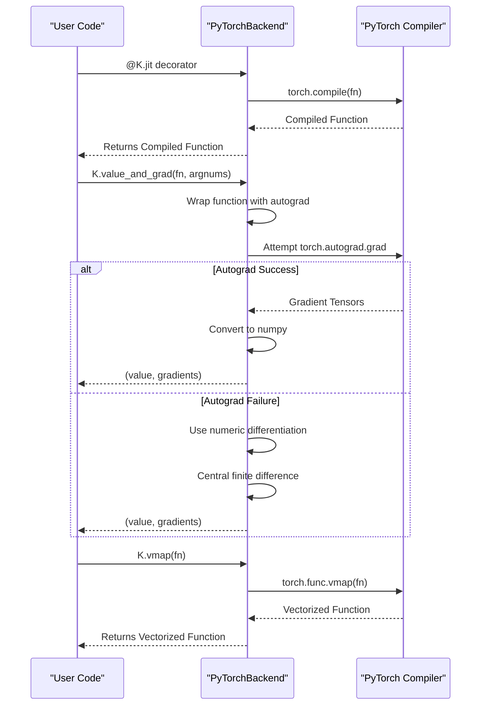

# Monte Carlo Noise Simulation

<cite>
**Referenced Files in This Document**   
- [mcnoise_boost.py](file://examples-ng/mcnoise_boost.py)
- [mcnoise_check.py](file://examples-ng/mcnoise_check.py)
- [noisy_sampling_jit.py](file://examples-ng/noisy_sampling_jit.py)
- [statevector/engine.py](file://src/tyxonq/devices/simulators/statevector/engine.py)
- [density_matrix/engine.py](file://src/tyxonq/devices/simulators/density_matrix/engine.py)
- [noise/channels.py](file://src/tyxonq/devices/simulators/noise/channels.py)
- [kernels/density_matrix.py](file://src/tyxonq/libs/quantum_library/kernels/density_matrix.py)
- [pytorch_backend.py](file://src/tyxonq/numerics/backends/pytorch_backend.py)
- [driver.py](file://src/tyxonq/devices/simulators/driver.py)
</cite>

## Table of Contents
1. [Introduction](#introduction)
2. [Core Components](#core-components)
3. [Layerwise Slicing Optimization](#layerwise-slicing-optimization)
4. [Cross-Validation Methodology](#cross-validation-methodology)
5. [JIT-Compiled Batched Sampling](#jit-compiled-batched-sampling)
6. [Noise Application and Status Flags](#noise-application-and-status-flags)
7. [vmap-Based Batching Strategy](#vmap-based-batching-strategy)
8. [Fidelity Comparison](#fidelity-comparison)
9. [General Kraus Channel Application](#general-kraus-channel-application)
10. [Trajectory Averaging](#trajectory-averaging)
11. [PyTorch JIT Integration](#pytorch-jit-integration)
12. [Conclusion](#conclusion)

## Introduction

Monte Carlo noise simulation is a stochastic method for modeling noisy quantum circuits by simulating individual quantum trajectories. This document details the implementation of Monte Carlo noise simulation in the TyxonQ framework, focusing on three key components: `mcnoise_boost.py` which demonstrates layerwise slicing optimization for reducing JIT staging time, `mcnoise_check.py` which implements cross-validation between density matrix and Monte Carlo simulators, and `noisy_sampling_jit.py` which showcases JIT-compiled batched sampling for high-performance noise simulation. The system leverages PyTorch's JIT compiler and vmap functionality to achieve high-performance noise simulation with deterministic noise application through status flags.

**Section sources**
- [mcnoise_boost.py](file://examples-ng/mcnoise_boost.py)
- [mcnoise_check.py](file://examples-ng/mcnoise_check.py)
- [noisy_sampling_jit.py](file://examples-ng/noisy_sampling_jit.py)

## Core Components

The Monte Carlo noise simulation system in TyxonQ consists of three primary components that work together to provide efficient and accurate noise modeling. The `mcnoise_boost.py` component implements layerwise slicing optimization to reduce JIT staging time, which is particularly beneficial for large-scale quantum circuits. The `mcnoise_check.py` component provides cross-validation between the density matrix simulator and the Monte Carlo trajectory state simulator, ensuring the correctness of the stochastic simulation results. The `noisy_sampling_jit.py` component demonstrates JIT-compiled batched sampling, which enables high-performance noise simulation suitable for hardware simulation scenarios. These components collectively form a comprehensive framework for stochastic trajectory methods in quantum circuit noise modeling.

**Section sources**
- [mcnoise_boost.py](file://examples-ng/mcnoise_boost.py#L1-L97)
- [mcnoise_check.py](file://examples-ng/mcnoise_check.py#L1-L81)
- [noisy_sampling_jit.py](file://examples-ng/noisy_sampling_jit.py#L1-L62)

## Layerwise Slicing Optimization

The layerwise slicing optimization demonstrated in `mcnoise_boost.py` addresses the challenge of long JIT staging times in Monte Carlo noise simulation. The optimization works by breaking down the quantum circuit into smaller, manageable layers that can be processed independently. This approach significantly reduces the computational overhead associated with JIT compilation by minimizing the size of the computation graph that needs to be staged. The implementation uses template functions for different circuit components (CNOT gates, noise application, and RZ rotations) that operate on intermediate quantum states, allowing for incremental state evolution rather than processing the entire circuit at once. This layer-by-layer processing strategy enables more efficient memory usage and faster compilation times, particularly for deep quantum circuits with multiple layers of operations.

**Diagram sources**
- [mcnoise_boost.py](file://examples-ng/mcnoise_boost.py#L45-L68)

**Section sources**
- [mcnoise_boost.py](file://examples-ng/mcnoise_boost.py#L45-L68)

## Cross-Validation Methodology

The cross-validation methodology implemented in `mcnoise_check.py` provides a rigorous approach to verify the correctness of Monte Carlo noise simulation results by comparing them against exact density matrix simulation. The process begins by computing the exact density matrix using the `DMCircuit2` class, which represents the true mixed state of the noisy quantum system. Then, multiple Monte Carlo trajectories are simulated using the standard `Circuit` class, each representing a possible evolution path of the quantum system under noise. The final density matrix is reconstructed by averaging the outer products of the state vectors from all trajectories. The validation compares the reconstructed density matrix with the exact one using metrics such as fidelity and trace distance. This cross-validation ensures that the stochastic Monte Carlo method accurately captures the statistical properties of the noisy quantum system.

**Diagram sources**
- [mcnoise_check.py](file://examples-ng/mcnoise_check.py#L50-L81)

**Section sources**
- [mcnoise_check.py](file://examples-ng/mcnoise_check.py#L50-L81)

## JIT-Compiled Batched Sampling

The JIT-compiled batched sampling approach in `noisy_sampling_jit.py` enables high-performance noise simulation by leveraging PyTorch's JIT compiler and vmap functionality. This approach is specifically designed for hardware simulation scenarios where only sampling interfaces are available, making Monte Carlo simulation sufficient and efficient. The implementation uses the `@K.jit` decorator to compile the noise measurement function, which creates a quantum circuit, applies noise operations, and returns samples. The key innovation is the use of `K.vmap` to create a vectorized version of the noise measurement function that can process multiple noise realizations simultaneously. This batched evaluation strategy dramatically improves performance by eliminating the overhead of repeated function calls and enabling parallel execution on GPU hardware.

**Diagram sources**
- [noisy_sampling_jit.py](file://examples-ng/noisy_sampling_jit.py#L25-L62)

**Section sources**
- [noisy_sampling_jit.py](file://examples-ng/noisy_sampling_jit.py#L25-L62)

## Noise Application and Status Flags

The Monte Carlo noise simulation system uses status flags to enable deterministic noise application, which is crucial for reproducible results and gradient computation. In the implementation, the `status` parameter is passed to noise channel operations such as `apply_general_kraus` and `depolarizing`, allowing explicit control over the random process that determines which Kraus operator is applied. When a status value is provided, the noise application becomes deterministic, as the same status will always result in the same noise outcome. This is particularly important for gradient-based optimization, where consistent noise realizations are needed across forward and backward passes. The status flags are generated using `K.implicit_randu` to create a tensor of random values that can be reused across multiple simulation runs, ensuring consistency while maintaining the statistical properties of the noise model.

**Section sources**
- [mcnoise_boost.py](file://examples-ng/mcnoise_boost.py#L35-L40)
- [noisy_sampling_jit.py](file://examples-ng/noisy_sampling_jit.py#L15-L20)

## vmap-Based Batching Strategy

The vmap-based batching strategy is a key performance optimization that enables efficient parallel execution of multiple Monte Carlo trajectories. The strategy uses PyTorch's `vmap` function to create a vectorized version of the noise measurement function, which can process a batch of noise realizations simultaneously. This approach eliminates the Python loop overhead and allows the computation to be fully parallelized on GPU hardware. The implementation first creates a status tensor with dimensions `[tries, 2, n, m]` where each element represents a random status for a specific noise channel in a specific trajectory. Then, `K.vmap` is applied to the `noise_measurement` function with `vectorized_argnums=1`, indicating that the second argument (status) should be vectorized. This creates a new function `vnoise` that can process the entire batch of status values in a single call, resulting in significant performance improvements compared to sequential execution.

**Section sources**
- [noisy_sampling_jit.py](file://examples-ng/noisy_sampling_jit.py#L55-L57)

## Fidelity Comparison

The fidelity comparison between exact and Monte Carlo results provides a quantitative measure of the accuracy of the stochastic simulation. In the `mcnoise_check.py` implementation, the fidelity is computed using `tq.quantum.fidelity(rho, rho0)` where `rho` is the density matrix reconstructed from Monte Carlo trajectories and `rho0` is the exact density matrix from the density matrix simulator. The fidelity metric ranges from 0 to 1, with values closer to 1 indicating higher similarity between the two quantum states. This comparison serves as a critical validation step, ensuring that the Monte Carlo method accurately captures the statistical properties of the noisy quantum system. The trace distance is also computed as a complementary metric, providing a measure of the distinguishability between the two states. Together, these metrics offer a comprehensive assessment of the Monte Carlo simulation's accuracy.

**Section sources**
- [mcnoise_check.py](file://examples-ng/mcnoise_check.py#L75-L77)

## General Kraus Channel Application

The general Kraus channel application is implemented through the `apply_general_kraus` method, which allows for the simulation of arbitrary quantum noise processes. This method takes a Kraus channel definition (such as `phasedampingchannel(0.15)`) and applies it to a specified qubit in the quantum circuit. The implementation in `noise/channels.py` provides several predefined noise channels including depolarizing, amplitude damping, phase damping, and Pauli channels, each returning a list of Kraus operators that satisfy the completeness relation. When a Kraus channel is applied, the simulation randomly selects one of the Kraus operators according to the specified probabilities, effectively modeling the stochastic nature of quantum noise. The ability to apply general Kraus channels makes the simulation framework highly flexible and capable of modeling a wide range of realistic noise scenarios encountered in quantum hardware.

**Diagram sources**
- [noise/channels.py](file://src/tyxonq/devices/simulators/noise/channels.py#L1-L64)
- [mcnoise_boost.py](file://examples-ng/mcnoise_boost.py#L25-L30)

**Section sources**
- [noise/channels.py](file://src/tyxonq/devices/simulators/noise/channels.py#L1-L64)
- [mcnoise_boost.py](file://examples-ng/mcnoise_boost.py#L25-L30)

## Trajectory Averaging

Trajectory averaging is the core principle of Monte Carlo noise simulation, where the expected behavior of a noisy quantum system is estimated by averaging over multiple stochastic trajectories. In the implementation, each trajectory represents a possible evolution path of the quantum system under the influence of noise, with the specific noise realization determined by random selection of Kraus operators. The final result is obtained by averaging the outcomes of all trajectories, with the accuracy improving as the number of trajectories increases. The `mcnoise_check.py` example demonstrates this by reconstructing the density matrix as ρ = Σ|ψᵢ⟩⟨ψᵢ|/mctries, where each |ψᵢ⟩ is the state vector from a single trajectory and mctries is the total number of trajectories. This approach effectively approximates the mixed state of the system as an ensemble of pure states, providing a computationally efficient alternative to full density matrix simulation for large systems.

**Section sources**
- [mcnoise_check.py](file://examples-ng/mcnoise_check.py#L65-L70)

## PyTorch JIT Integration

The integration with PyTorch's JIT compiler is a key enabler of high-performance noise simulation in the TyxonQ framework. The `pytorch_backend.py` implementation provides a `jit` method that wraps PyTorch's `torch.compile` functionality, allowing quantum circuit functions to be compiled into optimized computation graphs. This compilation process eliminates Python interpreter overhead and enables various optimizations such as operator fusion and memory planning. The `value_and_grad` method further enhances the JIT integration by providing automatic differentiation capabilities, which are essential for gradient-based optimization in variational quantum algorithms. The backend also implements `vmap` through `torch.func.vmap`, enabling efficient batching of operations. This comprehensive JIT integration allows the Monte Carlo noise simulation to achieve performance levels close to native PyTorch code while maintaining the high-level quantum circuit abstraction.

**Diagram sources**
- [pytorch_backend.py](file://src/tyxonq/numerics/backends/pytorch_backend.py#L200-L259)
- [noisy_sampling_jit.py](file://examples-ng/noisy_sampling_jit.py#L25-L26)

**Section sources**
- [pytorch_backend.py](file://src/tyxonq/numerics/backends/pytorch_backend.py#L200-L259)
- [noisy_sampling_jit.py](file://examples-ng/noisy_sampling_jit.py#L25-L26)

## Conclusion

The Monte Carlo noise simulation framework in TyxonQ provides a comprehensive and high-performance solution for modeling noisy quantum circuits using stochastic trajectory methods. The system combines several advanced techniques including layerwise slicing optimization to reduce JIT staging time, cross-validation between density matrix and Monte Carlo simulators to ensure correctness, and JIT-compiled batched sampling for high-performance execution. The use of status flags enables deterministic noise application, which is crucial for reproducible results and gradient computation in variational algorithms. The vmap-based batching strategy leverages PyTorch's vectorization capabilities to achieve efficient parallel execution of multiple trajectories. The framework supports general Kraus channel application, allowing for the simulation of arbitrary quantum noise processes, and implements trajectory averaging to estimate the expected behavior of noisy systems. The integration with PyTorch's JIT compiler provides significant performance benefits while maintaining the flexibility of high-level quantum circuit abstractions. Together, these components form a robust and efficient platform for noise simulation in quantum computing research and development.