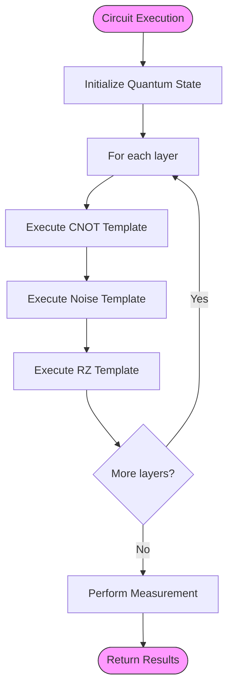
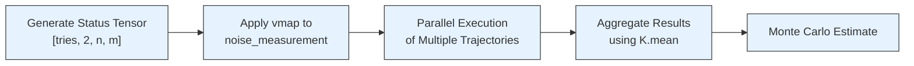

# Performance Optimization

<cite>
**Referenced Files in This Document**   
- [mcnoise_boost.py](file://examples-ng/mcnoise_boost.py)
- [mcnoise_boost_v2.py](file://examples-ng/mcnoise_boost_v2.py)
- [noisy_sampling_jit.py](file://examples-ng/noisy_sampling_jit.py)
- [pytorch_backend.py](file://src/tyxonq/numerics/backends/pytorch_backend.py)
</cite>

## Table of Contents
1. [Introduction](#introduction)
2. [Layerwise Slicing for JIT Staging Optimization](#layerwise-slicing-for-jit-staging-optimization)
3. [vmap-Based Batching Strategy](#vmap-based-batching-strategy)
4. [PyTorch JIT Integration and Static Argument Handling](#pytorch-jit-integration-and-static-argument-handling)
5. [Benchmarking Methodology and Performance Metrics](#benchmarking-methodology-and-performance-metrics)
6. [Optimization Guidelines for Large-Scale Simulation](#optimization-guidelines-for-large-scale-simulation)
7. [Conclusion](#conclusion)

## Introduction
This document provides a comprehensive analysis of performance optimization techniques for Monte Carlo noise simulation in quantum computing. The focus is on two key strategies: layerwise slicing to reduce JIT staging time and vmap-based batching for high-throughput trajectory simulation. These techniques are implemented in the TyxonQ framework, leveraging PyTorch's JIT compiler and advanced numerical backends to achieve significant performance improvements in noisy circuit simulation.

**Section sources**
- [mcnoise_boost.py](file://examples-ng/mcnoise_boost.py#L1-L10)
- [noisy_sampling_jit.py](file://examples-ng/noisy_sampling_jit.py#L1-L10)

## Layerwise Slicing for JIT Staging Optimization

The layerwise slicing technique implemented in `mcnoise_boost.py` addresses the challenge of long JIT compilation staging times in Monte Carlo noise simulations. This optimization breaks down large quantum circuits into smaller, manageable templates that can be compiled and executed more efficiently.

The core implementation uses a template-based approach where the circuit is decomposed into three fundamental operations: CNOT gates, noise application, and RX rotations. Each operation is encapsulated in its own template function (`templatecnot`, `templatenoise`, `templaterz`), allowing for independent compilation and execution. This modular design enables the JIT compiler to optimize each component separately, significantly reducing the overall staging time.

The slicing strategy works by maintaining the quantum state between template executions, effectively creating a pipeline where each layer of the circuit is processed incrementally. This approach contrasts with the monolithic circuit execution in the baseline implementation (`f1`), where the entire circuit must be compiled and staged before execution can begin.

Performance benchmarks demonstrate the effectiveness of this technique, showing a dramatic reduction in staging time from 235 seconds to 26 seconds for a 10×4 circuit configuration on a PyTorch/T4 platform, while also improving execution time from 0.36 seconds to 0.04 seconds per run.



**Diagram sources**
- [mcnoise_boost.py](file://examples-ng/mcnoise_boost.py#L30-L60)

**Section sources**
- [mcnoise_boost.py](file://examples-ng/mcnoise_boost.py#L30-L75)
- [mcnoise_boost_v2.py](file://examples-ng/mcnoise_boost_v2.py#L30-L75)

## vmap-Based Batching Strategy

The vmap-based batching strategy in `noisy_sampling_jit.py` enables high-throughput trajectory simulation by leveraging PyTorch's vectorization capabilities. This approach uses implicit random status flags to ensure deterministic noise application across batches while maintaining statistical independence between trajectories.

The implementation centers around the `K.vmap` function, which vectorizes the `noise_measurement` function across the batch dimension. This allows multiple noise trajectories to be simulated in parallel, dramatically increasing throughput. The key innovation is the use of `K.implicit_randu` to generate a tensor of random status values that control the noise application in each trajectory.

The batching strategy works by creating a status tensor with dimensions `[tries, 2, n, m]`, where `tries` represents the number of trajectories, `2` corresponds to the two qubits affected by each CNOT gate, `n` is the number of qubits, and `m` is the number of layers. This status tensor is passed to the `depolarizing` noise channels, which use the status values to determine whether to apply the noise operation.

This approach ensures that noise is applied consistently within each trajectory (deterministic across the batch) while allowing different trajectories to have different noise realizations (statistical independence). The vectorized execution enables efficient GPU utilization, as the parallel trajectories can be processed simultaneously on the available compute resources.



**Diagram sources**
- [noisy_sampling_jit.py](file://examples-ng/noisy_sampling_jit.py#L40-L60)

**Section sources**
- [noisy_sampling_jit.py](file://examples-ng/noisy_sampling_jit.py#L40-L60)

## PyTorch JIT Integration and Static Argument Handling

The integration with PyTorch's JIT compiler is a critical component of the performance optimization strategy. The implementation in `pytorch_backend.py` provides a comprehensive interface for JIT compilation, gradient computation, and vectorization, enabling efficient execution of quantum circuits with noise.

The `jit` method in the `PyTorchBackend` class serves as a thin wrapper around `torch.compile`, providing compatibility with the TyxonQ framework. When available, it leverages PyTorch's advanced compilation capabilities to optimize the execution graph, reducing both staging and execution times. The implementation includes fallback mechanisms to ensure compatibility across different PyTorch versions and configurations.

Static argument handling plays a crucial role in compilation caching and performance optimization. By specifying static arguments (such as circuit size `n` and number of layers `nlayer`) in the `static_argnums` parameter of the JIT decorator, the compiler can cache compiled versions of functions for specific circuit configurations. This eliminates redundant compilation when running multiple simulations with the same circuit structure but different parameters.

The `value_and_grad` implementation demonstrates sophisticated handling of automatic differentiation, combining PyTorch's autograd system with a numeric fallback for cases where symbolic gradients cannot be computed. This hybrid approach ensures robust gradient computation while maintaining performance through JIT compilation.

```mermaid
classDiagram
class PyTorchBackend {
+name : str
+available : bool
+jit(fn) Any
+vmap(fn) Any
+value_and_grad(fn, argnums) Any
+array(data, dtype) Any
+to_numpy(data) Any
+matmul(a, b) Any
+einsum(subscripts, *operands) Any
}
class BackendInterface {
<<interface>>
+jit(fn) Any
+vmap(fn) Any
+value_and_grad(fn, argnums) Any
+array(data, dtype) Any
+to_numpy(data) Any
}
BackendInterface <|.. PyTorchBackend : implements
PyTorchBackend ..> torch : uses
PyTorchBackend ..> torch.func : uses
note right of PyTorchBackend
Implements K-like helpers for
JIT compilation, vectorization,
and automatic differentiation
with PyTorch backend
end note
```

**Diagram sources**
- [pytorch_backend.py](file://src/tyxonq/numerics/backends/pytorch_backend.py#L150-L250)

**Section sources**
- [pytorch_backend.py](file://src/tyxonq/numerics/backends/pytorch_backend.py#L150-L250)
- [mcnoise_boost.py](file://examples-ng/mcnoise_boost.py#L80-L90)

## Benchmarking Methodology and Performance Metrics

The benchmarking methodology implemented in the example files provides a comprehensive framework for evaluating the performance of noisy circuit simulations. The approach measures both staging time (JIT compilation overhead) and running time (execution performance), offering insights into the trade-offs between these critical metrics.

The benchmarking function in `mcnoise_boost.py` follows a standardized protocol: it first measures the initial execution time (which includes JIT staging), then performs multiple runs to measure the average execution time. This approach separates the one-time compilation cost from the recurring execution cost, providing a clear picture of performance characteristics.

Real-world performance metrics demonstrate significant improvements from the optimization techniques. For a 10×4 circuit configuration on a PyTorch/T4 platform, the layerwise slicing technique reduces staging time from 235 seconds to 26 seconds (approximately 9× improvement) while improving execution time from 0.36 seconds to 0.04 seconds (approximately 9× improvement). On a Mac16 Intel CPU, the improvement is even more dramatic, with staging time reduced from 1015 seconds to 31.68 seconds (over 30× improvement).

The validation methodology in `noisy_sampling_jit.py` compares Monte Carlo simulation results against exact calculations using density matrix simulation (`DMCircuit`). This approach provides a quantitative measure of accuracy, with the difference between exact and Monte Carlo results serving as a metric for simulation fidelity. The implementation demonstrates that the optimized batching strategy maintains high accuracy while achieving significant performance improvements.

**Section sources**
- [mcnoise_boost.py](file://examples-ng/mcnoise_boost.py#L75-L95)
- [noisy_sampling_jit.py](file://examples-ng/noisy_sampling_jit.py#L50-L60)

## Optimization Guidelines for Large-Scale Simulation

Based on the analysis of the implemented techniques, several optimization guidelines emerge for large-scale noisy circuit simulation:

1. **Adopt layerwise slicing** for circuits with multiple layers of operations, as this dramatically reduces JIT staging time by breaking the compilation into smaller, cacheable units.

2. **Leverage vmap-based batching** for Monte Carlo simulations requiring multiple trajectories, as this enables efficient parallel execution and maximizes hardware utilization.

3. **Use implicit random status flags** to ensure deterministic noise application within trajectories while maintaining statistical independence between trajectories.

4. **Specify static arguments** in JIT compilation to enable compilation caching, particularly for circuit parameters that remain constant across multiple simulations.

5. **Balance staging and execution time** based on the use case: for single simulations, focus on reducing execution time; for repeated simulations with the same circuit structure, prioritize reducing staging time.

6. **Validate accuracy** by comparing Monte Carlo results against exact calculations when feasible, ensuring that performance optimizations do not compromise simulation fidelity.

These guidelines provide a framework for optimizing noisy quantum circuit simulations, balancing performance, accuracy, and resource utilization.

**Section sources**
- [mcnoise_boost.py](file://examples-ng/mcnoise_boost.py)
- [noisy_sampling_jit.py](file://examples-ng/noisy_sampling_jit.py)
- [pytorch_backend.py](file://src/tyxonq/numerics/backends/pytorch_backend.py)

## Conclusion
The performance optimization techniques analyzed in this document demonstrate significant improvements in Monte Carlo noise simulation for quantum circuits. The layerwise slicing approach effectively reduces JIT staging time by decomposing circuits into smaller, independently compilable templates, while the vmap-based batching strategy enables high-throughput trajectory simulation through efficient parallelization.

The integration with PyTorch's JIT compiler and the strategic use of static argument handling provide a robust foundation for performance optimization, enabling both reduced compilation overhead and efficient execution. The benchmarking results validate the effectiveness of these techniques, showing order-of-magnitude improvements in both staging and execution times.

These optimizations are particularly valuable for large-scale quantum simulations where computational efficiency is critical. By following the guidelines outlined in this document, researchers and developers can achieve significant performance improvements in their noisy quantum circuit simulations while maintaining accuracy and reliability.