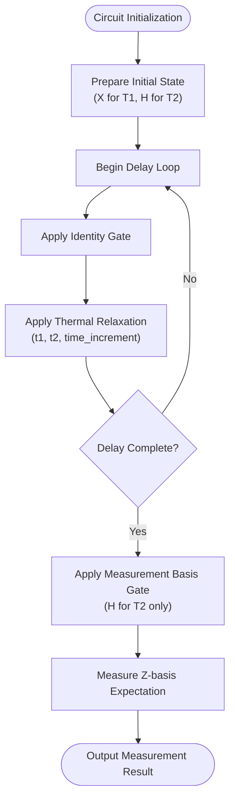
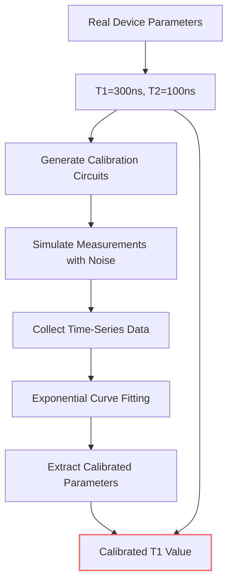

# Noise Calibration Procedures

<cite>
**Referenced Files in This Document**   
- [noise_calibration.py](file://examples-ng/noise_calibration.py)
- [readout.py](file://src/tyxonq/postprocessing/readout.py)
</cite>

## Table of Contents
1. [Introduction](#introduction)
2. [Readout Error Matrix Calibration](#readout-error-matrix-calibration)
3. [T1 and T2 Relaxation Time Calibration](#t1-and-t2-relaxation-time-calibration)
4. [DMCircuit for Thermal Relaxation Simulation](#dmcircuit-for-thermal-relaxation-simulation)
5. [Exponential Decay Curve Fitting](#exponential-decay-curve-fitting)
6. [Practical Examples and Validation](#practical-examples-and-validation)
7. [Best Practices for Noise Model Integration](#best-practices-for-noise-model-integration)

## Introduction
This document details the experimental procedures for calibrating quantum device noise parameters within the TyxonQ framework. The focus is on two primary noise characterization methodologies: readout error mitigation through preparation and measurement circuits, and relaxation time (T1/T2) calibration via exponential decay curve fitting. The implementation leverages the DMCircuit class for simulating thermal relaxation dynamics and utilizes scipy.optimize.curve_fit for robust parameter estimation. These calibration techniques are essential for constructing accurate noise models that reflect real device behavior, enabling more realistic quantum circuit simulations and error mitigation strategies.

## Readout Error Matrix Calibration
The calibration of readout error matrices is achieved through a systematic preparation and measurement protocol. The process begins by generating a complete set of preparation circuits that initialize the quantum system into all possible computational basis states. For an n-qubit system, this requires 2^n distinct circuits, each preparing a unique bitstring state through appropriate X-gate applications.

The core methodology involves constructing a calibration matrix that maps ideal preparation states to their experimentally observed (noisy) measurement outcomes. This is implemented in the `miti_readout_circ` function, which programmatically generates the full suite of state preparation circuits. Each circuit is executed with readout noise enabled, and the resulting measurement statistics are used to populate the columns of the calibration matrix. Specifically, the (i,j)-th element of the matrix represents the probability of measuring state i when state j was prepared.

Two distinct mitigation strategies are available for correcting measurement outcomes:
- **Matrix Inversion Method**: Applies the inverse of the calibration matrix to the noisy probability vector
- **Constrained Least Squares Method**: Solves an optimization problem that minimizes the difference between predicted and observed counts while enforcing probability constraints

The implementation in `mitigate_probability` demonstrates both approaches, with the constrained optimization formulation ensuring that the corrected probabilities remain physically valid (non-negative and summing to unity).

**Section sources**
- [noise_calibration.py](file://examples-ng/noise_calibration.py#L0-L50)
- [readout.py](file://src/tyxonq/postprocessing/readout.py#L14-L136)

## T1 and T2 Relaxation Time Calibration
The characterization of T1 (energy relaxation) and T2 (dephasing) times follows standard quantum device calibration protocols through time-domain measurements. The procedures are implemented in the `T1_cali` and `T2_cali` functions, which construct specialized circuits to probe these relaxation processes.

For T1 calibration:
1. Initialize the qubit in the excited state using an X-gate
2. Apply a variable number of identity operations (simulating delay time)
3. Measure the remaining excited state population
4. Repeat for increasing delay durations to sample the decay curve

For T2 calibration:
1. Prepare a superposition state using an H-gate
2. Apply variable delay through identity operations
3. Reapply the H-gate to convert phase information to population differences
4. Measure the resulting population to sample the dephasing decay

The number of steps in each calibration sequence is determined by the expected relaxation time and the time increment per step, ensuring sufficient sampling of the decay process (typically 4*T1 or 4*T2 total duration). The thermal relaxation noise model is applied between identity operations using the `thermalrelaxation` method of DMCircuit, which incorporates both T1 and T2 parameters along with the excited state population bias.

**Section sources**
- [noise_calibration.py](file://examples-ng/noise_calibration.py#L116-L171)

## DMCircuit for Thermal Relaxation Simulation
The DMCircuit class serves as the primary tool for simulating thermal relaxation dynamics in the calibration procedures. This circuit type is specifically designed to handle dissipative processes that cannot be represented by unitary evolution alone.

The thermal relaxation channel is implemented as a combination of amplitude damping and phase damping processes, parameterized by the T1 and T2 time constants. The simulation framework allows for the insertion of thermal relaxation noise at specific points in the circuit timeline, enabling precise modeling of decoherence during idle periods.

Key features of the DMCircuit implementation include:
- Support for variable time increments between operations
- Configurable relaxation methods (including AUTO mode for adaptive selection)
- Incorporation of excited state population bias in the steady state
- Integration with the expectation value calculation for measurement simulation

The circuit construction pattern follows a clear sequence: initialization, variable delay (simulated by identity gates), noise application, and measurement. This structure enables the systematic exploration of time-dependent relaxation effects.



**Diagram sources**
- [noise_calibration.py](file://examples-ng/noise_calibration.py#L116-L171)

## Exponential Decay Curve Fitting
The extraction of T1 and T2 parameters from experimental data is accomplished through non-linear least squares curve fitting using scipy.optimize.curve_fit. The `fit_function` wrapper provides a clean interface to this optimization routine, taking the time series data and an initial parameter guess as inputs.

The fitting model assumes an exponential decay form:
```
f(t) = A * exp(-t/T) + C
```
where:
- A: Amplitude of the decaying component
- T: Relaxation time constant (T1 or T2)
- C: Offset representing the long-time equilibrium value

The initial parameter guess is critical for convergence, with the example code providing reasonable defaults [-3, 0, 100] for the amplitude, offset, and time constant respectively. The fitting procedure returns both the optimal parameters and their covariance matrix, allowing for uncertainty quantification in the calibrated values.

The implementation handles both T1 and T2 calibration through the same fitting function, demonstrating the modularity of the approach. The extracted time constant parameter provides the calibrated noise model value that can be used in subsequent simulations.

**Section sources**
- [noise_calibration.py](file://examples-ng/noise_calibration.py#L111-L113)

## Practical Examples and Validation
The noise calibration framework includes concrete examples that validate the calibration procedures and demonstrate their accuracy. The `example_T1_cali` and `example_T2_cali` functions implement end-to-end calibration workflows that compare known input parameters with the recovered values.

In the T1 calibration example:
- A simulated device with T1 = 300 ns and T2 = 100 ns is configured
- Measurement data is generated across a time series with 100 ns increments
- The exponential decay curve is fitted to extract the calibrated T1 value
- Results are printed showing both the realistic and calibrated values

Similarly, the T2 calibration example uses a device with T1 = 300 ns and T2 = 280 ns, with measurements taken at 50 ns intervals. The comparison between input and output values serves as a validation of the calibration methodology, with the expectation that the calibrated values should closely match the true parameters within statistical uncertainty.

These examples provide a template for real device characterization, where the same circuit patterns and analysis methods can be applied to experimental data to extract accurate noise parameters.



**Diagram sources**
- [noise_calibration.py](file://examples-ng/noise_calibration.py#L174-L213)

## Best Practices for Noise Model Integration
Integrating calibrated noise models into circuit simulations requires careful consideration of several factors:

1. **Parameter Validation**: Always verify that calibrated parameters fall within physically reasonable ranges (T2 ≤ 2*T1, positive relaxation times, etc.)

2. **Statistical Uncertainty**: Consider the confidence intervals of fitted parameters, especially when shot noise is significant

3. **Time Scale Alignment**: Ensure that the time increments in simulation match the calibration conditions

4. **Cross-Validation**: Use independent measurement protocols to validate extracted parameters

5. **Regular Recalibration**: Device parameters drift over time, necessitating periodic re-calibration

The modular design of the calibration framework allows for easy integration of new noise models and measurement protocols. The separation between data acquisition (circuit execution) and analysis (curve fitting) enables flexible experimentation with different fitting models and optimization strategies.

When deploying calibrated models in production simulations, it is recommended to:
- Store calibration metadata (timestamp, fitting residuals, parameter uncertainties)
- Implement version control for noise models
- Validate simulation results against hold-out experimental data
- Monitor parameter drift and establish recalibration triggers

These practices ensure that noise models remain accurate and reliable for quantum algorithm development and performance prediction.

**Section sources**
- [noise_calibration.py](file://examples-ng/noise_calibration.py#L174-L213)