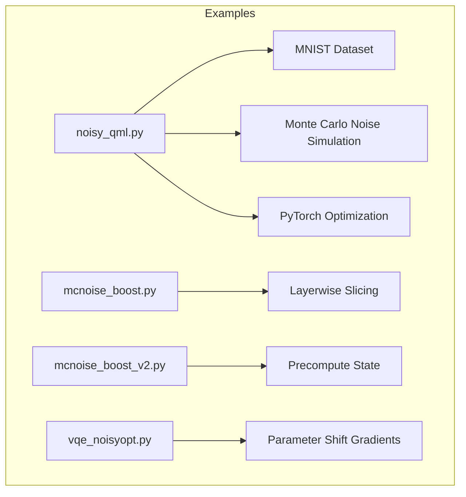
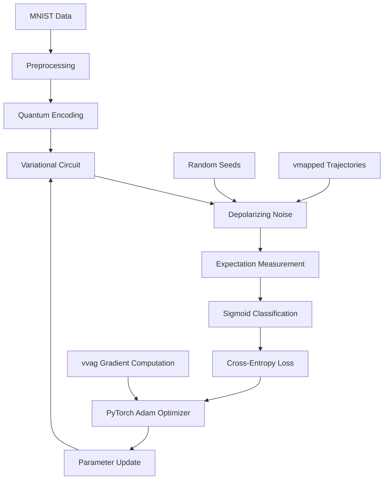
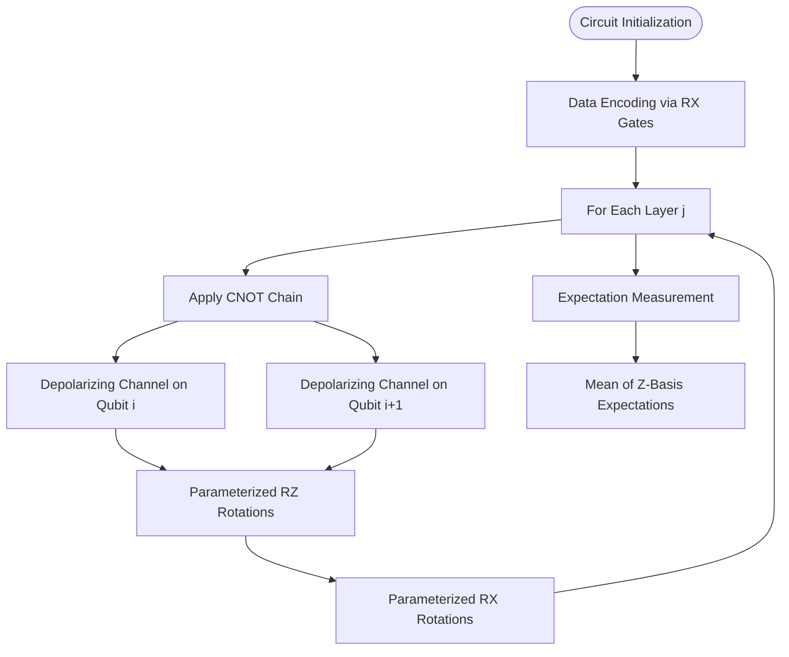
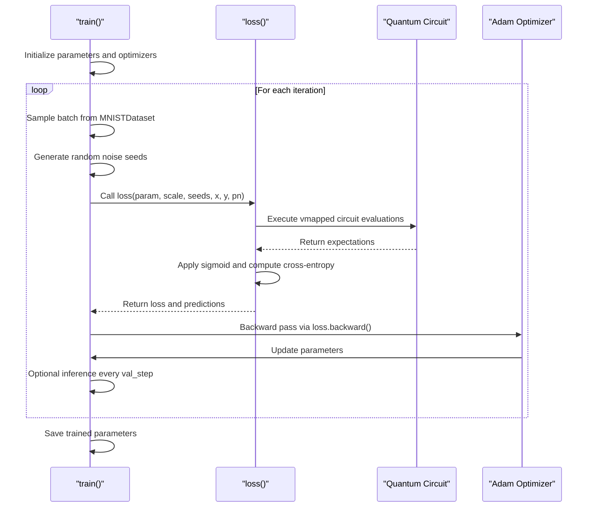
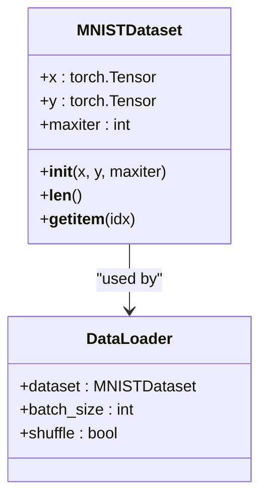
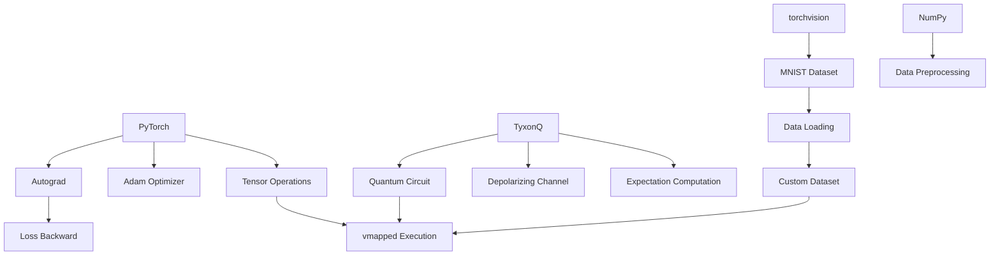

# Noisy Quantum Machine Learning

<cite>
**Referenced Files in This Document**   
- [noisy_qml.py](file://examples-ng/noisy_qml.py)
- [mcnoise_boost.py](file://examples-ng/mcnoise_boost.py)
- [mcnoise_boost_v2.py](file://examples-ng/mcnoise_boost_v2.py)
- [vqe_noisyopt.py](file://examples/vqe_noisyopt.py)
</cite>

## Table of Contents
1. [Introduction](#introduction)
2. [Project Structure](#project-structure)
3. [Core Components](#core-components)
4. [Architecture Overview](#architecture-overview)
5. [Detailed Component Analysis](#detailed-component-analysis)
6. [Dependency Analysis](#dependency-analysis)
7. [Performance Considerations](#performance-considerations)
8. [Troubleshooting Guide](#troubleshooting-guide)
9. [Conclusion](#conclusion)

## Introduction
This document provides a comprehensive analysis of Noisy Quantum Machine Learning (QML) using variational quantum circuits under depolarizing noise. The implementation integrates Monte Carlo noise simulation within the QML training loop, leveraging vmapped noise trajectories for efficient gradient computation. The workflow is built on PyTorch for optimization and includes key components such as circuit ansatz design, parameterized noise injection via status flags, and a sigmoid-based classification loss function. The system processes MNIST data through custom preprocessing and batched training using a PyTorch Dataset. Vectorized value and gradient computation (vvag) enables high-performance training under varying noise levels, with performance insights and convergence behavior analyzed throughout.

## Project Structure
The project is organized into modular components that support quantum machine learning with noise simulation. Key directories include `examples-ng` for advanced QML workflows and `examples` for foundational demonstrations. The noisy QML implementation resides in `examples-ng/noisy_qml.py`, which orchestrates the full training pipeline. Supporting noise simulation techniques are demonstrated in `mcnoise_boost.py` and `mcnoise_boost_v2.py`, while `vqe_noisyopt.py` provides comparative insights into noisy variational quantum eigensolvers.

**Diagram sources**
- [noisy_qml.py](file://examples-ng/noisy_qml.py)
- [mcnoise_boost.py](file://examples-ng/mcnoise_boost.py)
- [mcnoise_boost_v2.py](file://examples-ng/mcnoise_boost_v2.py)
- [vqe_noisyopt.py](file://examples/vqe_noisyopt.py)

**Section sources**
- [noisy_qml.py](file://examples-ng/noisy_qml.py)
- [mcnoise_boost.py](file://examples-ng/mcnoise_boost.py)
- [mcnoise_boost_v2.py](file://examples-ng/mcnoise_boost_v2.py)
- [vqe_noisyopt.py](file://examples/vqe_noisyopt.py)

## Core Components
The core components of the noisy QML system include the quantum circuit ansatz, Monte Carlo noise simulation, vectorized gradient computation, and classification loss function. The circuit processes MNIST images encoded into quantum states, applies a layered variational ansatz with depolarizing noise, and measures expectations for classification. Noise is simulated using random seeds passed through vmapped trajectories, enabling differentiable noise modeling. The loss function uses a sigmoid transformation for binary classification, and optimization is performed using Adam with separate learning rates for circuit parameters and scaling factors.

**Section sources**
- [noisy_qml.py](file://examples-ng/noisy_qml.py#L0-L227)
- [vqe_noisyopt.py](file://examples/vqe_noisyopt.py#L0-L288)

## Architecture Overview
The architecture integrates classical deep learning frameworks with quantum circuit simulation under noise. The workflow begins with MNIST data preprocessing, followed by quantum state encoding and variational circuit execution. Noise is injected via depolarizing channels controlled by status flags derived from random seeds. Multiple noise trajectories are processed in parallel using `vmap`, and gradients are computed using `vvag` for end-to-end training. The PyTorch backend enables seamless integration of quantum operations within a classical optimization loop.

**Diagram sources**
- [noisy_qml.py](file://examples-ng/noisy_qml.py#L0-L227)

## Detailed Component Analysis

### Quantum Circuit Ansatz and Noise Injection
The variational quantum circuit consists of a data encoding layer followed by multiple entangling and rotation layers. Each layer applies CNOT gates for entanglement and parameterized RX/RZ rotations. Depolarizing noise is injected after each CNOT gate using status flags derived from random seeds, allowing precise control over noise realization per trajectory.

**Diagram sources**
- [noisy_qml.py](file://examples-ng/noisy_qml.py#L86-L109)

**Section sources**
- [noisy_qml.py](file://examples-ng/noisy_qml.py#L86-L109)

### Training Workflow and Optimization
The training loop integrates noise simulation, forward pass, loss computation, and gradient-based optimization. It uses two Adam optimizers: one for circuit parameters and another for a scaling factor that controls the sigmoid nonlinearity. The loop supports variable noise levels and number of noise trajectories (noc), with periodic inference to monitor convergence.

**Diagram sources**
- [noisy_qml.py](file://examples-ng/noisy_qml.py#L142-L195)

**Section sources**
- [noisy_qml.py](file://examples-ng/noisy_qml.py#L142-L195)

### Dataset Preprocessing and Batching
The MNIST dataset is preprocessed using either bilinear interpolation to a √n×√n grid or PCA dimensionality reduction. A custom PyTorch Dataset class enables batched training with random sampling, where each iteration returns a new random batch of fixed size. This design supports stochastic training while maintaining compatibility with quantum circuit input requirements.

**Diagram sources**
- [noisy_qml.py](file://examples-ng/noisy_qml.py#L69-L81)

**Section sources**
- [noisy_qml.py](file://examples-ng/noisy_qml.py#L69-L81)

## Dependency Analysis
The system relies on several key dependencies for functionality. The primary dependency is PyTorch for tensor operations and automatic differentiation. The TyxonQ framework provides quantum circuit simulation capabilities, including noise channels and expectation computation. Additional dependencies include torchvision for MNIST data loading and NumPy for numerical operations. The integration of `vvag` for vectorized gradients and `vmap` for parallel noise trajectory simulation creates a tightly coupled computational graph that enables efficient training under noise.

**Diagram sources**
- [noisy_qml.py](file://examples-ng/noisy_qml.py)
- [vqe_noisyopt.py](file://examples/vqe_noisyopt.py)

**Section sources**
- [noisy_qml.py](file://examples-ng/noisy_qml.py)
- [vqe_noisyopt.py](file://examples/vqe_noisyopt.py)

## Performance Considerations
The implementation demonstrates significant performance considerations in noisy QML training. The use of `K.jit` and `vmap` enables efficient execution of multiple noise trajectories, reducing both staging and running times. The `mcnoise_boost` examples show that layerwise slicing and state precomputation can dramatically reduce compilation overhead. Training performance is affected by noise level, number of trajectories, and circuit depth, with deeper circuits requiring more computational resources. The separation of parameter and scale optimization allows for adaptive learning but increases memory usage due to multiple optimizer states.

**Section sources**
- [mcnoise_boost.py](file://examples-ng/mcnoise_boost.py)
- [mcnoise_boost_v2.py](file://examples-ng/mcnoise_boost_v2.py)
- [noisy_qml.py](file://examples-ng/noisy_qml.py)

## Troubleshooting Guide
Common issues in this implementation include gradient computation failures under high noise, memory exhaustion with large batch sizes, and convergence problems due to improper scaling. Ensure that the `PYTORCH_ENABLE_MPS_FALLBACK` environment variable is set for GPU compatibility. When training fails to converge, try reducing the learning rate or increasing the number of noise trajectories. For memory issues, reduce batch size or use fewer noise trajectories. Debugging can be enabled in the inference function to inspect prediction values.

**Section sources**
- [noisy_qml.py](file://examples-ng/noisy_qml.py#L198-L220)
- [noisy_qml.py](file://examples-ng/noisy_qml.py#L138-L138)

## Conclusion
This analysis demonstrates a complete framework for Noisy Quantum Machine Learning using variational circuits with Monte Carlo noise simulation. The integration of PyTorch optimization with vmapped noise trajectories enables efficient training under depolarizing noise. Key components including the circuit ansatz, parameterized noise injection, and sigmoid-based classification work together to form a robust QML pipeline. The use of `vvag` for vectorized gradients and custom dataset handling for MNIST preprocessing showcases the flexibility of the framework. Performance can be further optimized using techniques like layerwise slicing, making this approach suitable for large-scale noisy quantum machine learning experiments.