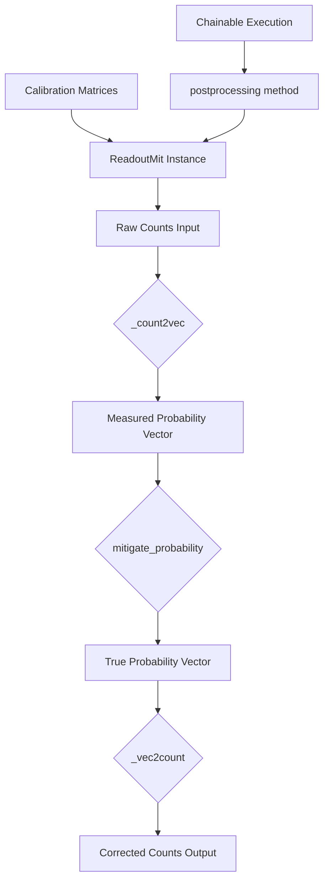
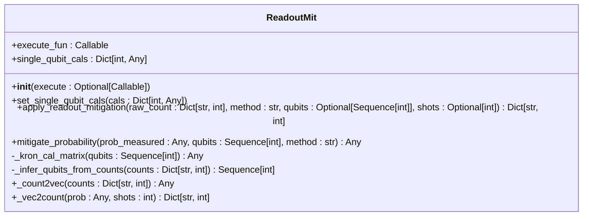
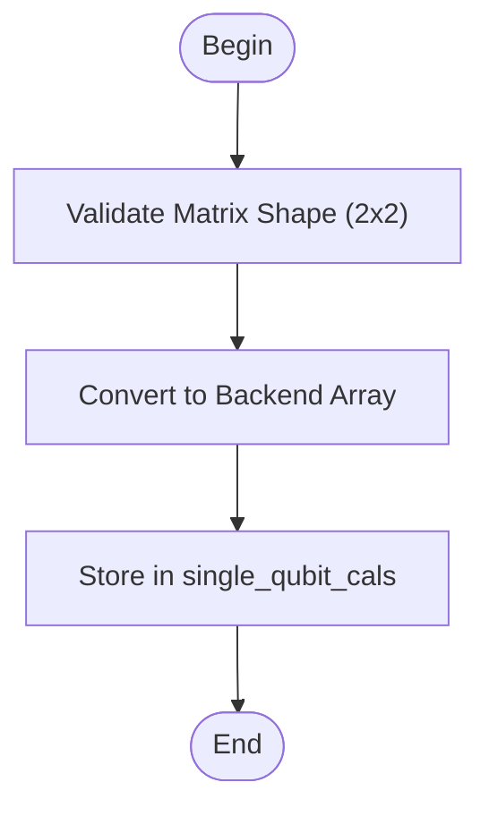
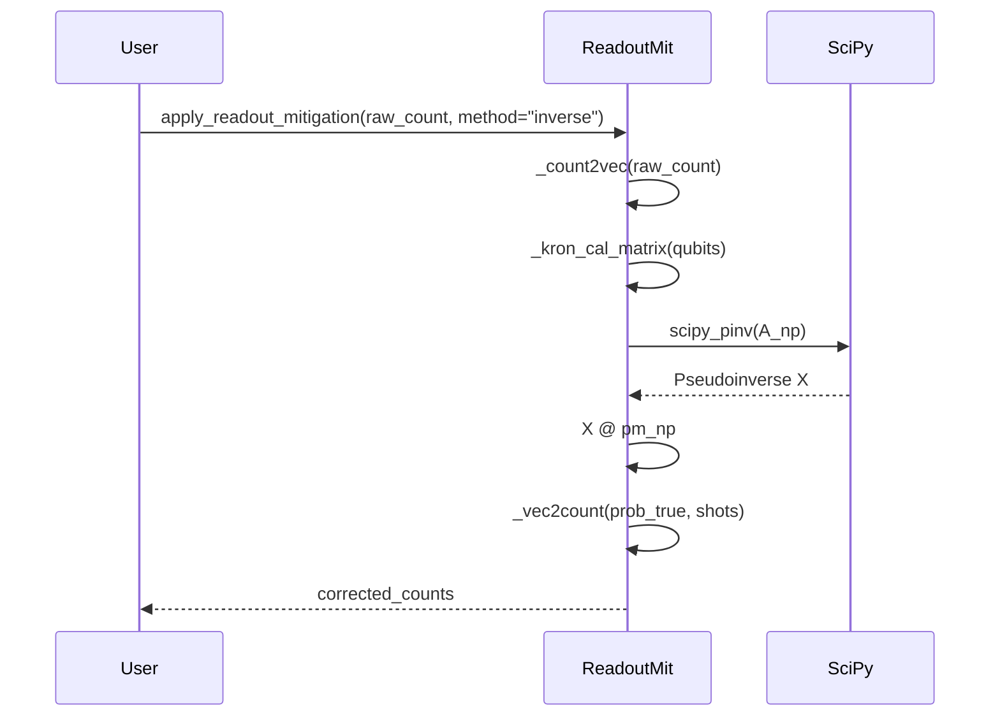
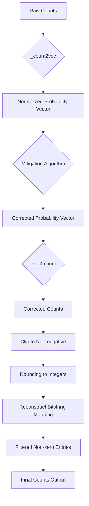
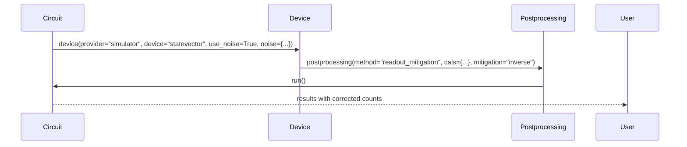

# Readout Error Mitigation

<cite>
**Referenced Files in This Document**   
- [readout_mitigation.py](file://examples/readout_mitigation.py)
- [readout.py](file://src/tyxonq/postprocessing/readout.py)
- [numpy_backend.py](file://src/tyxonq/numerics/backends/numpy_backend.py)
- [pytorch_backend.py](file://src/tyxonq/numerics/backends/pytorch_backend.py)
- [api.py](file://src/tyxonq/numerics/api.py)
</cite>

## Table of Contents
1. [Introduction](#introduction)
2. [Core Components](#core-components)
3. [Architecture Overview](#architecture-overview)
4. [Detailed Component Analysis](#detailed-component-analysis)
5. [Integration with Chainable Execution](#integration-with-chainable-execution)
6. [Backend Interoperability](#backend-interoperability)
7. [Accuracy Trade-offs and Numerical Stability](#accuracy-trade-offs-and-numerical-stability)
8. [Conclusion](#conclusion)

## Introduction

Readout error mitigation is a critical post-processing technique in quantum computing that corrects measurement inaccuracies caused by imperfect readout operations. In TyxonQ, this is implemented through the `ReadoutMit` class, which enables correction of measured counts using per-qubit calibration data. The framework supports both numeric computation paths and integration within the chainable circuit execution workflow. This document details the implementation of readout error correction, focusing on calibration matrix construction, mitigation methods, practical application in Bell state circuits, and backend interoperability with NumPy and PyTorch.

## Core Components

The core functionality of readout error mitigation in TyxonQ revolves around the `ReadoutMit` class, which orchestrates the correction of measurement outcomes based on pre-characterized calibration matrices. The process involves converting raw counts into probability vectors, applying inverse or constrained optimization techniques to recover true probabilities, and transforming the results back into corrected count distributions. The system is designed to work seamlessly with both synthetic noise models and real device data, supporting flexible configuration via either direct numeric input or device-level noise injection.

**Section sources**
- [readout.py](file://src/tyxonq/postprocessing/readout.py#L14-L136)
- [readout_mitigation.py](file://examples/readout_mitigation.py#L1-L133)

## Architecture Overview

The readout error mitigation architecture in TyxonQ follows a modular design that separates calibration, transformation, and application logic. At its core, the `ReadoutMit` class manages per-qubit calibration matrices and applies correction algorithms to measured counts. The workflow begins with calibration matrix definition, proceeds through probability vector transformation, and concludes with count reconstruction. This architecture supports two primary usage patterns: standalone numeric correction and integrated mitigation within circuit execution chains.



**Diagram sources **
- [readout.py](file://src/tyxonq/postprocessing/readout.py#L14-L136)
- [readout_mitigation.py](file://examples/readout_mitigation.py#L1-L133)

## Detailed Component Analysis

### ReadoutMit Class Analysis

The `ReadoutMit` class serves as the central component for readout error correction in TyxonQ. It encapsulates the entire mitigation workflow, from calibration matrix storage to final count reconstruction. The class is initialized without mandatory parameters, allowing dynamic configuration of calibration data and execution functions. Its primary responsibility is to apply correction algorithms to measured counts, producing more accurate estimates of the true quantum state.

#### Class Diagram


**Diagram sources **
- [readout.py](file://src/tyxonq/postprocessing/readout.py#L14-L136)

**Section sources**
- [readout.py](file://src/tyxonq/postprocessing/readout.py#L14-L136)

### Calibration Matrix Construction

Per-qubit calibration matrices are fundamental to the readout error mitigation process. These 2x2 matrices model the probability of measuring a qubit in state |0⟩ or |1⟩ given its true state. The `set_single_qubit_cals` method validates and stores these matrices, ensuring they conform to the required shape and converting them to the active numeric backend format. For multi-qubit systems, the full calibration matrix is constructed as the Kronecker product of individual qubit matrices in ascending wire order, reflecting the tensor product structure of the measurement process.

#### Flowchart


**Diagram sources **
- [readout.py](file://src/tyxonq/postprocessing/readout.py#L32-L42)

**Section sources**
- [readout.py](file://src/tyxonq/postprocessing/readout.py#L32-L42)

### Mitigation Methods

TyxonQ implements two primary methods for readout error correction: matrix inversion and constrained least-squares optimization. The choice between these methods involves trade-offs between computational efficiency and numerical stability.

#### Matrix Inversion Method
The inversion method directly computes the inverse of the calibration matrix to recover true probabilities from measured ones. This approach uses the Moore-Penrose pseudoinverse (`scipy_pinv`) for numerical stability, particularly when dealing with ill-conditioned matrices. The process involves converting backend arrays to NumPy format, performing the matrix inversion, and applying post-processing to ensure physical validity (non-negative probabilities that sum to one).

#### Constrained Least-Squares Method
When the inversion method produces unstable results, the constrained least-squares approach provides a more robust alternative. This method formulates the mitigation as an optimization problem where the objective is to minimize the difference between predicted and measured probabilities, subject to constraints that ensure the solution lies on the probability simplex (non-negative values summing to one). The SLSQP algorithm from SciPy is used to solve this constrained optimization problem.

#### Sequence Diagram


**Diagram sources **
- [readout.py](file://src/tyxonq/postprocessing/readout.py#L93-L128)
- [readout.py](file://src/tyxonq/postprocessing/readout.py#L48-L59)

**Section sources**
- [readout.py](file://src/tyxonq/postprocessing/readout.py#L93-L128)
- [readout.py](file://src/tyxonq/postprocessing/readout.py#L48-L59)

### Data Transformation Pipeline

The mitigation process relies on two key transformation functions: `_count2vec` and `_vec2count`. These functions handle the conversion between discrete count data and continuous probability vectors. The `_count2vec` method normalizes raw counts into a probability distribution, while `_vec2count` performs the reverse operation, rounding corrected probabilities back to integer counts. Both functions include safeguards against numerical issues, such as zero-shot scenarios and floating-point precision errors.

#### Flowchart


**Diagram sources **
- [readout.py](file://src/tyxonq/postprocessing/readout.py#L62-L73)
- [readout.py](file://src/tyxonq/postprocessing/readout.py#L76-L91)

**Section sources**
- [readout.py](file://src/tyxonq/postprocessing/readout.py#L62-L91)

## Integration with Chainable Execution

Readout error mitigation is seamlessly integrated into TyxonQ's chainable circuit execution workflow. This allows users to apply correction directly within circuit construction and execution pipelines. The `postprocessing` method can be chained after device specification, enabling end-to-end workflows where noise is injected during simulation and automatically corrected during post-processing. This integration supports both the `inverse` and `least-squares` mitigation methods through the `mitigation` parameter.



**Diagram sources **
- [readout_mitigation.py](file://examples/readout_mitigation.py#L113)
- [readout.py](file://src/tyxonq/postprocessing/readout.py#L14-L136)

**Section sources**
- [readout_mitigation.py](file://examples/readout_mitigation.py#L113)

## Backend Interoperability

TyxonQ's readout error mitigation system is designed for seamless interoperability with multiple numeric backends, including NumPy and PyTorch. The framework uses a unified `ArrayBackend` interface that abstracts array operations across different libraries. Backend selection is managed through the `get_backend` function, which returns an appropriate backend instance based on configuration. This design enables users to perform mitigation computations using their preferred numeric library while maintaining compatibility with external scientific computing tools like SciPy.

### Backend Integration Diagram
```mermaid
graph TD
A[User Code] --> B{set_backend("numpy")}
A --> C{set_backend("pytorch")}
B --> D[NumpyBackend]
C --> E[PyTorchBackend]
D --> F[Array Operations]
E --> F
F --> G[Backend-Agnostic Logic]
G --> H[SciPy Interop via to_numpy]
H --> I[Final Results]
```

**Diagram sources **
- [api.py](file://src/tyxonq/numerics/api.py#L159-L191)
- [numpy_backend.py](file://src/tyxonq/numerics/backends/numpy_backend.py)
- [pytorch_backend.py](file://src/tyxonq/numerics/backends/pytorch_backend.py)

**Section sources**
- [api.py](file://src/tyxonq/numerics/api.py#L159-L191)
- [numpy_backend.py](file://src/tyxonq/numerics/backends/numpy_backend.py)
- [pytorch_backend.py](file://src/tyxonq/numerics/backends/pytorch_backend.py)

## Accuracy Trade-offs and Numerical Stability

The effectiveness of readout error mitigation depends on several factors, including the quality of calibration data, the condition number of the calibration matrix, and the chosen mitigation method. Matrix inversion provides a direct solution but can amplify noise when the calibration matrix is ill-conditioned. The constrained least-squares method offers improved numerical stability at the cost of increased computational complexity. Both methods include safeguards such as probability clipping and normalization to ensure physically meaningful results. Users should carefully evaluate the trade-offs between accuracy and stability based on their specific use case and noise characteristics.

## Conclusion

TyxonQ's readout error mitigation framework provides a comprehensive solution for correcting measurement inaccuracies in quantum computations. By combining flexible calibration matrix handling, multiple correction algorithms, and seamless integration with the chainable execution model, the system enables accurate results even in the presence of significant readout errors. The backend-agnostic design ensures compatibility with various numeric computing environments, while the modular architecture allows for easy extension and customization. This implementation demonstrates TyxonQ's commitment to providing robust, production-ready tools for quantum algorithm development and execution.