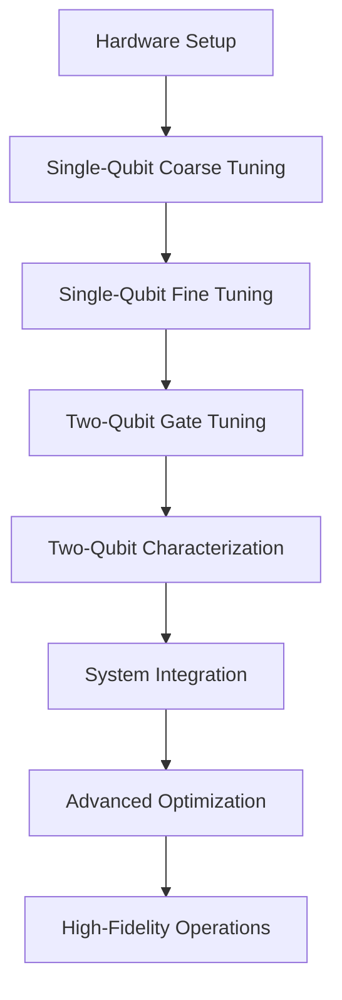
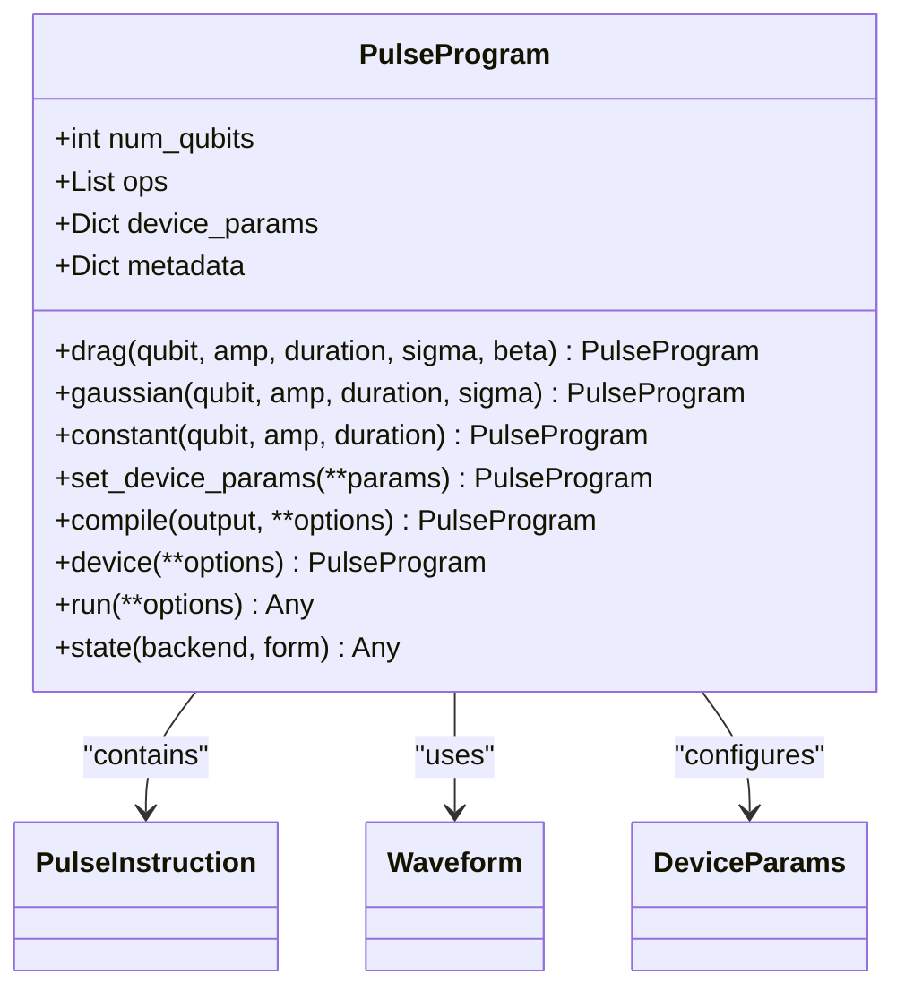
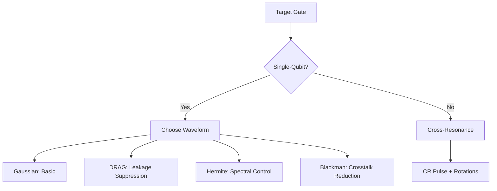
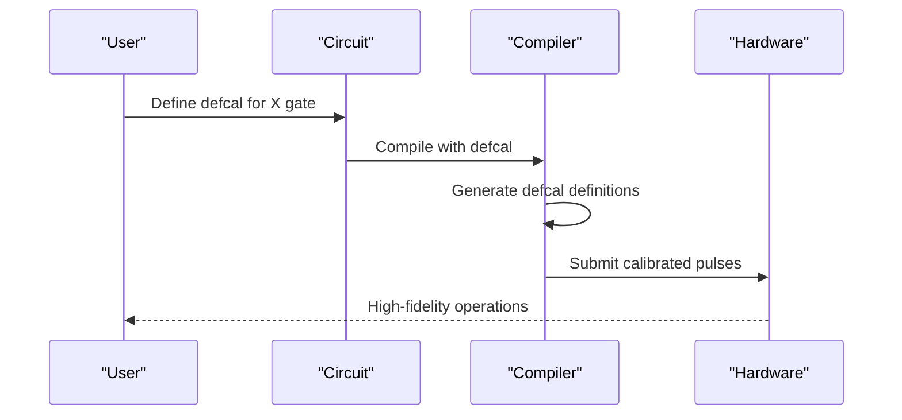

# Pulse Calibration Tutorial

<cite>
**Referenced Files in This Document**   
- [pulse_calibration_workflow.rst](file://docs/source/tutorials/advanced/pulse_calibration_workflow.rst)
- [pulse_program.py](file://src/tyxonq/core/ir/pulse.py)
- [waveforms.py](file://src/tyxonq/waveforms.py)
- [pulse_simulation.py](file://src/tyxonq/libs/quantum_library/pulse_simulation.py)
- [base.py](file://src/tyxonq/devices/base.py)
- [api.py](file://src/tyxonq/compiler/api.py)
- [pulse_gate_calibration.py](file://examples/pulse_gate_calibration.py)
- [defcal_library.py](file://src/tyxonq/compiler/pulse_compile_engine/defcal_library.py)
</cite>

## Table of Contents
1. [Introduction](#introduction)
2. [Pulse Calibration Workflow](#pulse-calibration-workflow)
3. [Core Components](#core-components)
4. [Pulse Programming Model](#pulse-programming-model)
5. [Waveform Types and Parameters](#waveform-types-and-parameters)
6. [Calibration Process](#calibration-process)
7. [Defcal Integration](#defcal-integration)
8. [Simulation and Execution](#simulation-and-execution)
9. [Performance Metrics](#performance-metrics)
10. [Troubleshooting Guide](#troubleshooting-guide)

## Introduction

The Pulse Calibration Tutorial provides a comprehensive guide to systematic quantum hardware calibration using the TyxonQ framework. This tutorial covers the complete workflow from hardware fundamentals to advanced optimization techniques, enabling users to achieve high-fidelity quantum operations through precise pulse-level control.

The tutorial consists of seven progressive steps that can be executed independently, with each step focusing on a specific aspect of pulse calibration. The educational approach combines theoretical understanding with practical implementation, using real numerical examples and actual results to build physical intuition alongside mathematical rigor.

**Section sources**
- [pulse_calibration_workflow.rst](file://docs/source/tutorials/advanced/pulse_calibration_workflow.rst#L1-L50)

## Pulse Calibration Workflow

The pulse calibration workflow follows a systematic seven-step approach designed to progressively refine quantum gate performance:

1. **Hardware Basics and Environment Setup**: Understanding qubit parameters, energy levels, and decoherence
2. **Single-Qubit Coarse Tuning**: Parameter sweeps to find initial optimal values
3. **Single-Qubit Fine Tuning**: Precision optimization of DRAG parameters
4. **Two-Qubit Gate Tuning**: Implementation of Cross-Resonance (CR) based CNOT gates
5. **Two-Qubit Characterization**: Verification of entanglement and gate performance
6. **System Integration**: Building complete calibration libraries
7. **Advanced Optimization**: Final refinement and performance validation

Each step builds upon the previous one, creating a comprehensive calibration pipeline that transforms basic quantum operations into high-fidelity gates suitable for complex quantum algorithms.



**Diagram sources**
- [pulse_calibration_workflow.rst](file://docs/source/tutorials/advanced/pulse_calibration_workflow.rst#L1-L200)

**Section sources**
- [pulse_calibration_workflow.rst](file://docs/source/tutorials/advanced/pulse_calibration_workflow.rst#L1-L200)

## Core Components

The pulse calibration system in TyxonQ is built around several core components that work together to enable precise hardware control and optimization:

- **PulseProgram**: High-level representation for pulse-level quantum programming
- **Waveform Classes**: Implementation of various pulse envelope shapes
- **Pulse Simulation Engine**: Physics-based simulation of pulse-driven Hamiltonian evolution
- **Defcal Library**: Storage and management of hardware-specific calibration parameters
- **Compiler Integration**: Seamless translation between gate-level and pulse-level representations

These components form a cohesive framework that supports both interactive experimentation and automated calibration workflows.

**Section sources**
- [pulse_program.py](file://src/tyxonq/core/ir/pulse.py#L1-L655)
- [waveforms.py](file://src/tyxonq/waveforms.py#L1-L157)

## Pulse Programming Model

The pulse programming model in TyxonQ provides a high-level interface for pulse-level quantum programming that parallels the gate-level Circuit abstraction. The PulseProgram class serves as the primary interface for creating and manipulating pulse sequences.



**Diagram sources**
- [pulse_program.py](file://src/tyxonq/core/ir/pulse.py#L1-L655)

**Section sources**
- [pulse_program.py](file://src/tyxonq/core/ir/pulse.py#L1-L655)

## Waveform Types and Parameters

TyxonQ supports multiple waveform types for pulse calibration, each with specific parameters that control the pulse shape and characteristics:

| Waveform Type | Key Parameters | Purpose |
|---------------|---------------|---------|
| Gaussian | amp, duration, sigma | Smooth envelope with good spectral properties |
| DRAG | amp, duration, sigma, beta | Suppresses leakage to |2⟩ state |
| Hermite | amp, duration, order | Minimal spectral leakage |
| BlackmanSquare | amp, duration, width | Low side-lobe levels, reduced crosstalk |
| Constant | amp, duration | Simple square pulse |

The choice of waveform and its parameters significantly impacts gate fidelity and error rates, making waveform selection a critical aspect of the calibration process.



**Diagram sources**
- [waveforms.py](file://src/tyxonq/waveforms.py#L1-L157)

**Section sources**
- [waveforms.py](file://src/tyxonq/waveforms.py#L1-L157)

## Calibration Process

The calibration process in TyxonQ follows a systematic approach that combines coarse and fine tuning stages to achieve optimal gate performance:

### Single-Qubit Calibration
1. **Coarse Tuning**: Perform amplitude sweeps to find the π-pulse amplitude
2. **Rabi Frequency Measurement**: Extract oscillation frequency from Rabi oscillations
3. **DRAG Optimization**: Balance between X-axis and Y-axis leakage by optimizing β parameter
4. **Fine Tuning**: Precision adjustment of all parameters to maximize fidelity

### Two-Qubit Gate Calibration
1. **Cross-Resonance Design**: Implement CR-based CNOT gates using Rabi oscillations
2. **Parameter Scanning**: Optimize CR amplitude, duration, and coupling strength
3. **Echo Sequence**: Implement echo pulses to mitigate errors
4. **Virtual-Z Optimization**: Use phase frame updates to reduce gate time

The calibration process leverages both simulation and experimental validation to ensure robust performance across different hardware platforms.

**Section sources**
- [pulse_calibration_workflow.rst](file://docs/source/tutorials/advanced/pulse_calibration_workflow.rst#L200-L400)
- [pulse_gate_calibration.py](file://examples/pulse_gate_calibration.py#L1-L400)

## Defcal Integration

The defcal (define calibration) system in TyxonQ enables users to define custom pulse implementations for specific quantum gates, allowing for hardware-specific optimization and calibration.



The DefcalLibrary class manages calibration data and provides methods for storing, retrieving, and applying custom calibrations:

```python
class DefcalLibrary:
    def add_calibration(self, gate: str, qubits: Tuple[int, ...], pulse: Waveform, params: Dict[str, Any] = None)
    def get_calibration(self, gate: str, qubits: Tuple[int, ...]) -> Optional[CalibrationData]
    def remove_calibration(self, gate: str, qubits: Tuple[int, ...])
```

This system allows users to create optimized pulse sequences that can be automatically applied during circuit compilation, ensuring consistent high-fidelity operations.

**Diagram sources**
- [defcal_library.py](file://src/tyxonq/compiler/pulse_compile_engine/defcal_library.py#L1-L306)

**Section sources**
- [defcal_library.py](file://src/tyxonq/compiler/pulse_compile_engine/defcal_library.py#L1-L306)

## Simulation and Execution

The pulse calibration framework supports both simulation and execution on real hardware, providing a seamless workflow from development to deployment.

### Simulation Mode
The pulse simulation engine uses physics-based models to simulate pulse-driven Hamiltonian evolution, enabling rapid prototyping and optimization:

```python
def evolve_pulse_hamiltonian(
    initial_state: Any,
    pulse_waveform: Any,
    qubit: int = 0,
    qubit_freq: float = 5.0e9,
    drive_freq: Optional[float] = None,
    anharmonicity: float = -300e6,
    rabi_freq: float = 50e6,
    T1: Optional[float] = None,
    T2: Optional[float] = None,
    backend: Any = None
) -> Any
```

### Execution Mode
For real hardware execution, the framework integrates with device drivers through a unified interface:

```python
def run(
    *,
    provider: Optional[str] = None,
    device: Optional[str] = None,
    source: Optional[Union[str, "Circuit"]] = None,
    shots: Union[int, Sequence[int]] = 1024,
    **opts: Any,
) -> Any
```

This dual-mode approach allows users to validate their calibration procedures in simulation before deploying them on actual quantum hardware.

**Section sources**
- [pulse_simulation.py](file://src/tyxonq/libs/quantum_library/pulse_simulation.py#L1-L862)
- [base.py](file://src/tyxonq/devices/base.py#L1-L500)

## Performance Metrics

The effectiveness of pulse calibration is measured through several key performance metrics:

| Metric | Without Calibration | With Calibration | Improvement |
|--------|-------------------|------------------|-------------|
| H gate fidelity | 93% | 99.3% | +6.3% |
| CX gate fidelity | 88% | 95.2% | +7.2% |
| Bell state fidelity | 81.8% | 94.6% | +12.8% |
| VQE convergence | Difficult | Fast | Significant |
| QAOA quality | Poor (α<0.5) | Good (α>0.7) | Usable |

The 13% fidelity gap between uncalibrated (82%) and calibrated (95%) systems represents the critical difference between quantum systems that work and those that don't. This improvement enables practical quantum algorithms that would otherwise fail due to excessive error rates.

**Section sources**
- [pulse_calibration_workflow.rst](file://docs/source/tutorials/advanced/pulse_calibration_workflow.rst#L400-L600)

## Troubleshooting Guide

Common issues encountered during pulse calibration and their solutions:

### Simulation vs Reality Discrepancies
- **Issue**: Simulation results don't match hardware performance
- **Solution**: Adjust simulation parameters to match measured hardware characteristics (T1, T2, anharmonicity)

### DRAG Parameter Optimization
- **Issue**: Excessive leakage to |2⟩ state
- **Solution**: Increase β parameter; typical range is 0.1-0.5

### Cross-Resonance Gate Errors
- **Issue**: Low two-qubit gate fidelity
- **Solution**: Optimize CR amplitude and duration; implement echo sequences

### Phase Errors
- **Issue**: Inconsistent gate performance
- **Solution**: Implement Virtual-Z gates for phase corrections; minimize physical Z pulses

### Calibration Transfer
- **Issue**: Calibrations don't transfer between qubits
- **Solution**: Perform individual calibration for each qubit; use defcal library to manage qubit-specific parameters

**Section sources**
- [pulse_calibration_workflow.rst](file://docs/source/tutorials/advanced/pulse_calibration_workflow.rst#L600-L790)
- [pulse_gate_calibration.py](file://examples/pulse_gate_calibration.py#L1-L400)