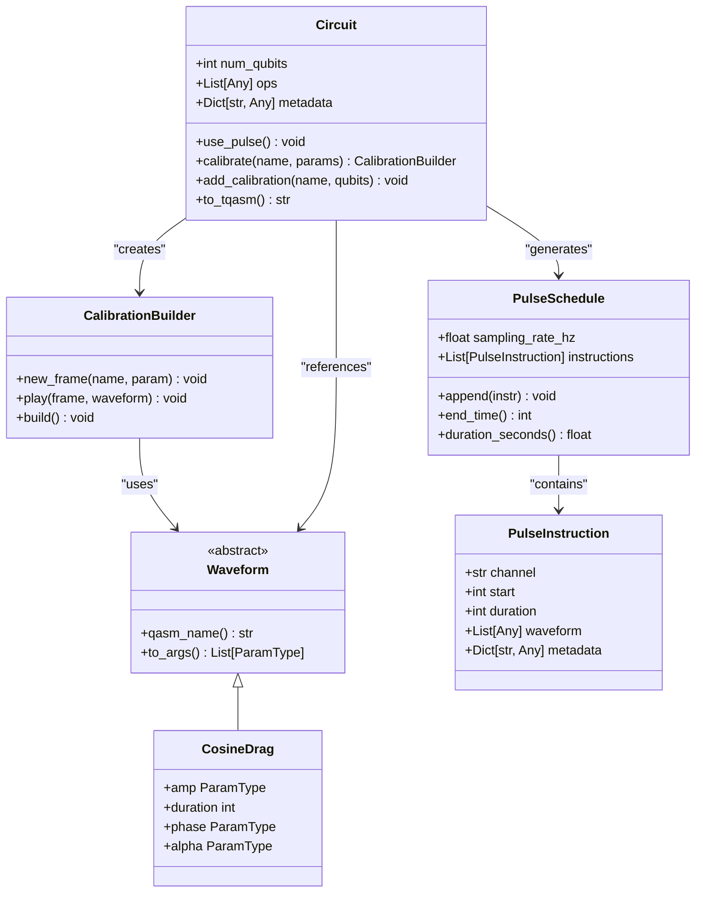

# Pulse-Level Control Examples

<cite>
**Referenced Files in This Document**   
- [pulse_demo.py](file://examples/pulse_demo.py)
- [pulse_demo_scan.py](file://examples/pulse_demo_scan.py)
- [circuit.py](file://src/tyxonq/core/ir/circuit.py)
- [pulse.py](file://src/tyxonq/core/ir/pulse.py)
- [waveforms.py](file://src/tyxonq/waveforms.py)
</cite>

## Table of Contents
1. [Introduction](#introduction)
2. [Pulse Sequence Definition and Manipulation](#pulse-sequence-definition-and-manipulation)
3. [Parameter Scanning for Pulse Calibration](#parameter-scanning-for-pulse-calibration)
4. [Interface Between High-Level Circuits and Pulse-Level Instructions](#interface-between-high-level-circuits-and-pulse-level-instructions)
5. [Designing Custom Pulse Schedules](#designing-custom-pulse-schedules)
6. [Common Challenges in Pulse-Level Programming](#common-challenges-in-pulse-level-programming)
7. [Implementing High-Fidelity Gates Through Pulse Shaping](#implementing-high-fidelity-gates-through-pulse-shaping)
8. [Conclusion](#conclusion)

## Introduction

This document provides comprehensive guidance on pulse-level control capabilities within the TyxonQ framework. It focuses on practical implementation of low-level quantum control through two primary examples: `pulse_demo.py` for basic pulse sequence definition and manipulation, and `pulse_demo_scan.py` for systematic parameter scanning in pulse calibration. The documentation covers the interface between high-level quantum circuits and pulse-level instructions, including waveform generation and timing constraints. Guidance is provided for designing custom pulse schedules tailored to specific hardware characteristics, addressing common challenges such as calibration, noise sensitivity, and gate fidelity optimization.

**Section sources**
- [pulse_demo.py](file://examples/pulse_demo.py#L1-L81)
- [pulse_demo_scan.py](file://examples/pulse_demo_scan.py#L1-L49)

## Pulse Sequence Definition and Manipulation

The pulse sequence definition and manipulation capabilities in TyxonQ are demonstrated through the `pulse_demo.py` example, which implements a parametric Rabi oscillation experiment. The core functionality revolves around creating pulse-calibrated circuits using the Circuit class's pulse interface.

The process begins with initializing a single-qubit circuit and enabling pulse mode through the `use_pulse()` method. A parametric waveform is then defined using the `calibrate()` method, which creates a calibration builder for constructing pulse sequences. The example demonstrates the creation of a cosine drag waveform with variable duration parameters, where the pulse shape is defined by amplitude, sigma, phase, and alpha parameters.

Key operations include creating a new frame for the drive channel and playing the defined waveform on that frame. The calibration is finalized with the `build()` method, and the calibrated pulse is added to the circuit through `add_calibration()`. This approach allows for the creation of parameterized pulse sequences that can be executed on quantum hardware.

**Diagram sources**
- [pulse_demo.py](file://examples/pulse_demo.py#L25-L55)

**Section sources**
- [pulse_demo.py](file://examples/pulse_demo.py#L25-L55)
- [waveforms.py](file://src/tyxonq/waveforms.py#L50-L57)

## Parameter Scanning for Pulse Calibration

The `pulse_demo_scan.py` example demonstrates systematic parameter scanning for pulse calibration, implementing a precise Rabi oscillation experiment with variable parameters. This approach enables comprehensive characterization of quantum device behavior across different pulse configurations.

The implementation creates a parameterized Rabi circuit function that accepts duration, amplitude, and frequency parameters for a sine waveform. The calibration process follows a similar pattern to the basic pulse demo but focuses on systematic variation of waveform parameters. The example iterates through predefined frequency and amplitude values, generating TQASM code for each combination to facilitate experimental execution.

This parameter scanning methodology supports calibration workflows where optimal pulse parameters need to be identified through empirical testing. By systematically varying waveform characteristics, researchers can map device response across parameter space, identify optimal operating points, and characterize hardware-specific constraints.

**Diagram sources**
- [pulse_demo_scan.py](file://examples/pulse_demo_scan.py#L10-L48)

**Section sources**
- [pulse_demo_scan.py](file://examples/pulse_demo_scan.py#L10-L48)
- [waveforms.py](file://src/tyxonq/waveforms.py#L38-L43)

## Interface Between High-Level Circuits and Pulse-Level Instructions

The interface between high-level quantum circuits and pulse-level instructions in TyxonQ is mediated through the Circuit class and its pulse calibration system. This architecture enables seamless integration of abstract quantum algorithms with low-level hardware control.

The core mechanism involves the `use_pulse()` method which switches the circuit to pulse mode, enabling calibration capabilities. The `calibrate()` method creates a builder pattern interface for constructing pulse sequences with parameterized waveforms. These calibrations are then linked to circuit operations through `add_calibration()`, establishing the connection between high-level circuit instructions and low-level pulse implementations.

Underlying this interface are data structures defined in the pulse module, including `PulseInstruction` and `PulseSchedule`, which represent individual pulse operations and complete pulse sequences respectively. The waveform library provides various pulse shapes (Gaussian, Drag, Sine, Cosine, etc.) that can be parameterized and composed into complex pulse sequences.

**Diagram sources**
- [circuit.py](file://src/tyxonq/core/ir/circuit.py#L100-L150)
- [pulse.py](file://src/tyxonq/core/ir/pulse.py#L7-L66)
- [waveforms.py](file://src/tyxonq/waveforms.py#L1-L97)

**Section sources**
- [circuit.py](file://src/tyxonq/core/ir/circuit.py#L100-L150)
- [pulse.py](file://src/tyxonq/core/ir/pulse.py#L7-L66)
- [waveforms.py](file://src/tyxonq/waveforms.py#L1-L97)

## Designing Custom Pulse Schedules

Designing custom pulse schedules in TyxonQ involves creating parameterized waveforms and organizing them into timed sequences that respect hardware constraints. The framework provides a flexible system for defining pulse schedules that can be tailored to specific device characteristics and experimental requirements.

The process begins with selecting appropriate waveform types from the available library, including Gaussian, Drag, Sine, Cosine, and specialized shapes like CosineDrag. These waveforms can be parameterized with variables that allow for dynamic adjustment during execution. The calibration builder interface enables the creation of frames (representing hardware channels) and the scheduling of waveforms on those frames with precise timing control.

When designing custom schedules, considerations include sampling rate constraints, channel availability, and timing dependencies between operations. The PulseSchedule class manages the temporal organization of pulse instructions, ensuring that operations are properly sequenced and that timing constraints are respected. The end_time() and duration_seconds() methods provide utilities for analyzing schedule timing properties.

**Section sources**
- [pulse.py](file://src/tyxonq/core/ir/pulse.py#L31-L63)
- [waveforms.py](file://src/tyxonq/waveforms.py#L1-L97)
- [pulse_demo.py](file://examples/pulse_demo.py#L25-L55)

## Common Challenges in Pulse-Level Programming

Pulse-level programming presents several common challenges that must be addressed to achieve reliable quantum control. These challenges include calibration complexity, noise sensitivity, and gate fidelity optimization, all of which impact the performance and reliability of quantum experiments.

Calibration requires precise parameter tuning to match hardware characteristics, often involving iterative testing and measurement. The parameter scanning demonstrated in `pulse_demo_scan.py` addresses this by systematically exploring parameter space to identify optimal operating points. Noise sensitivity is another critical challenge, as pulse shapes and timing can significantly affect susceptibility to various noise sources, including T1/T2 relaxation and dephasing.

Gate fidelity optimization involves balancing competing requirements such as speed, accuracy, and robustness. Shorter pulses enable faster operations but may introduce control errors, while longer pulses can reduce errors but increase susceptibility to decoherence. The framework's support for parameterized waveforms and systematic scanning enables researchers to navigate these trade-offs and identify pulse configurations that maximize gate fidelity for specific hardware platforms.

**Section sources**
- [pulse_demo.py](file://examples/pulse_demo.py#L1-L81)
- [pulse_demo_scan.py](file://examples/pulse_demo_scan.py#L1-L49)
- [pulse.py](file://src/tyxonq/core/ir/pulse.py#L7-L66)

## Implementing High-Fidelity Gates Through Pulse Shaping

Implementing high-fidelity gates through pulse shaping leverages the parameterized waveform capabilities of the TyxonQ framework to optimize quantum operations. The example implementations demonstrate how pulse shaping techniques can be used to create high-performance quantum gates by carefully controlling waveform parameters.

The CosineDrag waveform used in the examples combines a cosine envelope with a derivative component (alpha parameter) that helps mitigate leakage to higher energy states and reduce sensitivity to control errors. By parameterizing the pulse duration, amplitude, and shape parameters, researchers can optimize gate performance through systematic experimentation.

The parameter scanning approach enables comprehensive characterization of gate performance across different pulse configurations, facilitating the identification of optimal parameters that maximize fidelity. This methodology supports the development of robust quantum gates that maintain high performance across varying hardware conditions and environmental factors.

**Section sources**
- [pulse_demo.py](file://examples/pulse_demo.py#L25-L55)
- [waveforms.py](file://src/tyxonq/waveforms.py#L50-L57)
- [pulse_demo_scan.py](file://examples/pulse_demo_scan.py#L10-L48)

## Conclusion

The pulse-level control examples in TyxonQ demonstrate a comprehensive framework for low-level quantum control, enabling researchers to implement sophisticated pulse sequences and calibration workflows. The integration of high-level circuit abstractions with detailed pulse-level instructions provides a powerful platform for quantum experimentation and optimization. By leveraging parameterized waveforms, systematic scanning, and flexible scheduling capabilities, users can develop high-fidelity quantum gates tailored to specific hardware characteristics. These capabilities form a foundation for advanced quantum control techniques that are essential for pushing the boundaries of quantum computing performance.