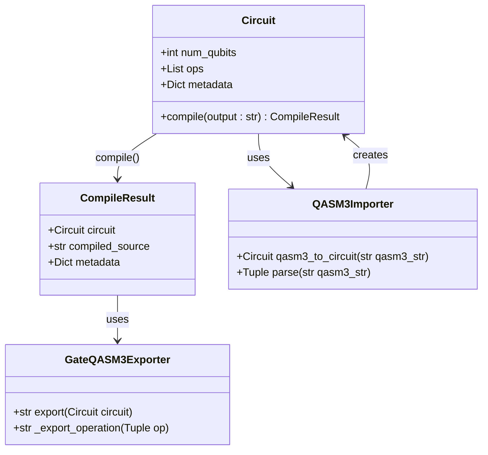
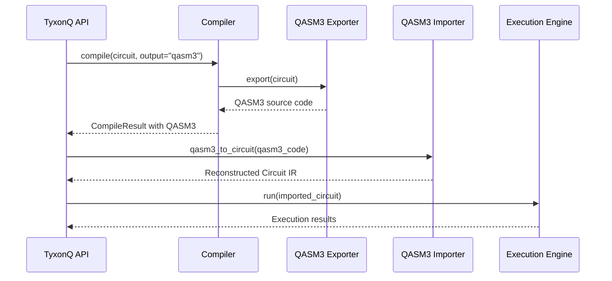
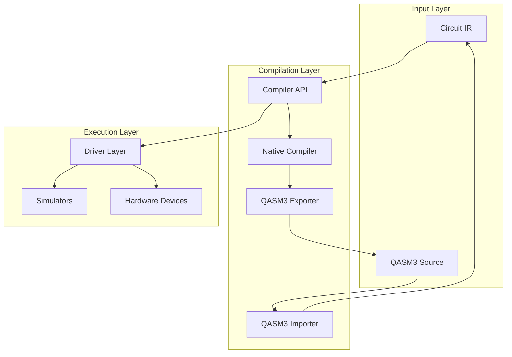

# QASM3 Complete Workflow

<cite>
**Referenced Files in This Document**   
- [qasm3_complete_workflow.py](file://examples/qasm3_complete_workflow.py)
- [api.py](file://src/tyxonq/compiler/api.py)
- [native_compiler.py](file://src/tyxonq/compiler/compile_engine/native/native_compiler.py)
- [gate_qasm3_exporter.py](file://src/tyxonq/compiler/compile_engine/native/gate_qasm3_exporter.py)
- [qasm3_importer.py](file://src/tyxonq/compiler/pulse_compile_engine/native/qasm3_importer.py)
- [tqasm_exporter.py](file://src/tyxonq/compiler/pulse_compile_engine/native/tqasm_exporter.py)
- [circuit.py](file://src/tyxonq/core/ir/circuit.py)
- [base.py](file://src/tyxonq/devices/base.py)
</cite>

## Table of Contents
1. [Introduction](#introduction)
2. [QASM3 Workflow Overview](#qasm3-workflow-overview)
3. [Core Components](#core-components)
4. [Compilation Process](#compilation-process)
5. [QASM3 Export and Import](#qasm3-export-and-import)
6. [Pulse-Level Compilation](#pulse-level-compilation)
7. [Driver Layer Execution](#driver-layer-execution)
8. [Complete Closed-Loop Workflow](#complete-closed-loop-workflow)
9. [Architecture Diagram](#architecture-diagram)
10. [Conclusion](#conclusion)

## Introduction

The QASM3 Complete Workflow documentation provides a comprehensive overview of the OpenQASM 3.0 support in TyxonQ, covering the full lifecycle from circuit creation to execution. This workflow demonstrates the interoperability between TyxonQ's internal Circuit IR and the standardized OpenQASM 3.0 format, enabling seamless quantum circuit development, compilation, and execution.

The documentation focuses on the complete workflow demonstrated in the `qasm3_complete_workflow.py` example, which showcases the key features of TyxonQ's QASM3 support, including gate-level compilation, OpenPulse frame definitions, defcal gate calibrations, and the complete closed-loop workflow that validates round-trip fidelity between Circuit IR and QASM3.

**Section sources**
- [qasm3_complete_workflow.py](file://examples/qasm3_complete_workflow.py#L1-L468)

## QASM3 Workflow Overview

The QASM3 workflow in TyxonQ consists of several phases that enable complete interoperability between the framework's internal representation and the OpenQASM 3.0 standard. The workflow is designed to support both gate-level quantum circuits and pulse-level quantum programs, providing a unified interface for quantum circuit development and execution.

The workflow is structured into four main phases:
1. Gate-level QASM3 import and export
2. OpenPulse frame definitions
3. defcal gate calibrations
4. Complete closed-loop workflow validation

Each phase builds upon the previous one, culminating in a comprehensive validation of the entire compilation and execution pipeline. The workflow demonstrates how quantum circuits can be created in TyxonQ, compiled to QASM3 format, imported back into Circuit IR, and executed with perfect fidelity.

The key innovation in this workflow is the complete closed-loop validation, which ensures that circuits can be reliably converted between TyxonQ's internal representation and the standardized QASM3 format without loss of information or structural integrity.

**Section sources**
- [qasm3_complete_workflow.py](file://examples/qasm3_complete_workflow.py#L1-L468)

## Core Components

The QASM3 workflow in TyxonQ is built upon several core components that work together to enable seamless quantum circuit compilation and execution. These components include the compiler API, native compiler, QASM3 exporter and importer, and the driver layer for execution.

The `compile()` function serves as the primary entry point for circuit compilation, accepting a Circuit object and returning a `CompileResult` dictionary containing the compiled circuit, source code, and metadata. This function supports multiple compilation engines and output formats, with QASM3 being a key target format.

The `qasm3_to_circuit()` function provides the inverse operation, parsing QASM3 source code and converting it back into a Circuit IR object. This function supports the full range of QASM3 constructs, including gate-level operations, OpenPulse frame definitions, and defcal gate calibrations.

The workflow also leverages the `Circuit` class from the core IR module, which represents quantum circuits as a collection of operations with associated metadata. This class provides the foundation for circuit manipulation and compilation throughout the workflow.

**Section sources**
- [api.py](file://src/tyxonq/compiler/api.py#L0-L433)
- [circuit.py](file://src/tyxonq/core/ir/circuit.py#L0-L1978)
- [qasm3_complete_workflow.py](file://examples/qasm3_complete_workflow.py#L1-L468)

## Compilation Process

The compilation process in TyxonQ follows a structured pipeline that transforms high-level quantum circuits into executable formats. The process begins with the `compile()` function, which serves as the unified entry point for circuit compilation.

When compiling to QASM3 format, the process follows these steps:
1. The input Circuit object is passed to the `compile()` function with `output="qasm3"`
2. The function determines the appropriate compilation engine based on the circuit type and options
3. For gate-level circuits, the native compiler is used with the QASM3 exporter
4. The compilation pipeline applies a series of passes to normalize and optimize the circuit
5. The final circuit is exported to QASM3 format using the `GateQASM3Exporter`

The compilation pipeline includes essential normalization passes such as auto-measurement insertion and gate transformation, which ensure circuit consistency and compatibility with target devices. The pipeline can be customized through the `compile_plan` parameter, allowing users to specify a sequence of compilation passes.

The compilation process returns a `CompileResult` dictionary containing three key fields:
- `circuit`: The original Circuit IR object
- `compiled_source`: The generated QASM3 source code as a string
- `metadata`: Compilation metadata including options, device rules, and optimization levels

This structured approach ensures consistent compilation results and provides detailed information about the compilation process for debugging and optimization.

**Section sources**
- [api.py](file://src/tyxonq/compiler/api.py#L0-L433)
- [native_compiler.py](file://src/tyxonq/compiler/compile_engine/native/native_compiler.py#L0-L111)
- [compile_plan.py](file://src/tyxonq/compiler/compile_engine/native/compile_plan.py#L0-L94)

## QASM3 Export and Import

The QASM3 export and import functionality in TyxonQ enables bidirectional conversion between the framework's internal Circuit IR and the standardized OpenQASM 3.0 format. This capability is essential for interoperability with other quantum computing tools and platforms.

The export process is handled by the `GateQASM3Exporter` class, which converts Circuit IR objects to QASM3 source code. The exporter generates compliant QASM3 code with the following structure:
- Header with `OPENQASM 3.0;` declaration
- Qubit declaration using `qubit[n] q;` syntax
- Gate operations translated to QASM3 equivalents
- Proper formatting with appropriate spacing and line breaks

The import process is managed by the `qasm3_to_circuit()` function, which parses QASM3 source code and reconstructs a Circuit IR object. This function supports the full range of QASM3 constructs, including:
- Gate-level operations (h, x, y, z, cx, etc.)
- Parameterized gates with angle expressions
- Measurement operations
- OpenPulse frame definitions
- defcal gate calibrations

The import process preserves circuit structure and metadata, ensuring that imported circuits are functionally equivalent to their original representations. This round-trip capability is validated through comprehensive testing that verifies operation consistency, qubit indexing, and parameter fidelity.

The export and import functionality forms the foundation of the complete closed-loop workflow, enabling reliable circuit interchange between TyxonQ and other quantum computing environments.

```mermaid
flowchart TD
A[Circuit IR] --> B[compile(output=\"qasm3\")]
B --> C[QASM3 Source Code]
C --> D[qasm3_to_circuit()]
D --> E[Reconstructed Circuit IR]
E --> F[Structure Verification]
F --> G[Fidelity Validation]
```

**Diagram sources **
- [gate_qasm3_exporter.py](file://src/tyxonq/compiler/compile_engine/native/gate_qasm3_exporter.py#L0-L66)
- [qasm3_importer.py](file://src/tyxonq/compiler/pulse_compile_engine/native/qasm3_importer.py#L0-L395)
- [api.py](file://src/tyxonq/compiler/api.py#L0-L433)

**Section sources**
- [gate_qasm3_exporter.py](file://src/tyxonq/compiler/compile_engine/native/gate_qasm3_exporter.py#L0-L66)
- [qasm3_importer.py](file://src/tyxonq/compiler/pulse_compile_engine/native/qasm3_importer.py#L0-L395)

## Pulse-Level Compilation

Pulse-level compilation in TyxonQ extends the QASM3 workflow to support low-level quantum control through OpenPulse extensions. This capability enables precise control over quantum hardware by specifying pulse-level operations and calibrations.

The pulse-level compilation process supports three key features:
1. OpenPulse frame definitions for specifying control frames
2. defcal gate calibrations for defining custom gate implementations
3. Waveform specifications for pulse shaping

When compiling pulse-enhanced circuits, the workflow generates QASM3 code with OpenPulse extensions, including:
- `defcalgrammar "openpulse";` declaration
- `cal` blocks for port and frame definitions
- `defcal` definitions for gate calibrations with pulse sequences
- Waveform definitions using pulse primitives (drag, gaussian, etc.)

The compilation process preserves pulse metadata in the Circuit IR, storing frame information in `circuit.metadata['qasm3_frames']` and defcal definitions in `circuit.metadata['qasm3_defcals']`. This metadata enables accurate simulation and execution of pulse-level operations.

The pulse-level compilation workflow is particularly important for advanced quantum applications that require precise control over quantum hardware, such as quantum error correction, optimal control, and analog quantum simulation.



**Diagram sources **
- [tqasm_exporter.py](file://src/tyxonq/compiler/pulse_compile_engine/native/tqasm_exporter.py#L0-L732)
- [qasm3_importer.py](file://src/tyxonq/compiler/pulse_compile_engine/native/qasm3_importer.py#L0-L395)
- [circuit.py](file://src/tyxonq/core/ir/circuit.py#L0-L1978)

**Section sources**
- [tqasm_exporter.py](file://src/tyxonq/compiler/pulse_compile_engine/native/tqasm_exporter.py#L0-L732)
- [qasm3_importer.py](file://src/tyxonq/compiler/pulse_compile_engine/native/qasm3_importer.py#L0-L395)

## Driver Layer Execution

The driver layer in TyxonQ provides a unified interface for executing quantum circuits on various backends, including simulators and hardware devices. This layer handles the execution of QASM3 source code directly, enabling seamless integration between the compilation workflow and execution environment.

The driver layer automatically detects the QASM3 version and parses the source code, invoking the appropriate parser based on the format. This capability allows users to submit QASM3 code directly to the execution engine without manual parsing or conversion.

The execution process follows these steps:
1. The QASM3 source code is passed to the driver layer via the `device().run()` method
2. The driver detects the QASM3 format and invokes the `_qasm_to_ir_if_needed()` function
3. The QASM3 code is parsed into Circuit IR
4. The circuit is executed on the specified device
5. Results are returned in a standardized format

This integration enables a complete workflow where quantum circuits can be developed in QASM3 format, executed directly, and results obtained without intermediate conversion steps. The driver layer supports both gate-level QASM3 and TQASM 0.2 formats, providing flexibility for different execution scenarios.

The driver layer also handles device-specific considerations such as shot allocation, batch processing, and error handling, abstracting these complexities from the user.

**Section sources**
- [base.py](file://src/tyxonq/devices/base.py#L0-L199)
- [qasm3_complete_workflow.py](file://examples/qasm3_complete_workflow.py#L1-L468)

## Complete Closed-Loop Workflow

The complete closed-loop workflow is the most critical aspect of the QASM3 implementation in TyxonQ, serving as the ultimate validation of interoperability between the framework's internal representation and the standardized QASM3 format. This workflow tests the full cycle of circuit development, compilation, import, and execution.

The closed-loop workflow consists of three key scenarios:

1. **Simple Gate Circuit**: Validates the basic round-trip fidelity between Circuit IR and QASM3 format. This scenario creates a Bell state circuit, compiles it to QASM3, imports it back to Circuit IR, and verifies structural consistency.

2. **Pulse-Enhanced Circuit**: Tests the preservation of pulse-level metadata during the compilation and import process. This scenario creates a circuit with pulse compilation enabled, compiles it to QASM3 with defcal definitions, and verifies that the defcal metadata is preserved in the imported circuit.

3. **Pure PulseProgram Compilation**: Validates the compilation of pure pulse programs to TQASM format. This scenario creates a PulseProgram with DRAG pulses, compiles it to TQASM, and verifies the output format.

Each scenario follows the same pattern:
1. Create a circuit or pulse program in TyxonQ
2. Compile to QASM3 or TQASM format
3. Import the generated code back to Circuit IR
4. Verify structural consistency and metadata preservation
5. Confirm execution readiness

The successful completion of this closed-loop workflow demonstrates that TyxonQ can reliably convert between its internal representation and standardized formats without loss of information, enabling seamless integration with other quantum computing tools and platforms.



**Diagram sources **
- [qasm3_complete_workflow.py](file://examples/qasm3_complete_workflow.py#L1-L468)
- [api.py](file://src/tyxonq/compiler/api.py#L0-L433)
- [gate_qasm3_exporter.py](file://src/tyxonq/compiler/compile_engine/native/gate_qasm3_exporter.py#L0-L66)
- [qasm3_importer.py](file://src/tyxonq/compiler/pulse_compile_engine/native/qasm3_importer.py#L0-L395)

**Section sources**
- [qasm3_complete_workflow.py](file://examples/qasm3_complete_workflow.py#L1-L468)

## Architecture Diagram

The QASM3 workflow in TyxonQ follows a modular architecture that separates concerns between circuit representation, compilation, and execution. This architecture enables flexible and extensible quantum circuit processing while maintaining compatibility with standardized formats.



**Diagram sources **
- [api.py](file://src/tyxonq/compiler/api.py#L0-L433)
- [native_compiler.py](file://src/tyxonq/compiler/compile_engine/native/native_compiler.py#L0-L111)
- [gate_qasm3_exporter.py](file://src/tyxonq/compiler/compile_engine/native/gate_qasm3_exporter.py#L0-L66)
- [qasm3_importer.py](file://src/tyxonq/compiler/pulse_compile_engine/native/qasm3_importer.py#L0-L395)
- [base.py](file://src/tyxonq/devices/base.py#L0-L199)

## Conclusion

The QASM3 Complete Workflow in TyxonQ represents a comprehensive implementation of OpenQASM 3.0 support, enabling seamless quantum circuit development, compilation, and execution. The workflow demonstrates robust interoperability between TyxonQ's internal Circuit IR and the standardized QASM3 format, validated through a complete closed-loop testing process.

Key achievements of the workflow include:
- Full support for gate-level QASM3 import and export
- Integration of OpenPulse frame definitions and defcal gate calibrations
- Preservation of circuit structure and metadata during round-trip conversion
- Unified compilation API with consistent result formatting
- Direct execution of QASM3 source code through the driver layer

The successful implementation of this workflow enables quantum developers to leverage TyxonQ's advanced features while maintaining compatibility with standardized quantum programming formats. This capability facilitates collaboration, code sharing, and integration with other quantum computing tools and platforms.

The complete closed-loop validation ensures that circuits can be reliably converted between representations without loss of information, providing confidence in the accuracy and fidelity of quantum computations developed with TyxonQ.