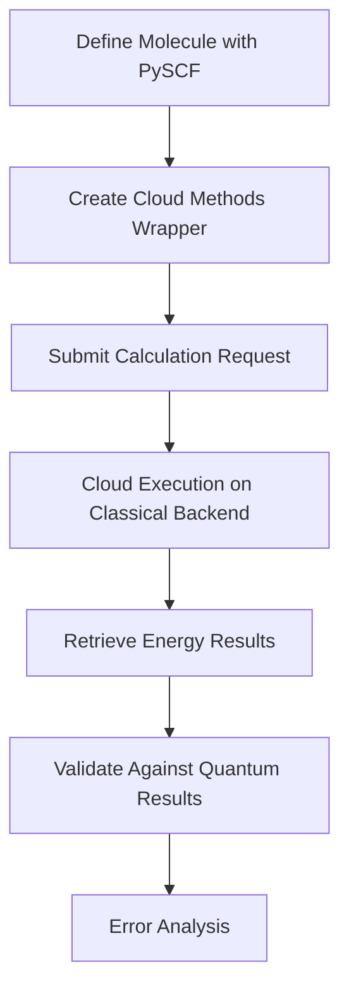
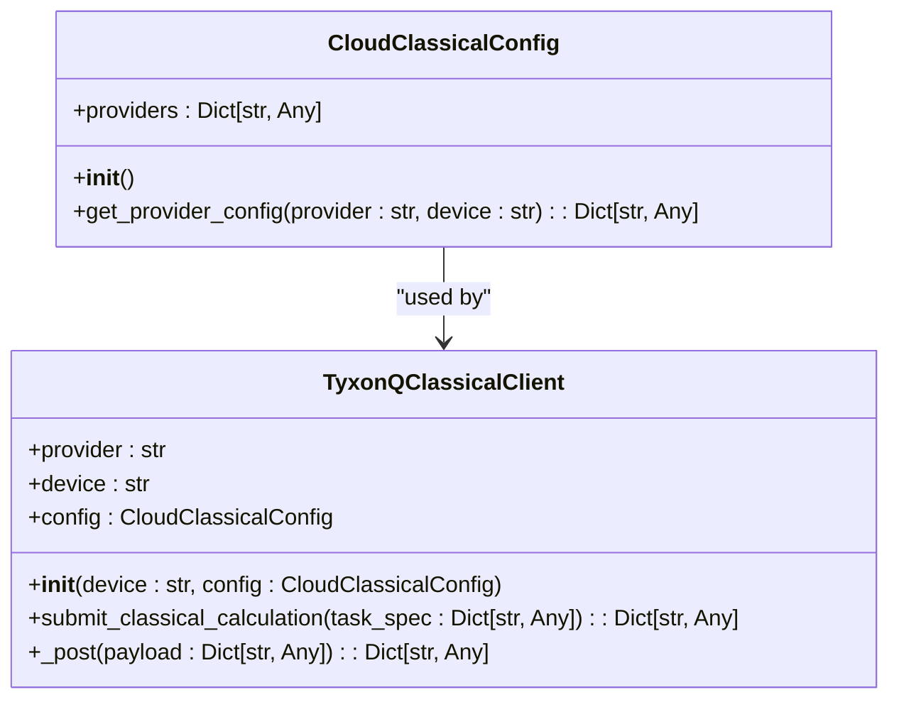
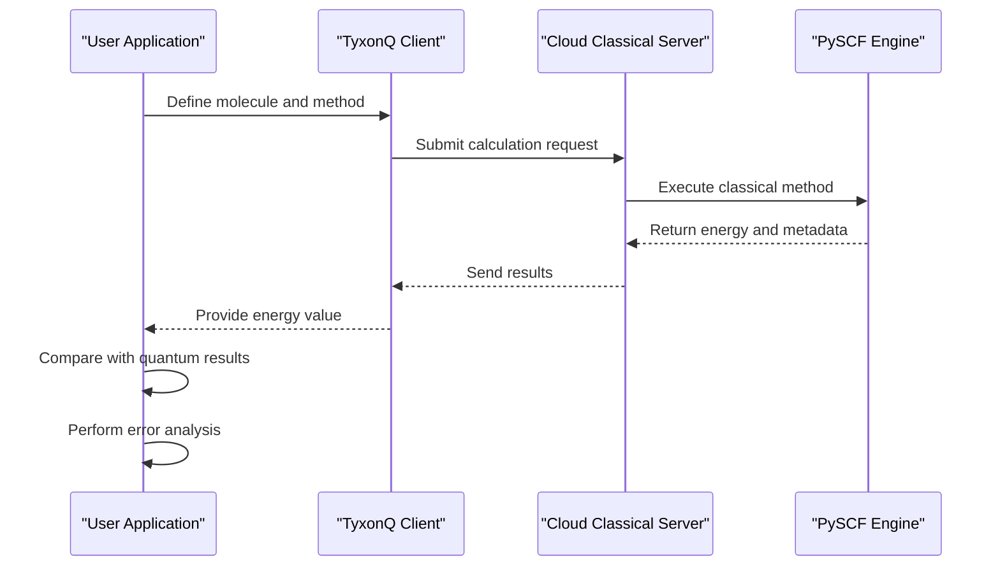
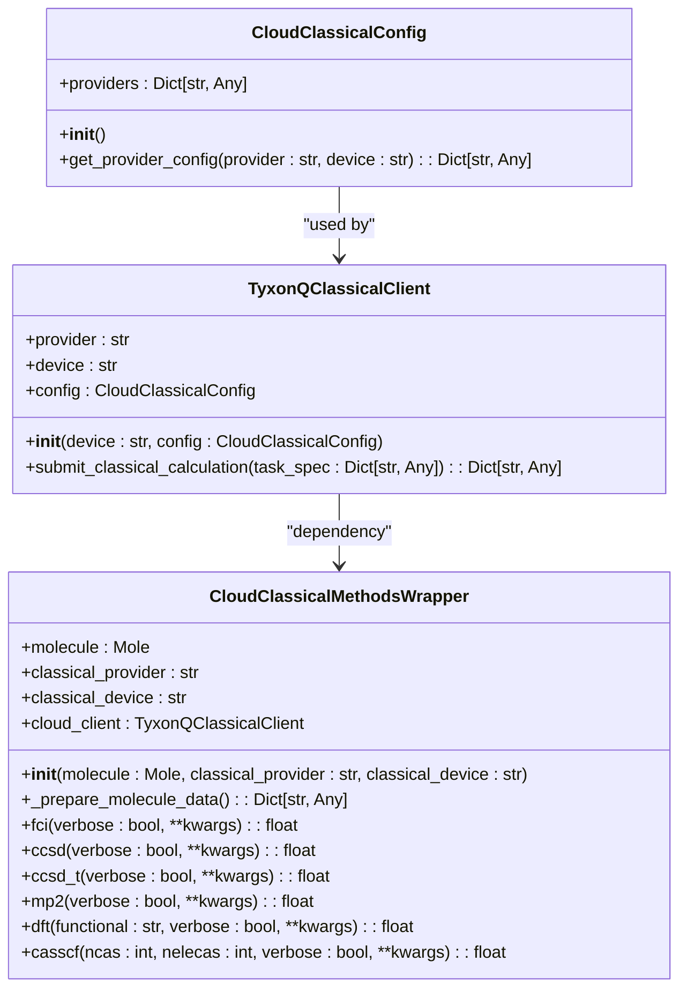

# Classical Chemistry Methods Integration

<cite>
**Referenced Files in This Document**   
- [cloud_classical_methods_demo.py](file://examples/cloud_classical_methods_demo.py)
- [classical_methods.py](file://src/tyxonq/applications/chem/classical_chem_cloud/classical_methods.py)
- [clients.py](file://src/tyxonq/applications/chem/classical_chem_cloud/clients.py)
- [config.py](file://src/tyxonq/applications/chem/classical_chem_cloud/config.py)
- [mock_classical_server.py](file://src/tyxonq/applications/chem/classical_chem_cloud/server/mock_classical_server.py)
- [molecule.py](file://src/tyxonq/applications/chem/molecule.py)
- [hamiltonian_builders.py](file://src/tyxonq/applications/chem/chem_libs/hamiltonians_chem_library/hamiltonian_builders.py)
</cite>

## Table of Contents
1. [Introduction](#introduction)
2. [Core Integration Workflow](#core-integration-workflow)
3. [Classical Backend Configuration](#classical-backend-configuration)
4. [Data Exchange and Preprocessing](#data-exchange-and-preprocessing)
5. [Hybrid Quantum-Classical Computation Patterns](#hybrid-quantum-classical-computation-patterns)
6. [Energy Validation and Error Analysis](#energy-validation-and-error-analysis)
7. [API Reference and Usage Examples](#api-reference-and-usage-examples)
8. [Server Architecture and Implementation](#server-architecture-and-implementation)

## Introduction

The TyxonQ framework provides seamless integration between quantum algorithms and classical quantum chemistry software through its cloud-accelerated classical computation system. This integration enables researchers to leverage the strengths of both quantum and classical computational paradigms in a unified workflow. The system is designed to interface with established classical solvers like PySCF, allowing for efficient data exchange, hybrid computation patterns, and comprehensive validation of quantum results against classical reference calculations.

The core objective of this integration is to offload computationally intensive classical quantum chemistry methods to cloud infrastructure while maintaining compatibility with existing PySCF workflows. This approach enables researchers to perform high-accuracy classical calculations (such as HF, CCSD, FCI) that serve as benchmarks for validating quantum computed energies, while also providing preprocessing capabilities for quantum algorithms.

**Section sources**
- [cloud_classical_methods_demo.py](file://examples/cloud_classical_methods_demo.py#L1-L60)
- [classical_methods.py](file://src/tyxonq/applications/chem/classical_chem_cloud/classical_methods.py#L1-L168)

## Core Integration Workflow

The integration between TyxonQ and classical quantum chemistry software follows a structured workflow that enables efficient hybrid computation. The process begins with molecular specification using PySCF's Mole object, which is then processed through TyxonQ's cloud interface to execute classical quantum chemistry methods.

The workflow consists of three primary phases: molecule preparation, cloud task submission, and result retrieval. During molecule preparation, users define molecular geometry, basis sets, charge, and spin states using PySCF's familiar interface. This molecular data is then serialized and transmitted to the cloud service for computation. The cloud service executes the requested classical method and returns the results, including energy values and optional verbose metadata.

This integration pattern allows for transparent acceleration of classical methods without requiring changes to existing codebases. The cloud interface maintains PySCF-compatible interfaces while leveraging TyxonQ's cloud infrastructure for performance improvements, particularly for large-scale systems where classical computation becomes prohibitively expensive on local hardware.

**Diagram sources**
- [cloud_classical_methods_demo.py](file://examples/cloud_classical_methods_demo.py#L15-L60)
- [classical_methods.py](file://src/tyxonq/applications/chem/classical_chem_cloud/classical_methods.py#L134-L164)

**Section sources**
- [cloud_classical_methods_demo.py](file://examples/cloud_classical_methods_demo.py#L15-L60)
- [classical_methods.py](file://src/tyxonq/applications/chem/classical_chem_cloud/classical_methods.py#L1-L168)

## Classical Backend Configuration

The classical computation backend in TyxonQ is configured through a flexible provider and device selection system that allows users to specify their preferred computational resources. The configuration system supports multiple classical providers, with "tyxonq" being the primary implementation that routes calculations to cloud-accelerated servers.

Backend selection is controlled through two parameters: `classical_provider` and `classical_device`. The provider parameter determines which computational infrastructure will execute the calculation, while the device parameter specifies the hardware type (CPU, GPU, or auto) to be used. The "auto" setting allows the server to optimize device selection based on the problem size and available resources.

Configuration is managed through the `CloudClassicalConfig` class, which maintains provider-specific settings including API endpoints and timeout configurations. The current implementation routes requests to a local mock server during development, but can be configured for production use with appropriate endpoint settings. This configuration system enables seamless switching between local testing and cloud production environments without code changes.

**Diagram sources**
- [config.py](file://src/tyxonq/applications/chem/classical_chem_cloud/config.py#L1-L42)
- [clients.py](file://src/tyxonq/applications/chem/classical_chem_cloud/clients.py#L1-L73)

**Section sources**
- [config.py](file://src/tyxonq/applications/chem/classical_chem_cloud/config.py#L1-L42)
- [clients.py](file://src/tyxonq/applications/chem/classical_chem_cloud/clients.py#L1-L73)

## Data Exchange and Preprocessing

The data exchange mechanism between TyxonQ and classical solvers follows a structured format that ensures compatibility and efficient transmission. Molecular data is serialized into a standardized dictionary format containing essential parameters such as atomic coordinates, basis set specifications, charge, spin state, and orbital counts. This serialization process preserves all necessary information for accurate quantum chemistry calculations while minimizing transmission overhead.

Preprocessing operations are integrated into the workflow to prepare molecular orbitals and integral transformations required for both classical and quantum computations. The system supports molecular orbital coefficient retrieval and energy level information through the verbose output option, which prevents redundant calculations when multiple methods are applied to the same molecular system. This is particularly valuable for hybrid quantum-classical algorithms that require Hartree-Fock reference data.

The integral transformation pipeline converts atomic orbital integrals to molecular orbital basis, enabling accurate correlation energy calculations. This transformation is handled server-side, reducing client computational burden and ensuring consistency across different calculation methods. The preprocessing capabilities also support active space specification for methods like CASSCF, allowing researchers to focus computational resources on chemically relevant orbitals.

**Section sources**
- [mock_classical_server.py](file://src/tyxonq/applications/chem/classical_chem_cloud/server/mock_classical_server.py#L55-L80)
- [hamiltonian_builders.py](file://src/tyxonq/applications/chem/chem_libs/hamiltonians_chem_library/hamiltonian_builders.py#L1-L298)

## Hybrid Quantum-Classical Computation Patterns

TyxonQ implements several hybrid computation patterns that combine the strengths of quantum and classical computing paradigms. The primary pattern involves using classical methods as reference calculations to validate and benchmark quantum algorithm results. This approach enables researchers to assess the accuracy of quantum computations against established classical methods with known error characteristics.

A key hybrid pattern is the use of classical calculations for initial state preparation and orbital optimization. The system can compute Hartree-Fock solutions and molecular orbital coefficients in the cloud, then use this information to initialize quantum variational algorithms. This pre-processing step significantly improves convergence properties of quantum algorithms by providing physically meaningful starting points.

Another important pattern is the hierarchical validation approach, where multiple levels of classical theory (HF, MP2, CCSD, CCSD(T)) are used to establish a reference ladder against which quantum results can be compared. This multi-tiered validation provides insights into systematic errors and helps identify cases where quantum algorithms may offer advantages over classical methods.

The integration also supports hybrid energy decomposition, where classical methods compute certain energy components (like Hartree-Fock energy) while quantum algorithms compute correlation energy contributions. This division of labor optimizes resource utilization by applying the most appropriate computational paradigm to each component of the total energy calculation.

**Diagram sources**
- [classical_methods.py](file://src/tyxonq/applications/chem/classical_chem_cloud/classical_methods.py#L48-L131)
- [mock_classical_server.py](file://src/tyxonq/applications/chem/classical_chem_cloud/server/mock_classical_server.py#L82-L141)

**Section sources**
- [classical_methods.py](file://src/tyxonq/applications/chem/classical_chem_cloud/classical_methods.py#L48-L131)
- [mock_classical_server.py](file://src/tyxonq/applications/chem/classical_chem_cloud/server/mock_classical_server.py#L82-L141)

## Energy Validation and Error Analysis

The integration provides comprehensive capabilities for validating quantum computed energies against classical reference methods and performing detailed error analysis. The system supports multiple high-accuracy classical methods including FCI (Full Configuration Interaction), CCSD (Coupled Cluster Singles Doubles), CCSD(T), MP2 (Møller-Plesset perturbation theory), and DFT (Density Functional Theory), each serving as a benchmark with different accuracy characteristics and computational costs.

Error analysis is facilitated through the comparison of energy values obtained from quantum algorithms with those from classical methods. The hierarchical nature of quantum chemistry methods provides a natural framework for error assessment, where lower-level methods (HF, MP2) serve as initial approximations and higher-level methods (CCSD, CCSD(T)) provide increasingly accurate reference values. This multi-level validation helps identify systematic errors in quantum computations and assess convergence properties.

The system also supports active space methods like CASSCF (Complete Active Space SCF) for studying strongly correlated systems where single-reference methods may fail. By comparing quantum results with multi-reference classical calculations, researchers can evaluate the ability of quantum algorithms to capture strong electron correlation effects that are challenging for conventional quantum computing approaches.

The verbose output option enhances error analysis by providing additional metadata such as molecular orbital coefficients and energies, enabling detailed comparison of wavefunction characteristics between classical and quantum solutions. This information is valuable for diagnosing convergence issues and understanding the physical interpretation of quantum computed states.

**Section sources**
- [cloud_classical_methods_demo.py](file://examples/cloud_classical_methods_demo.py#L30-L57)
- [classical_methods.py](file://src/tyxonq/applications/chem/classical_chem_cloud/classical_methods.py#L48-L131)

## API Reference and Usage Examples

The TyxonQ classical chemistry integration provides a clean, intuitive API that maintains compatibility with PySCF conventions while adding cloud acceleration capabilities. The primary entry point is the `cloud_classical_methods` factory function, which creates a wrapper object containing methods for various quantum chemistry calculations.

Usage follows a simple pattern: first, a molecule is defined using PySCF's Mole class; then, the cloud methods wrapper is created with specified provider and device parameters; finally, individual calculation methods are called on the wrapper to obtain energy values. Each method supports a verbose parameter that returns additional metadata useful for analysis and debugging.

The API supports all major quantum chemistry methods through dedicated methods: `fci()` for Full Configuration Interaction, `ccsd()` for Coupled Cluster Singles Doubles, `mp2()` for Møller-Plesset perturbation theory, `dft()` for Density Functional Theory with configurable functionals, and `casscf()` for Complete Active Space SCF with active space specification. This consistent interface simplifies code development and enables easy comparison between different calculation methods.

**Diagram sources**
- [classical_methods.py](file://src/tyxonq/applications/chem/classical_chem_cloud/classical_methods.py#L13-L168)
- [clients.py](file://src/tyxonq/applications/chem/classical_chem_cloud/clients.py#L1-L73)
- [config.py](file://src/tyxonq/applications/chem/classical_chem_cloud/config.py#L1-L42)

**Section sources**
- [cloud_classical_methods_demo.py](file://examples/cloud_classical_methods_demo.py#L15-L60)
- [classical_methods.py](file://src/tyxonq/applications/chem/classical_chem_cloud/classical_methods.py#L134-L164)

## Server Architecture and Implementation

The server architecture for classical chemistry computations is implemented as a FastAPI application that provides a RESTful interface for receiving calculation requests and returning results. The mock server implementation demonstrates the core functionality and can be extended for production use with enhanced features like authentication, job queuing, and resource management.

The server processes incoming requests by first reconstructing the molecular system from the transmitted data, then executing the requested quantum chemistry method using PySCF. The implementation supports all major post-Hartree-Fock methods through PySCF's modular architecture, with each method handled by specialized modules (fci, cc, mp, dft, mcscf). The server returns the total energy as the primary result, with optional verbose output containing additional metadata when requested.

A key architectural feature is the separation of concerns between the client interface and computational engine. The client handles data serialization and transmission, while the server focuses on computation and result formatting. This design enables scalability and flexibility, allowing the computational backend to be optimized independently of the client interface.

The server also implements integral transformation capabilities, converting atomic orbital integrals to molecular orbital basis when requested. This preprocessing step is essential for accurate correlation energy calculations and demonstrates the server's role as more than just a computational resource, but as an integrated component of the quantum chemistry workflow.

**Section sources**
- [mock_classical_server.py](file://src/tyxonq/applications/chem/classical_chem_cloud/server/mock_classical_server.py#L1-L142)
- [classical_methods.py](file://src/tyxonq/applications/chem/classical_chem_cloud/classical_methods.py#L1-L168)