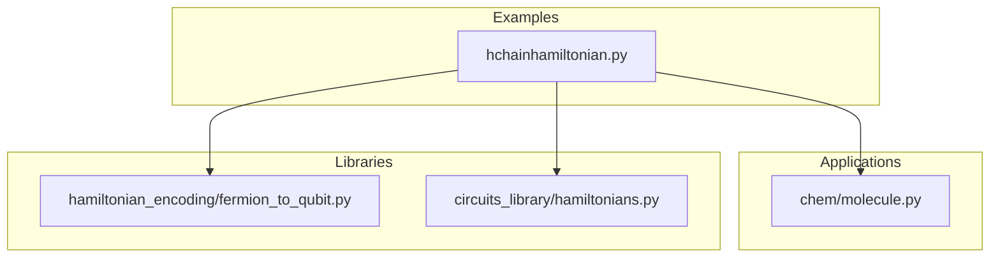
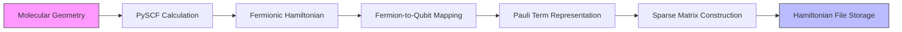
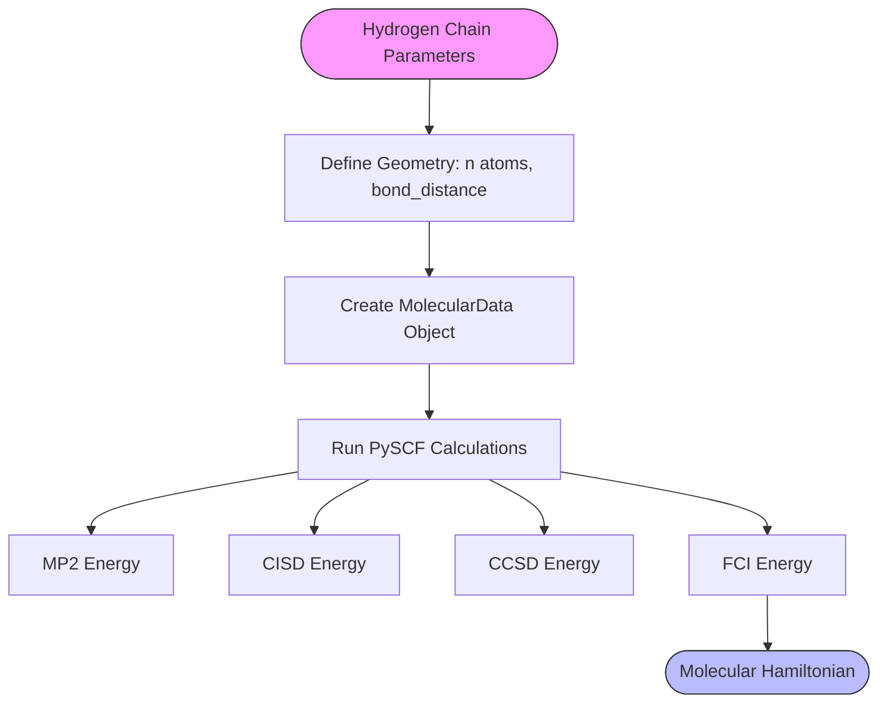
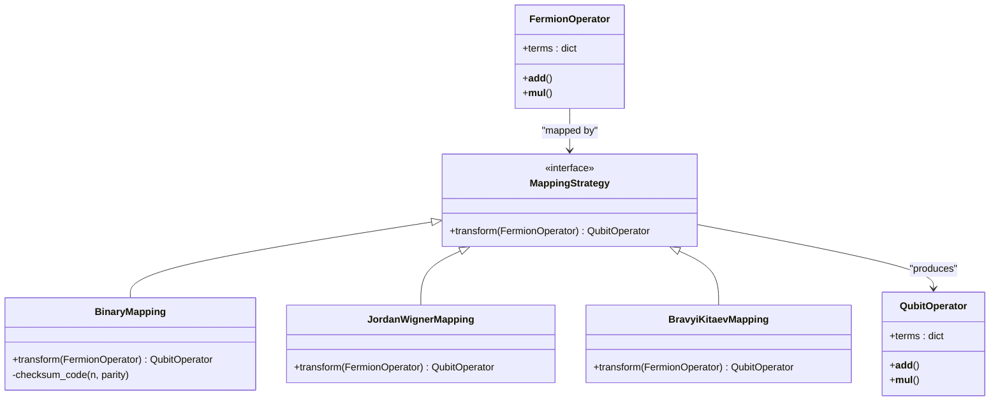
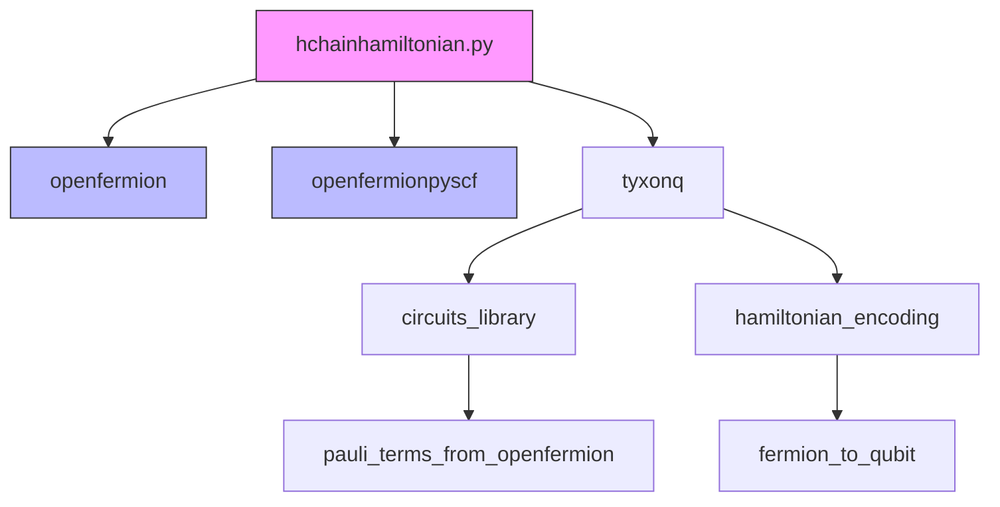

# Hydrogen Chain Hamiltonian Modeling

<cite>
**Referenced Files in This Document**   
- [hchainhamiltonian.py](file://examples/hchainhamiltonian.py)
- [molecule.py](file://src/tyxonq/applications/chem/molecule.py)
- [fermion_to_qubit.py](file://src/tyxonq/libs/hamiltonian_encoding/fermion_to_qubit.py)
- [hamiltonians.py](file://src/tyxonq/libs/circuits_library/hamiltonians.py)
</cite>

## Table of Contents
1. [Introduction](#introduction)
2. [Project Structure](#project-structure)
3. [Core Components](#core-components)
4. [Architecture Overview](#architecture-overview)
5. [Detailed Component Analysis](#detailed-component-analysis)
6. [Dependency Analysis](#dependency-analysis)
7. [Performance Considerations](#performance-considerations)
8. [Troubleshooting Guide](#troubleshooting-guide)
9. [Conclusion](#conclusion)

## Introduction

The hydrogen chain system represents a fundamental model in quantum chemistry for benchmarking electronic structure methods. This 1D lattice of hydrogen atoms serves as a critical testbed for quantum algorithms due to its tunable complexity and rich physical phenomena, including the metal-insulator transition that occurs as interatomic distances vary. The `hchainhamiltonian.py` example demonstrates the complete workflow for constructing and analyzing hydrogen chain Hamiltonians, from molecular geometry specification to qubit representation and sparse matrix construction. This system is particularly valuable for validating quantum simulation algorithms because its exact solutions can be computed for small instances, providing a gold standard for method comparison.

## Project Structure

The hydrogen chain modeling functionality is organized across multiple components in the TyxonQ framework. The primary example script resides in the examples directory, while core chemical modeling utilities are located in the applications/chem module. Hamiltonian processing and fermion-to-qubit mapping capabilities are implemented in dedicated library modules, creating a clean separation between application logic and fundamental quantum chemistry operations.



**Diagram sources**
- [examples/hchainhamiltonian.py](file://examples/hchainhamiltonian.py)
- [src/tyxonq/applications/chem/molecule.py](file://src/tyxonq/applications/chem/molecule.py)
- [src/tyxonq/libs/hamiltonian_encoding/fermion_to_qubit.py](file://src/tyxonq/libs/hamiltonian_encoding/fermion_to_qubit.py)
- [src/tyxonq/libs/circuits_library/hamiltonians.py](file://src/tyxonq/libs/circuits_library/hamiltonians.py)

**Section sources**
- [examples/hchainhamiltonian.py](file://examples/hchainhamiltonian.py)
- [src/tyxonq/applications/chem/molecule.py](file://src/tyxonq/applications/chem/molecule.py)

## Core Components

The hydrogen chain Hamiltonian modeling system comprises several key components that work together to transform molecular specifications into quantum-computable Hamiltonians. The process begins with geometry definition using PySCF's MolecularData structure, proceeds through fermionic Hamiltonian construction, applies fermion-to-qubit mapping via binary or Jordan-Wigner transformations, and concludes with sparse matrix representation for numerical analysis. The system leverages OpenFermion for quantum chemistry calculations and integrates with TyxonQ's quantum simulation framework for subsequent processing.

**Section sources**
- [examples/hchainhamiltonian.py](file://examples/hchainhamiltonian.py#L1-L76)
- [src/tyxonq/libs/circuits_library/hamiltonians.py](file://src/tyxonq/libs/circuits_library/hamiltonians.py#L28-L58)

## Architecture Overview

The hydrogen chain Hamiltonian construction follows a sequential pipeline architecture that transforms molecular specifications into qubit Hamiltonians suitable for quantum simulation. The architecture integrates quantum chemistry software (PySCF, OpenFermion) with quantum computing frameworks (TyxonQ) to provide a complete workflow from molecular input to quantum-ready Hamiltonian representation.



**Diagram sources**
- [examples/hchainhamiltonian.py](file://examples/hchainhamiltonian.py#L1-L76)
- [src/tyxonq/libs/hamiltonian_encoding/fermion_to_qubit.py](file://src/tyxonq/libs/hamiltonian_encoding/fermion_to_qubit.py#L78-L95)

## Detailed Component Analysis

### Hydrogen Chain Construction Analysis

The hydrogen chain system is parameterized by the number of atoms and interatomic distance, with atomic positions aligned along the z-axis. The `h_chain` function in molecule.py provides a convenient interface for generating hydrogen chain geometries with specified bond distances and charge states. This geometric specification serves as the foundation for subsequent quantum chemical calculations, with the linear arrangement creating a 1D electronic structure problem that can be systematically scaled by varying the number of atoms.



**Diagram sources**
- [src/tyxonq/applications/chem/molecule.py](file://src/tyxonq/applications/chem/molecule.py#L100-L136)
- [examples/hchainhamiltonian.py](file://examples/hchainhamiltonian.py#L15-L20)

**Section sources**
- [src/tyxonq/applications/chem/molecule.py](file://src/tyxonq/applications/chem/molecule.py#L100-L136)
- [examples/hchainhamiltonian.py](file://examples/hchainhamiltonian.py#L15-L25)

### Fermion-to-Qubit Mapping Analysis

The transformation from fermionic to qubit representations employs multiple mapping strategies, with the binary code transform featuring checksum code parity saving being used in the hydrogen chain example. This mapping reduces the qubit count by exploiting particle number conservation, while alternative mappings like Jordan-Wigner and Bravyi-Kitaev are available through the unified `fop_to_qop` interface. The choice of mapping significantly impacts the resulting Pauli term structure and subsequent quantum algorithm performance.



**Diagram sources**
- [src/tyxonq/libs/hamiltonian_encoding/fermion_to_qubit.py](file://src/tyxonq/libs/hamiltonian_encoding/fermion_to_qubit.py#L0-L98)
- [examples/hchainhamiltonian.py](file://examples/hchainhamiltonian.py#L30-L32)

**Section sources**
- [src/tyxonq/libs/hamiltonian_encoding/fermion_to_qubit.py](file://src/tyxonq/libs/hamiltonian_encoding/fermion_to_qubit.py#L0-L98)
- [examples/hchainhamiltonian.py](file://examples/hchainhamiltonian.py#L30-L32)

### Hamiltonian Representation Analysis

The Hamiltonian representation subsystem converts OpenFermion's QubitOperator into a compact Pauli term list format suitable for efficient processing. The `pauli_terms_from_openfermion` function transforms the operator into three components: lsb (list of Pauli codes), wb (list of weights), and n_qubits (qubit count). This representation enables efficient sparse matrix construction and storage, with the Pauli codes using a numerical encoding (0=I, 1=X, 2=Y, 3=Z) for compactness.

```mermaid
flowchart LR
A[QubitOperator] --> B{Parse Terms}
B --> C[Extract Pauli Strings]
C --> D[Convert to Code Format]
D --> E[Collect Weights]
E --> F[Infer Qubit Count]
F --> G[Return (lsb, wb, n_qubits)]
style A fill:#f9f,stroke:#333
style G fill:#bbf,stroke:#333
```

**Diagram sources**
- [src/tyxonq/libs/circuits_library/hamiltonians.py](file://src/tyxonq/libs/circuits_library/hamiltonians.py#L28-L58)
- [examples/hchainhamiltonian.py](file://examples/hchainhamiltonian.py#L34-L35)

**Section sources**
- [src/tyxonq/libs/circuits_library/hamiltonians.py](file://src/tyxonq/libs/circuits_library/hamiltonians.py#L28-L58)
- [examples/hchainhamiltonian.py](file://examples/hchainhamiltonian.py#L34-L35)

## Dependency Analysis

The hydrogen chain Hamiltonian system exhibits a clear dependency hierarchy, with the example script depending on both quantum chemistry utilities and Hamiltonian processing libraries. The modular design allows for independent development and testing of components while maintaining a cohesive workflow. External dependencies on OpenFermion and PySCF provide robust quantum chemistry capabilities, while internal dependencies ensure consistent data representation across the framework.



**Diagram sources**
- [examples/hchainhamiltonian.py](file://examples/hchainhamiltonian.py#L1-L10)
- [src/tyxonq/libs/circuits_library/hamiltonians.py](file://src/tyxonq/libs/circuits_library/hamiltonians.py)
- [src/tyxonq/libs/hamiltonian_encoding/fermion_to_qubit.py](file://src/tyxonq/libs/hamiltonian_encoding/fermion_to_qubit.py)

**Section sources**
- [examples/hchainhamiltonian.py](file://examples/hchainhamiltonian.py#L1-L10)
- [src/tyxonq/libs/circuits_library/hamiltonians.py](file://src/tyxonq/libs/circuits_library/hamiltonians.py)
- [src/tyxonq/libs/hamiltonian_encoding/fermion_to_qubit.py](file://src/tyxonq/libs/hamiltonian_encoding/fermion_to_qubit.py)

## Performance Considerations

The current implementation uses a naive Kronecker product approach for sparse matrix construction, which becomes computationally expensive for larger hydrogen chains. The time complexity scales exponentially with the number of qubits, making this approach impractical for chains with more than approximately 10 atoms. Alternative strategies such as tensor network representations or direct diagonalization of the Pauli term list would provide better scalability. The use of sparse matrix storage (COO format) is appropriate for the typically sparse nature of molecular Hamiltonians, but the construction process itself represents a bottleneck that could be optimized through more efficient tensor operations or parallelization.

**Section sources**
- [examples/hchainhamiltonian.py](file://examples/hchainhamiltonian.py#L45-L70)

## Troubleshooting Guide

When working with the hydrogen chain Hamiltonian system, several common issues may arise. For large systems, memory limitations during sparse matrix construction can be mitigated by processing Pauli terms in batches or using memory-mapped arrays. Numerical precision issues may occur when comparing energies from different quantum chemistry methods, requiring careful attention to convergence criteria in the PySCF calculations. Mapping errors can occur when the fermion-to-qubit transformation is applied to systems with odd electron counts, necessitating explicit specification of alpha and beta electron numbers. File I/O issues with the NPZ format may require ensuring write permissions in the execution directory.

**Section sources**
- [examples/hchainhamiltonian.py](file://examples/hchainhamiltonian.py#L72-L76)
- [src/tyxonq/libs/hamiltonian_encoding/fermion_to_qubit.py](file://src/tyxonq/libs/hamiltonian_encoding/fermion_to_qubit.py#L50-L60)

## Conclusion

The hydrogen chain Hamiltonian modeling system provides a comprehensive framework for constructing and analyzing 1D hydrogen lattices, serving as a valuable tool for quantum chemistry benchmarking. The implementation demonstrates the complete workflow from molecular geometry specification to qubit Hamiltonian representation, with particular attention to fermion-to-qubit mapping strategies that impact quantum algorithm efficiency. While the current example focuses on Hamiltonian construction and storage, the generated representations are suitable for subsequent analysis via exact diagonalization or variational quantum eigensolvers (VQE). Future extensions could include automated potential energy surface generation across interatomic distances to study the metal-insulator transition, as well as integration with quantum simulation backends for direct energy computation.