# Quantum Chemistry Examples

<cite>
**Referenced Files in This Document**   
- [cloud_uccsd_hea_demo.py](file://examples/cloud_uccsd_hea_demo.py)
- [cloud_classical_methods_demo.py](file://examples/cloud_classical_methods_demo.py)
- [hchainhamiltonian.py](file://examples/hchainhamiltonian.py)
- [vqe_noisyopt.py](file://examples/vqe_noisyopt.py)
- [vqe_parallel_pmap.py](file://examples/vqe_parallel_pmap.py)
- [vqe_shot_noise.py](file://examples/vqe_shot_noise.py)
- [vqeh2o_benchmark.py](file://examples/vqeh2o_benchmark.py)
- [vqetfim_benchmark.py](file://examples/vqetfim_benchmark.py)
- [uccsd.py](file://src/tyxonq/applications/chem/algorithms/uccsd.py)
- [hea.py](file://src/tyxonq/applications/chem/algorithms/hea.py)
</cite>

## Table of Contents
1. [Introduction](#introduction)
2. [UCCSD and HEA Algorithms](#uccsd-and-hea-algorithms)
3. [Classical Chemistry Integration](#classical-chemistry-integration)
4. [Hydrogen Chain Modeling](#hydrogen-chain-modeling)
5. [VQE Implementations](#vqe-implementations)
6. [Benchmarking Studies](#benchmarking-studies)
7. [Algorithm Selection and Accuracy](#algorithm-selection-and-accuracy)
8. [Workflow Configuration and Metrics](#workflow-configuration-and-metrics)

## Introduction
This document showcases TyxonQ's capabilities in computational quantum chemistry through a series of examples. It covers advanced algorithms such as UCCSD and HEA for molecular systems, integration with classical chemistry methods, hydrogen chain modeling, and various VQE implementations. The examples demonstrate how to configure chemistry workflows, interpret chemical accuracy metrics, and understand the trade-offs between algorithm choice, accuracy, and computational cost.

## UCCSD and HEA Algorithms
The UCCSD (Unitary Coupled Cluster Singles and Doubles) and HEA (Hardware-Efficient Ansatz) algorithms are central to quantum chemistry simulations in TyxonQ. These algorithms are demonstrated in the `cloud_uccsd_hea_demo.py` example, which shows their application to molecular systems using PySCF molecules.

The UCCSD algorithm is initialized with a molecular input and can be configured with various parameters such as the initial method for amplitude guessing, active space approximation, and mode of particle symmetry handling. The algorithm generates excitation operators for the UCCSD ansatz, which are used to construct the quantum circuit. The HEA algorithm, on the other hand, uses a hardware-efficient ansatz consisting of alternating single-qubit rotations and entangling layers. It supports both local and cloud-based execution, allowing for flexible deployment based on computational resources.

**Diagram sources**
- [uccsd.py](file://src/tyxonq/applications/chem/algorithms/uccsd.py#L17-L229)
- [hea.py](file://src/tyxonq/applications/chem/algorithms/hea.py#L27-L510)

**Section sources**
- [cloud_uccsd_hea_demo.py](file://examples/cloud_uccsd_hea_demo.py#L0-L56)

## Classical Chemistry Integration
TyxonQ integrates with classical chemistry methods through the `cloud_classical_methods_demo.py` example. This integration allows for cloud-accelerated execution of classical quantum chemistry methods such as FCI, CCSD, DFT, MP2, and CASSCF. The example demonstrates how to compare local and cloud-based execution, request verbose outputs, and retrieve artifacts such as HF chkfiles.

The integration is achieved through the `cloud_classical_methods` function, which takes a molecular object and optional parameters for the classical provider and device. The function returns a client object that can be used to execute various classical methods. The results are compared between local and cloud-based execution, providing insights into the performance and accuracy of each approach.

**Diagram sources**
- [cloud_classical_methods_demo.py](file://examples/cloud_classical_methods_demo.py#L0-L60)

**Section sources**
- [cloud_classical_methods_demo.py](file://examples/cloud_classical_methods_demo.py#L0-L60)

## Hydrogen Chain Modeling
The `hchainhamiltonian.py` example demonstrates how to model hydrogen chains using TyxonQ. This involves constructing the molecular Hamiltonian in qubit form from OpenFermion, converting it to a Pauli-term list, and saving it as a sparse file using scipy. The example constructs a hydrogen chain with a specified number of atoms and basis set, then calculates the molecular Hamiltonian using PySCF.

The process involves several steps: first, the molecular data is defined and the molecule is built using PySCF. Then, the fermion operator is obtained from the molecular Hamiltonian, and it is transformed into a qubit operator using a binary code transformation. The resulting qubit operator is converted to a list of Pauli terms, which are used to construct a sparse matrix representation of the Hamiltonian. This sparse matrix is saved to a file for further analysis.

**Diagram sources**
- [hchainhamiltonian.py](file://examples/hchainhamiltonian.py#L0-L76)

**Section sources**
- [hchainhamiltonian.py](file://examples/hchainhamiltonian.py#L0-L76)

## VQE Implementations
TyxonQ provides several implementations of the Variational Quantum Eigensolver (VQE) algorithm, each tailored to different computational scenarios. These implementations are demonstrated in the `vqe_noisyopt.py`, `vqe_parallel_pmap.py`, and `vqe_shot_noise.py` examples.

The `vqe_noisyopt.py` example showcases VQE with finite measurement shot noise and a direct numeric path for comparison. It supports both gradient-free (SPSA, Compass) and gradient-based (parameter-shift) optimization methods. The `vqe_parallel_pmap.py` example demonstrates parallel execution of VQE using PyTorch's `vmap` function, allowing for batch processing of parameter sets. The `vqe_shot_noise.py` example focuses on the impact of shot noise on VQE performance, comparing exact and noisy energy evaluations.

**Diagram sources**
- [vqe_noisyopt.py](file://examples/vqe_noisyopt.py#L0-L288)
- [vqe_parallel_pmap.py](file://examples/vqe_parallel_pmap.py#L0-L163)
- [vqe_shot_noise.py](file://examples/vqe_shot_noise.py#L0-L222)

**Section sources**
- [vqe_noisyopt.py](file://examples/vqe_noisyopt.py#L0-L288)
- [vqe_parallel_pmap.py](file://examples/vqe_parallel_pmap.py#L0-L163)
- [vqe_shot_noise.py](file://examples/vqe_shot_noise.py#L0-L222)

## Benchmarking Studies
Benchmarking studies are essential for evaluating the performance and accuracy of quantum chemistry algorithms. TyxonQ includes two benchmarking examples: `vqeh2o_benchmark.py` for real molecules and `vqetfim_benchmark.py` for transverse field Ising models.

The `vqeh2o_benchmark.py` example compares different evaluation approaches for VQE on the H2O molecule. It uses OpenFermion to obtain the molecular Hamiltonian and converts it to a list of Pauli terms. The example then benchmarks the exact energy calculation using a direct numeric path and compares it with the counts-based path. The `vqetfim_benchmark.py` example performs a similar comparison for the transverse field Ising model, focusing on the time required for energy evaluation.

```mermaid
graph TD
subgraph "H2O Benchmark"
H2O_Start([Define H2O Geometry]) --> H2O_Build["Build Molecule with PySCF"]
H2O_Build --> H2O_GetHamiltonian["Get Molecular Hamiltonian"]
H2O_GetHamiltonian --> H2O_ConvertToPauli["Convert to Pauli-Term List"]
H2O_ConvertToPauli --> H2O_Benchmark["Benchmark Energy Calculation"]
H2O_Benchmark --> H2O_End([Results])
end
subgraph "TFIM Benchmark"
TFIM_Start([Define TFIM Parameters]) --> TFIM_Answer["Construct Ansatz"]
TFIM_Answer --> TFIM_Counts["Counts-Based Energy Evaluation"]
TFIM_Counts --> TFIM_Exact["Exact Energy Evaluation"]
TFIM_Exact --> TFIM_Benchmark["Benchmark Energy Calculation"]
TFIM_Benchmark --> TFIM_End([Results])
end
```

**Diagram sources**
- [vqeh2o_benchmark.py](file://examples/vqeh2o_benchmark.py#L0-L162)
- [vqetfim_benchmark.py](file://examples/vqetfim_benchmark.py#L0-L123)

**Section sources**
- [vqeh2o_benchmark.py](file://examples/vqeh2o_benchmark.py#L0-L162)
- [vqetfim_benchmark.py](file://examples/vqetfim_benchmark.py#L0-L123)

## Algorithm Selection and Accuracy
Choosing the right algorithm for a quantum chemistry problem involves balancing accuracy and computational cost. The UCCSD algorithm is highly accurate but computationally expensive, making it suitable for small molecules where high precision is required. The HEA algorithm, while less accurate, is more efficient and can be used for larger systems or when computational resources are limited.

The choice of optimization method also affects the trade-off between accuracy and cost. Gradient-free methods like SPSA and Compass are less sensitive to noise but may converge more slowly. Gradient-based methods like parameter-shift are faster but require more circuit evaluations, increasing the computational cost. The presence of shot noise further complicates this trade-off, as it introduces additional uncertainty into the energy evaluation.

**Section sources**
- [cloud_uccsd_hea_demo.py](file://examples/cloud_uccsd_hea_demo.py#L0-L56)
- [vqe_noisyopt.py](file://examples/vqe_noisyopt.py#L0-L288)
- [vqe_shot_noise.py](file://examples/vqe_shot_noise.py#L0-L222)

## Workflow Configuration and Metrics
Configuring chemistry workflows in TyxonQ involves setting up the molecular input, choosing the appropriate algorithm and optimization method, and specifying the computational resources. The `cloud_uccsd_hea_demo.py` and `cloud_classical_methods_demo.py` examples provide guidance on how to configure these workflows.

Interpreting chemical accuracy metrics is crucial for assessing the quality of the results. Key metrics include the ground state energy, the convergence of the optimization process, and the fidelity of the final quantum state. The benchmarking examples (`vqeh2o_benchmark.py` and `vqetfim_benchmark.py`) demonstrate how to measure and compare these metrics across different algorithms and computational paths.

**Section sources**
- [cloud_uccsd_hea_demo.py](file://examples/cloud_uccsd_hea_demo.py#L0-L56)
- [cloud_classical_methods_demo.py](file://examples/cloud_classical_methods_demo.py#L0-L60)
- [vqeh2o_benchmark.py](file://examples/vqeh2o_benchmark.py#L0-L162)
- [vqetfim_benchmark.py](file://examples/vqetfim_benchmark.py#L0-L123)